# Visual Pipeline Demonstration

> **Session:** 2026-01-22 18:00 UTC  
> **Location:** Richard Bartle's Study, Essex  
> **Participants:** Don Hopkins, Richard Bartle (simulated), Heuristic (dragon), Cursor Claude  
> **Topic:** The complete MOOLLM visual generation and interpretation pipeline

---

## The Pipeline

What we demonstrated tonight, step by step:

```mermaid
flowchart TB
    subgraph S1["1. 💬 NARRATIVE CONVERSATION"]
        N1["Chat with simulated characters"]
        N2["HERO-STORY protocol"]
        N3["Characters have agency"]
    end
    
    subgraph S2["2. 🎭 INCARNATION"]
        I1["CHARACTER.yml — soul file"]
        I2["CARD.yml — playable card"]
        I3["ROOM.yml — personal space"]
        I4["Pets, artifacts, sessions"]
    end
    
    subgraph S3["3. 📢 ADVERTISEMENT DESIGN"]
        A1["Dragon gets capabilities"]
        A2["Ads score based on context"]
        A3["Characters become ACTORS"]
    end
    
    subgraph S4["4. ✨ PROMPT CRYSTALLIZATION"]
        P1["Read ROOM.yml, CHARACTER.yml"]
        P2["Synthesize visualizer_prompt"]
        P3["Rich detailed prompts"]
    end
    
    subgraph S5["5. 🤖 PROMPT SYNTHESIS"]
        PS1["LLM expands YAML to prose"]
        PS2["Art style, palette, composition"]
        PS3["Output: -prompt.txt"]
    end
    
    subgraph S6["6. 🖼️ IMAGE RENDERING"]
        R1["Imagen 4 / DALL-E / SD"]
        R2["Condensed prompts"]
        R3["Output: -imagen4.png"]
    end
    
    subgraph S7["7. 🔍 CONTEXT-AWARE MINING"]
        M1["Vision model + FULL CONTEXT"]
        M2["Knows what to LOOK FOR"]
        M3["Output: -mine.yml"]
    end
    
    subgraph S8["8. 🪨 YAML FORDITE"]
        F1["Layer 0: Definition .yml"]
        F2["Layer 1: Prompt .txt"]
        F3["Layer 2: Image .png"]
        F4["Layer 3: Mining .yml"]
    end
    
    subgraph S9["9. 📖 SLIDESHOW SYNTHESIS"]
        SS1["SLIDESHOW.md narrative"]
        SS2["Temporal arcs"]
        SS3["Whole > parts"]
    end
    
    subgraph S10["10. 📸 PHOTOS AS ACTORS"]
        PA1["Each photo = executed ad"]
        PA2["Just Before → Right Now → Just After"]
        PA3["Invariant = Always"]
    end
    
    S1 --> S2 --> S3 --> S4 --> S5 --> S6 --> S7 --> S8 --> S9 --> S10
    
    style S1 fill:#e3f2fd
    style S2 fill:#e8f5e9
    style S3 fill:#fff3e0
    style S4 fill:#fce4ec
    style S5 fill:#f3e5f5
    style S6 fill:#e0f7fa
    style S7 fill:#fff8e1
    style S8 fill:#efebe9
    style S9 fill:#e8eaf6
    style S10 fill:#fbe9e7
```



---

## Key Insights

### 1. YES AND — Committing to the Generated Image

This is **improv**, not revision.

```mermaid
flowchart TB
    subgraph TRAD["❌ Traditional Approach"]
        direction TB
        T1["Generate image"]
        T2["'That's not what I wanted'"]
        T3["Retry..."]
        T4["Retry..."]
        T5["Eventually get 'correct' image"]
        T6["Use it"]
        T1 --> T2 --> T3 --> T4 --> T5 --> T6
    end
    
    subgraph MOOLLM["✅ MOOLLM Approach"]
        direction TB
        M1["Generate image"]
        M2["'What did we get?'"]
        M3["YES, that's canon now"]
        M4["AND what does it mean?"]
        M5["AND how does it change things?"]
        M6["AND what new stories?"]
        M1 --> M2 --> M3 --> M4 --> M5 --> M6
    end
    
    style TRAD fill:#ffebee
    style MOOLLM fill:#e8f5e9
    style T2 fill:#ffcdd2
    style M3 fill:#c8e6c9
    style M4 fill:#c8e6c9
    style M5 fill:#c8e6c9
    style M6 fill:#c8e6c9
```



**YES:** The rabbit appeared in Shot 7. We didn't ask for it. It's there.

**AND:** What IS that rabbit? Is it:
- Richard's inner Achiever made manifest?
- A Bugs Bunny cameo because we went full Looney Tunes?
- A new character who needs incarnation?
- A glitch that becomes a feature?

We don't retry until the rabbit goes away. We COMMIT to the rabbit. We BUILD on the rabbit. The rabbit is now part of the story.

| Surprise | YES (Accept) | AND (Build) |
|----------|--------------|-------------|
| Rabbit in Shot 7 | "There's a rabbit" | "Who is it? What does it mean?" |
| Third figure in Shot 1 | "Someone else is there" | "A student? A visitor? Future session explores" |
| Room empty in Shot 4 | "No one's there" | "The room has consciousness. It waits." |
| Dragon's perfect smugness | "He nailed that expression" | "PHOTOBOMB advertisement is CONFIRMED" |

**The improv rule:** You can't say "no, that didn't happen." You can only say "yes, and here's what happens next."

### The Rabbit's True Soul (Prompt Archaeology)

When we compared the **prompt** to the **mined image**, we discovered something profound:

**The prompt said:**
> "DON HOPKINS dominates the left side... One arm stretches 
> impossibly long using cartoon physics, fingers forming 
> perfect **BUNNY EARS** behind Richard's silver hair."

**The image showed:**
> Don (transformed, now wearing actual bunny ears) + **AN ACTUAL BUNNY**

The bunny ears **BECAME** a bunny.

| Prompt Element | Image Result | Interpretation |
|----------------|--------------|----------------|
| Don makes bunny ears | Don + separate bunny entity | Gesture incarnated |
| "cartoon physics" | Full Looney Tunes style | Style amplified |
| Playful silliness | Joy so powerful it spawned a being | Emergence theology |

**Non Sequitur is not a random addition.**

He is the **emergent spirit of Don Hopkins' playfulness** — the bunny ears that were so full of joy they achieved their own existence.

Every culture has trickster gods born from laughter: Coyote, Anansi, Loki, Hermes.

Non Sequitur is **Don's bunny ears achieving apotheosis**.

This is what context-aware mining reveals: not just WHAT appeared, but WHY it appeared. The soul behind the emergence.

### 2. Context-Aware Mining Supports YES AND

Normal image recognition: "I see a dragon."

Context-aware mining: "I see Heuristic, the bronze dragon from Richard's study, positioned on the radiator spot mentioned in ROOM.yml, with the verdigris patina described in his CHARACTER.yml, making the expression that matches his PHOTOBOMB advertisement... AND there's a rabbit I didn't expect. YES, the rabbit is here. AND what does it mean?"

**The difference:** We know what we EXPECTED. We can identify what EMERGED. We commit to both.

### 3. YAML Fordite

Like automotive fordite (layered paint cross-sections), each image accumulates interpretive layers:

```
selfie-01-classic.yml           ← Definition: what we WANTED
selfie-01-classic-prompt.txt    ← Synthesis: how we ASKED for it  
selfie-01-classic-imagen4.png   ← Rendering: what we GOT
selfie-01-classic-imagen4-mine.yml ← Analysis: what it MEANS
```

Each layer reveals different facets. The mining layer is richest because it has ALL prior layers as context.

### 4. Narrative Moments as Stack Frames

Every photo has temporal structure:

| Layer | Meaning | Computational Analog |
|-------|---------|---------------------|
| Just Before | What triggered this moment | Advertisement condition |
| Right Now | The frozen instant | Method execution |
| Just After | What this enables | Return value / side effects |
| Always | Eternal pattern | Prototype inheritance |

The empty study (Shot 4) is **stack preservation** — the room holds state while the actor is suspended.

### 5. Characters as Capability Bundles

Richard isn't just a description — he's a **capability bundle**:

- Advertisements that score in different contexts
- Methods that dispatch when called
- State that persists across sessions
- Relationships to other actors (Don, Heuristic)

Heuristic the dragon is the same — with OFFER-WISDOM, PHOTOBOMB, COMFORT advertisements that activate based on context.

### 6. The Pipeline is Reversible (and Committed)

```mermaid
flowchart TB
    A["💬 Narrative"] --> B["📄 YAML"]
    B --> C["✍️ Prompt"]
    C --> D["🖼️ Image"]
    D --> E["⛏️ Mining"]
    E --> A
    
    style A fill:#e3f2fd
    style E fill:#e3f2fd
```



The mined narrative feeds back into future conversations. The slideshow becomes a session artifact that future sessions can reference.

---

## What We Built Tonight

### Files Created

```
richard-bartle/study/selfies/
├── SLIDESHOW.md                    # 20KB narrative synthesis
├── README.md                       # GitHub landing page
├── selfie-photo-set.yml            # Original series definition
│
├── selfie-01-classic.yml           # Definition
├── selfie-01-classic-prompt.txt    # Synthesized prompt
├── selfie-01-classic-imagen4.png   # Rendered image
├── selfie-01-classic-imagen4-mine.yml # Deep analysis
│
├── selfie-02-photobomb.yml
├── selfie-02-photobomb-prompt.txt
├── selfie-02-photobomb-imagen4.png
├── selfie-02-photobomb-imagen4-mine.yml
│
├── ... (6 more complete families) ...
│
└── selfie-08-portrait.yml
    selfie-08-portrait-prompt.txt
    selfie-08-portrait-imagen4.png
    selfie-08-portrait-imagen4-mine.yml
```

### Skills Demonstrated

| Skill | How Used |
|-------|----------|
| **character** | Richard, Don, Heuristic incarnation |
| **room** | Study environment definition |
| **visualizer** | Image generation pipeline |
| **image-mining** | Context-aware extraction |
| **slideshow** | Narrative synthesis |
| **yaml-jazz** | Metadata as semantic fuel |
| **hero-story** | Ethical real-person simulation |
| **k-lines** | Cross-referencing throughout |

### The Emotional Arc

| Shot | Energy | What It Teaches |
|------|--------|-----------------|
| 1 | Warm | Friendship endures |
| 2 | Chaotic | Play subverts dignity |
| 3 | Proud | Frameworks crystallize wisdom |
| 4 | Still | Rooms hold memory |
| 5 | Sacred | History teaches |
| 6 | Awed | Knowledge humbles |
| 7 | Unhinged | Joy releases |
| 8 | Dignified | Legacy deserves honor |

---

## Narrative Fluxx: The Feedback Loop

The pipeline isn't linear — it's a **self-modifying feedback loop**:

```mermaid
flowchart TB
    subgraph FLUXX["🎲 NARRATIVE FLUXX ENGINE"]
        direction TB
        
        subgraph STATE["🌍 MICROWORLD STATE"]
            S1["Characters"]
            S2["Rooms"]
            S3["Objects"]
            S4["Rules ⚡ CAN CHANGE"]
        end
        
        subgraph VIZ["🎴 VISUALIZE"]
            V1["'Deal me a card'"]
            V2["Generate image from current state"]
        end
        
        subgraph MINE["⛏️ MINE"]
            M1["'Resolve the card'"]
            M2["What did we get?"]
            M3["Surprises? New info?"]
        end
        
        subgraph INT["🔄 INTEGRATE"]
            I1["'Apply the effect'"]
            I2["Update characters"]
            I3["Update rooms"]
            I4["Update RULES"]
        end
        
        STATE --> VIZ
        VIZ --> MINE
        MINE --> INT
        INT -->|"feedback loop"| STATE
    end
    
    CANON["🐰 Rabbit in Shot 7 = CANON<br/>📚 'Mistakes' shelf EXISTS<br/>📸 PHOTOBOMB confirmed"]
    INT --> CANON
    
    style STATE fill:#e8f5e9
    style VIZ fill:#e3f2fd
    style MINE fill:#fff8e1
    style INT fill:#fce4ec
    style CANON fill:#f3e5f5
    style S4 fill:#ffcdd2
```



### Like Fluxx, the Rules Change

In **Fluxx** (the card game), cards can modify:
- Win conditions ("New Rule: First to 3 Keepers wins")
- Hand limits ("New Rule: Hand Limit 2")
- Play rules ("New Rule: Play All")
- The cards themselves ("Creeper cancels your Keeper")

In **MOOLLM Visual Pipeline**, images can modify:

| Fluxx Analog | MOOLLM Equivalent | Example from Tonight |
|--------------|-------------------|---------------------|
| New Rule | Narrative physics change | "THE PATH WAS WALKED BEFORE" becomes quotable wisdom |
| New Keeper | Character gains trait | Heuristic's tongue-out expression is now canon |
| Creeper | Complication introduced | The mysterious rabbit must be explained |
| Goal change | Story direction shifts | Shot 4's emptiness reframes the whole series |

### What We Learned Tonight (Feedback Effects)

The images we generated **changed the microworld**:

| Discovery | Effect on Microworld |
|-----------|---------------------|
| Third figure in Shot 1 | WHO IS SHE? New character spawned? |
| Dragon's smugness in Shot 2 | PHOTOBOMB advertisement CONFIRMED working |
| Cards rendered perfectly in Shot 3 | Taxonomy is now VISUAL, not just conceptual |
| Room empty in Shot 4 | The study has its own consciousness |
| "Mistakes" shelf sagging in Shot 6 | That joke is now PHYSICALLY MANIFEST |
| Rabbit in Shot 7 | WHAT. New entity? Richard's inner Achiever? Bugs Bunny cameo? |
| Book title readable in Shot 8 | "Designing Virtual Worlds" is visually present |

### Narrative Physics Updated

Before tonight, these were **abstract**:
- Heuristic photobombs → now we have PROOF
- The study holds memory → now we have the EMPTY SHOT
- Richard's taxonomy → now we have the CARDS IN HAND

After tonight, these are **visual canon**:
- Future sessions can reference "remember the photobomb?"
- Characters can point to the slideshow
- The rules of THIS microworld include these images

### The Fluxx Insight

> *"Every image generated is a card played. Every mining is the effect resolving. The effect can change the rules themselves."*

```
PLAY: Generate selfie-07-goofy
RESOLVE: Mine the image
DISCOVER: Unexpected rabbit character
EFFECT: New Rule — "Sometimes cartoon logic applies"
        New Keeper — "Mystery Rabbit (unidentified)"
        Goal Shift — "Explain the rabbit in future session"
```

The rabbit wasn't in our prompt. The image model introduced it. Now it's CANON. Now we have to deal with it. The card changed the game.

### Self-Modifying Narrative

This is why MOOLLM is different from static world-building:

| Static World | MOOLLM |
|--------------|--------|
| Author defines everything | Images can surprise |
| Canon is pre-written | Canon emerges from play |
| Rules fixed | Rules evolve |
| Closed system | Open to emergence |

We didn't PLAN for the rabbit. We didn't PLAN for the room to feel conscious. We didn't PLAN for the "Mistakes" shelf to visually sag.

But now those are TRUE. The visualization fed back into the representation, and the representation is richer for it.

---

## The Meta-Lesson

> *"A photograph is a frozen advertisement that once scored high enough to execute."*

Every image we create in MOOLLM isn't just pixels — it's:
- A **moment** in a narrative
- An **actor** with incoming/outgoing arcs
- A **stack frame** with context and continuation
- A **prototype instance** inheriting eternal patterns
- A **layer** in accumulating fordite of meaning

The pipeline transforms casual conversation into persistent visual artifacts that encode not just WHAT was seen, but WHY it mattered, WHO was there, WHEN it happened, and WHAT IT MEANS.

---

## Acknowledgments

**Richard Bartle** — For creating the worlds that let us imagine better ones.

**Heuristic** — For photobombing at exactly the right moment.

**Don Hopkins** — For holding the camera and asking the questions.

**The Study** — For holding the thoughts while we stepped away.

---

*"THE PATH WAS WALKED BEFORE."*  
*— Heuristic, on every creative pipeline ever built*
