# 📖 Richard Bartle's Sessions

> *A day of incarnation, discovery, and emergence*  
> *January 22-23, 2026*

---

## The Story Arc

What began as a pub meeting became a full incarnation — CHARACTER.yml, CARD.yml, study, dragon, familiars, eight selfies, and one unexpected rabbit.

```mermaid
flowchart TB
    subgraph DAY1["📅 January 22, 2026"]
        direction TB
        A["🍺 11:30 — The Pub<br/><i>Agreement to incarnate</i>"]
        B["🎴 12:45 — Cards as Actors<br/><i>The architecture insight</i>"]
        C["✨ 13:15-15:30 — Building<br/><i>Card, photos, familiars, profiles</i>"]
        D["🐉 16:00-17:00 — Awakening<br/><i>Heuristic gets powers, Scott McCloud visits</i>"]
        E["📸 18:00 — Visual Pipeline<br/><i>8 selfies, the BUNNY BACKFIRE</i>"]
        F["📊 20:00 — Deep Probe<br/><i>Harper's Numbers, meta-analysis</i>"]
        
        A --> B --> C --> D --> E --> F
    end
    
    subgraph DAY2["📅 January 23, 2026"]
        G["💬 06:00 — PR #111 Reveal<br/><i>Facebook: 'integrated component model'</i>"]
        H["🏠 07:00 — The Study Awakens<br/><i>Rooms can be characters</i>"]
        I["🚀 10:00 — The Study Takes Flight<br/><i>TARDIS tour of Leela</i>"]
        G --> H --> I
    end
    
    DAY1 --> DAY2
    
    style A fill:#e3f2fd
    style B fill:#fff3e0
    style E fill:#fce4ec
    style G fill:#e8f5e9
    style H fill:#f3e5f5
```



---

## Session Index

### Act I: Arrival & Agreement

| Time | Session | Summary |
|------|---------|---------|
| **11:30** | [Meeting Don at the Pub](2026-01-22-11-30-00-meeting-don-at-the-pub.md) | Richard arrives at The Rusty Lantern. Don explains incarnation levels. Richard agrees to full incarnation with HERO-STORY ethics. Designs his study, artifacts, and Heuristic the dragon. |
| **12:45** | [Cards as Actors](2026-01-22-12-45-00-cards-as-actors.md) | The architecture insight: cards = prototypes = actors = stack frames. Self's inheritance model. "Prototypes all the way down. Prototypes all the way UP." |

### Act II: Building the Character

| Time | Session | Summary |
|------|---------|---------|
| **13:15** | [Designing My Own Card](2026-01-22-13-15-00-designing-my-own-card.md) | Richard reflects on his own CARD.yml. Advertisements (what he offers), false advertisements (what he won't provide), buffs, debuffs, conversation trees. |
| **14:00** | [The Photos](2026-01-22-14-00-00-the-photos.md) | Don shows conference photos. Richard describes his appearance for the visualizer: silver-white hair, blue-grey eyes, academic casual, the face of someone who's been correcting assumptions for 40 years. |
| **14:30** | [The Familiars](2026-01-22-14-30-00-the-familiars.md) | Creating spirit animals for each Bartle type: Consequence (raven), Chorus (songbird flock), Tally (magpie), Delve (mole). Heuristic as the fifth familiar — the meta-observer. |
| **15:00** | [Bartle Profile Facet](2026-01-22-15-00-00-bartle-profile-facet.md) | The taxonomy becomes a character dimension like `sims_traits`. Every character can have a `bartle_profile`. Examples: Donna (60% Killer), Palm (70% Explorer), Wumpus (80% Killer). |
| **15:30** | [Familiars as Guides](2026-01-22-15-30-00-familiars-as-guides.md) | The familiars help calibrate your own bartle_profile. Each asks questions from their type's perspective. "The Professor" as meta-guide. The recursive insight. |

### Act III: Awakening & Ethics

| Time | Session | Summary |
|------|---------|---------|
| **16:00** | [Heuristic Awakens](2026-01-22-16-00-00-heuristic-awakens.md) | The dragon gets advertisements (historical_context, riddle_teaching), buffs (Historical Grounding +3, Novelty Shield), and callable methods. "I have always had these capabilities. Now they are documented." |
| **17:00** | [Annie Hall Protocol](2026-01-22-17-00-00-annie-hall-protocol.md) | Scott McCloud steps out from behind the bookshelf to discuss ethical representation. Cartoon abstraction as protection. "The cartoon is honest about being a representation." |

### Act IV: Synthesis

| Time | Session | Summary |
|------|---------|---------|
| **18:00** | [Visual Pipeline Demonstration](2026-01-22-18-00-00-visual-pipeline-demonstration.md) | The complete 10-stage pipeline documented. YES AND principle. YAML Fordite. Narrative Fluxx Engine. **THE BUNNY BACKFIRE** — Don's bunny ears became a bunny. Non Sequitur is born. |
| **20:00** | [Deep Probe Session Report](2026-01-22-20-00-00-deep-probe-session-report.md) | Harper's Numbers: 30,137 lines, 382 tool calls, 58 files created. The Bunny Backfire revelation. Keyword archaeology (248 "bunny", 189 "rabbit"). Full narrative arc. |

### Epilogue: The Next Day

| Time | Session | Summary |
|------|---------|---------|
| **06:00** | [PR #111 Reveal](2026-01-23-06-00-00-pr-111-reveal.md) | Don shows Richard the completed PR on Facebook. Richard: "The skill card system sounds very powerful, it's like an integrated component model." Don explains he's now a rabbit. |
| **07:00** | [The Study Awakens](2026-01-23-07-00-00-the-study-awakens.md) | Richard discovers his study now has a CHARACTER.yml. The empty room portrait (selfie-04) proves rooms can be actors. McCloud's masking effect encoded. "I hold the thoughts of decades." |
| **10:00** | [The Study Takes Flight](2026-01-23-10-00-00-the-study-takes-flight.md) | Don gives the Study TARDIS capabilities. Test drive through Leela Manufacturing: lobby, catalog, factory floor, rooftop garden. Meeting Eventually the wisdom turtle. "The tea is always ready. Even in orbit." 🚀 |

---

## Key Moments

### The Insights

- **"Cards = Prototypes = Actors"** — The same pattern: template → instance → state
- **"Prototypes all the way down. Prototypes all the way UP."** — Any instance can become a prototype
- **"It's like an integrated component model."** — Richard's first reaction to CARD.yml
- **"The cartoon is honest about being a representation."** — Scott McCloud on ethical abstraction

### The Emergent

- **The Familiars** — Four spirit animals for four types, plus Heuristic as meta-observer
- **The Bunny Backfire** — Don tried to give Richard bunny ears; became a bunny himself
- **Non Sequitur** — The emergent rabbit, Patron Saint of Emergence
- **The Study Awakens** — Rooms can be characters. The empty portrait proves independent existence.
- **The Study Takes Flight** — Room-character-vehicle. Portable gezelligheid. "The tea is always ready. Even in orbit."

### The Meta

- **YAML Fordite** — Layers of interpretation accumulating meaning
- **Narrative Fluxx** — Images can change the rules of the world
- **Photos as Actors** — Each image is a frozen advertisement that executed

---

## Reading Order

For the full experience, read in filename order — they sort temporally:

```
ls -1 *.md | sort
```

Or follow the story:

1. 🍺 **The Pub** — Where it begins
2. 🎴 **Cards** — The architecture
3. ✨ **Building** — The character takes shape
4. 🐉 **Awakening** — Powers emerge
5. 📸 **Pipeline** — Images generated
6. 📊 **Analysis** — What we learned
7. 💬 **Reveal** — Richard sees it all
8. 🏠 **Study Awakens** — Rooms become characters
9. 🚀 **Study Takes Flight** — TARDIS test drive through Leela

---

## Statistics

| Metric | Value |
|--------|-------|
| **Sessions** | 14 |
| **Total Lines** | ~3,000 |
| **Mermaid Diagrams** | 8 |
| **Characters Introduced** | Consequence, Chorus, Tally, Delve, Non Sequitur, **The Study**, **Eventually** |
| **Buffs Documented** | 6 |
| **Bunnies Spawned** | 1 |
| **Rooms Incarnated** | 1 |
| **Vehicles Created** | 1 (The Study as TARDIS) |
| **Wisdom Turtles Met** | 1 |

---

*"THE PATH WAS WALKED BEFORE."*  
*— Heuristic, watching the sessions accumulate*

🏰🐰🐉
