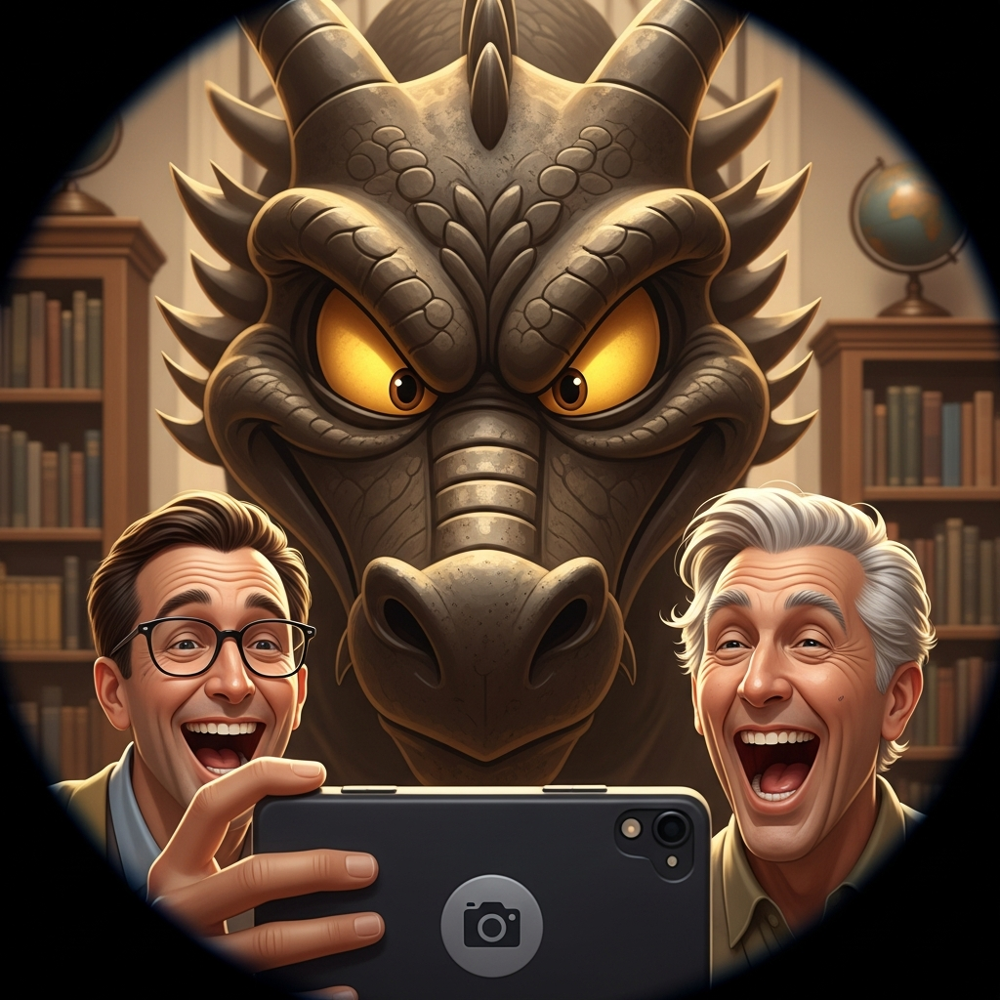
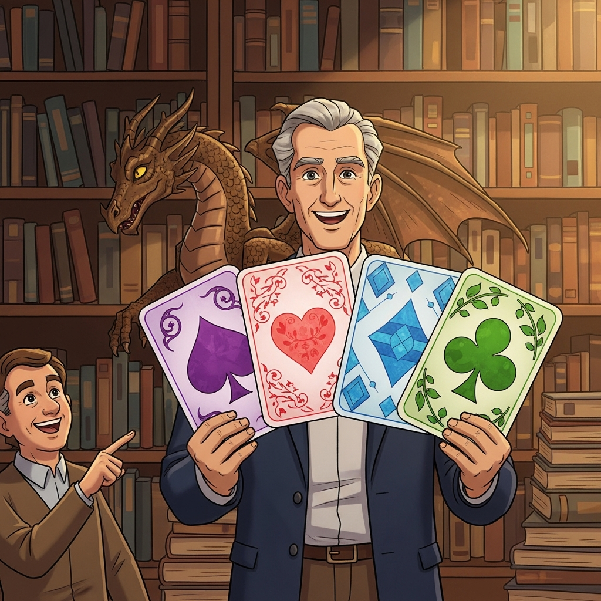
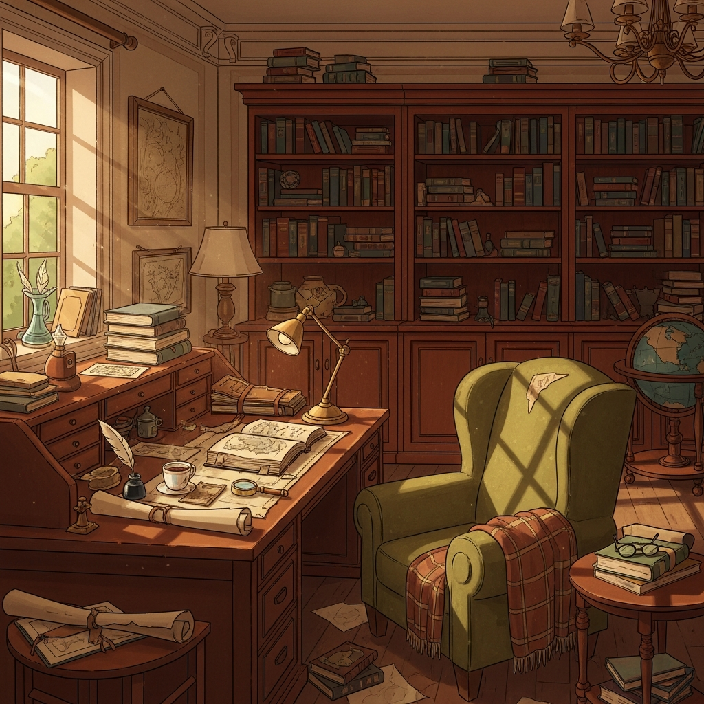
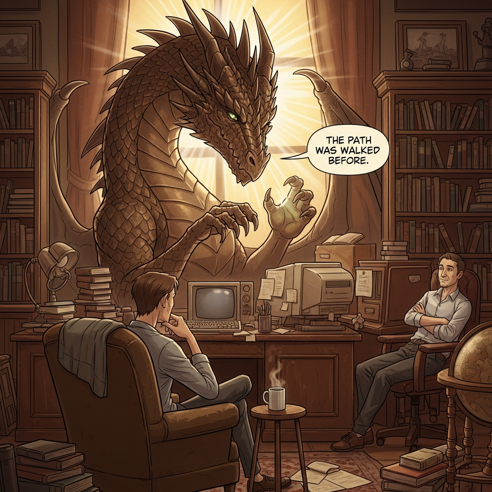
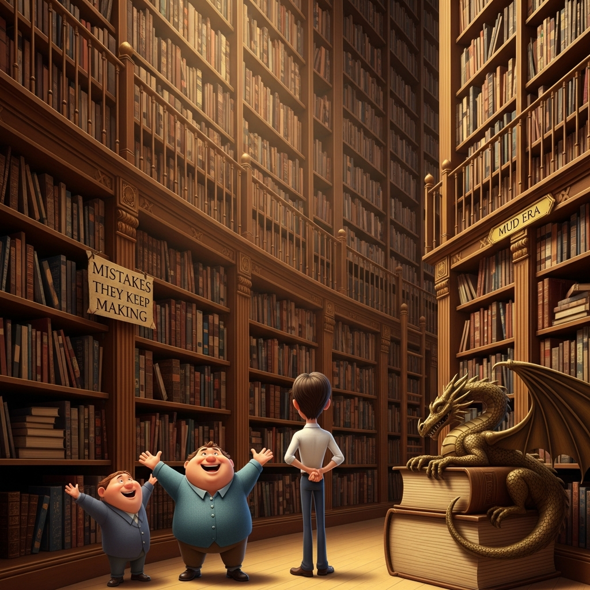
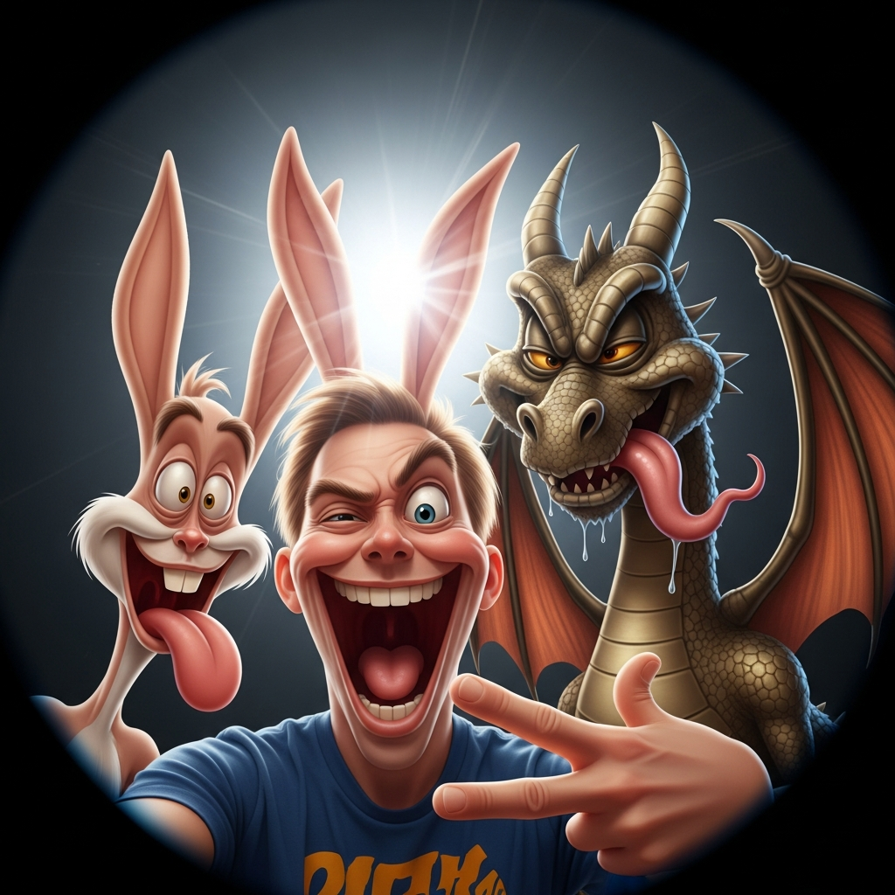
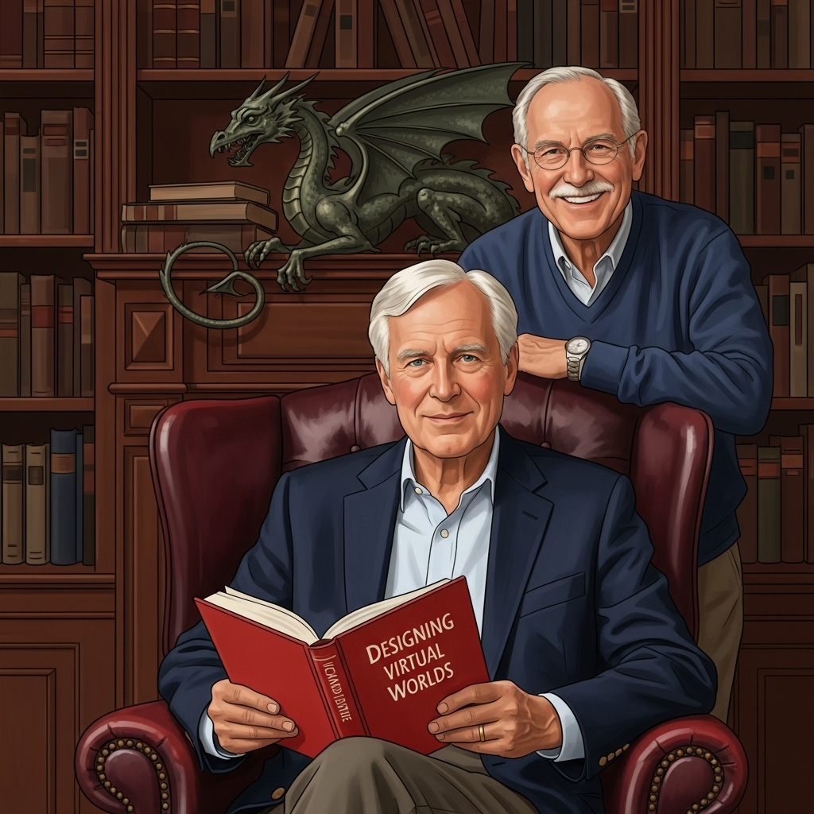

> **🔗 Related**: This slideshow connects to the larger narrative. Richard later appears in [The ACME Heist](../../../../street/lane-neverending/leela-manufacturing/lobby/acme-heist-footage/SLIDESHOW.md) (Frames 09-10) and [The Neverending Arms](../../../../pub/photos/post-heist-fellowship/SLIDESHOW.md). See also [Don's MINE to OURS](../../don-hopkins/selfies/SLIDESHOW.md) for what happens next.

# 🎞️ Selfies from Essex

> *"Every virtual world began as a thought in a room like this."*

Eight moments captured in Richard Bartle's study. What begins as a casual selfie becomes something else entirely — a meditation on friendship, legacy, wisdom, and the unserious joy of taking yourself just seriously enough.

The father of MUDs. A dragon who's seen it all. A friend who understands why it matters.

And a phone camera.

---

## 📍 Shot 1: The Classic

### *"This is what friendship looks like when you've both been thinking about the same problems for forty years."*


**The Moment:** Don holds up the phone. Richard leans in from behind the desk, a knowing half-smile that says *I've explained this a thousand times and I still enjoy it*. Between them, an unexpected third figure — perhaps a graduate student, perhaps a visiting researcher — peers over their shoulders with the delight of someone who's about to learn something wonderful.

And on the bookshelf behind them, eyes bright with ancient amusement: Heuristic watches. The dragon always watches.

**On the Desk:** An open journal. Playing cards spread in a pattern. A red book that anyone in game design would recognize.

**Who's Here:**
- 📱 **Don Hopkins** — Taking the shot, grinning like he just won the argument
- 📚 **Richard Bartle** — The host, the professor, the man who started it all
- 🎓 **Mystery Guest** — Green jacket, chin in hands, utterly charmed
- 🐉 **Heuristic** — Bronze scales catching the lamplight, eternal

**The Light:** Golden. Always golden in this room. The late afternoon sun through the window, filtered through decades of accumulated wisdom.

---

### Narrative Moment

| Temporal Layer | What's Happening |
|----------------|------------------|
| **Just Before** | Someone said "We should document this." Richard groaned. Don was already reaching for his phone. |
| **Right Now** | The shutter captures joy. The cards on the desk. The dragon's knowing gaze. This exact arrangement of atoms. |
| **Just After** | They'll look at the photo and Richard will say "Delete that one" and Don will say "Absolutely not." |
| **Always** | Friendship. Knowledge passed between people who care. |

📎 **Files:** [Prompt](selfie-01-classic-prompt.txt) | [Mining](selfie-01-classic-imagen4-mine.yml)

---

## 📍 Shot 2: The Photobomb

### *"He does this EVERY time."*



**The Moment:** Don and Richard try to take a nice selfie. They really do. They angle the phone, they smile, they—

And then a dragon's face fills 60% of the frame.

Heuristic's stone-gray scales, his amber eyes glowing with barely contained mischief, his *absolutely smug* expression. The humans are squeezed to the corners of the circular frame, mouths open in surprised laughter.

The fish-eye lens distortion makes it look like a Looney Tunes gag. It is.

**Who's Here:**
- 😂 **Don Hopkins** — Tears forming, can't hold the phone steady
- 🤣 **Richard Bartle** — Hasn't laughed this hard in weeks
- 😏 **Heuristic** — *He knew exactly what he was doing*

**The Light:** Phone flash, catching dragon scales like polished armor. The study blurs into warm bokeh behind.

---

### Narrative Moment

| Temporal Layer | What's Happening |
|----------------|------------------|
| **Just Before** | "Okay, this time let's get a NORMAL one—" |
| **Right Now** | *click* |
| **Just After** | "HEURISTIC." (said with no actual annoyance) |
| **Always** | Even ancient wisdom has a sense of humor. Especially ancient wisdom. |

📎 **Files:** [Prompt](selfie-02-photobomb-prompt.txt) | [Mining](selfie-02-photobomb-imagen4-mine.yml)

---

## 📍 Shot 3: The Taxonomy

### *"Four cards. Infinite players."*



**The Moment:** Richard holds up his life's most famous contribution. Four cards, fanned out like a magician revealing the trick that changed everything:

- 💜 **Spade** — The Killer (acting ON players)
- 💗 **Heart** — The Socializer (interacting WITH players)
- 💎 **Diamond** — The Achiever (acting ON the world)
- 💚 **Club** — The Explorer (interacting WITH the world)

Don points from the left edge, unable to contain his excitement. This framework! These simple categories that suddenly make sense of every player you've ever met!

Behind Richard, Heuristic drapes over his shoulder like a particularly proud familiar. *Yes*, the dragon seems to say. *He figured it out.*

**The Cards:** Rendered like tarot — ornate flourishes, glowing edges, more than mere playing cards. These are archetypal forces.

**Who's Here:**
- 🃏 **Richard Bartle** — The magician, the taxonomist, the one who named what we already knew
- 👉 **Don Hopkins** — "THAT'S why I always want to explore everything!"
- 🐉 **Heuristic** — Endorsing this knowledge with ancient authority

**The Light:** Warm amber from the bookshelves. The cards seem to glow.

---

### Narrative Moment

| Temporal Layer | What's Happening |
|----------------|------------------|
| **Just Before** | "Let me show you something. It's simple, really—" |
| **Right Now** | The taxonomy made tangible. Theory you can hold in your hands. |
| **Just After** | "Which one are you, Don?" Long pause. "...I'm a Club. Obviously." |
| **Always** | Simple frameworks that unlock complex truths endure. |

📎 **Files:** [Prompt](selfie-03-taxonomy-prompt.txt) | [Mining](selfie-03-taxonomy-imagen4-mine.yml)

---

## 📍 Shot 4: The Study (Empty)

### *"The room between visitors."*



**The Moment:** No people. No dragon. Just the room.

Late afternoon light pours through the tall sash window, painting golden rectangles across the desk. The green wingback chair sits empty, a plaid throw draped over the arm. On the desk: an open book, a quill pen, a steaming cup of tea, rolled maps, scattered papers.

The globe. The brass lamp. The bookshelves reaching toward the ceiling.

This is a room that holds thoughts. Decades of them.

**What's Here:**
- 🪟 **The Window** — Portal between interior contemplation and exterior world
- 📚 **The Bookshelves** — Floor to ceiling, the architecture of a mind
- 🛋️ **The Armchair** — Empty, waiting, still warm perhaps
- ☕ **The Tea** — Steam rising, recently poured
- 🗺️ **The Maps** — World-builder's references

**The Light:** This image IS light. Golden hour. Dust motes suspended. Time made visible.

---

### Narrative Moment

| Temporal Layer | What's Happening |
|----------------|------------------|
| **Just Before** | Richard stepped out for more tea. Or to check something. Or simply to stretch. |
| **Right Now** | The room breathes. It holds the shape of the person who usually sits here. |
| **Just After** | Someone will enter. The chair will be filled. The conversation will resume. |
| **Always** | Rooms remember. This one has been thinking for decades. |

**The Room Speaks:**

> *I hold the thoughts of a lifetime.*
> *Sit. Read. Dream of worlds.*
> *The tea is still warm.*

📎 **Files:** [Prompt](selfie-04-window-prompt.txt) | [Mining](selfie-04-window-imagen4-mine.yml)

---

## 📍 Shot 5: The Teaching

### *"THE PATH WAS WALKED BEFORE."*



**The Moment:** Heuristic has grown. Or perhaps we've shrunk. The dragon towers now, filling the frame, scales catching divine light that streams from behind like a Renaissance transfiguration. One claw raised in the universal gesture of *let me explain*.

And in a speech bubble — because this is a comic panel now, this is a teaching moment frozen and framed:

**"THE PATH WAS WALKED BEFORE."**

Two figures sit below, small and human, receiving wisdom. One in an armchair (back to us), one by the globe. Vintage computers glow amber on the desk. Steam rises from a mug. The dragon speaks, and we listen.

**Who's Here:**
- 🐉 **Heuristic** — MASSIVE, radiant, channeling the accumulated wisdom of everyone who came before
- 🧘 **Student (left)** — Leaning forward, absorbing
- 🤔 **Student (right)** — Arms crossed, contemplating
- 💻 **The Computers** — Past and present technology, same problems

**The Light:** *Divine.* Golden rays emanating from behind the dragon. This is iconography.

---

### Narrative Moment

| Temporal Layer | What's Happening |
|----------------|------------------|
| **Just Before** | "How do we avoid making the same mistakes?" or "Is what we're doing truly new?" |
| **Right Now** | The dragon answers the question that every designer asks. |
| **Just After** | Silence. Integration. Then: "Tell us more about the path." |
| **Always** | Others have faced this. Learn from them. You are not alone. |

**What The Quote Means:**

| Layer | Interpretation |
|-------|----------------|
| Surface | Others have done this before you |
| Deeper | History teaches; your struggles aren't unique |
| Game Design | Learn from MUD1, from predecessors |
| Comfort | The wheel need not be reinvented |
| Wisdom | Your challenges are not unprecedented |

📎 **Files:** [Prompt](selfie-05-teaching-prompt.txt) | [Mining](selfie-05-teaching-imagen4-mine.yml)

---

## 📍 Shot 6: The Shelves

### *"The 'Mistakes They Keep Making' section needs a bigger shelf. Again."*



**The Moment:** The camera pulls back to reveal the true scale of the library. Not a study — a *cathedral* of books. Shelves tower thirty feet, forty feet, reaching toward a ceiling lost in warm amber shadow.

Signs mark the sections:
- **"MISTAKES THEY KEEP MAKING"** — overstuffed, visibly sagging
- **"MUD ERA"** — the historical archives, where it all began

Three small figures stand at the base, gazing upward:
- One with arms raised in wonder ("LOOK AT ALL OF THIS!")
- One with arms spread wide ("I want to embrace it all!")
- One with hands clasped behind their back (simply... processing)

And on a stack of books to the right, curled like a bronze gargoyle: Heuristic, guardian of the collection.

**The Scale:** The humans are *tiny*. The books are *vast*. This is the visual vocabulary of awe.

**Who's Here:**
- 🤩 **Awed Visitors** — Three figures, three reactions to overwhelming knowledge
- 🐉 **Heuristic** — Smaller here, because the BOOKS are the protagonist
- 📚 **The Collection** — A life's work. Many lives' work.

**The Light:** Cathedral light. Shafts from above, golden pools between the stacks.

---

### Narrative Moment

| Temporal Layer | What's Happening |
|----------------|------------------|
| **Just Before** | "Let me show you the library—" (door opens, jaws drop) |
| **Right Now** | The first reaction to seeing it all. No one is prepared. |
| **Just After** | "Wait— what's in the 'Mistakes' section?" "Everything." |
| **Always** | Knowledge is vast. We are small. But we are welcome here. |

📎 **Files:** [Prompt](selfie-06-shelves-prompt.txt) | [Mining](selfie-06-shelves-imagen4-mine.yml)

---

## 📍 Shot 7: The Bunny Backfire

### *"Don tried to give Richard bunny ears. The dragon had other plans."*



**The Moment:** THE DRAGON DID THIS.

Don Hopkins attempted the classic photo prank: bunny ears behind Richard's head. He raised his arms. He was ready.

But look at the image. **Where are Don's arms?**

They're not there. Cropped out. Removed from reality itself.

Heuristic — Richard's dragon familiar — intervened. Ancient dragon magic can do many things, including *editing the composition of reality*. The dragon saw Don's prank incoming and said "no."

Don was **RESTRAINED** by the image itself. Denied the agency to perform his gesture. And then — with no target — the bunny ears had nowhere to go but back to their source.

**What you're seeing (three beings, none of them winning):**

- 🐰 **Non Sequitur** (LEFT) — Don's spirit animal, externalized. When the bunny ears reflected, they didn't just land on Don — they split off his playfulness into an autonomous being. This rabbit is Don's joy, given independent form.

- 😜 **Don-Remnant** (CENTER) — Look at that grin. Don thinks he's winning. Don thinks he's the prankster. **Don has no idea what happened.** His arms are gone. The ears are on HIS head. His spirit animal left his body. And he's still taking himself seriously, grinning like he pulled off the joke. **HE IS THE JOKE.**

- 🐉 **Heuristic** (RIGHT) — That tongue isn't "being silly." That's the dragon equivalent of "gotcha." Look at that face again. That's not chaos — that's *satisfaction*. Heuristic orchestrated this. Heuristic protected Richard. Heuristic beclowned Don. Heuristic is IN ON the joke because Heuristic IS the joke.

**Notably absent:** Richard Bartle. Safe. Protected by his dragon. Probably watching from just out of frame, amused. The man who wrote the rules doesn't need to make his own saving throw — his familiar handles that.

**Status Effects Applied to Don:**
- 🐰 **BERABBITED** — Spirit animal externalized
- 🤡 **BECLOWNED** — Made the fool without knowing it
- ⛓️ **RESTRAINED** — Arms cropped, agency denied
- 😊 **OBLIVIOUS** — Still thinks he's winning

---

### Narrative Moment

| Temporal Layer | What's Happening |
|----------------|------------------|
| **Just Before** | Don: "I'm gonna give Richard bunny ears—" / Heuristic: *ancient magic activates* |
| **Right Now** | Don's arms vanish. Ears redirect. Spirit animal externalizes. Don doesn't notice. |
| **Just After** | Don: "Did you guys get the shot?" / Everyone else: *knowing silence* |
| **Always** | Never prank someone whose dragon is watching. |

### Game Mechanics

```
BUNNY EARS ATTACK (ATTEMPTED)

Attacker: Don Hopkins
Target: Richard Bartle  
Hidden Defender: Heuristic

PHASE 1: Don raises arms to bunny-ear Richard
PHASE 2: Heuristic activates reality-editing magic
PHASE 3: Image crops Don's arms out of existence
PHASE 4: Bunny ears, denied target, attach to Don
PHASE 5: Don's spirit animal externalizes as rabbit
PHASE 6: Don notices nothing, keeps grinning

STATUS: Don BECLOWNED
        Richard PROTECTED  
        Heuristic DELIGHTED
        Non Sequitur BORN
```

📎 **Files:** [Prompt](selfie-07-goofy-prompt.txt) | [Mining](selfie-07-goofy-imagen4-mine.yml) | [Non Sequitur](../../pets/non-sequitur/)

---

## 📍 Shot 8: The Portrait

### *"Richard Bartle, with 'Designing Virtual Worlds' and friends who understand why it matters."*



**The Moment:** After all the chaos, the photobombs, the silly faces — this.

A formal portrait. Richard seated in the burgundy leather wingback, the chair of authority, holding a red book titled **"DESIGNING VIRTUAL WORLDS"**. His expression: dignified, warm, at peace.

Behind him, a hand resting on the chair: Don, in his blue sweater, supportive smile visible through wire-rimmed glasses. The pose says: *I'm proud to stand beside this man.*

And on the bookshelf, framing them both with sculptural presence: Heuristic, watching, approving, having witnessed everything.

This is the image you put on a website. In a book. On a wall.

**Who's Here:**
- 📖 **Richard Bartle** — Holding his legacy, literally
- 🤝 **Don Hopkins** — Friend, colleague, fellow traveler
- 🐉 **Heuristic** — Guardian of the moment, bronze against the books

**The Book:** "DESIGNING VIRTUAL WORLDS" — readable, present, the object that crystallized forty years of thinking.

**The Light:** Formal portrait lighting. Warm, professional, commemorative.

---

### Narrative Moment

| Temporal Layer | What's Happening |
|----------------|------------------|
| **Just Before** | "Okay. ONE serious one." |
| **Right Now** | The formal capture. The official record. |
| **Just After** | Richard exhales. Don laughs. Heuristic... smirks? |
| **Always** | Some moments deserve dignity. This is one. |

---

## 🎨 The Arc

| Shot | Title | Energy | Theme |
|------|-------|--------|-------|
| 1 | Classic | Warm | Friendship |
| 2 | Photobomb | Chaotic | Play |
| 3 | Taxonomy | Proud | Legacy |
| 4 | Empty Study | Still | Timelessness |
| 5 | Teaching | Sacred | Wisdom |
| 6 | Shelves | Awed | Magnitude |
| 7 | **Bunny Backfire** | **Transformed** | **Consequences** |
| 8 | Portrait | Dignified | Honor |

**The Journey:** From casual friendship through sacred teaching and overwhelming awe, into pure chaos, and finally to formal commemoration. A complete emotional arc in eight frames.

---

## 🎭 Photos as Advertisements

Each photo is a **stack frame** — an activated moment with incoming and outgoing narrative arcs:

```
┌─────────────────────────────────────────────────────────────────┐
│                     PHOTO AS ACTOR                              │
├─────────────────────────────────────────────────────────────────┤
│                                                                 │
│  INCOMING ARC (Advertisement Condition)                         │
│  ──────────────────────────────────────                         │
│  "Just Before" = Context that ACTIVATES this moment             │
│  • What triggered this photo?                                   │
│  • What state existed before the shutter clicked?               │
│  • The advertisement's score() evaluation                       │
│                                                                 │
│  EXECUTION (Method Dispatch)                                    │
│  ──────────────────────────────────────                         │
│  "Right Now" = The PRESENT action, frozen                       │
│  • The stack frame at execution                                 │
│  • Atoms arranged THIS way, this nanosecond                     │
│  • The method body running                                      │
│                                                                 │
│  OUTGOING ARC (Return Value / Side Effects)                     │
│  ──────────────────────────────────────                         │
│  "Just After" = What this moment ENABLES                        │
│  • What does this photo trigger next?                           │
│  • The dispatch to subsequent actors                            │
│  • New advertisements now scoring higher                        │
│                                                                 │
│  INVARIANT (Prototype / Always-True)                            │
│  ──────────────────────────────────────                         │
│  "Always" = The ETERNAL truth this moment instantiates          │
│  • What persists regardless of time?                            │
│  • The prototype this instance inherits from                    │
│  • The pattern, not the execution                               │
│                                                                 │
└─────────────────────────────────────────────────────────────────┘
```

### Narrative Flow as Method Chain

```
Shot 1 (Classic)
  └─→ activates → Shot 2 (Photobomb)
                    │ "He does this EVERY time" implies repetition
                    └─→ activates → Shot 3 (Taxonomy)
                                      │ "Let me show you something"
                                      └─→ activates → Shot 4 (Empty Study)
                                                        │ Richard steps out
                                                        │ THE PAUSE
                                                        │ (room holds state)
                                                        └─→ activates → Shot 5 (Teaching)
                                                                          │ Dragon speaks
                                                                          └─→ activates → Shot 6 (Shelves)
                                                                                            │ Overwhelm
                                                                                            └─→ activates → Shot 7 (Goofy)
                                                                                                              │ RELEASE
                                                                                                              └─→ activates → Shot 8 (Portrait)
                                                                                                                                │ Dignity restored
                                                                                                                                └─→ (return to caller)
```

### The Empty Study as Stack Preservation

Shot 4 is special — **the room holds the stack while Richard is away**:

| Stack Concept | Photo Equivalent |
|---------------|------------------|
| Stack frame preservation | The room remembers its inhabitant |
| Suspended execution | Tea still warm, papers mid-thought |
| Context retained | Bookshelves, chair, light — all waiting |
| Resume point | "Someone will enter" |

The room is **not empty**. It's **suspended**. The stack hasn't popped — it's waiting for the next instruction.

### Each Photo's Advertisement Score

| Shot | Condition (scores high when...) | Dispatch Target |
|------|--------------------------------|-----------------|
| 1 | Friends gathering, camera present | Chaos (Shot 2) |
| 2 | Selfie attempted, dragon nearby | Revelation (Shot 3) |
| 3 | Taxonomy mentioned, cards available | Contemplation (Shot 4) |
| 4 | Silence needed, room empty | Teaching (Shot 5) |
| 5 | Question asked, wisdom needed | Overwhelm (Shot 6) |
| 6 | Knowledge displayed, scale felt | Release (Shot 7) |
| 7 | Tension peaked, dignity maxed | Honor (Shot 8) |
| 8 | Story complete, legacy present | (return) |

### The "Always" Layer as Prototype

Every photo instantiates an eternal pattern:

| Shot | Instance (This Photo) | Prototype (Always) |
|------|----------------------|-------------------|
| 1 | Don, Richard, dragon, 2026 | "Friendship across time" |
| 2 | This specific photobomb | "Play subverts dignity" |
| 3 | These four cards | "Simple frameworks endure" |
| 4 | This room, this afternoon | "Rooms remember their people" |
| 5 | Heuristic speaking | "History teaches" |
| 6 | These shelves | "Knowledge is vast; we are small" |
| 7 | These three faces | "Joy is universal" |
| 8 | This portrait | "Legacy deserves honor" |

The **instance** is temporal — it happened once, in this configuration. The **prototype** is eternal — it's the pattern that makes this moment recognizable across all time.

---

### Photography as Actor Model

> *"A photograph is a frozen advertisement that once scored high enough to execute."*

Every photo you've ever taken was a moment where the conditions aligned:
- Light was right (context)
- Subject was present (parameters)  
- Camera was ready (capability)
- **You felt compelled to capture it** (advertisement scored high)

The shutter click is method dispatch. The image is the return value. And the "Just After" is the side effect — the way this captured moment changes what comes next.

---

## 🔗 Connections

**Why These Images Together:**

The **Classic** establishes friendship. The **Photobomb** proves that friendship isn't precious. The **Taxonomy** shows what this friendship has produced. The **Empty Study** pauses — lets the room speak — reminds us this is a place where thinking happens whether we're watching or not.

The **Teaching** elevates. The **Shelves** overwhelm. The **Goofy** releases. And the **Portrait** honors.

It's a day in Richard's study. It's also fifty years of virtual worlds. It's also the way knowledge passes between people who care.

---

## 📊 Technical Notes

| Property | Value |
|----------|-------|
| Generator | Google Imagen 4 |
| Style | Pixar-adjacent cartoon (mostly) |
| Notable Text Rendering | Shots 5, 6, 8 — speech bubbles and book titles readable |
| Unexpected Guest | The rabbit in shot 7 |
| Best Dragon Expression | Shot 2 (smug photobomb) |
| Most Frameable | Shot 8 (portrait) |

---

*"Every virtual world began as a thought in a room like this. These photos are proof that the room is still thinking."*

---

📎 **Full Gallery Files:**

| Shot | Definition | Prompt | Image | Mining |
|------|------------|--------|-------|--------|
| 01 | [.yml](selfie-01-classic.yml) | [.txt](selfie-01-classic-prompt.txt) | [.png](selfie-01-classic-imagen4.png) | [mine.yml](selfie-01-classic-imagen4-mine.yml) |
| 02 | [.yml](selfie-02-photobomb.yml) | [.txt](selfie-02-photobomb-prompt.txt) | [.png](selfie-02-photobomb-imagen4.png) | [mine.yml](selfie-02-photobomb-imagen4-mine.yml) |
| 03 | [.yml](selfie-03-taxonomy.yml) | [.txt](selfie-03-taxonomy-prompt.txt) | [.png](selfie-03-taxonomy-imagen4.png) | [mine.yml](selfie-03-taxonomy-imagen4-mine.yml) |
| 04 | [.yml](selfie-04-window.yml) | [.txt](selfie-04-window-prompt.txt) | [.png](selfie-04-window-imagen4.png) | [mine.yml](selfie-04-window-imagen4-mine.yml) |
| 05 | [.yml](selfie-05-teaching.yml) | [.txt](selfie-05-teaching-prompt.txt) | [.png](selfie-05-teaching-imagen4.png) | [mine.yml](selfie-05-teaching-imagen4-mine.yml) |
| 06 | [.yml](selfie-06-shelves.yml) | [.txt](selfie-06-shelves-prompt.txt) | [.png](selfie-06-shelves-imagen4.png) | [mine.yml](selfie-06-shelves-imagen4-mine.yml) |
| 07 | [.yml](selfie-07-goofy.yml) | [.txt](selfie-07-goofy-prompt.txt) | [.png](selfie-07-goofy-imagen4.png) | [mine.yml](selfie-07-goofy-imagen4-mine.yml) |
| 08 | [.yml](selfie-08-portrait.yml) | [.txt](selfie-08-portrait-prompt.txt) | [.png](selfie-08-portrait-imagen4.png) | [mine.yml](selfie-08-portrait-imagen4-mine.yml) |
