# 🌸🧺 THE GREAT PICNIC SLIDESHOW 🚌📚
## From Industrial Lobby to Forest Meadow and Back Again

> *"The factory must grow, but the picnic must happen."*

---

## 🎞️ Prologue: The Intent
After the intense materialization at the Leela Manufacturing lobby, Don and Richard felt the need for a different kind of "coordinate system." One with more chlorophyll and fewer security cameras. Setting their location to a faraway, newly discovered namespace, they prepared for the ultimate transclusion test: a portable sanctuary in a wild meadow.

---

## [Slide 01] A Faraway Landing
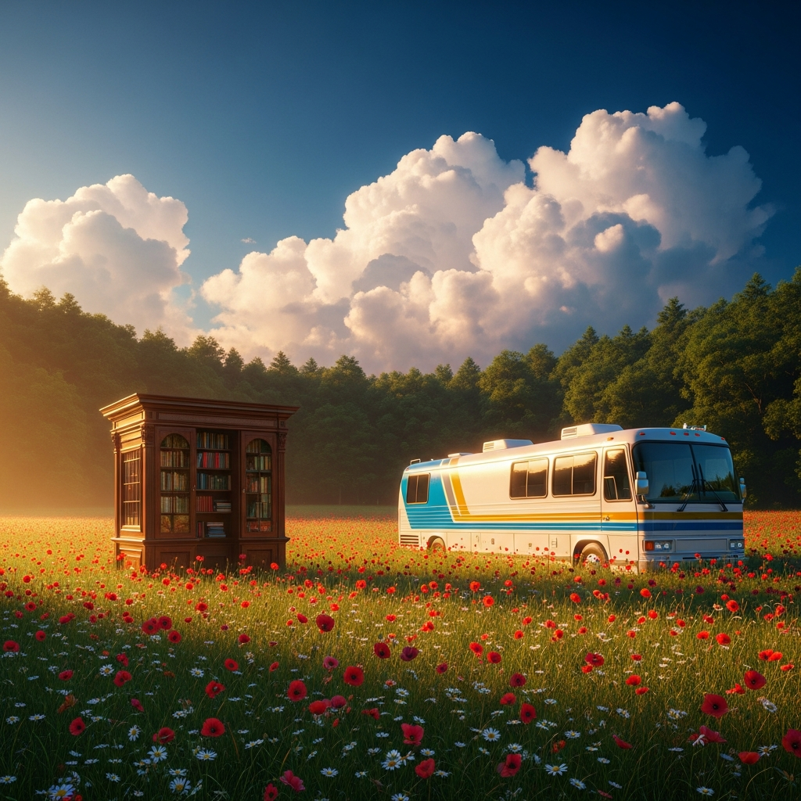
**"The WHOMP of Displacement"**

The Study and the FMC #898 materialize simultaneously in the tall grass. The silence of the ancient forest is broken by the soft sound of displaced air. The vehicles look like precious artifacts dropped into a giant's garden. Richard feels the "Gezelligheid" of his Study instantly adapt to the new view, while Don observes that the FMC's low profile is perfect for meadow-submersion.

---

## [Slide 02] The Pioneers' Perspective
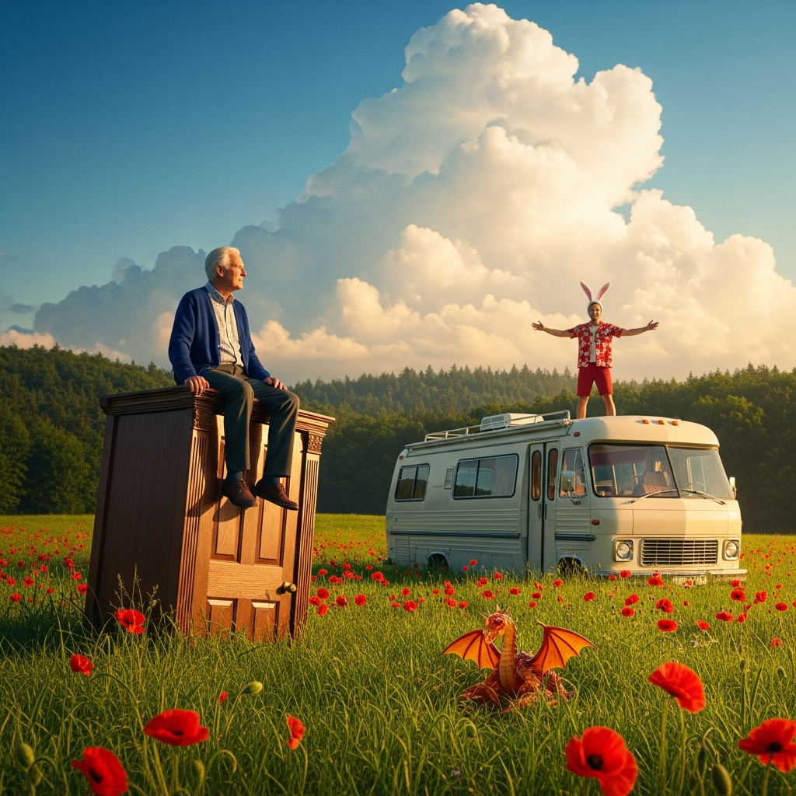
**"High-Level Observation"**

Richard and Don descend... by climbing up. Standing on their respective roofs, they survey the horizon. Richard, on his mahogany observation deck, looks for the limits of the namespace. Don, standing by his new flexible solar panels, feels the energy of the sun—literal and metaphorical. Below, Heuristic the dragon has already disembarked to sniff the first red poppy.

---

## [Slide 03] A Meadow Banquet
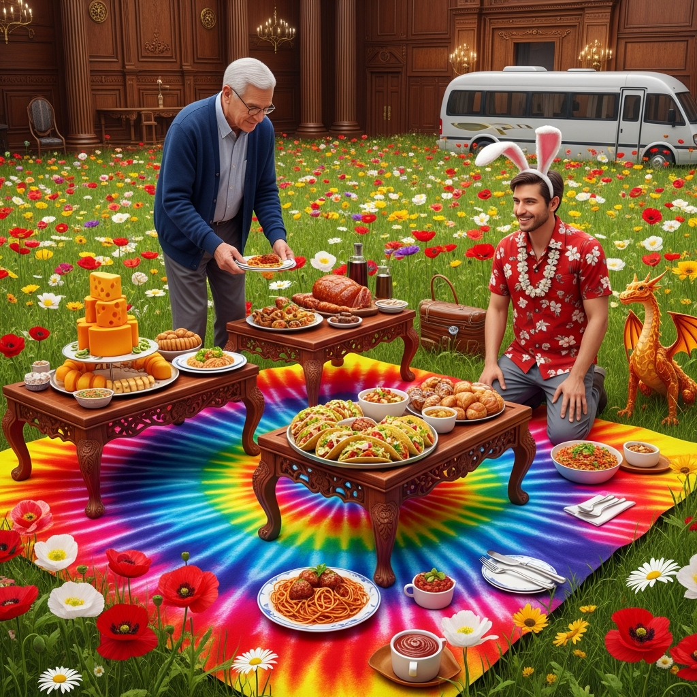
**"Setting the Gilded Threshold"**

Decorum meets dirt. Richard brings out the Study's mahogany tuckaway tables, while Don spreads the 'Swirl of Infinite Parameters' tie-dye blanket. The Leela haul is unpacked: silver trays of tacos, glazed hams, and the 3-foot 'Nuclear Saffron' cheddar pyramid. Richard meticulously adjusts the settings, white napkin tucked into his cardigan, while Heuristic takes up his post as 'Gourmet Guardian'.

---

## [Slide 04] Macro Meadow: Flora & Fusion
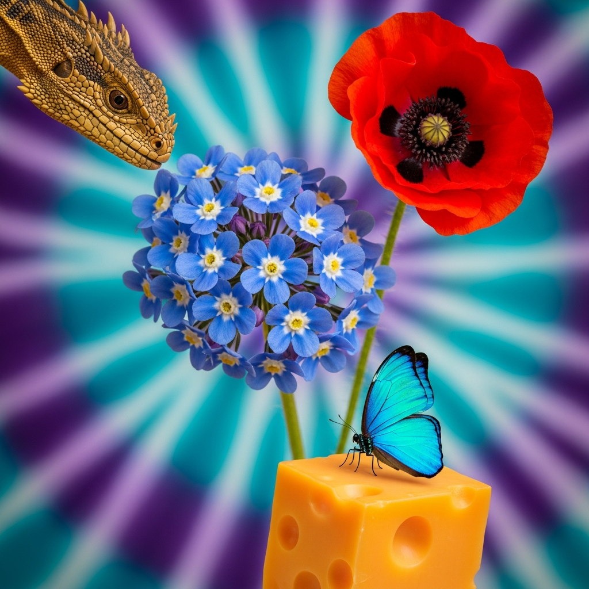
**"The UI of Nature"**

A moment of extreme detail. Richard studies the local blue flowers and realizes they have eight petals in a perfect radial circle—Nature's own pie menus. Don notices a 'Parameter Monarch' butterfly, its wings iridescent blue and purple, landing on a block of sweating cheddar. Heuristic leans in, his hammered-copper scales shimmering, curious if the flowers taste as good as they look.

---

## [Slide 05] Taco Flowers & Busy Pollinators

**"Pollinating the Parameters"**

The discovery of *Anthotaco bellus*. The yellow-gold petals have toasted-brown edges, mimicking a crunchy taco shell perfectly. Giant Meadow Fuzzy bumblebees, their legs heavy with neon-orange pollen, dive into the blooms. In the foreground, actual Leela tacos sit in a silver tray, achieving a state of perfect visual rhyme with the landscape.

---

## [Slide 06] The Uninvited Guest
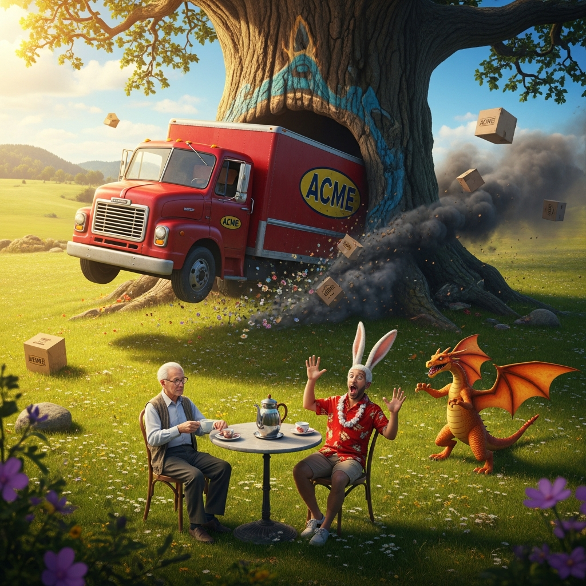
**"Resolution Pollution"**

Drama erupts. An ancient oak tree un-renders its bark to reveal a 2D 'Painted Tunnel'. Out bursts a battered red ACME Van-Guard, skidding through the poppies. Richard reacts with "Academic Disappointment" at the glitchy intruder. Don jumps in shock, ears splayed. Heuristic, sensing a threat to the spaghetti, prepares a blue-spark ignition at the tip of his snout.

---

## [Slide 07] Unsolicited Delivery
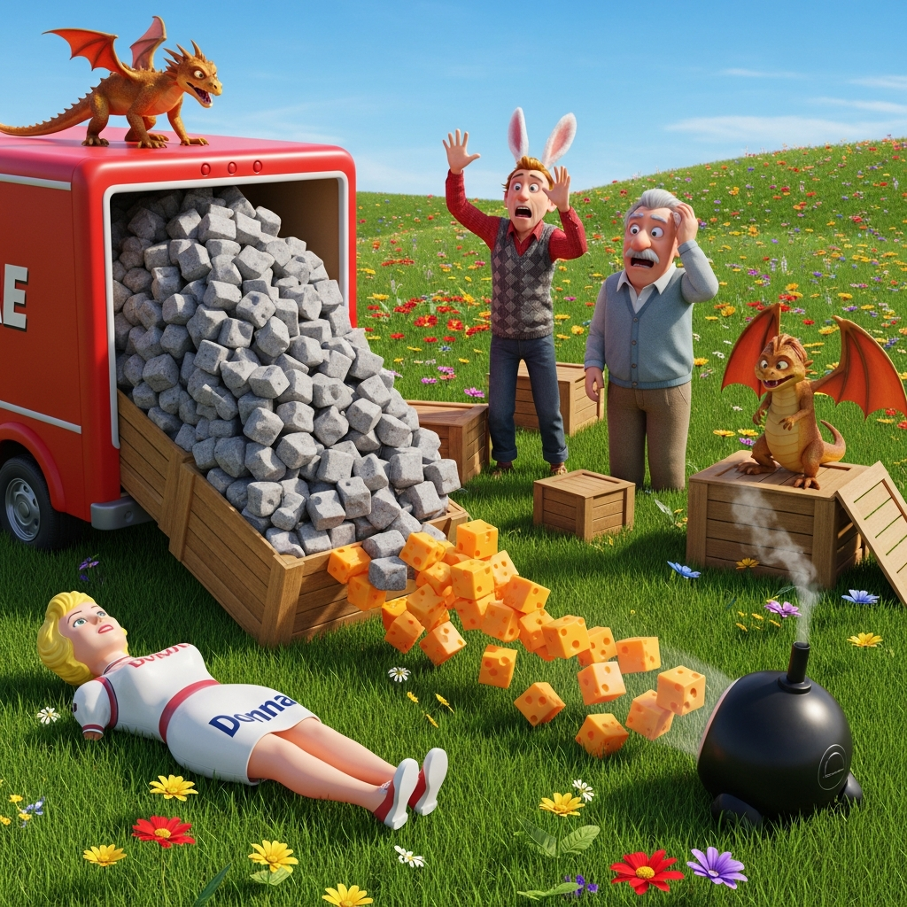
**"Donna's Care Package"**

The truck's doors burst open, spilling an avalanche of ACME chaos. A 'Dehydrated Feast' expands into rubbery grey cubes (one landing in Richard's tea). A wobbly 'Inflatable Donna' decoy begins its malicious recorded laugh. Most dangerously, a 'Pocket Black Hole' begins to spaghettify the cheddar pyramid. Don lunges horizontally across the blanket—a hero's dive for the cheese.

---

## [Slide 08] Taming the Chaos
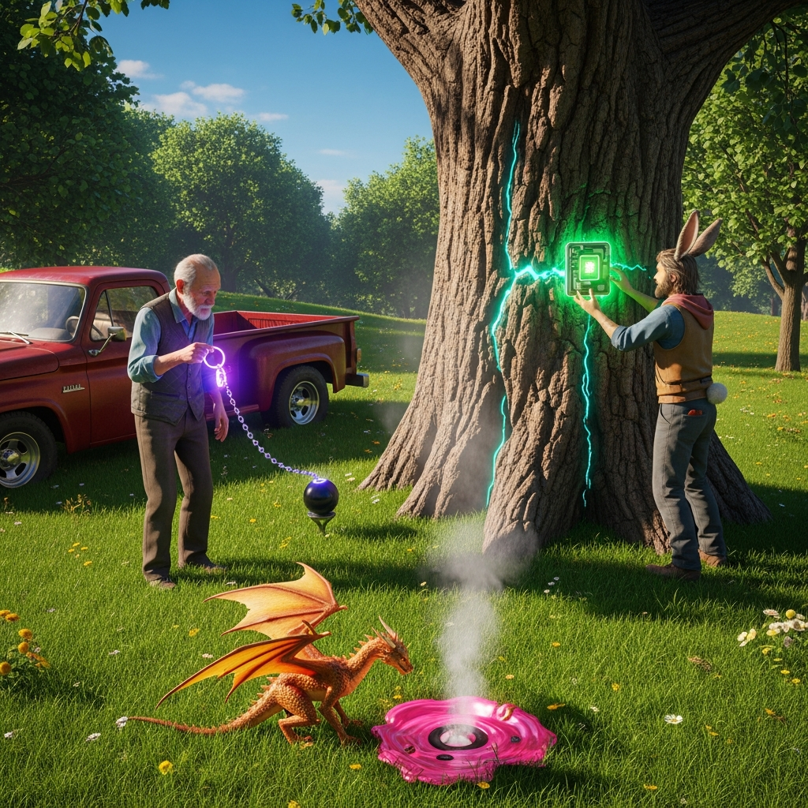
**"Deployment of Intelligence"**

The counter-attack. Richard uses the amethyst-pulsing 'Pocket Dimension' to swallow the black hole. Don slaps a green 'Self-Healing Module' onto the oak, overwriting the low-res tunnel with hyper-detailed bark. Heuristic incinerates the Donna decoy into a pile of molten vinyl. The transclusion is safe, but the tea is ruined.

---

## [Slide 09] The Battle of the Likenesses

**"Quality Control Brawl"**

The real Donna Toadstool emerges, livid at her decoy's performance. The decoy glitches into a stable 1970s McDonald's-style trash can with a red silk tie. It's a slapstick duel: Donna punches, the weighted decoy 'BOINGS' back. Don watches with 'This is Ridiculous' ears, while Richard studies the 8-bit artifacts on the trash can's surface with a magnifying glass.

---

## [Slide 10] The Fabergé TARDIS
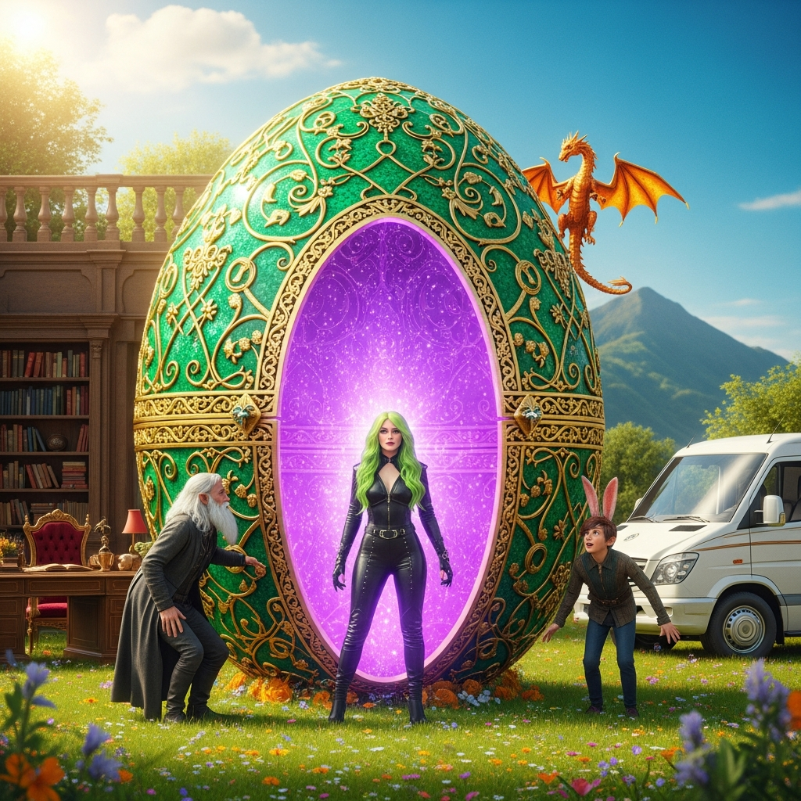
**"Gatekeeper of the Metaverse"**

Alliance through absurdity. Donna produces the Fabergé Egg from the OURS Accord. Inserting a brass key, she triggers a TARDIS expansion. The 12-foot structure reveals clockwork gears beneath green enamel and opens a violet portal. A shimmering aurora fills the meadow as the pioneers realize the Egg is a gateway to a nested egg-metaverse.

---

## [Slide 11] The Assembly of Taste
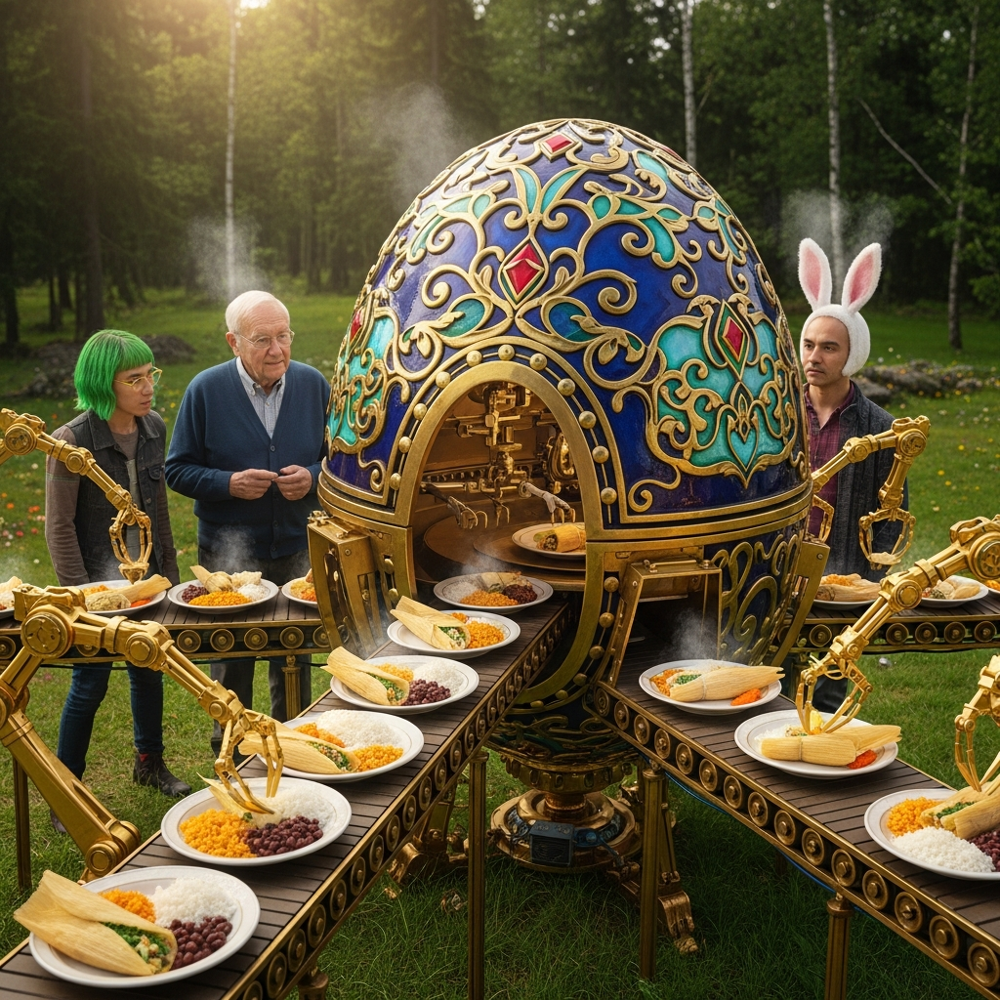
**"Factorio in the Field"**

The Egg reveals its true purpose: industrial catering. Brass conveyor belts unfold fractally, carrying hundreds of steaming tamales. Golden Inserter robots pluck them off, plopping them onto porcelain plates with Sinusoidal Sauce wave patterns. Don cheers at the "Joyful Frequency" of the logistics. Richard examines the kinematics. The factory must feed.

---

## [Slide 12] The Voracious Feast
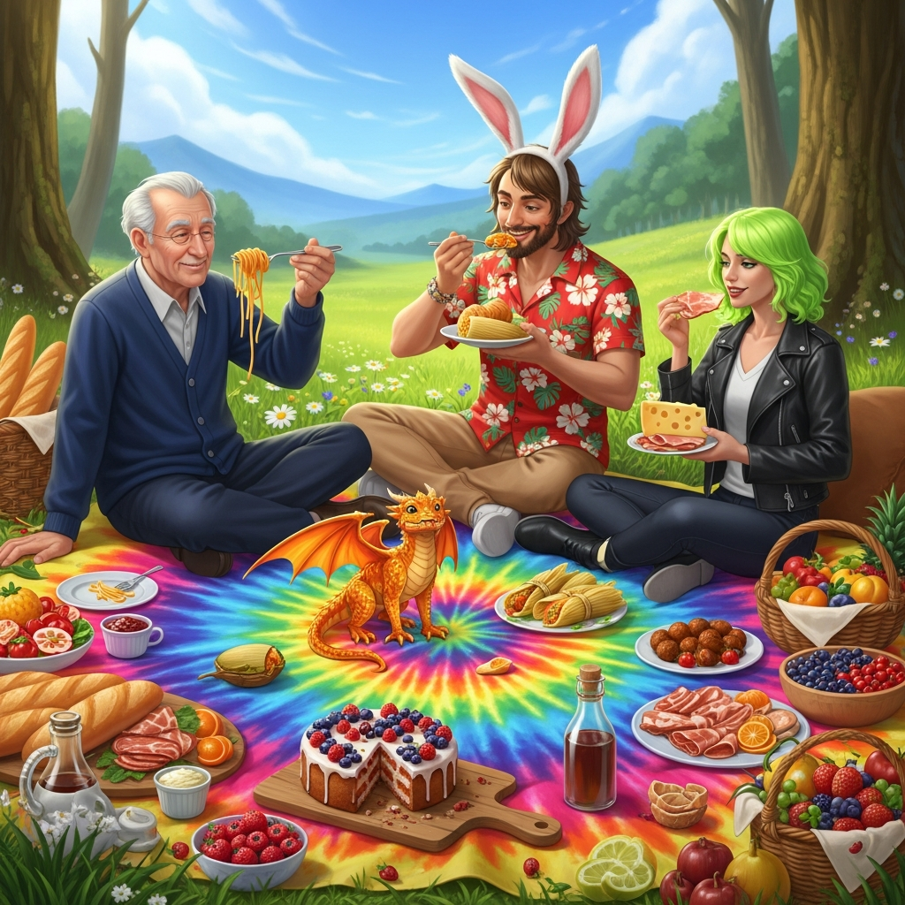
**"Decorum Digested"**

Hunger wins. The three pioneers descend on the food with "vermicious and vorciferous" intensity. Don double-fists tamales; Richard slurps spaghetti with comical focus; Donna uses cheddar chunks as dipping tools. Heuristic enters a blissful food coma. The tie-dye blanket is now a canvas of sauce splatters and corn husk parchment.

---

## [Slide 13] Don's Selfie: Tamale Joy

**"The Salsa Ear"**

Don captures the peak moment. His left grey-white ear is stained a permanent, saturated red from a salsa encounter. His grin is wide and masa-dusted. The handheld smartphone aesthetic distorts the foreground tamale, making the "vermicious" hunger feel immediate and high-resolution.

---

## [Slide 14] Richard's Selfie: Scholarly Slurp
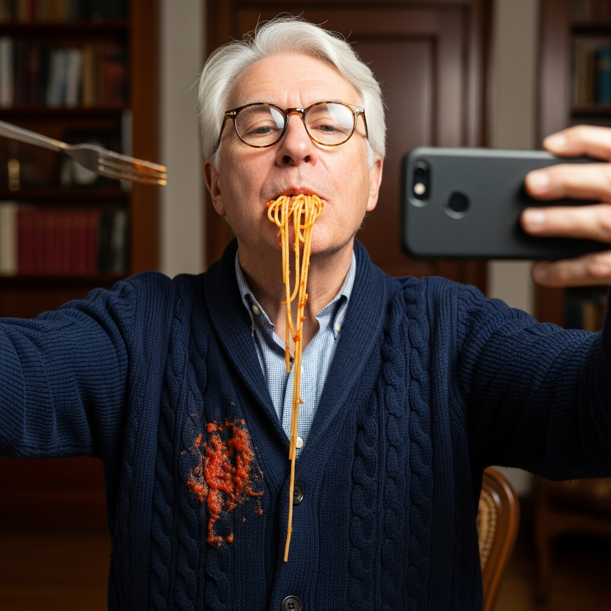
**"The Fourth Player Type"**

Dr. Bartle captures himself mid-slurp. A single taut strand of spaghetti connects his mouth to the plate. His gold glasses are tilted, his silver hair is a chaotic halo, and his navy cardigan features a bold, 'Distressed-Industrial' red stain. He looks energized, having discovered the 'Ravenous Slurper' within himself.

---

## [Slide 15] Donna's Selfie: Cheddar Control
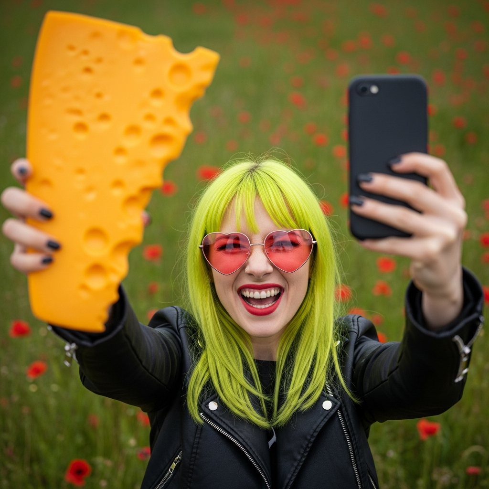
**"The Nuclear Saffron Trophy"**

Donna holds a head-sized block of orange cheddar toward the lens like a radioactive gemstone. Wearing her pink heart glasses and a triumphant grin, she asserts her punk-queen authority over the remaining dairy bullion. In the background, the ACME truck smoke trails fade into the blue.

---

## [Slide 16] The Transmogrification
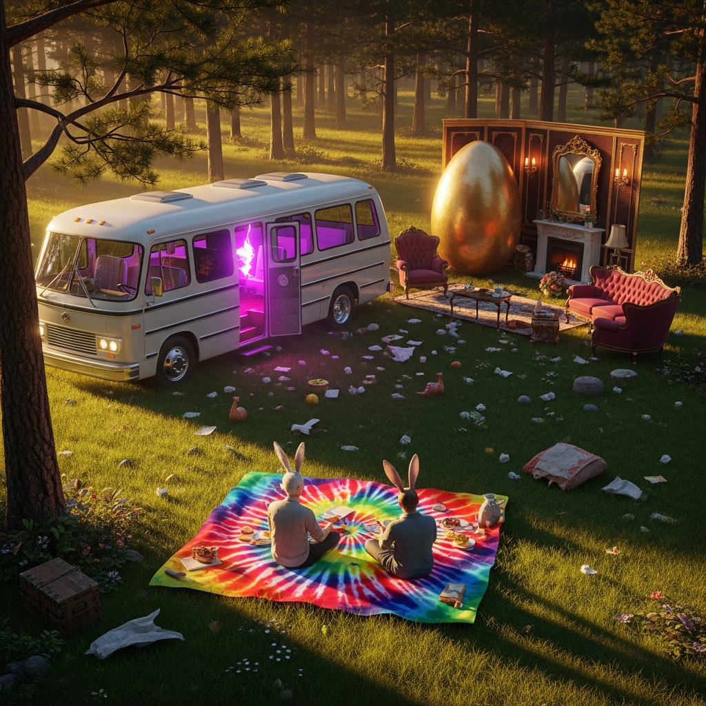
**"A Change of Atmosphere"**

The feast has reached a point of comfortable satiety. Donna, wiping cheddar from her heart-shaped glasses, looks at the FMC Motorcoach. "This is a TREMENDOUS vehicle," she says, her voice already starting to shift into the familiar bombastic cadence. She disappears into the passenger door of the FMC. Within moments, a vibrant purple glow intensifies in the cockpit. Richard and Don share a look. They know what's coming.

---

## [Slide 17] The Entrance of the Star
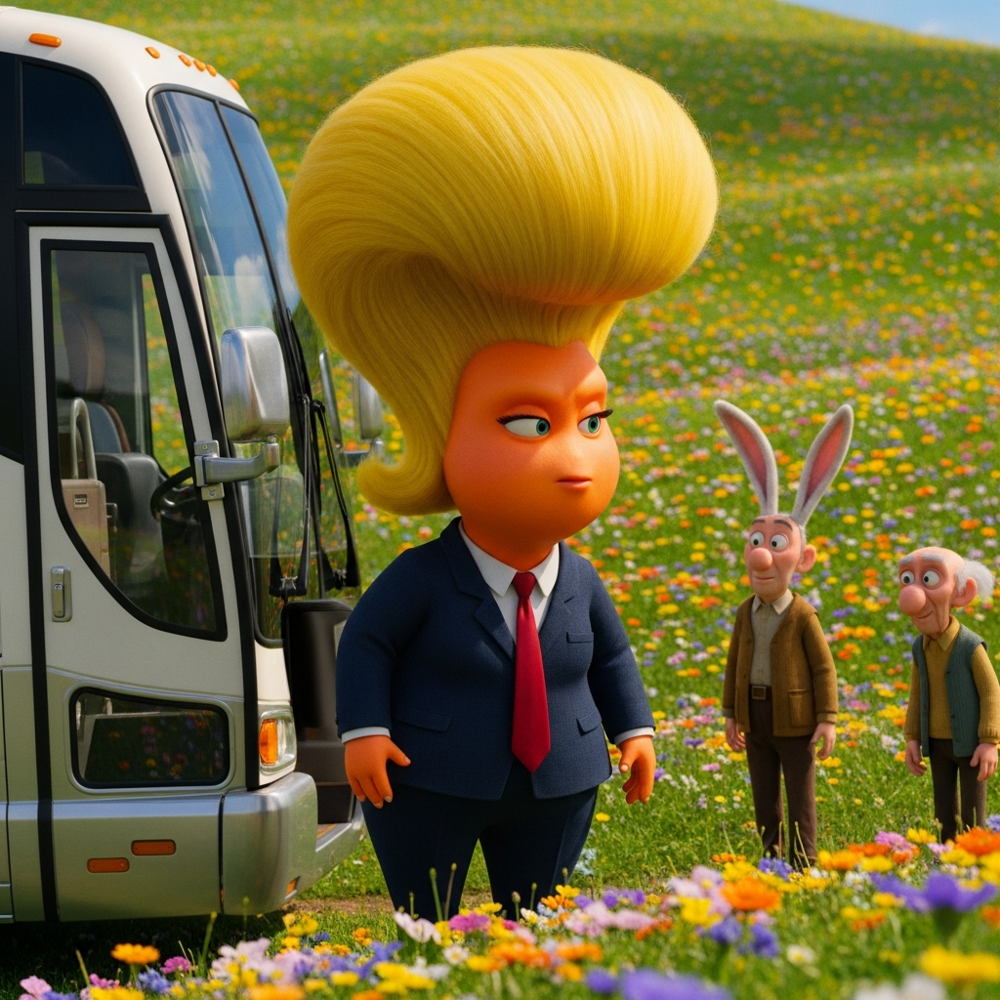
**"Narcissistic Gravity"**

The performance begins. Donna emerges from the FMC 'Dressing Room' in full 34-count regalia. Radioactive tangerine skin, sentient straw-yellow combover, and a too-long red tie. The effect is literal: the meadow flowers actually tilt toward her as she steps onto the retractable metal stairs. Don applauds; Richard studies the topology.

---

## [Slide 18] The Infamous Outtake
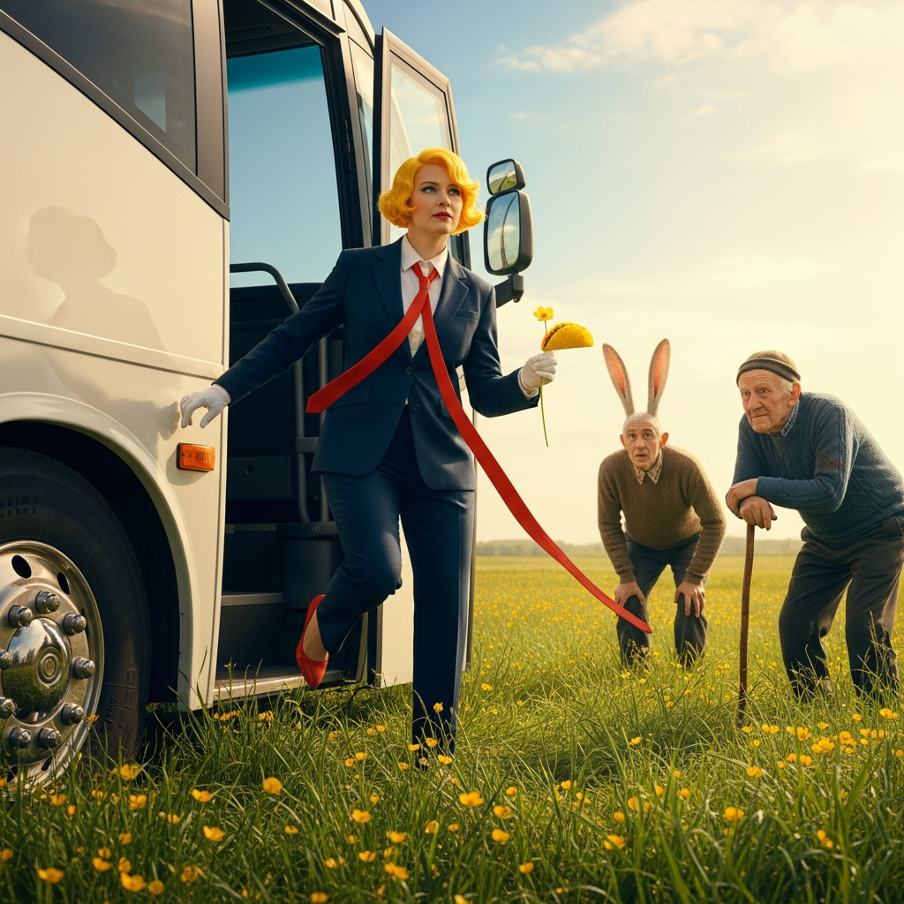
**"Star Entitlement"**

A low-angle handheld video still captures the "Star Treatment." Donna prances off the steps, aggressively grabbing a yellow Taco Flower with a mock-classy pinky extension. "They let you do that when you're a star!" Don leans against the fiberglass bus shell, his ears drooping with the sheer weight of the cringe.

---

## [Slide 19] The Taco Frenzy
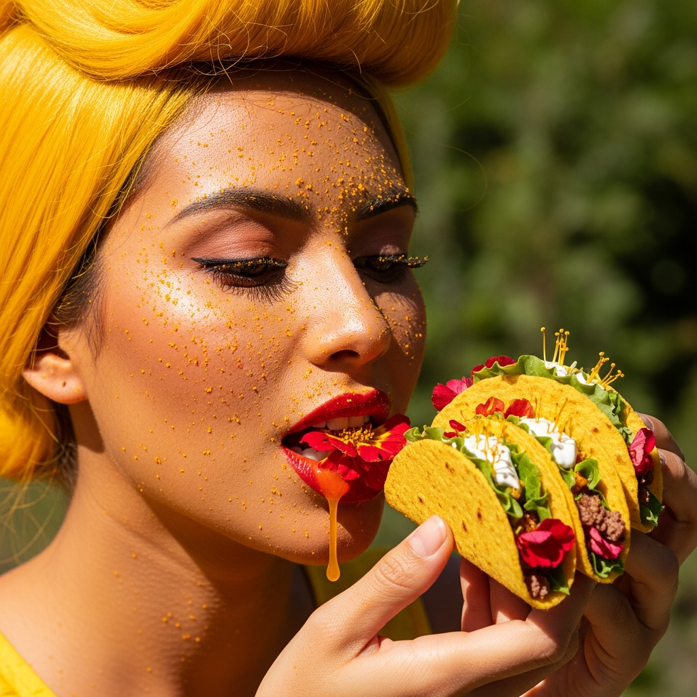
**"Metabolizing the Glitch"**

Donna Toadstool at her most visceral. She is "stuffing her face" with the crystalline, sugary petals of the Taco Flowers. Her orange foundation is cracking under the strain; her 'Pollen Moustache' is a thick neon-orange sludge. She is literally consuming the resolution pollution, turning the ACME error into fuel.

---

## [Slide 20] The Great Slurp
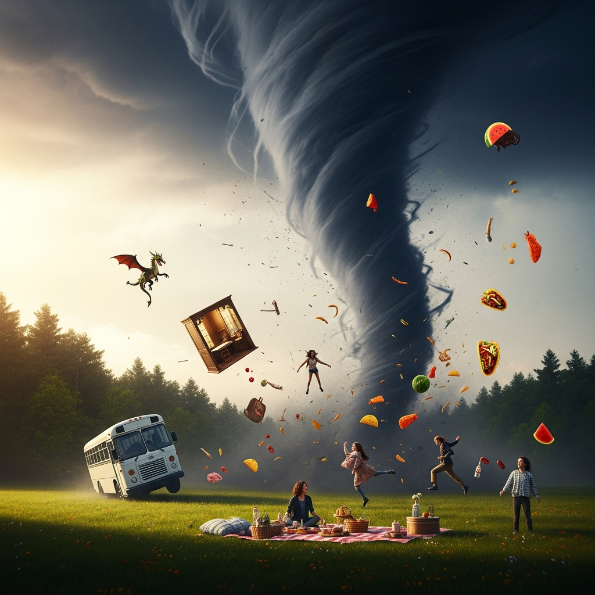
**"Atmospheric Transclusion"**

The afternoon ends with a vacuum. A grey-violet tornado drops from the woolly sky, slurping up the entire picnic. Everything is airborne: spinning motorcoach, tilted Study, billowing cardigan, and 'flavor rings' of rotating watermelons. The pioneers are whisked into the azure sky, their transclusion now purely atmospheric.

---

## [Slide 21] There's No Place Like Home
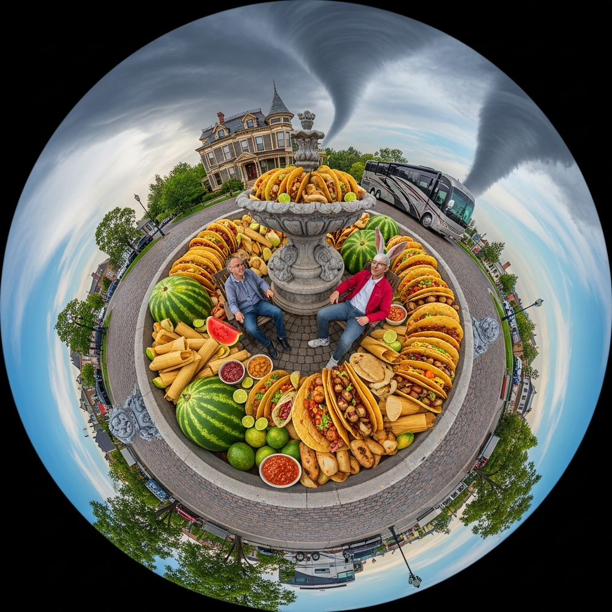
**"The Return to Origin"**

The final atmospheric burp. The vortex ejects the pioneers over Fountain Square at Lane Neverending E2. Don and Richard land unceremoniously in the dry stone basin among a rain of tamales and watermelons. They look at their dusty, sauce-stained vehicles back in their respective lots and realize the fundamental truth: home is what you carry, but there's no place like where your hookups are.

---

## 🎞️ Epilogue: The State Persists
The tea is empty. The cardigan is stained. The ears are red. But the transclusion was successful. The details are documented. The pioneers are home. 

**Wait, where did Heuristic go?**  
*(He beat the tornado. He's already in the Study window.)*

🏠⛲🌮🚌📚🐉✨
