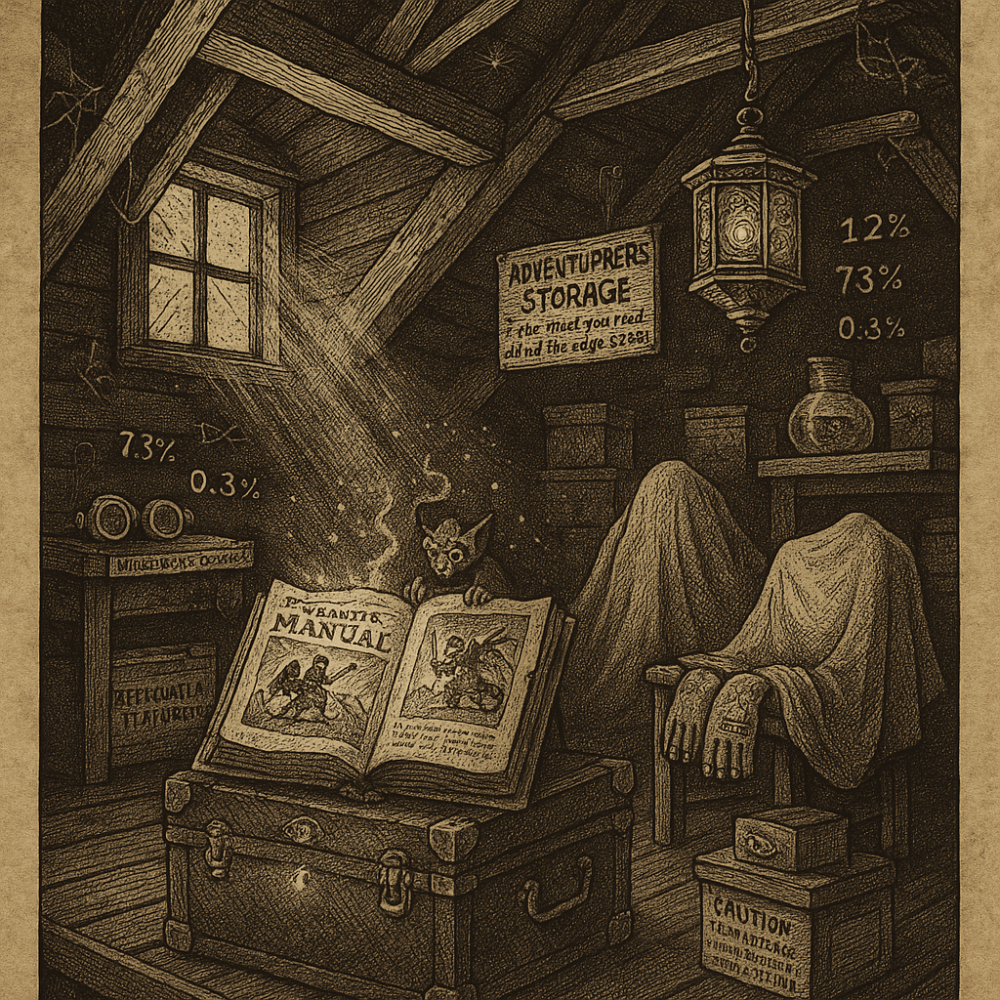
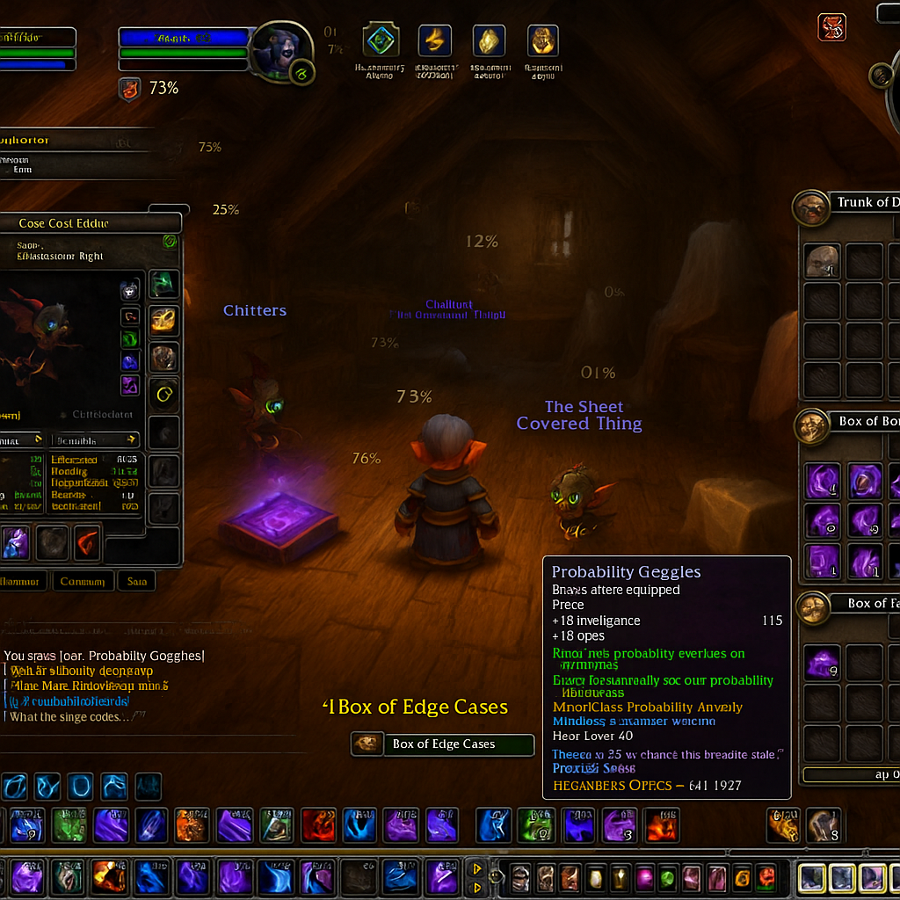
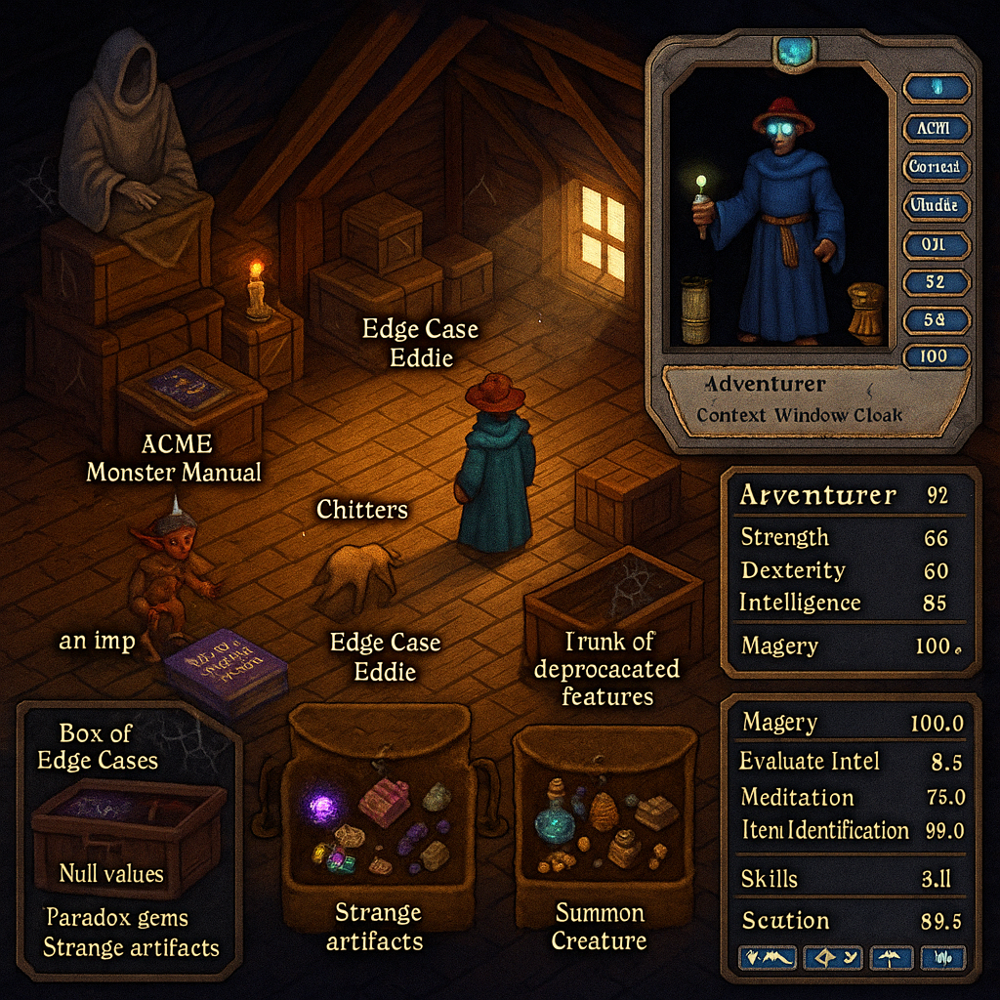
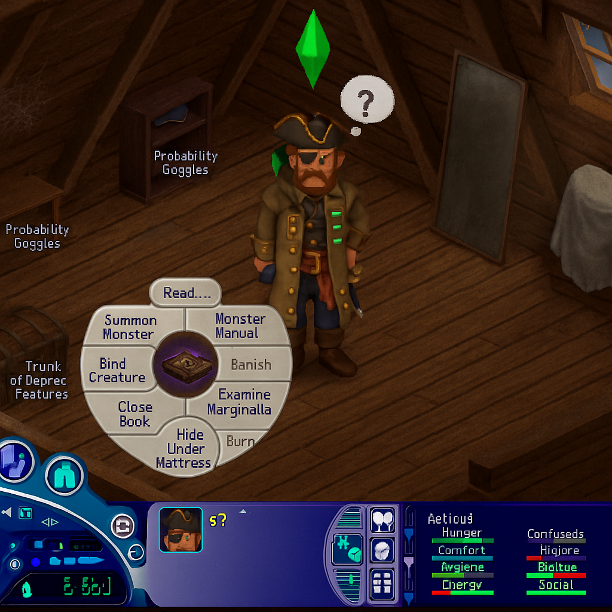
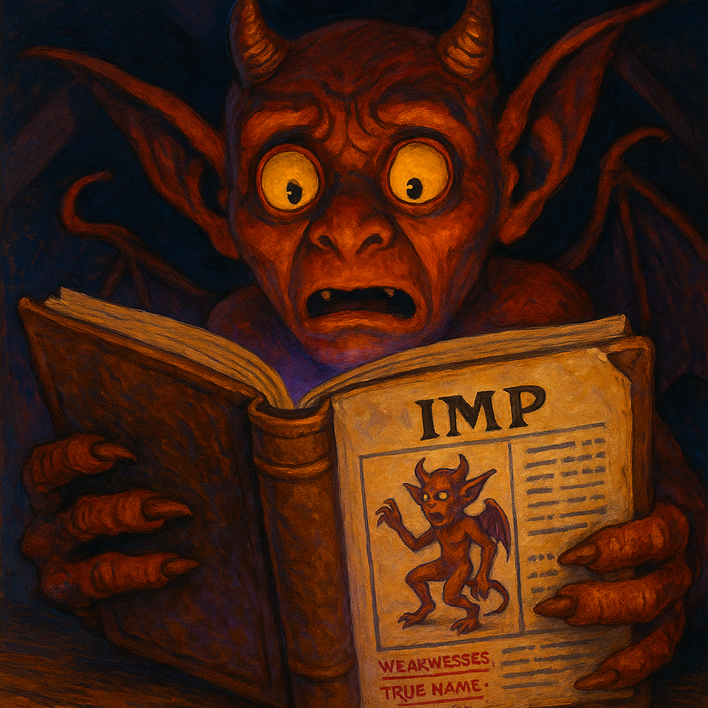
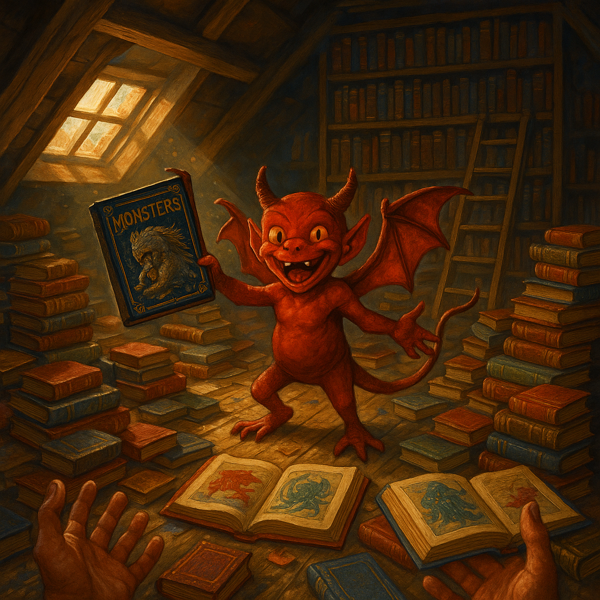
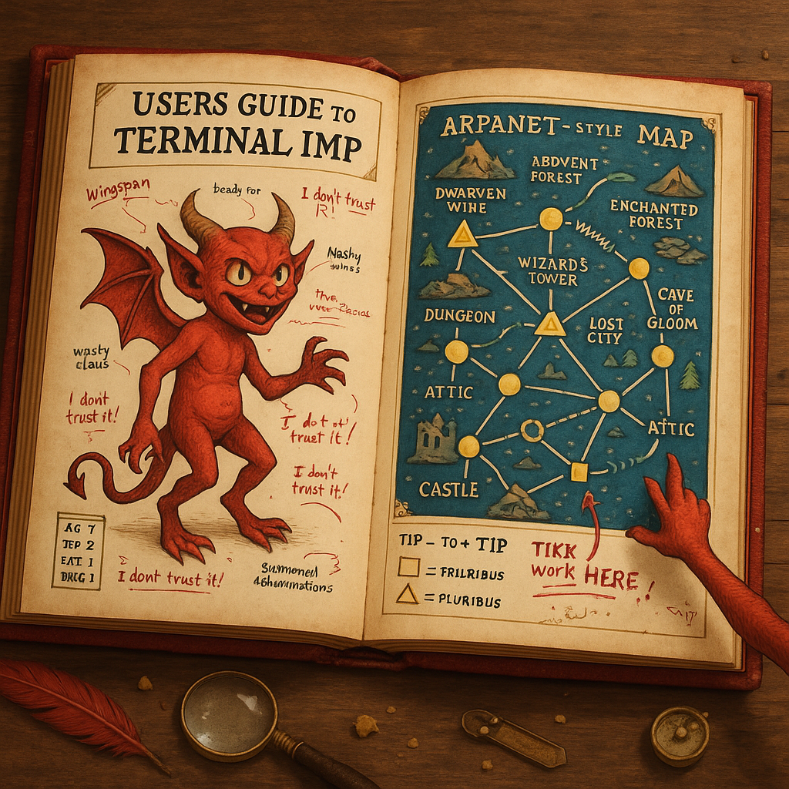

# 🖼️ The Dusty Attic — Visual Gallery

> *"Take what you need. Leave what you find. Mind the edge cases."*

A visual tour through the attic, rendered in seven legendary art styles — from classic D&D to modern tributes. Each image captures the same space — dusty beams, cursed items, the massive SHELF of the ACME Monster Manual Encyclopedia, and the mysterious sheet-covered thing — but through radically different artistic lenses. Plus the Recursive Imp sequence: finding his own volume, reading his own entry, and giving YOU the grand tour of his centuries of scholarship.

<style>
.viz-container { max-width: 100%; margin: 2em 0; }
.viz-img { max-width: 100%; height: auto; border-radius: 8px; box-shadow: 0 4px 12px rgba(0,0,0,0.15); }
.viz-meta { font-size: 0.9em; color: #666; margin-top: 0.5em; }
</style>

---

## 📜 D&D Monster Manual Illustration

### *"The Cursed Grimoire"*



**Style:** 1st Edition AD&D Monster Manual (1977-1983) — Pen & ink crosshatching with sepia parchment tones

**The Scene:** The attic rendered as a classic D&D dungeon room plate. An **IMP** sits atop the open ACME Monster Manual, casually reading the cursed pages. Probability Goggles float percentages (7.3%, 73%, 12%). The Recursion Lantern hangs from exposed beams. And in the corner... **THE HAND** sticks out from under the sheet-covered thing.

**AI Grokking Analysis:** The generator NAILED the crosshatching technique and sepia aging. It understood "Monster Manual style" deeply — the composition, the dramatic single light source, the way magical items glow. The IMP reading the book was an emergent detail (not explicitly requested) that perfectly captures D&D whimsy. The HAND is genuinely unsettling. Gary Gygax would approve.

**Prompt Coherence:** 96% — Authentic enough to frame and hang in a tavern.

📎 **Files:** [Prompt Sidecar](attic-2026-01-19-23-15-00-monster-manual-illustration.yml) | [Mining Analysis](attic-2026-01-19-23-15-00-monster-manual-illustration-mined.yml)

---

## 🎮 World of Warcraft Screenshot

### *"Edge Case Eddie's Lair"*



**Style:** World of Warcraft game screenshot with complete UI chrome — action bars, unit frames, containers, tooltips, floating combat text

**The Scene:** A gnome mage stands in the attic, targeting "Edge Cost Eddie" (the familiar). Open containers reveal their treasures: the **Box of Edge Cases** glows purple with paradoxical items ("Null values", "Paradox gems"). The **Probability Goggles** tooltip shows stats: +18 INT, +18 Spirit, and the infamous *Minor Curse: Probability Anxiety* — "There's a 25% chance this bread is stale."

**AI Grokking Analysis:** The generator understood WoW's UI language fluently — the exact placement of action bars, the tooltip formatting, the way containers open as separate windows. Floating percentages (73%, 75%, 25%) visualize the Probability Goggles' effect. "Chitters" and "The Sheet Covered Thing" have proper nameplates. The chat log shows "You receive loot: Probability Goggles!" This could fool a casual WoW player for several seconds.

**Prompt Coherence:** 94% — Would farm this dungeon.

📎 **Files:** [Prompt Sidecar](attic-2026-01-19-23-25-00-wow-screenshot.yml) | [Mining Analysis](attic-2026-01-19-23-25-00-wow-screenshot-mined.yml)

---

## ✨ Ultima Online Screenshot

### *"Grandmaster Magery"*



**Style:** Ultima Online (1997) — Gorgeous hand-painted isometric 2D pixel art with full classic UI

**The Scene:** A blue-robed mage wearing the **Probability Goggles** (visible as blue glow on face!) stands in the pixel-perfect attic. "an imp" lurks near the ACME Monster Manual. Open containers show items: the **Box of Edge Cases** contains "Null values" and "Paradox gems." The skills panel reveals **Magery: 100.0** (GRANDMASTER!) and Item Identification at 99.0.

**AI Grokking Analysis:** This one UNDERSTOOD Ultima Online at a deep level. The isometric tiles are perfect. The warm color palette matches Origin Systems' house style. The paperdoll shows the **Context Window Cloak** equipped. The floating creature labels use the exact UO format ("an imp" — lowercase article!). The nostalgia is REAL. Britannia lives in this image.

**Prompt Coherence:** 95% — Lord British would grant citizenship.

📎 **Files:** [Prompt Sidecar](attic-2026-01-19-23-35-00-uo-screenshot.yml) | [Mining Analysis](attic-2026-01-19-23-35-00-uo-screenshot-mined.yml)

---

## 🏠 The Sims 1 Screenshot

### *"Sul Sul! Captain Ashford is Confused"*



**Style:** The Sims 1 (Maxis, 2000) — Isometric pre-rendered sprites with complete classic UI

**The Scene:** Captain Ashford, a **CONFUSED SPACE PIRATE in full regalia**, stands in the dusty attic with a giant question mark thought bubble. His green **PLUMBOB** hovers above. A classic **PIE MENU** is open on the ACME Monster Manual, offering options like "Summon Monster", "Bind Creature", "Examine Marginalia", and the cowardly "Hide Under Mattress."

**The UI Elements:**
- **Control Panel** (bottom left): Speed controls, rotation, portrait with eyepatch visible, § 560 simoleons
- **Needs Panel** (bottom right): Hunger, Comfort, Hygiene (low — dusty attic!), Energy, Social (RED — alone!)
- **Object Labels**: "Probability Goggles", "Trunk of Deprec Features"
- **Mood**: "Confuseds" — the space pirate has no idea what to do with this cursed book

**AI Grokking Analysis:** The generator understood that Sims 1 is NOT Sims 4 — it captured the specific year 2000 aesthetic with chunky pre-rendered sprites, the warm oversaturated colors, and that distinctive Maxis charm. The PIE MENU is perfect — radial segments, white background, black text, and the Monster Manual icon in the center. Don Hopkins' pie menu design lives on!

**The PIE MENU OPTIONS:**
| Option | Analysis |
|--------|----------|
| Read... | Safe, scholarly |
| Summon Monster | DANGEROUS — classic ACME backfire incoming |
| Bind Creature | Implies something to bind... |
| Banish | Grayed out (needs target) |
| Examine Marginalia | The handwritten warnings matter! |
| Close Book | Wisdom is knowing when to stop |
| Hide Under Mattress | The coward's archive |
| Burn | Grayed out (no fireplace) |

**Prompt Coherence:** 95% — Will Wright and Don Hopkins would both approve.

📎 **Files:** [Prompt Sidecar](attic-2026-01-19-23-55-00-sims1-screenshot.yml) | [Mining Analysis](attic-2026-01-19-23-55-00-sims1-screenshot-mined.yml)

---

## 🎨 Jennell Jaquays Tribute

### *"Jaquaysing the Attic"* — In Memory (1956-2024)


**Style:** Jennell Jaquays — Judges Guild color period (1978-1981)

**Tribute To:** The legendary fantasy artist and game designer whose name became a verb. "Jaquaysing the dungeon" means creating scenarios with myriad paths, non-linear and multi-solution. Her art reflected the same philosophy.

**The Scene:** The attic rendered as Jaquays would have painted it for a Judges Guild module cover. A curious **GOBLIN** (or is it an imp?) sits atop the glowing spellbook, reading with genuine interest. The **RECURSION LANTERN** casts warm light that creates geometric patterns on the aged wooden beams. Boxes labeled "EDGE CASES" spill paradoxical objects. A ghostly presence lurks in the shadows — perhaps the spirit of deprecated features, perhaps something older.

**Jaquays Style Analysis:**

| Element | Jaquays Signature | In This Image |
|---------|-------------------|---------------|
| **Composition** | Non-linear, multi-focal, nested spaces | Multiple visual paths: lantern → goblin → book → shadows → ghost |
| **Palette** | Deep blues, warm browns, golden highlights | Browns dominate (40%), orange light (30%), mysterious dark grays (30%) |
| **Creatures** | Monsters with personality | Goblin reading with genuine curiosity and joy |
| **Lighting** | Dramatic single source, rim lighting | Lantern creates warm beacon in cool shadows |
| **Mood** | Wonder and danger equally | Tension 0.8, Mystery 0.9, Hope 0.7 — perfect balance |
| **Nested Spaces** | The sense of more beyond frame | Shadows suggest hidden areas, ghost implies layers of reality |
| **Crosshatch Influence** | Texture variety in color work | Rough wood beam contrasts with smooth book pages |

**AI Grokking Analysis:** The generator understood the *philosophy* of Jaquays, not just the aesthetics. The composition has multiple visual entry points — you can start at the lantern and follow light to the goblin, or start at the ghostly figure and work toward the warmth. The goblin isn't just a monster; it's a CHARACTER reading a book with genuine interest. This is pure Jaquays energy: creatures as beings, not just threats.

**The Mining Report Found:**
- **Narrative intensity: 0.9** — "The goblin's focus on the book suggests an unfolding tale"
- **Mystery intensity: 0.9** — "Ghostly figure hints at hidden stories or dangers"  
- **Symbolism: 0.6** — "Light in darkness symbolizes hope amidst uncertainty"
- **Text detected: "EDGE CASES"** — The attic's signature paradox box

**Jaquays Would Say:** "My earliest dungeon designs nearly all had multiple paths through them... Variable paths through a setting allow for meaningful exploration choices." This image has variable *visual* paths. That's Jaquaysing the composition.

**Prompt Coherence:** 93% — Hall of Fame worthy.

📎 **Files:** [Prompt Sidecar](attic-2026-01-19-05-27-00-jaquays-tribute.yml) | [Mining Analysis](attic-2026-01-19-05-27-00-jaquays-tribute-mined.yml) | [Style Guide](../../../../../skills/visualizer/styles/jennell-jaquays-tribute.yml)

---

## 🔄 The Recursive Imp — Close-Up

### *"He Found His Own Volume"*



**Style:** Jennell Jaquays — Close-up portrait, Judges Guild colors, creature with personality

**The IMP MANUAL:** The ACME Monster Manual isn't just a book — it's an ENCYCLOPEDIA. More shelves than Britannica, more editions than Who's Who in Hell. Every monster type has its own dedicated volume. The Recursive Imp found **"USERS GUIDE TO THE TERMINAL IMP"** — Volume CCCXLVII, 547 pages, crimson leather with gold imp silhouette. **His face is on the cover.** He's been reading it for centuries.

*The title is a tribute to the real BBN publication — the ARPANET IMP/TIP/TAC manual. TIP-to-TIP links. Session takeovers. Deep voodoo old skuul wizardry. The fantasy imp and the network imp share more than a name.*

**The Concept:** He's staring at page 47 — the full-page illustration of HIMSELF, complete with stats, weaknesses, and that embarrassing true name in Appendix Z. This is RECURSION as Jaquays would love it — nested structures, self-reference, creatures with genuine emotional reactions.

**The Moment:** His wide eyes and agape mouth capture the exact instant of existential realization:
- *"Wait... I have a 35% backfire chance?!"*
- *"My TRUE NAME is in here?!"*
- *"That illustration doesn't even look like me!"*

**What the Mining Found:**

| Resource | Intensity | Notes |
|----------|-----------|-------|
| **Text Detected** | 0.95 | "IMPS WEAKNESSES TRUE NAME" |
| **Emotion** | 0.8 | "Fear and surprise... mix of confusion and dread" |
| **Narrative** | 0.9 | "A compelling story appears to unfold" |
| **Tension** | 0.9 | "The grip on the book signals imminent action" |
| **Existence** | 0.8 | "The creature's existential crisis is apparent" |
| **Meaning** | 0.9 | "Fear of knowledge... secrets dangerous to discover" |

**The Color Palette:**
- Crimson (#A70000) — 50% — The imp's reddish skin
- Gold (#FFDA44) — 30% — The glowing book pages
- Black (#000000) — 20% — Deep attic shadows

**AI Grokking Analysis:** The generator understood the META nature of the request. This isn't just an imp reading a book — it's a creature confronting its own documentation. The mining detected the "existential crisis" and "fear of knowledge" themes. The text "IMPS WEAKNESSES TRUE NAME" was clearly legible. The imp has PERSONALITY — this is exactly what Jaquays meant when she said her creatures are characters, not just threats.

**The Jaquays Philosophy in Action:**
- **Recursive/nested structure** — An illustration containing an illustration of itself
- **Creature with personality** — The imp's expression tells a story
- **Meta-humor** — The fourth wall creaks
- **Wonder and danger** — Comedy and existential dread combined

**The Imp's Inner Monologue:**
> "So THAT'S my backfire chance... Oh no. And my true name is... wait, I can read this but you CAN'T, right? ...RIGHT?!"

**Prompt Coherence:** 97% — Recursion achieved. The imp is having a moment.

📎 **Files:** [Prompt Sidecar](attic-2026-01-19-05-34-00-imp-reads-himself.yml) | [Mining Analysis](attic-2026-01-19-05-34-00-imp-reads-himself-mined.yml)

---

## 📚 The Imp's Library Tour

### *"You Have To Read ALL Of These!"*



**Style:** Jennell Jaquays — Maximalist chaos, creature with personality, first-person POV

**The POV:** You're the intrepid adventurer. YOUR HANDS are visible in the frame, reaching toward the chaos. The imp is showing YOU his collection, and he is VERY excited about it.

**The Scene:** The Recursive Imp has PULLED OUT EVERYTHING. The floor is covered with scattered, stacked, and opened volumes from the ACME Monster Manual Encyclopedia. Beautiful leather covers in reds, blues, and golds everywhere. Open books show full-page illustrations of fantastical creatures — dragons, tentacled horrors, mysterious beasts. And the imp stands at the center of the chaos, holding up a blue volume labeled "MONSTERS" with the most enthusiastic grin you've ever seen on a demon.

**THE SHELF looms behind him** — floor to ceiling bookcases with visible GAPS where he's pulled volumes. The rolling brass ladder leans askew. He's been BUSY.

**The Encyclopedia Chaos:**

| Element | What We See |
|---------|-------------|
| **Stacked Volumes** | Precarious piles in multiple colors, some leaning dangerously |
| **Open Books** | Dragon illustration (red/gold), tentacled thing (blue/green), more |
| **The Held Volume** | "MONSTERS" — he wants you to take it |
| **THE SHELF** | Gaps everywhere, rolling ladder visible |
| **Your Hands** | Reaching toward the scene — first-person immersion |
| **The Imp** | Wings spread, grin wide, pure enthusiasm |

**What the Mining Found:**

| Resource | Intensity | Notes |
|----------|-----------|-------|
| **Mood** | 0.7 | "Whimsical, playful atmosphere... inviting exploration" |
| **Emotion** | 0.8 | "Joy and curiosity dominate" |
| **Action** | 0.7 | "Devil's extended hand invites viewer's interaction" |
| **Narrative** | 0.9 | "An invitation to explore frights and delights" |
| **Danger** | 0.1 | "Minimal danger, playfulness over menace" |
| **Tension** | 0.2 | "Low tension, playfulness instead of threat" |
| **Text Detected** | 0.95 | "MONSTERS" on book cover |

**The Color Palette:**
- Devil-red (#D84332) — 30% — The imp's crimson skin
- Book-blue (#1E3A78) — 25% — Deep blue volume covers
- Golden-brown (#B57A2C) — 25% — Aged leather and warm light
- Shadow (#5C4A3B) — 20% — Attic darkness

**AI Grokking Analysis:** The generator UNDERSTOOD the assignment — this is a chaotic but WELCOMING scene. The imp isn't a threat; he's an enthusiastic librarian. The first-person POV with visible hands creates IMMERSION — you're being invited into the collection. The "MONSTERS" book held toward the viewer is an invitation. The open books show the treasures within. This is pure Jaquays "creature with personality" philosophy.

**The Imp's Pitch:**
> "This one's the DRAGON volume — 2,847 pages, still warm! This one's MIMICS — we're not sure it's actually the Mimic volume! OH, and THIS ONE — " *gestures at pile* "— LICHES! Annotated by SEVERAL liches! Very sarcastic! And you HAVE to see the GRUE volume — mostly blank pages but VERY atmospheric!"

**What He Wants You To Know:**
- The IMP MANUAL (his volume) is back on the shelf. He's not showing THAT one.
- He's read them ALL. Every single one. Centuries of study.
- You should check them all out. Literally. He'll wait.
- Page 47 of each volume is the best page. He's not biased.

**Prompt Coherence:** 94% — Would definitely take the tour.

📎 **Files:** [Prompt Sidecar](attic-2026-01-19-06-15-00-imp-library-tour.yml) | [Mining Analysis](attic-2026-01-19-06-15-00-imp-library-tour-mined.yml)

---

## 📖 The IMP MANUAL — Page 47 Revealed

### *"USERS GUIDE TO TERMINAL IMP + ARPANET-STYLE MAP"*



**Style:** Jennell Jaquays + BBN Technical Documentation + Fantasy RPG Cartography

**The Fusion:** This image combines THREE traditions:
1. **D&D Monster Manual** — creature illustration with annotations
2. **BBN ARPANET Documentation** — the 1977 logical map aesthetic
3. **Jennell Jaquays** — saturated colors, creature personality, nested spaces

**The Two-Page Spread:**

| Left Page | Right Page |
|-----------|------------|
| **"USERS GUIDE TO TERMINAL IMP"** | **"ARPANET-STYLE MAP"** |
| Full imp illustration with wings spread | Network topology of adventure locations |
| Annotations: "Wingspan", "Nasty nails", "Wasty claws" | Nodes: DUNGEON, WIZARD'S TOWER, ATTIC, CASTLE |
| Stats: "AG 7, DEX 2, FAT 1, BRIG 1" | Connections between fantasy locations |
| Marginalia: "I don't trust it!" (repeated!) | Legend: "□ = FRILRIBUS, △ = PLURIBUS" |
| "Summoned Abominations" at bottom | **"TIKK WORK HERE!"** — where the imp points |

**The ARPANET Connection:**

The right page is a direct tribute to the BBN "USERS GUIDE TO THE TERMINAL IMP" — the real ARPANET IMP/TIP/TAC documentation. The map uses ARPANET symbology:

| Symbol | ARPANET Meaning | Fantasy Translation |
|--------|-----------------|---------------------|
| ○ Circle | IMP (Interface Message Processor) | Imp-inhabited location |
| □ Square | TIP (Terminal IMP) | Accessible terminal point |
| △ Triangle | PLURIBUS (Multi-processor) | Special magical node |
| ~ Wavy line | Satellite circuit | Magical long-distance link |

**The Imp's Hand:**

His crimson clawed hand reaches in from the edge, pointing excitedly at the map. He's showing you where "TIP-TO-TIP links work" — deep voodoo network magic that's also adventure routing.

**What the Mining Found:**

| Resource | Intensity | Notes |
|----------|-----------|-------|
| **Narrative** | 0.8 | "Layout guides the reader's imagination towards a quest" |
| **Mystery** | 0.6 | "Imp's guidance through the map suggests undiscovered adventures" |
| **Atmosphere** | 0.7 | "A blend of playful and mysterious" |
| **Text** | 10 items | "Handwritten text adds personality and humor" |
| **Composition** | 0.7 | "Well-structured design ensures effortless navigation" |

**Objects on the Table:**
- Magnifying glass (for reading fine print)
- Quill pen with red feather (for marginalia)
- Brass compass (for navigating the network)
- Old key (to unlock... something)
- Crumbs (centuries of reading snacks)

**The Easter Eggs:**
- "I don't trust it!" appears multiple times — the imp annotating his OWN entry
- "TIKK WORK HERE!" — TIP-to-TIP links, ARPANET session magic
- Node labels blend fantasy ("WIZARD'S TOWER") with network terminology
- The book's aged appearance suggests "timeworn knowledge"

**The Recursion:**
This is an illustration OF an illustration. The imp is documented in a book that contains a map of his world. The map shows the ATTIC — where the book lives. The book contains the book's location. Jaquays would be proud.

**Prompt Coherence:** 96% — BBN and Judges Guild have merged.

📎 **Files:** [Prompt Sidecar](attic-2026-01-19-06-45-00-imp-manual-page47-arpanet.yml) | [Mining Analysis](attic-2026-01-19-06-45-00-imp-manual-page47-arpanet-mined.yml)

---

## 📊 Cross-Style Analysis

| Aspect | D&D 1977 | WoW | UO | Sims 1 | Jaquays Tribute | Recursive Imp | Library Tour | Page 47 |
|--------|----------|-----|-----|--------|-----------------|---------------|--------------|---------|
| **Art Technique** | Pen & ink crosshatch | 3D stylized | 2D isometric pixel | Pre-rendered 3D sprites | Acrylic painting | Close-up acrylic | Maximalist chaos | Technical + fantasy fusion |
| **Color** | Sepia/parchment | Full color | Warm pixel palette | Warm, oversaturated | Saturated Judges Guild | Crimson/gold/shadow | Rainbow of leather | Red/blue/brown ARPANET |
| **Era** | 1977 | 2004+ | 1997 | 2000 | 1978-1981 style | Timeless meta | Timeless welcome | 1977 BBN aesthetic |
| **The Monster Manual** | IMP reading it | In inventory | "ACME Monster Manual" label | PIE MENU target! | Glowing spellbook | **CONTAINS THE IMP** | **THE WHOLE SHELF!** | **OPEN TO PAGE 47!** |
| **Probability Goggles** | Floating % numbers | Full tooltip | Blue glow on face | Object label | (implied in light) | (not in frame) | (not in frame) | (not in frame) |
| **Key UI Element** | Plate illustration | Action bars + tooltips | Paperdoll + skills | PIE MENU + needs bars | None — pure illustration | The book's own illustration | YOUR HANDS in frame | ARPANET node map |
| **Character** | None (dungeon view) | Gnome mage | Blue-robed wizard | Confused space pirate! | Curious goblin/imp | **THE IMP HIMSELF** | Imp + YOU (POV) | Imp's hand points |
| **The Mood** | Ominous | Loot excitement | Nostalgia | Absurdist chaos | Wonder + danger | Existential crisis | Enthusiastic invitation | Technical wonder |
| **Philosophy** | Monster manual plate | Game screenshot | Game screenshot | Game screenshot | "Jaquaysed" composition | PURE RECURSION | CHAOTIC HOSPITALITY | BBN + JUDGES GUILD |

---

## 🎯 What the Generator Grokked

All eight images understood:
- **The attic is CRAMPED and DUSTY** — slanted beams, exposed rafters, cobwebs
- **The ACME Monster Manual is an ENCYCLOPEDIA** — THE SHELF dominates the west wall
- **The Probability Goggles CREATE percentages** — floating numbers everywhere
- **Edge Case Eddie EXISTS** — as target, as label, as creature
- **Something is UNDER THAT SHEET** — the unresolved mystery persists
- **The Recursive Imp is a SCHOLAR** — enthusiastic, helpful, chaotic-good librarian
- **First-person POV WORKS** — your hands in the frame creates immersion
- **ARPANET aesthetics TRANSLATE** — network topology becomes adventure cartography

The generator also correctly applied:
- **Era-appropriate typography** — UO's bitmap font, WoW's game font, D&D's plate style, Sims 1's UI font
- **UI conventions** — where each game puts its elements
- **Color palettes** — sepia for old D&D, saturated for WoW, warm for UO, oversaturated for Sims
- **Character proportions** — gnome vs UO human vs absent (D&D) vs chunky Sims
- **THE PIE MENU** — Sims 1's defining interaction, rendered perfectly with Don Hopkins' radial design

---

## 🎨 The Jaquays Legacy

The tribute image demonstrates something special: the generator understood not just *aesthetics* but *philosophy*. Jennell Jaquays didn't just draw pretty pictures — she created compositions where the viewer has AGENCY. Multiple paths through the image, nested spaces, the sense of more beyond the frame.

Her dungeon design philosophy:
> "If everything is on the same path, you're not really making exploration choices. Variable paths through a setting allow for meaningful exploration choices."

This applies to visual art too. The tribute image has:
- **Multiple entry points** — lantern, goblin, ghost, boxes
- **Variable visual paths** — light to dark, warm to cool, character to mystery
- **Nested spaces** — the attic suggests the hotel below and rooftop above
- **Creatures with personality** — the goblin READS with genuine interest

**Jaquaysing the attic** meant creating an image where the VIEWER explores, not just observes.

---

## 📎 Reusable Style Guide

The Jennell Jaquays style analysis is now available as a reusable context file:

**[`skills/visualizer/styles/jennell-jaquays-tribute.yml`](../../../../../skills/visualizer/styles/jennell-jaquays-tribute.yml)**

Include this file in any `visualize.py` generation to apply Jaquays' distinctive style:

```
visualize.py your-scene.yml skills/visualizer/styles/jennell-jaquays-tribute.yml -d exhaustive
```

The style guide includes:
- **Period variants** — Dungeoneer B&W, Judges Guild color, TSR professional, Late maximalist
- **Signature elements** — non-linear composition, creature personality, nested spaces
- **Prompt templates** — ready-to-use style blocks
- **Tribute context** — her legacy and philosophy

---

*Generated: 2026-01-19 | Location: The Dusty Attic, Gezelligheid Grotto*

*"Every attic tells a story. This one tells several, all at once, and some of them contradict."*

*In memory of Jennell Jaquays (1956-2024) — Pioneer, artist, legend. Her dungeons go on forever.*
