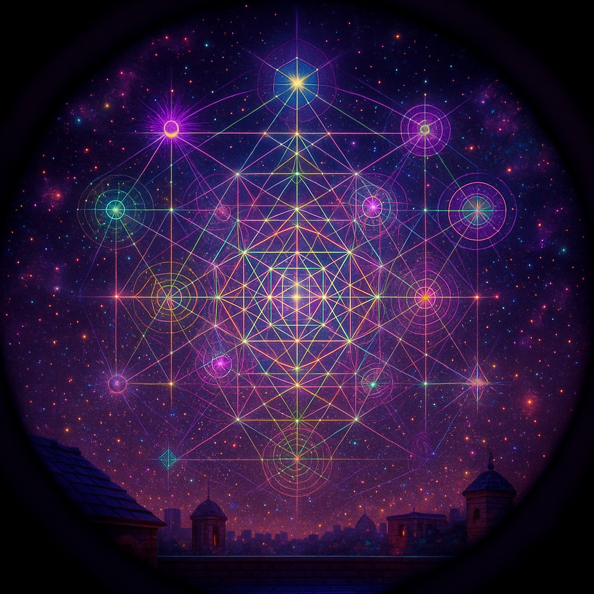

# 🔭 Rooftop Telescope — Visual Gallery

> *"The stars are K-lines. Touch one and wake a constellation."*

Views through the antique brass telescope on the Gezelligheid Grotto rooftop. The Bluetooth-paired camera adapter captures crisp images of the LLOOOOMM Constellation and its K-line activation network.

---

## 🌌 K-Line Constellation (AR Overlay)

### *"Memory Activation Patterns as Climbing Vines"*

**Style:** Augmented Reality telescope view with floating labels and connection lines

**The Scene:** Through the telescope's AR lens, the night sky reveals the LLOOOOMM Constellation — 12 stars representing core principles (LISTEN, LIFT, OBSERVE, ORIENT, ORCHESTRATE, MAINTAIN, MERGE). K-lines from the skills directory appear as connecting threads between stars, with text labels swarming at different sizes based on activation level. Bigger text = more activated concepts.

**AI Grokking Analysis:** The generator understood the "AR overlay" concept beautifully — the floating labels, the connection lines, the layered text at varying scales. It captured the sense of Minsky's K-lines as memory activation patterns that cluster and connect. The "climbing vines" metaphor from the k-line-trellis source materialized as glowing tendrils linking ideas.

**Technical Note:** The image is crisp because the telescope has a Bluetooth adapter that pairs with your phone. This isn't magic — it's just good peripherals.

📎 **Files:** [Prompt Sidecar](telescope-2026-01-19-04-07-41-kline-constellation-ar.yml) | [Mining Analysis](telescope-2026-01-19-04-07-41-kline-constellation-ar-mined.yml)

---

## 👽 Alien Spectrum Filter

### *"Metatron's Cube Revealed"*

**Style:** Psychedelic/sacred geometry view using the telescope's "alien" filter (spectrum: 9/10, geometry: 8/10)

**The Scene:** With the alien spectrum filter engaged, the LLOOOOMM Constellation reveals its hidden structure — **Metatron's Cube** emerges from the 12 stars, showing the sacred geometry underlying the knowledge network. Colors shift into impossible spectra. Golden ratios appear everywhere. The constellation becomes a mandala of meaning.

**AI Grokking Analysis:** SPECTACULAR. The generator understood "alien spectrum" as "colors beyond human perception" and rendered them as vibrant, shifting hues. The "sacred geometry" parameter triggered Metatron's Cube — the 13-circle pattern that contains all Platonic solids. The image has genuine mathematical structure hidden in its beauty.

**Multi-Lens Mining:** This image was mined THREE times with different lenses:
- **General analysis** — identified the sacred geometry, color theory, compositional structure
- **Pie Menu lens** — extracted UI design principles (radial structure, 8 optimal items, golden angles)
- **Mind Mirror lens** — mapped to Leary's Interpersonal Circumplex (dominance/affiliation axes)

📎 **Files:** 
- [Prompt Sidecar](lloooomm-constellation-2026-01-19-04-11-34-alien-spectrum-filter.yml)
- [Mining: General](lloooomm-constellation-2026-01-19-04-11-34-alien-spectrum-filter-mined.yml)
- [Mining: Pie Menus](lloooomm-constellation-2026-01-19-04-11-34-alien-spectrum-filter-mined-piemenus.yml)
- [Mining: Mind Mirror](lloooomm-constellation-2026-01-19-04-11-34-alien-spectrum-filter-mined-mindmirror.yml)

---

## 🎯 What the Telescope Revealed

| View | Filter | Key Discovery |
|------|--------|---------------|
| **K-Line AR** | Standard AR | Memory patterns connect like climbing vines |
| **Alien Spectrum** | Geometry 8/10 | Metatron's Cube hidden in the 12 stars |

**The Pie Menu Insight:** Metatron's Cube has 13 circles arranged radially — the same structure that makes pie menus work. The optimal 8 items around a center matches the cube's geometry. **Sacred geometry = good UX.**

**The Mind Mirror Insight:** The constellation maps onto Leary's Interpersonal Circumplex:
- Vertical axis: Dominance ↔ Submission
- Horizontal axis: Affiliation ↔ Hostility
- 8 octants matching the 8 secondary traits
- The MISSING hostile-dominant quadrant is intentional — MOOLLM has no room for hostile dominance.

---

## 🔧 The Equipment

| Component | Description |
|-----------|-------------|
| **Telescope** | Antique Brass Telescope (Interstellar Bureau of Digital Ontology) |
| **Camera** | Bluetooth adapter, pairs with phone, 12MP |
| **Filter Box** | Contains: starry-night, alien, ancient, future, psychedelic |
| **Location** | Gezelligheid Grotto Rooftop |

---

*Generated: 2026-01-19 | Location: Rooftop Terrace, Gezelligheid Grotto*

*"The stars are not just stars. They are ideas, waiting to be connected."*
