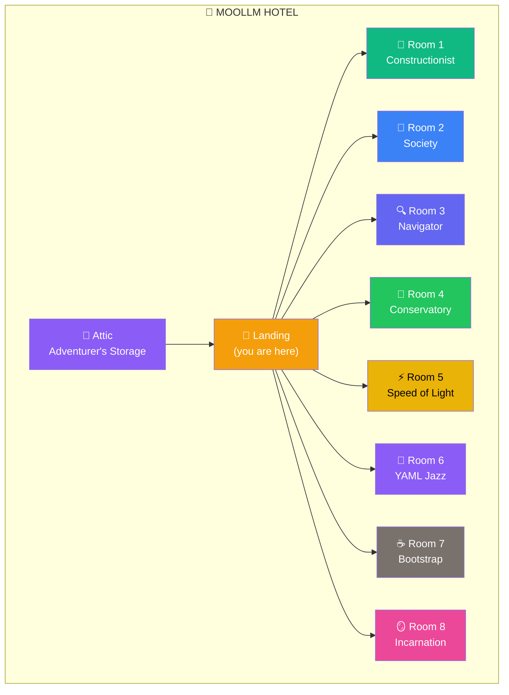

# 🏨 The MOOLLM Hotel

> *"Every room teaches something. Every guest learns differently."*

**Upstairs at The Rusty Lantern** — Eight themed suites showcasing MOOLLM philosophy.

---

## 🗺️ Room Directory



---

## 🚪 The Suites

| Room | Name | Theme | Emoji | Resident |
|------|------|-------|-------|----------|
| [1](room-1/) | **Constructionist Suite** | Papert, Logo, build to learn | 🐢 | Logo Turtle |
| [2](room-2/) | **Society Suite** | Minsky, agents, K-lines | 🧠 | Agent Parliament |
| [3](room-3/) | **Navigator's Suite** | Introspection, cursor-mirror | 🔍 | I-Beam |
| [4](room-4/) | **Garden Conservatory** | Rocky, YAML Jazz orchids | 🌿 | Rocky |
| [5](room-5/) | **Speed of Light Suite** | Many turns, one call | ⚡ | Shuffle |
| [6](room-6/) | **YAML Jazz Suite** | Structure with soul | 🎷 | Jazz Typewriter |
| [7](room-7/) | **Bootstrap Suite** | Cold start, probing | ☕ | Barista-9000 |
| [8](room-8/) | **Incarnation Suite** | Character creation, souls | 🪞 | Selfie |
| [Attic](attic/) | **Adventurer's Storage** | Gear, buffs, artifacts | 🎒 | Entropy Flask |

---

## ✨ Special Features

### 🐢 Room 1: The Logo Turtle Vehicle

The Logo Turtle in Room 1 can be **embarked as a vehicle**:

```
EMBARK → FORWARD pub → DISEMBARK
```

Travel anywhere in the adventure while piloting the turtle. Say `GO HOME` to return to Room 1.

### 🪨 Room 4: Geological Time

Rocky has been watching plants grow for 4.5 billion years. Ring the brass bell for conversation. The Logo Turtle visits often — they're geological-time buddies.

### 🎒 The Attic: Adventurer's Gear

Take what you need, leave what you find. Weird buffs, deprecated features, edge case equipment.

---

## 📜 Registry

See [hotel-registry.yml](hotel-registry.yml) for:
- Permanent residents
- Notable guests
- Incidents and stories

---

## 🚪 Navigation

| Direction | Destination |
|-----------|-------------|
| ⬇️ Down | [../](../) — The Rusty Lantern (pub) |
| ⬆️ Up | [attic/](attic/) — Adventurer's Storage |
| 🌟 Roof | [../rooftop/](../rooftop/) — Stargazing Terrace |

---

*"Choose the room that matches your goals."*
