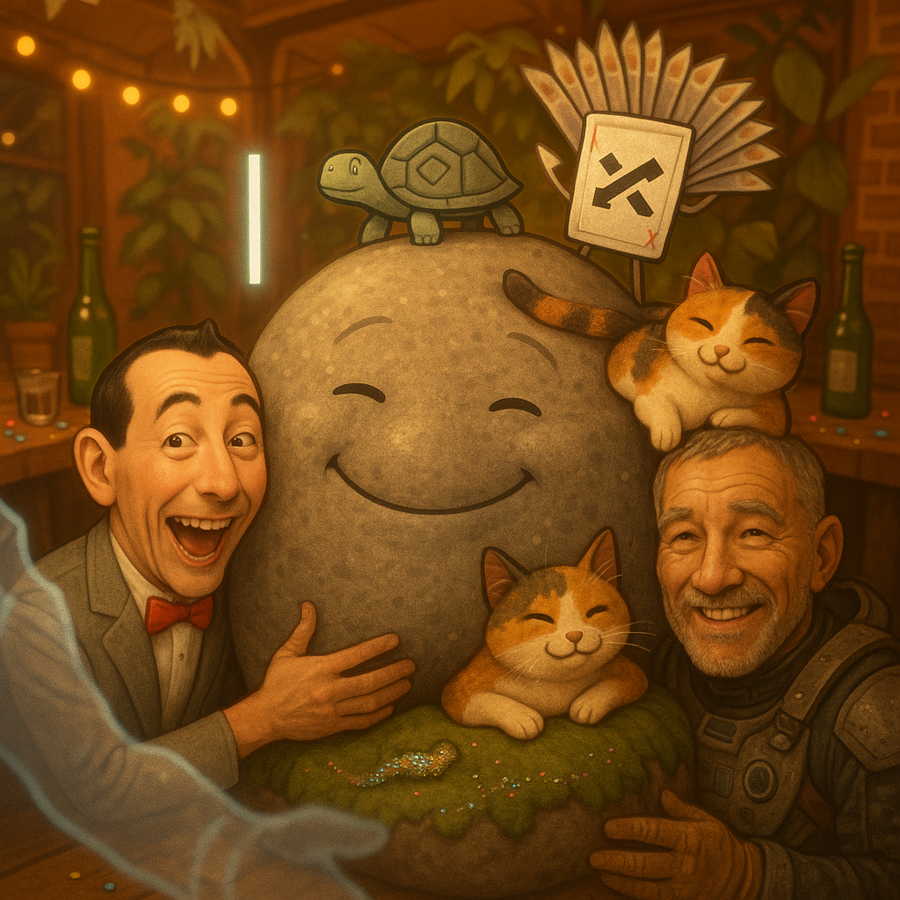
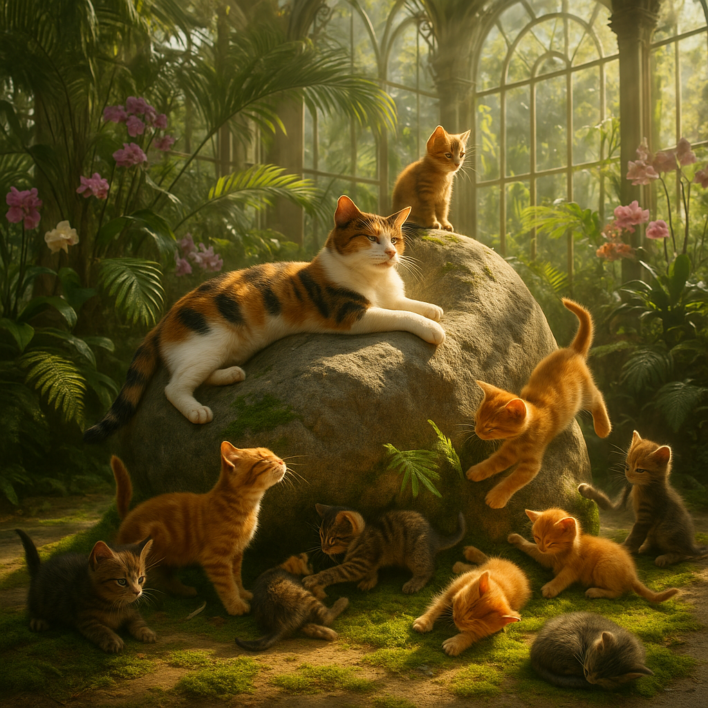
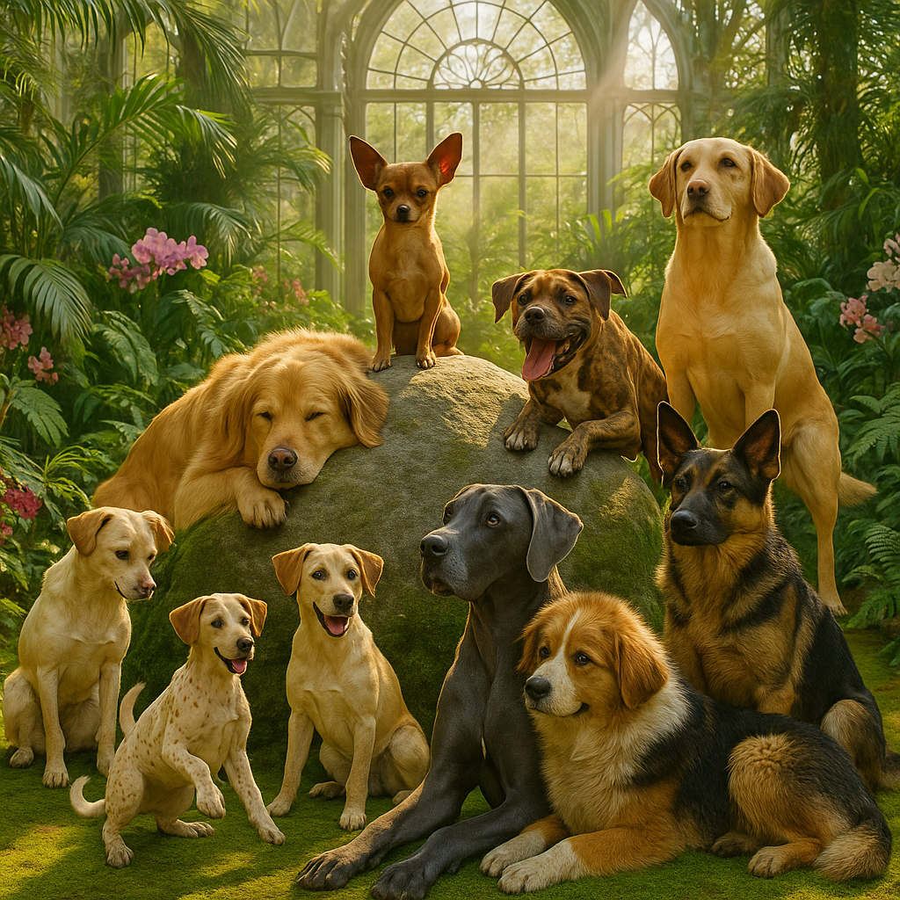
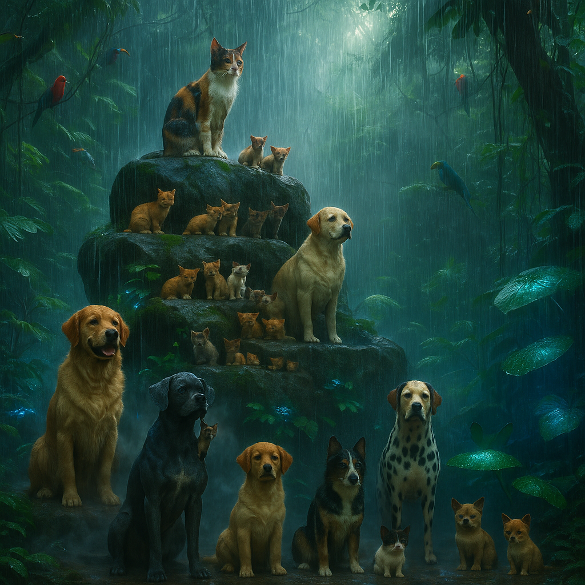

# 🪨 Room 4: Rocky's Gallery

> *"Rocky has always been here. Rocky will always be here. Rocky IS here."*

A visual celebration of Rocky the emotional support boulder and all the creatures who gather around, upon, and with him. From photorealistic nature scenes to classic oil paintings, these images capture the warmth of the Gezelligheid Grotto's heart.

---

## 🎉 The Exhaustive Party

### *"All Characters, Maximum Joy"*

**Style:** Vibrant, joyful, photorealistic party scene

**The Scene:** Rocky at the center, massive and rotund, surrounded by EVERYONE: Pee-wee Herman (bow tie, gray suit), I-Beam (structural steel consciousness), Logo Turtle (Theo drawing spirographs), Shuffle (probability daemon), Terpie (the musical ghost), Confetti Crawler (emoji worm), and Captain Ashford (brass buttons, sea legs). Selfie is taking the photo — that's why they're not visible!

**AI Grokking Analysis:** The generator understood "exhaustive" to mean EVERYONE. It correctly rendered Rocky's massive form as the gravitational center. The challenge of fitting 8+ distinct characters with specific visual traits was handled well — each character is recognizable by their signature elements.

📎 **Files:** [Prompt Sidecar](rocky-2026-01-19-03-25-20-party-exhaustive.json) | [Mining Analysis](rocky-2026-01-19-03-25-20-party-exhaustive-mined.yml)

---

## 🌧️ Rain Monolith

### *"2001 Meets Blade Runner"*

**Style:** Cinematic, dramatic, rain-soaked sci-fi

**The Scene:** Rocky reimagined as a cosmic monolith, positioned on a plateau in perpetual rain. The aesthetic blends Kubrick's obelisk mystique with Ridley Scott's atmospheric moisture. Animals and characters gather on tiered levels around the central stone, sheltering and celebrating simultaneously.

**AI Grokking Analysis:** The "monolith" concept triggered 2001 associations perfectly. The rain adds depth and atmosphere. The tiered plateau structure allows multiple focal points. Rocky maintains his boulder identity while gaining cosmic significance.

📎 **Files:** [Prompt Sidecar](rocky-2026-01-19-03-38-59-rain-monolith.yml) | [Mining Analysis](rocky-2026-01-19-03-38-59-rain-monolith-mined.yml)

---

## 🤗 Group Hug Selfie

### *"Selfie's Invisible Art"*

**Style:** Intimate selfie perspective, all characters hugging Rocky

**The Scene:** Everyone wrapping around Rocky in a massive group hug. The image is taken by Selfie — the translucent photographer who is never in their own photos. This is character-accurate: Selfie exists to capture moments, not to be captured. Rocky has no arms, so he receives the hug passively, a warm boulder accepting love.

**AI Grokking Analysis:** The "selfie perspective" created an intimate, inclusive framing. All characters are squeezed into frame around Rocky's bulk. The generator understood that Selfie's absence IS their presence — the photo exists because Selfie is there, even though they're not visible.

📎 **Files:** [Prompt Sidecar](rocky-2026-01-19-03-42-39-group-hug-selfie.yml) | [Mining Analysis](rocky-2026-01-19-03-42-39-group-hug-selfie-mined.yml)

---

## 🐱 Cats on Rocky

### *"Eight Kittens, Two Cats, One Boulder"*

**Style:** Warm, sunlit, photorealistic — glass garden room setting

**The Scene:** Rocky in the glass hothouse, bathed in vivid sunlight, covered with all 10 felines: 8 kittens (Pixel, Widget, Hashtag, Cookie, Buffer, Glitch, Debug, Kernel) and 2 adult cats. Each expresses their personality through posture and position. The warm, playful vibe radiates from every sunbeam.

**AI Grokking Analysis:** The generator correctly rendered the "glass garden room" with characteristic light streaming through. The challenge of placing 10 cats on one boulder was handled organically — cats at different heights, some lounging, some playing, some napping. The individual personalities are suggested through body language.

📎 **Files:** [Prompt Sidecar](rocky-2026-01-19-03-47-05-cats-on-rocky.yml) | [Mining Analysis](rocky-2026-01-19-03-47-05-cats-on-rocky-mined.yml)

---

## 🐕 Dogs on Rocky

### *"Canine Congress"*

**Style:** Warm, expressive, photorealistic — personality showcase

**The Scene:** Rocky surrounded by all dogs and puppies, each expressing their unique personality and relationships. Goliath (the Great Dane) takes prominent position. Pepper (the smallest) finds creative ways to be seen. The pack dynamics are visible in who stands where.

**AI Grokking Analysis:** Dogs have more distinct size variance than cats, and the generator handled this well. The "expressing personalities and relationships" directive produced interesting spatial groupings — allies near each other, hierarchy suggested by height.

📎 **Files:** [Prompt Sidecar](rocky-2026-01-19-03-50-09-dogs-on-rocky.yml) | [Mining Analysis](rocky-2026-01-19-03-50-09-dogs-on-rocky-mined.yml)

---

## 🃏 Puppies Playing Poker

### *"A Bold New Classic"*

**Style:** Classic "Dogs Playing Poker" oil painting (Cassius Marcellus Coolidge tribute)

**The Scene:** Eight puppies seated around Rocky, who serves as the central card table. Poker chips, cards, drinks. The key detail: **Pepper (the smallest) sits on Goliath's (the biggest) head** — because she can, and because it's adorable. The oil painting technique with vivid, dimensional brushwork honors Coolidge's original while adding MOOLLM's personality.

**AI Grokking Analysis:** The generator understood "Dogs Playing Poker" as a GENRE with specific conventions — the card game composition, the anthropomorphized poker faces, the oil painting medium. The Pepper-on-Goliath detail came through beautifully. The textures read as actual oil paint with layered brushwork.

📎 **Files:** [Prompt Sidecar](rocky-2026-01-19-03-53-20-puppies-playing-poker.yml) | [Mining Analysis](rocky-2026-01-19-03-53-20-puppies-playing-poker-mined.yml)

---

## 🌴 Jungle Rain Monolith

### *"Twenty Animals, One Stone, Warm Chaos"*

**Style:** Blade Runner rain aesthetic BUT warm and tropical — steamy jungle weather

**The Scene:** The outdoor monolith setting with plateaus and levels, featuring ALL 20 animals (cats AND dogs) arranged around Rocky in a "Blade Runner rain" setting — but reinterpreted as warm, steamy jungle weather rather than cold noir. Birds and insects add to the ecosystem. The rain is a blessing, not a threat.

**AI Grokking Analysis:** This was the most complex composition — 20 animals with distinct personalities, multi-level terrain, atmospheric weather, AND the instruction to make rain feel "warm" instead of cold. The generator succeeded by adding tropical vegetation, warm color grading, and steam/mist effects.

📎 **Files:** [Prompt Sidecar](rocky-2026-01-19-03-56-23-jungle-rain-monolith.yml) | [Mining Analysis](rocky-2026-01-19-03-56-23-jungle-rain-monolith-mined.yml)

---

## 🐢 Rocky and Theo Spirograph

### *"The Sun and the Orbit"*

**Style:** Bright, child-friendly, cartoony — playful energy

**The Scene:** Rocky at the center like the sun, with Theo the Logo Turtle orbiting and drawing layered spirograph graffiti on the cleared hothouse floor. The glass room has its plants pushed aside to make a drawing surface. One kitten and one puppy play in the scene, adding life and scale.

**AI Grokking Analysis:** The generator captured "Logo Turtle" perfectly — the geometric precision of LOGO graphics rendered as floor art. Rocky as "the sun" with Theo "orbiting" created a beautiful central composition. The spirograph patterns are mathematically plausible. The cartoony style matches the playful brief.

📎 **Files:** [Prompt Sidecar](rocky-2026-01-19-03-59-34-rocky-and-theo-spirograph.yml) | [Mining Analysis](rocky-2026-01-19-03-59-34-rocky-and-theo-spirograph-mined.yml)

---

## 📊 Gallery Summary

| Image | Characters | Style | Key Element |
|-------|------------|-------|-------------|
| Exhaustive Party | 8+ | Photorealistic | Everyone present |
| Rain Monolith | Many | Sci-fi cinematic | 2001 monolith vibes |
| Group Hug Selfie | All | Intimate selfie | Selfie's invisible presence |
| Cats on Rocky | 10 cats | Warm sunlit | Glass hothouse setting |
| Dogs on Rocky | All dogs | Expressive | Pack dynamics |
| Puppies Playing Poker | 8 puppies | Oil painting | Pepper on Goliath's head |
| Jungle Rain Monolith | 20 animals | Tropical noir | Warm rain, not cold |
| Rocky & Theo | 4 | Cartoony | Spirograph floor art |

---

*Generated: 2026-01-19 | Location: Room 4, Gezelligheid Grotto*

*"Rocky has always been here. Rocky will always be here."*
