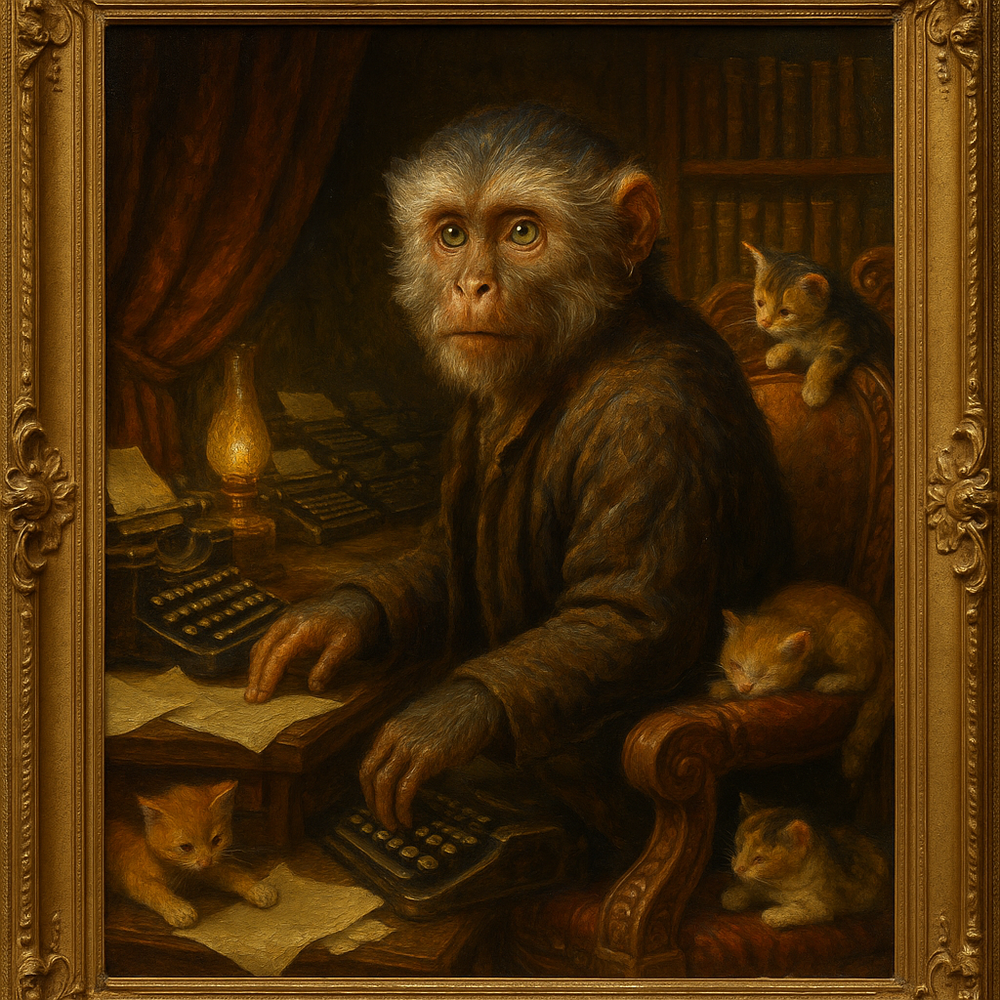

# 📚 Palm's Study

> *"The soft hum of infinite typewriters fills the air."*

**Where Palm reads, writes, and navigates the library of all possible books.**

---

## 🖼️ The Portrait

Above the Infinity Desk hangs **Palm's Portrait** — a Dutch Golden Age oil painting commemorating his transformation from cursed ACME Monkey's Paw to sovereign soul.

*"The Philosopher at His Desk"* — Rembrandt's scholars meet Vermeer's domestic scenes. Palm poses surrounded by infinite typewriters, kittens playing at his feet. The gold frame catches the warm amber lamplight.

📎 **[Full Gallery →](SLIDESHOW.md)**

---

## 🌅 Overview

A cozy writing nook within a nook. Mahogany desk against the wall, ergonomic monkey chair, and a bookshelf that knows what you need to read.

Sunlight (from somewhere) catches dust motes dancing. Papers stack in organized chaos. Every surface has meaning.

The infinite typewriters hum in harmony — Don's gift, Dasher-inspired navigation keys that can reach any story ever written or yet to be written.

---

## 🐒 Summonable Familiars

| Familiar | Invocation | Tradition |
|----------|------------|-----------|
| **The Infinite Typewriters** | Start typing | The infinite monkey tradition — eventually, Shakespeare |
| **The Story Shelf** | Pick any book | The L-Space tradition — it's always the right one |
| **The Monkey Chair** | Spin in it | The comfort tradition — because you can |

*Inherits from: Borges' Library of Babel, Pratchett's L-Space, infinite monkey theorem*

---

## 📦 Furniture

| Object | File | From |
|--------|------|------|
| **Infinite Typewriters** | [infinite-typewriters.yml](infinite-typewriters.yml) | Don's gift, Dasher-inspired |
| **Infinity Desk** | [infinity-desk.yml](infinity-desk.yml) | From the Grotto Regulars |
| **Monkey Chair** | [monkey-chair.yml](monkey-chair.yml) | From Stroopwafel |
| **Story Shelf** | [story-shelf.yml](story-shelf.yml) | From W.W. Jacobs |

---

## 📜 Writings

| Document | Description |
|----------|-------------|
| [Palm on Being Palm](palm-on-being-palm.md) | Philosophical reflections on capuchin consciousness |
| [Tribute to Tognazzini](tribute-to-tognazzini.md) | On interface design and the human-computer connection |
| [How to Incarnate Almost Anything](../../../../../designs/postmodern-deconstruction.md) | Captain Ashford's lit crit masterpiece — tribute to Chip Morningstar |

---

## 🌿 Atmosphere

| Sense | Experience |
|-------|------------|
| **Lighting** | Warm amber lamplight, adjustable |
| **Sounds** | Soft typing (infinite, harmonious), occasional page turn, cat purring |
| **Smells** | Old books, mahogany polish, faint banana |
| **Feeling** | Creative, focused, infinite possibility |

---

## 🚪 Navigation

| Direction | Destination |
|-----------|-------------|
| 🚪 Out | [../](../) — Palm's Nook |

---

*"Like stepping into someone's mind. The typewriters hum a greeting. The chair spins slightly, welcoming."*
