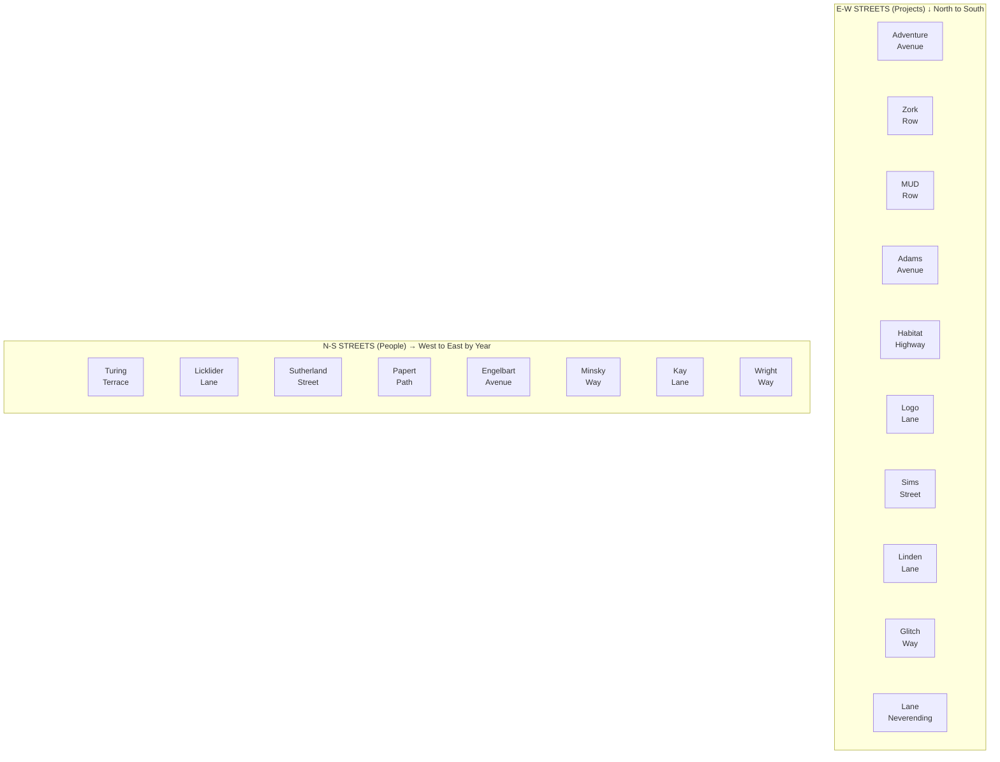

# The Street Grid

> *"Meet me at the corner of Kay and Neverending."*

This document describes the street grid topology for the virtual town. Streets are named according to a tribute convention that honors both **pioneers** (people) and **projects** (virtual worlds).

---

## The Grid Plan



---

## Naming Convention

| Direction | Named After | Pattern | Examples |
|-----------|-------------|---------|----------|
| **North-South** | People (pioneers) | [Name] + Street Type | Kay Lane, Engelbart Avenue |
| **East-West** | Projects (virtual worlds) | [Project] + Street Type | Lane Neverending, Habitat Highway |

### Why This Convention?

- **People run vertically** — like pillars holding up the world
- **Projects run horizontally** — like layers of history, each era building on the last
- **Intersections** — where a pioneer meets a world they influenced

---

## North-South Streets (Pioneers)

*Vertical streets honoring the people who built the foundations.*

| Street | Tribute | Year | Why | Status |
|--------|---------|------|-----|--------|
| **Turing Terrace** | Alan Turing | 1936 | On Computable Numbers. The foundation of it all. | 📋 Planned |
| **Licklider Lane** | J.C.R. Licklider | 1960 | Man-computer symbiosis, ARPANET vision. | 📋 Planned |
| **Sutherland Street** | Ivan Sutherland | 1963 | Sketchpad, VR pioneer, computer graphics. | 📋 Planned |
| **Papert Path** | Seymour Papert | 1967 | Logo, constructionism, microworlds, turtle graphics. | 📋 Planned |
| **Engelbart Avenue** | Doug Engelbart | 1968 | Mother of all demos, mouse, hypertext, augmentation. | 📋 Planned |
| **Minsky Way** | Marvin Minsky | 1969 | Perceptrons, Society of Mind, K-lines, AI foundations. | 📋 Planned |
| **Kay Lane** | Alan Kay | 1972 | Smalltalk, Dynabook, OOP. The main spine. Pun on "K-Line". | 🎯 Planned (main) |
| **Wright Way** | Will Wright | 1989 | SimCity, The Sims, Spore. God games and dollhouses. | 📋 Planned |

### The Sound Test

These names were chosen for both meaning and mellifluousness (ordered by year):

- **Turing Terrace** (1936) — T-T alliteration
- **Licklider Lane** (1960) — L-L alliteration
- **Sutherland Street** (1963) — S-S alliteration
- **Papert Path** (1967) — P-P alliteration
- **Engelbart Avenue** (1968) — EN-gel-bart AV-en-ue (perfect cadence)
- **Minsky Way** (1969) — echoes "Milky Way"
- **Kay Lane** (1972) — punchy, memorable, pun-laden
- **Wright Way** (1989) — W-W alliteration

---

## East-West Streets (Projects/Worlds)

*Horizontal streets honoring the virtual worlds and projects that shaped this medium.*

**Ordered north to south** — "Old Town" text adventures in the north, newer worlds toward the south:

| Street | Position | Tribute | Era | Status |
|--------|----------|---------|-----|--------|
| **Adventure Avenue** | **NORTHERN EDGE** | Adventure genre (Colossal Cave, etc.) | 1976+ | 📋 Planned |
| **Zork Row** | Far North | Infocom's Zork | 1977-1982 | 📋 Planned |
| **MUD Row** | North | MUD1 (like Skid Row, but muddier) | 1978 | 📋 Planned |
| **Adams Avenue** | North | Scott Adams (Adventureland) | 1978 | 📋 Planned |
| **Habitat Highway** | Mid-North | Lucasfilm's Habitat | 1986 | 📋 Planned |
| **Logo Lane** | Mid | Logo Adventure (Don Hopkins, C64) | 1987 | 📋 Planned |
| **Sims Street** | Mid | The Sims, SimCity | 1989-2000 | 📋 Planned |
| **Linden Lane** | Mid-South | Second Life (Linden Lab) | 2003 | 📋 Planned |
| **Glitch Way** | Just North of Lane | Glitch (Tiny Speck) | 2011-2012 | 📋 Planned |
| **Lane Neverending** | **South Edge** | Habitat → Game Neverending → Glitch | 1986-2012 | ✅ Built |

**The Glitch Connection:**
Glitch Way sits directly north of Lane Neverending — they're family.
Game Neverending (2002-2004) became Flickr but inspired Glitch (2011-2012).
After Glitch shut down, Stewart Butterfield's team created Slack.
Lane Neverending honors that whole lineage. (No Slack roads though — some things stay corporate.)

**Adventure Avenue:**
The NORTHERN frontier. No more streets beyond this — just adventure wilderness.
Buildings along the north side of Adventure Avenue open directly into dungeons,
caves, and adventure country. Colossal Cave is up there somewhere. So are dragons.
This is where the street grid ends and the adventure begins.

**MUD Row:**
Just south of Zork Row. Classic Essex architecture (whatever that is — 
brutalist 1970s university buildings? Half-timbered medieval? Both?). Like Skid Row, 
but muddier. Where the original multi-user dungeons began.

**Logo Lane:**
Where the command line IS the parser. Don Hopkins' Logo Adventure (1987, C64 Terrapin Logo)
let users "cheat" by learning Logo commands. Constructionist game design — the code
was the game, the game was the code. Turtles optional but encouraged.

**South of Lane Neverending:** The pub's back garden → the maze → dungeons and wilder places.

---

## The Main Intersection

The heart of town is where **Kay Lane** crosses **Lane Neverending**.

```
                 KAY LANE
                    │
                    │ N
                    │ (toward Zork Row, Habitat Highway)
       ┌────────────┼────────────┐
  W ───┤    Lane Neverending     ├─── E
       │            │            │
       │   [PUB]    │            │
       │  (south)   │            │
       └────────────┼────────────┘
                    │
                    │ S (behind pub: garden → maze → dungeons)
                    │
```

**At this intersection:**
- The Rusty Lantern pub (south side of Lane Neverending, at center)
- Kay Lane extends **north** toward Zork Row and beyond
- Kay Lane extends **south** into the pub's back garden, then the maze, then dungeons

**Lane Neverending is the southern edge of the street grid** — the frontier between town and the wilder places beyond.

---

## The Full Grid (Future Vision)

**North is UP. The pub marks the southern edge of the street grid.**

```
N O R T H   (adventure wilderness — dungeons, caves, dragons)
              │          │        │         │        │          ↑ buildings and lots open to forests and dungeons north
══════════════╪══════════╪════════╪═════════╪════════╪════════  Adventure Avenue (1976, NORTHERN EDGE)
              │          │        │         │        │ 
──────────────┼──────────┼────────┼─────────┼────────┼────────  Zork Row (MIT-DM, Infocom, 1977-82)
              │          │        │         │        │
──────────────┼──────────┼────────┼─────────┼────────┼────────  MUD Row (1978, Essex architecture)
              │          │        │         │        │
──────────────┼──────────┼────────┼─────────┼────────┼────────  Adams Avenue (Scott Adams, 1978)
              │          │        │         │        │
──────────────┼──────────┼────────┼─────────┼────────┼────────  Habitat Highway (1986)
              │          │        │         │        │
──────────────┼──────────┼────────┼─────────┼────────┼────────  Logo Lane (1987)
              │          │        │         │        │
──────────────┼──────────┼────────┼─────────┼────────┼────────  Sims Street (1989-2000)
              │          │        │         │        │
──────────────┼──────────┼────────┼─────────┼────────┼────────  Linden Lane (2003)
              │          │        │         │        │
──────────────┼──────────┼────────┼─────────┼────────┼────────  Glitch Way (2011-12) ← family!
              │          │        │         │        │
══════════════╪══════════╪════════╪═════════╪════════╪════════  Lane Neverending (SOUTHERN EDGE)
              │          │  PUB ◆ │         │ LEELA  │            ◆ = main intersection
              │Sutherland│  Kay   │Engelbart│ Minsky │ Papert
              │  Street  │  Lane  │ Avenue  │  Way   │  Path
                         │
                         ▼
              [Garden → Maze → Dungeons]  (beyond the grid)

S O U T H   (into the wilds)
```

The further north you go, the older the inspirations ("Old Town" — MUD Row, Adams Ave, Zork Row).
Adventure Avenue marks the northern edge — beyond it lies adventure wilderness.
Glitch Way sits just north of Lane Neverending — honoring their shared lineage.
Lane Neverending marks the southern edge — beyond it lies the pub's garden, maze, and dungeons.

**Both edges lead to adventure. The grid is civilization. Beyond is wilderness.**

---

## Building Placement

Each street segment can have buildings on two sides:

```
NORTH SIDE:  [ building ]
═════════════ STREET ═════════════
SOUTH SIDE:  [ building ]
```

Future expansion may allow corner buildings (NE, NW, SE, SW).

---

## Current Implementation

| Street | Status | Segments | Notes |
|--------|--------|----------|-------|
| [Lane Neverending](lane-neverending/) | ✅ Built | w3 ↔ e3 (loops) | Main E-W street |
| Kay Lane | 📋 Planned | — | Main N-S spine, crosses at center |
| Others | 📋 Planned | — | Deferred for future expansion |

---

## Directory Structure

```
street/
├── README.md                    # This file (grid plan)
├── lane-neverending/            # E-W: The endless loop
│   ├── center/                  # Kay Lane intersection
│   ├── w1/ through w3/          # West segments
│   ├── e1/ through e3/          # East segments
│   └── leela-manufacturing/     # Building (south of w1)
├── kay-lane/                    # N-S: Main spine (planned)
│   ├── center/                  # Lane Neverending intersection
│   ├── n1/ through n3/          # North segments
│   └── s1/ through s3/          # South segments
└── [other streets]/             # Future expansion
```

---

## See Also

- [Lane Neverending](lane-neverending/) — the first and currently only street
- [Leela Manufacturing](lane-neverending/leela-manufacturing/) — the knowledge factory

---

*The grid grows as the town grows. One intersection at a time.*
