# Lane Neverending

> *"A street that loops forever. Just like good ideas."*

**Lane Neverending** is the main thoroughfare running through this neighborhood. Named in tribute to [Habitat](https://en.wikipedia.org/wiki/Habitat_(video_game)), [Game Neverending](https://en.wikipedia.org/wiki/Game_Neverending), and [Glitch](https://en.wikipedia.org/wiki/Glitch_(video_game)) — pioneering virtual worlds that showed us what online communities could be.

The street runs east and west... and then loops back on itself. Walk far enough in either direction and you'll end up where you started. That's not a bug. That's the point.

---

## Street Map

```mermaid
flowchart LR
    subgraph West["WEST"]
        W3["w3\n🏪 More shops"]
        W2["w2\n🏛️ Landmarks"]
        W1["w1\n🏭 LEELA\n🍺 Next to pub"]
    end
    
    subgraph Center["CENTER"]
        C["center\n🌳 Origin Plaza\n⚡ Flickering Lamp"]
    end
    
    subgraph East["EAST"]
        E1["e1\n💤 Sleeping Figure\n📸 Glitch Memorial"]
        E2["e2\n🏪 ACME Surplus"]
        E3["e3\n🎭 More discoveries"]
    end
    
    W3 --> W2 --> W1 --> C --> E1 --> E2 --> E3
    E3 --> |"loops!"| W3

    style C fill:#27ae60,color:#fff
    style W1 fill:#3498db,color:#fff
```



---

## Street Segments

| Segment | Direction | Notable Features | Links |
|---------|-----------|------------------|-------|
| [w3](w3/) | Far West | Shops and curiosities | [→](w3/) |
| [w2](w2/) | West | Landmarks and history | [→](w2/) |
| [w1](w1/) | Near West | **Leela Manufacturing**, pub access | [→](w1/) |
| [center](center/) | Center | Origin Plaza, The Flickering Lamp | [→](center/) |
| [e1](e1/) | Near East | Sleeping Figure, Glitch Memorial | [→](e1/) |
| [e2](e2/) | East | ACME Surplus (painted tunnel!) | [→](e2/) |
| [e3](e3/) | Far East | More to discover | [→](e3/) |

---

## The Loop


The street loops. East connects to west. West connects to east. You can walk forever and never leave. You can also walk forever and see everything.

---

## Leela Manufacturing

The crown jewel of Lane Neverending: [Leela Manufacturing Intelligence](leela-manufacturing/) at **5 Lane Neverending**.

```mermaid
flowchart TB
    subgraph Leela["🏭 LEELA MANUFACTURING"]
        Roof["🌿 Rooftop"]
        F3["Floor 3: Shipping"]
        F2["Floor 2: Factory"]
        F1["Floor 1: Intake"]
        Lobby["Lobby"]
        Basement["Basement: R&D"]
    end
    
    Street["Lane Neverending W1"] --> Lobby

    style Leela fill:#3498db,color:#fff
```



The visual intelligence factory. Where video becomes understanding.

---

## Street Furniture

Every segment of Lane Neverending shares common elements, implemented via the [Flyweight Pattern](STREET-FURNITURE.yml):

```mermaid
flowchart LR
    subgraph Prototypes["📋 Shared Prototypes"]
        Lamp["🏮 Lamp Post\nMagical flame\nGrue-safe"]
        Bench["🪑 Street Bench\nWrought iron\nComfortable"]
        Cobbles["🟫 Cobblestones\nWell-worn\nHistoric"]
        Gutter["💧 Gutter\nFunctional\nOccasional frog"]
    end
    
    subgraph Instances["Each Street Gets"]
        L1["Lamp Post\n(north side)"]
        L2["Lamp Post\n(south side)"]
        B1["Bench\n(unique carvings)"]
    end
    
    Prototypes --> |"flyweight"| Instances
```



| Fixture | Description | Per Street |
|---------|-------------|------------|
| 🏮 Lamp Post | Magical flame, grue-safe | 1-2 |
| 🪑 Bench | Wrought iron, carved names | 1 |
| 🟫 Cobblestones | Historic, well-worn | Throughout |
| 💧 Gutter | Drainage, occasional frog | Along edges |

---

## Landmarks

### Origin Plaza (Center)

```mermaid
flowchart TB
    Plaza["🌳 ORIGIN PLAZA"]
    
    Plaza --> Tree["The Origin Tree\n(ancient, knowing)"]
    Plaza --> Lamp["The Flickering Lamp\n(famous, mysterious)"]
    Plaza --> Fountain["The Fountain\n(wishes optional)"]
```



The heart of Lane Neverending. The tree here is the source of cuttings throughout the neighborhood — including the one on [Leela's rooftop](leela-manufacturing/rooftop/).

### The Flickering Lamp (e1)

One lamp post that flickers. Nobody knows why. It's been that way since before anyone can remember. Some say it's trying to tell us something.

### Glitch Memorial (e1)

A small plaque honoring the citizens of [Glitch](https://en.wikipedia.org/wiki/Glitch_(video_game)) (2011-2012):

> *"Here once stood a world of giants and imagination.*
> *The giants are gone. The imagination remains.*
> *Thanks for all the cubimal boxes."*

### ACME Surplus (e2)

A storefront selling assorted ACME products. There's a boarded-up section with a painted tunnel that you **cannot** walk through, no matter how fast you run.

(Rumor has it ACME agents *can* use it for deliveries...)

---

## The Pub

The neighborhood pub sits just east of [Leela Manufacturing](leela-manufacturing/):

```mermaid
flowchart LR
    Leela["🏭 Leela\n5 Lane Neverending"]
    Pub["🍺 The Pub\n(next door)"]
    
    Leela --> |"pneumatic tube"| Pub
    Leela --> |"walk"| Pub
    Pub --> |"wave via telescope"| Leela
```



There's a priority pneumatic tube directly from Leela to the pub. Some insights are best delivered with a pint.

---

## History

**Lane Neverending** is named in tribute to:

| Project | Years | Legacy |
|---------|-------|--------|
| **Habitat** | 1986-1988 | First graphical MMO. Proved virtual worlds work. |
| **Game Neverending** | 2002-2004 | Became Flickr. Pioneered social gaming. |
| **Glitch** | 2011-2012 | Beautiful, weird, wonderful. Gone too soon. |

The name "Neverending" reflects:
- The infinite loop of the street
- The persistence of virtual worlds
- The idea that good communities never truly end

---

## Address Format

Buildings on Lane Neverending use this format:

```
[Number] Lane Neverending

Examples:
5 Lane Neverending (Leela Manufacturing)
7 Lane Neverending (The Pub)
```

---

## Navigation

The street loops, so you can always get anywhere:

| From | Going East | Going West |
|------|------------|------------|
| Center | → e1 → e2 → e3 → w3 → w2 → w1 → center | → w1 → w2 → w3 → e3 → e2 → e1 → center |

It doesn't matter which way you go. You'll get there.

---

*Part of the [MOOLLM Hotel](../../) adventure world*
