# 📦💥🔒 ACME Surplus — The Fun House of Horrors

**4 Lane Neverending** (North Side)  
*Across the street from Leela Manufacturing*

> "EVERYTHING MUST GO" — and it did. But the PRODUCTS remain.

## Status: CLOSED (and Very, VERY Trapped)

**THIS IS A LIVE DEMONSTRATION OF THE ACME CATALOG.**

The DM is encouraged to throw catalog products at intruders with **creativity**, **irony**, and **poetic justice**. Every shelf can spring a trap. Every shadow hides an anvil. Every clever escape attempt triggers a cleverer consequence.

ACME Surplus was once the premier supplier of mail-order gimmicks, improbable devices, and products that worked exactly as badly as needed for comedic effect. Now it stands empty — a monument to every pivot that didn't work out.

The building is **locked and trapped**. ACME never removed their "security" systems.

## The Anti-Pattern

Leela employees look at this building every day. There's even a camera (ACM1) pointed at it from the lobby window, observing the tunnel
painted on the boarded up window. It's a daily reminder:

| ACME | Leela |
|------|-------|
| Ship fast, break things | Build carefully, test thoroughly |
| Blame the customer | Improve from feedback |
| Pivot constantly | Debug persistently |
| Marketing over engineering | Engineering over marketing |
| Products that don't work | Products that work |

## Entry Methods (All Risky)

If you REALLY want to get inside:

### 🚪 Front Door — Pick Lock
- **Difficulty**: 3
- **Trap**: Anvil swings from ceiling on rope
- **Survival**: Dodge roll or take 2d6 blunt damage

### 👢 Front Door — Kick Open
- **Difficulty**: 4
- **Trap**: Cascade of anvils from overhead shelf
- **Survival**: Acrobatics check or become a bowling pin

### 🪟 Side Window — Break In
- **Difficulty**: 2 (easiest)
- **Trap**: Feet land in primed ACME Rocket Skates
- **Survival**: You will career through the store at 60mph

### 🌀 Vent System — Sneak
- **Difficulty**: 3
- **Trap**: ACME Tunnel Paint ruins your sense of direction
- **Survival**: Permanent depth perspective on your clothes

### 🎨 Painted Tunnel — Run Through
- **Difficulty**: 99 (impossible)
- **Trap**: Plywood. Always plywood.
- **Note**: Only works for ACME employees, delivery drivers, and roadrunners

## Inside the Store

If you make it past the traps, you'll find:

```mermaid
flowchart TB
    subgraph ACME["📦 ACME SURPLUS — Main Sales Floor"]
        subgraph Shelves["Empty Shelves"]
            PROJ["PROJECTILES<br/>(empty)"]
            PROP["PROPULSION<br/>(empty)"]
            PORT["PORTABILITY<br/>(empty)"]
            PERS["PERSONAL<br/>(empty)"]
        end
        
        Anvil["🔨 Display Anvil<br/>(not for sale)"]
        Returns["📦 Return Counter<br/>(defective pile)"]
        Tunnel["🎨 Painted Tunnel<br/>(doesn't work for you)"]
    end
    
    subgraph Locked["🔒 LOCKED AREAS"]
        BackRoom["📦⏰ Back Room<br/>*tick tick tick*"]
        Office["📋 Office<br/>(upstairs)"]
        Warehouse["🏭 Warehouse<br/>(deeper)"]
    end
    
    ACME --> BackRoom
    BackRoom --> Warehouse
    ACME --> Office
    
    style ACME fill:#7f8c8d,color:#fff
    style Anvil fill:#95a5a6,color:#000
    style Returns fill:#e74c3c,color:#fff
    style Tunnel fill:#9b59b6,color:#fff
    style BackRoom fill:#2c3e50,color:#fff
    style Office fill:#34495e,color:#fff
    style Warehouse fill:#1a252f,color:#fff
```



## Areas

### Sales Floor
Empty shelves, dust, regret. Some items fell from high shelves; watch your head.

### Return Counter  
Pile of products nobody wanted back:
- Rocket skates with broken ignition
- A portable hole that became permanent  
- "Bird seed" packages (contents unknown)
- Angry letter from a coyote

### Back Room (Locked)
Something ticks behind that door. Something BIG.
Also: **The Box That Works** — one ACME product that works perfectly.
Nobody knows what to do with it.

### Office Upstairs (Locked)
Where the pivots were planned. Whiteboards of failure.
The last note says: "IT WORKS. THAT'S THE PROBLEM."

## DM Toolkit: The Fun House

This space is a **playground of consequences**. The DM has full access to the [ACME Catalog](../w1/acme-catalog.yml) to throw at intruders.

### Ironic Justice Table

| Player Does... | Trap Triggers... |
|----------------|------------------|
| Steals something | 🧲 Giant Magnet attracts everything to it |
| Sneaks | 🎨 Invisible Paint (only THEY can't see themselves) |
| Runs | 🛼 Rocket Skates (no steering) |
| Searches for treasure | 🔍 Treasure Detector (beeps constantly, attracts danger) |
| Hides | 🎹 Grand Piano falls, plays sad trombone |
| Opens a box | 📦 Mystery Box (contains something ironic) |
| Ignores warning | ⚠️ Warning was accurate |
| Gets too clever | 🎭 The CLEVERER trap activates |

### Random Encounter (d6)

1. **ANVIL DROP** — Something falls. Roll to dodge.
2. **FLOOR TRAP** — Something underfoot. Roll dexterity.
3. **ENVIRONMENT** — Room changes. Roll perception.
4. **RESTRAINT** — Net/glue/trap. Roll escape.
5. **PSYCHOLOGICAL** — Mind games. Roll wisdom.
6. **CHAIN REACTION** — Two at once. Roll luck.

### Guiding Principles

- **IRONY IS KING** — Trap relates to what player just did
- **JUSTICE IS POETIC** — Greedy players find wealth-themed traps
- **SURVIVAL IS POSSIBLE** — Damage is comedic, not lethal
- **LESSONS ARE LEARNED** — Every trap teaches something about ACME
- **LAUGHTER IS THE GOAL** — Fun house, not death house

### 🎭 Runtime Instantiation

Traps are **instantiated at runtime** by blurting YAML Jazz into the session log:

```yaml
# 💥 TRAP INSTANTIATED: ACME Anvil
trap_instance:
  prototype: $KITCHEN/acme-catalog.yml#traps_and_devices/ACME_Anvil
  location: "Above the display case"
  triggered_by: "Player reached for the shiny thing"
  
  state:
    falling: true
    height: 15  # feet — narratively decremented
    
  poetic_justice: "They reached for gold. They got iron."
```

Then **properties evolve through narrative**:

> "The anvil plummets. Height: 10 feet. 5 feet. *CLANG.*"

The YAML provides structure. The prose provides evolution. No need to edit the block — just narrate the state changes.

---

## Sub-Rooms (If You Survive)

| Room | Lock | Trap Theme | Catalog Sections |
|------|------|------------|------------------|
| [📦⏰ Back Room](back-room/) | Employee Badge (4) | Mystery, Time | `mystery_items`, `tools` |
| [📋🔄 Office](office/) | Management Key (5) | Illusion, Psychology | `disguises`, `detection_devices` |
| [🏭♾️ Warehouse](warehouse/) | Warehouse Key (5) | Industrial, Propulsion | `traps_and_devices`, `adventure_gear` |

Each sub-room has **trap deployment guidance** — the DM draws from the ACME catalog sections appropriate to that space. Not exhaustive instances, but themes and irony patterns for runtime deployment.

---

## Secrets

### The Painted Tunnel Network
The tunnel IS real — it connects to ACME's entire distribution system. But it only works for:
- ACME employees
- Delivery drivers
- Roadrunners
- Anyone who genuinely doesn't think about it

You think too much. You'll always bounce.

### The Box That Works
One product. Perfect design. Flawless execution.
Labeled: "ANOMALY — DO NOT SHIP"
It terrifies everyone.

## The View from Inside

Through the dusty windows, you see Leela Manufacturing. Lights on. People working. A camera pointed right at you.

They're watching.
They're learning what not to be.
They're winning.

---

*Part of [Lane Neverending](../README.md) — the street where the future and the past face each other across the cobblestones.*
