# Center: Origin Plaza

> *"Where it all began. Where it all returns."*

**Origin Plaza** is the heart of Lane Neverending — a small public square at the center of the looping street. The ancient Origin Tree grows here, its branches spreading over benches where residents gather to think, talk, and occasionally receive wisdom.

---

## The Plaza

```mermaid
flowchart TB
    subgraph Plaza["🌳 ORIGIN PLAZA"]
        Tree["🌳 The Origin Tree<br/>Ancient. Knowing."]
        Lamp["🏮 The Famous Lamp<br/>(not the flickering one)"]
        Bench["🪑 Thinking Benches"]
        Fountain["⛲ The Fountain<br/>Wishes optional"]
    end
    
    W1["← w1<br/>Leela & Pub"] --> Plaza
    Plaza --> E1["e1 →<br/>Glitch Memorial"]
```

---

## The Origin Tree

This is the original. All other "Origin Tree cuttings" throughout the neighborhood trace their lineage here.

```mermaid
flowchart TB
    Origin["🌳 THE ORIGIN TREE<br/>(here, center)"]
    
    Origin --> |"cutting"| Rooftop["Leela Rooftop"]
    Origin --> |"cutting"| Garden["Pub Garden"]
    Origin --> |"cutting"| Unknown["Other locations..."]

    style Origin fill:#228B22,color:#fff
```

**Known Properties:**
- Age: Unknown (older than the street)
- Roots: Go somewhere (nobody has traced them)
- Wisdom: Sit beneath it when stuck
- Leaves: Change with the seasons (but not predictably)

---

## Street Furniture

| Fixture | Location | Notes |
|---------|----------|-------|
| 🏮 Lamp Post (North) | North side of plaza | Standard, steady |
| 🏮 Lamp Post (South) | South side of plaza | Standard, steady |
| 🪑 Bench (East) | Under tree, east side | Popular at sunset |
| 🪑 Bench (West) | Under tree, west side | Popular at sunrise |
| ⛲ Fountain | Center | Coins optional |

---

## Connections

| Direction | Destination | Description |
|-----------|-------------|-------------|
| ⬅️ West | [w1](../w1/) | Leela Manufacturing, The Pub |
| ➡️ East | [e1](../e1/) | The Flickering Lamp, Glitch Memorial |
| 🌳 Here | The plaza | You are here |

---

*Part of [Lane Neverending](../README.md)*
