# ⛪ The Church of the Eval Genius
#
# 3 Lane Neverending (North Side, W2)

> *"Declare your bias. Ring the bell. Enter the rubric."*

The Church of the Eval Genius sits on Lane Neverending like a deliberate footnote:
not huge, not flashy, but unmistakably present. The front is clean and practical,
with a few signature artifacts that say exactly what this place is about.

## The Front

- **Scoreboard Bell** — rings once for every honest admission of bias
- **Scatechism Bible Pod** — prints a single page of doctrine and a daily rubric
- **Tattoo Dispenser** — ACME & Leela certified, Short Duration Personal Tattoos
- **Slack Pipe Memorial** — a respectful nod to the SubGenius lineage
- **Bias Lantern** — changes color with the Bias of Record
- **Quiet Bench** — for Gray Folk who want to listen to themselves

Everything is tasteful and functional. No clutter. The frontage is a sermon: *clarity beats spectacle.*

## Inside the Church

The interior is a workshop, not a cathedral:

- **Narthex** — declarations, sign-in, and the rubric rack
- **Audit Choir** — a room for multi-agent review with rules of order
- **Bias Library** — declared biases archived and indexed
- **Experiment Loft** — simulations and evidence-making
- **Rubric Forge** — criteria hammered into form
- **Mirror Room** — self-evaluation and accountability
- **NO-AI Elevator** — manual, discrete, no inference
- **Roof** — weather vane of judgment and a stubborn little garden
- **Basements** — evidence, engines, silence, and refusal

## Diagram Porn (Holy, Pseudo-Scientific)

```mermaid
flowchart TB
    subgraph FRONT["⛪ FRONT OF HOUSE"]
        Bell["🔔 Scoreboard Bell"]
        Pod["📜 Scatechism Pod"]
        Ink["🖋️ Short Duration Tattoos"]
        Lantern["🏮 Bias Lantern"]
        Pipe["🚬 Slack Pipe Memorial"]
    end

    subgraph CORE["🧠 CORE RITUALS"]
        Declare["Declare Bias"]
        Measure["Measure Evidence"]
        Publish["Publish Scores"]
        Declare --> Measure --> Publish --> Declare
    end

    subgraph FLOORS["🏛️ FLOORS + BASEMENTS"]
        Narthex["Narthex"]
        Choir["Audit Choir"]
        Library["Bias Library"]
        Loft["Experiment Loft"]
        Forge["Rubric Forge"]
        Mirror["Mirror Room"]
        Roof["Roof of Judgment"]
        B1["Evidence Cellar"]
        B2["Bias Engine"]
        B3["Null Chapel"]
        B4["Refusal Vault"]
        B5["NO-AI Embassy"]
    end

    FRONT --> CORE --> FLOORS
    Mirror --> Declare
    B1 --> Measure
    Forge --> Publish
    B5 --> Pipe
```

```mermaid
flowchart LR
    subgraph CHURCH["⛪ Church Sub-Basements"]
        B5C["B5: NO-AI Embassy"]
    end
    subgraph TOWER["🏢 NO-AI Tower Sub-Basement"]
        BXT["Embassy: Church Outpost"]
    end
    B5C -- underground corridor --> BXT
    BXT -- underground corridor --> B5C
```

## Scoping, Not Geography

The filesystem is **scope**, not a map. Rooms live in directories for **inheritance,
behavior, and data access** — not because the rooms are physically nested. The exits
define geography. The church can pull in distant rooms by exit and still keep its own
scoped behavior. The building is a container of rules, not a prison of paths.

In short:
- **Directories are scope.**
- **Exits are geography.**
- **Transclusion keeps worlds modular.**

## Patron Saints (Parody, With Love)

Framed icons line the entry hall:
**Futurama**, **The Simpsons**, **Star Trek**, **Philip K. Dick**, **Stanisław Lem**.
All honored as patrons of skepticism, satire, and the joy of testing reality.

## Rooms

| Room | Directory | Purpose |
|------|-----------|---------|
| Main Sanctuary | `./` | Front hall and primary nave |
| Narthex | `narthex/` | Declare bias, sign the ledger |
| Audit Choir | `audit-choir/` | Multi-agent review and debate |
| Bias Library | `bias-library/` | Archived declarations and dissent |
| Experiment Loft | `experiment-loft/` | Simulations and evidence |
| Rubric Forge | `rubric-forge/` | Criteria and weight crafting |
| Mirror Room | `mirror-room/` | Self-evaluation |
| NO-AI Elevator | `no-ai-elevator/` | Manual elevator, discrete steps |
| Roof | `roof/` | Vane, garden, and skyline |
| Evidence Cellar | `basement-1-evidence/` | Logs, transcripts, receipts |
| Bias Engine | `basement-2-bias-engine/` | Gears and procedures |
| Null Chapel | `basement-3-null-chapel/` | Silence before judgment |
| Refusal Vault | `basement-4-refusal-vault/` | Archived abstentions |
| NO-AI Embassy | `basement-5-no-ai-embassy/` | Mutual sub-basement outpost |

## Tone

This church is a **loving parody** of the Church of the SubGenius, with sincere
respect for its lineage and its weird. Slack is remembered. Bias is declared.
The building keeps the score.
