# ⛪ Church — NO-AI Embassy
#
# Mutual underground outpost with NO-AI Tower

> *"Bias declared. Hype declined. Evidence shared."*

This is the Church's sub-basement embassy for the NO-AI Tower: lavish,
ritual-ready, and explicitly cooperative. The doorways are literal and
symbolic — a shared passage that says "we can disagree without collapsing
the floor."

## The Room

- A velvet bench and a brass lectern
- A lighted agreement line in the table
- Rubric glass and NO-AI interlocks on display
- Artifacts of shared protocols and mash-ups
- A ledger niche for mutual receipts

## Signature Artifacts

- A bell clapper etched with dissent notes
- A lamp with dual filaments: faith and proof
- A folded map of the embassy corridor with redlined amendments

## Embassy Rooms

| Room | Directory | Purpose |
|------|-----------|---------|
| Treaty Hall | `treaty-hall/` | Sign and archive accords |
| Mashup Gallery | `mashup-gallery/` | Joint artifacts and expansions |
| Signal Chapel | `signal-chapel/` | Bias‑to‑signal calibration |

## Diplomatic Files

| Artifact | File | Note |
|----------|------|------|
| Embassy Room Spec | `ROOM.yml` | Secret door, secret rules |
| Aurum Interlock Dossier | `../../../../characters/fictional/aurum-interlock/CHARACTER.yml` | NO-AI ambassador profile |
| Velvet Schema Dossier | `../../../../characters/fictional/velvet-schema/CHARACTER.yml` | Church ambassador profile |
| Aurum Tension Report | `../../../../characters/fictional/aurum-interlock/DIPLOMATIC-TENSION-ANALYSIS.md` | Internal, not for public maps |
| Velvet Tension Report | `../../../../characters/fictional/velvet-schema/DIPLOMATIC-TENSION-ANALYSIS.md` | Internal, not for public maps |

## Embassy Link

```mermaid
flowchart LR
    Church["⛪ Church B5<br/>NO-AI Embassy"] -->|east| Tower["🏢 NO-AI Tower<br/>Church Embassy"]
    Tower -->|west| Church
```

## Ritual Function

The embassy is not a truce. It is a diplomatic protocol.
