# 🧩 Mashup Gallery

> *"Two traditions walk in. One new artifact walks out."*

This gallery celebrates the shared weirdness between the Church and NO‑AI.
Every case is a mash‑up, every shelf a dimensional expansion.

## Highlights

- Bias Lantern glass fused with NO‑AI interlock circuits
- Rubric cards etched into metal tags for field audits
- K‑lines mapped as constellations on a dark ceiling panel
- A tiny shrine to the Ambiguously Gay Duo, under glass
- A mirror frame that annotates itself with declared bias
- A bell clapper wired to a fairness score meter

## Dimensional Expansions

- **Rubric as relic** — printed, stamped, and worn
- **Constraint as ornament** — safety rails as design
- **Evidence as art** — receipts framed without apology

## Visiting Notes

- Touch the exhibits only with gloved hands
- If a mash‑up blurs lineage, it goes back to the lab

## Diagram: Mashup Matrix

```mermaid
flowchart LR
    Church["⛪ Church Doctrine"] --> Mash["🧩 Mashup"]
    NoAI["🏢 NO-AI Tools"] --> Mash
    Mash --> Artifact["Artifact + Protocol"]
```

## Rule

Every mashup must keep both lineages intact. If it erases one side,
it is not a mashup — it is a takeover.
