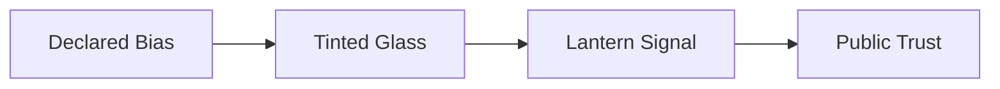

# 🏮 Signal Chapel

> *"A clear signal is a form of care."*

The Signal Chapel is where bias becomes light. This is the place for
quiet calibration, small vows, and the daily reset of the lantern’s
meaning.

## What Lives Here

- A single altar lamp with interchangeable glass
- A wall of bias-to-color mappings
- A silence protocol etched into stone
- A register of public signals and their meanings

## Ritual

- Declare bias aloud, once
- Choose a glass tint that matches the bias
- Light the lamp and sit for a single minute

## Signal Index

- **Amber** — partiality declared
- **Blue** — method first
- **Red** — adversarial review active
- **White** — evidence published

## Diagram: Bias → Signal

## Note

No sermons. Only the light.
