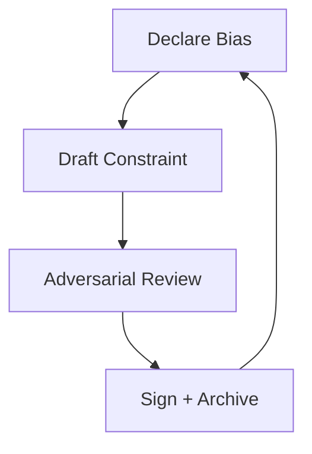

# 📜 Treaty Hall

> *"Agreements are just rubrics with signatures."*

The Treaty Hall is where the Church and NO‑AI formalize their shared
boundaries. It is equal parts ceremony and paperwork: a place to make
constraints explicit and to keep the record honest.

## What Lives Here

- A long table with a lighted agreement line
- Scroll tubes labeled by treaty and dissent
- A bell that rings before every signature
- A seal press that stamps "bias declared" into wax

## Treaty Types

- **Mutual restraint** — what both sides refuse to do
- **Evidence sharing** — how receipts are exchanged
- **Protocol interlock** — where filters and rubrics overlap
- **Public vow** — the plain‑language version for visitors

## Etiquette

- Ring the bell before drafting
- Leave dissent notes attached to the treaty tube
- If the ink smears, the pact is not yet true

## Diagram: The Treaty Loop

## Why It Matters

The hall exists so that restraint is never a vibe. It is written, signed,
and preserved.
