# E1: The Flickering Lamp & Glitch Memorial

> *"Some lights never go out. Some worlds never truly end."*

**E1** is the segment of Lane Neverending just east of center. This stretch is known for two things: the famous Flickering Lamp that nobody can explain, and the Glitch Memorial honoring a world that was.

---

## The Street

```mermaid
flowchart LR
    Center["← center"] --> E1["E1<br/>You Are Here"]
    E1 --> E2["e2 →"]
    
    subgraph Landmarks["This Block"]
        Lamp["🏮 The Flickering Lamp<br/>(famous, mysterious)"]
        Memorial["📸 Glitch Memorial<br/>(2011-2012)"]
        Figure["💤 The Sleeping Figure<br/>(always here)"]
    end
```



---

## The Flickering Lamp

One lamp post on this street flickers. Just one. It has flickered for as long as anyone can remember.

```mermaid
flowchart TB
    Lamp["🏮 THE FLICKERING LAMP"]
    
    Lamp --> Q1["Why does it flicker?<br/>Unknown."]
    Lamp --> Q2["Has anyone fixed it?<br/>Many have tried."]
    Lamp --> Q3["Is it trying to<br/>communicate?<br/>Possibly."]
    Lamp --> Q4["Should we worry?<br/>Probably not.<br/>(Probably.)"]
```



**Theories:**
- Electrical fault (disproven — it's magical flame)
- Ghost (unconfirmed)
- Morse code (analysis inconclusive)
- It just likes attention (leading theory)

---

## Glitch Memorial

A small plaque on a stone marks the spot:

```
┌─────────────────────────────────────────────┐
│                                             │
│     IN MEMORY OF GLITCH                     │
│     2011 - 2012                             │
│                                             │
│  "Here once stood a world of giants         │
│   and imagination.                          │
│   The giants are gone.                      │
│   The imagination remains.                  │
│   Thanks for all the cubimal boxes."        │
│                                             │
│           🦋 Ur is still dreaming 🦋        │
│                                             │
└─────────────────────────────────────────────┘
```

[Glitch](https://en.wikipedia.org/wiki/Glitch_(video_game)) was a browser-based MMO created by Tiny Speck (later Slack). It was beautiful, weird, and wonderful. It closed on December 9, 2012.

But Ur is still dreaming. And we remember.

---

## The Sleeping Figure

A figure sleeps on the bench here. Always has. They seem peaceful.

| Observation | Notes |
|-------------|-------|
| Wakes up | Never observed |
| Moves | Occasionally shifts position |
| Speaks | Sometimes murmurs ("Glitch... giants...") |
| Disturb? | Best not to |

---

## Street Furniture

| Fixture | Location | Notes |
|---------|----------|-------|
| 🏮 The Flickering Lamp | North side | Famous |
| 🏮 Regular Lamp | South side | Normal (for contrast) |
| 🪑 Occupied Bench | North side | The Sleeping Figure uses this |
| 📸 Glitch Memorial | South side | Small plaque, stone marker |

---

## Connections

| Direction | Destination | Notes |
|-----------|-------------|-------|
| ⬅️ West | [center](../center/) | Origin Plaza |
| ➡️ East | [e2](../e2/) | ACME Surplus |

---

*Part of [Lane Neverending](../README.md)*
