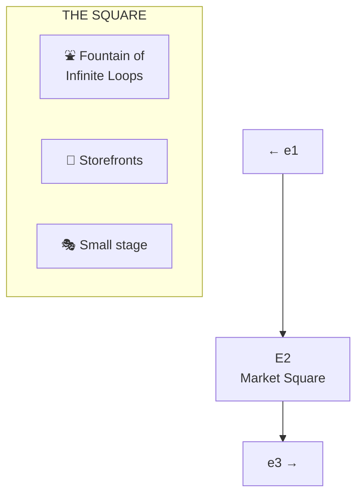
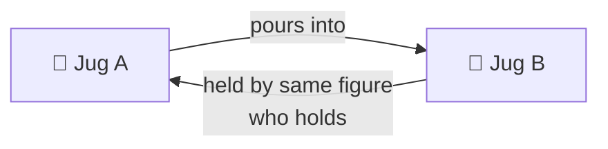

# E2: The Market Square

> *"Where the loops are infinite and the fountain is dry."*

**E2** is the segment of Lane Neverending east of the Glitch Memorial. The street widens here into what was once a market square, now a quiet plaza centered around the famous Fountain of Infinite Loops.

---

## The Square

```mermaid
flowchart TB
    E1["← e1"] --> E2["E2<br/>Market Square"]
    E2 --> E3["e3 →"]
    
    subgraph Square["THE SQUARE"]
        Fountain["⛲ Fountain of<br/>Infinite Loops"]
        Shops["🏪 Storefronts"]
        Stage["🎭 Small stage"]
    end
```

---

## The Fountain of Infinite Loops

```mermaid
flowchart LR
    Jug1["🏺 Jug A"] --> |"pours into"| Jug2["🏺 Jug B"]
    Jug2 --> |"held by same figure<br/>who holds"| Jug1
```

A recursive monument to all programmers stuck in `while(true){}`.

The water sprites went on strike. Now it's decorative only.

**The Plaque:**
> *"Dedicated to all those stuck in while(true){}"*

---

## Storefronts

*Planned Soul Plaza overlay — [SOUL-PLAZA-SHOPS.md](../SOUL-PLAZA-SHOPS.md). Fills these
lots **in place**; no new street segments until the center is dense enough.*

| Address | Name | Status |
|---------|------|--------|
| 10 (south) | MOOLLM Milk Bar | Planned — kid-friendly, Clockwork Orange wink |
| 12 (south) | Pet Shop / Vet | Planned — heal Nibbles ([THE-PET-SHOP](../../../designs/sim-obliterator/THE-PET-SHOP.md)) |
| 14 (north) | Wig-O-Rama | Planned — Wig-O-Matic machines |
| 16 (north) | Rug-O-Porium | Planned — Rug-O-Matic machines |
| 18 (north) | Transmogrifier World HQ | Planned — conglomerate HQ |
| — | Former Bakery (12 north) | Closed (smell lingers) → may become Head Shop |
| — | Curiosity Shop (14) | Open → becomes Wig-O-Rama |
| — | Unknown (16) | Shuttered → becomes Rug-O-Porium |

---

## Street Furniture

| Fixture | Location | Notes |
|---------|----------|-------|
| 🏮 Lamp Post ×4 | Each corner of square | Standard |
| 🪑 Bench | Facing fountain | Carved: "INFINITE LOOP MEMORIAL" |

---

## Connections

| Direction | Destination | Notes |
|-----------|-------------|-------|
| ⬅️ West | [e1](../e1/) | Glitch Memorial |
| ➡️ East | [e3](../e3/) | Loop point |

---

*Part of [Lane Neverending](../README.md)*
