# E2: ACME Surplus

> *"If ACME made it, we probably have it."*

**E2** is the segment of Lane Neverending known for the **ACME Surplus** storefront — a shop selling assorted ACME products of varying usefulness and danger levels. There's also a painted tunnel on the boarded-up section that you absolutely cannot walk through.

---

## The Street

```mermaid
flowchart LR
    E1["← e1"] --> E2["E2\nYou Are Here"]
    E2 --> E3["e3 →"]
    
    subgraph Buildings["This Block"]
        ACME["🏭 ACME SURPLUS\nProducts & Tunnel"]
    end
```



---

## ACME Surplus

```mermaid
flowchart TB
    subgraph Store["🏭 ACME SURPLUS"]
        Window["🪟 Display Window\nProducts visible"]
        Door["🚪 Entrance\n(open for business)"]
        Boarded["🚧 Boarded Section\n(closed... or is it?)"]
    end
    
    Boarded --> Tunnel["🎨 PAINTED TUNNEL\n(definitely not real)"]
```



### Products on Display

| Item | Description | Price |
|------|-------------|-------|
| Rocket Skates | Speed guaranteed. Brakes not included. | $49.99 |
| Portable Hole | Apply to any surface. Retrieve... eventually. | $29.99 |
| Instant Boulder | Just add water. Run. | $19.99 |
| Birdseed (Premium) | Attracts roadrunners. Maybe. | $9.99 |
| Giant Slingshot | Aim carefully. Or don't. | $79.99 |

---

## The Painted Tunnel

On the boarded-up section: a tunnel painted directly onto the wall. It looks surprisingly realistic. Cartoon-realistic.

```mermaid
flowchart LR
    You["🏃 You"] --> |"run at tunnel"| Impact["💥 BONK"]
    Impact --> |"physics says"| Nope["You can't go through.\nNo matter how fast."]
```



**Known Facts:**
- You cannot walk through it (verified)
- You cannot run through it (verified, painfully)
- You cannot speed through it (velocity doesn't help)
- It's just paint (definitely just paint)

### The Rumor

```
⚠️ UNCONFIRMED REPORT:

ACME agents, drones, and delivery personnel
have been observed using this tunnel for
deliveries.

They step through the paint.
The paint accepts them.
Packages arrive.

How?

ACME physics. Don't think about it too hard.
```

---

## Street Furniture

| Fixture | Location | Notes |
|---------|----------|-------|
| 🏮 Lamp Post | North side | Standard |
| 🪑 Bench | South side, near store | Watch the tunnel from here |
| 🚧 Boarded Window | Part of ACME | Tunnel painted here |

---

## Connections

| Direction | Destination | Notes |
|-----------|-------------|-------|
| ⬅️ West | [e1](../e1/) | Glitch Memorial |
| ➡️ East | [e3](../e3/) | Far east, loops to w3 |

---

*Part of [Lane Neverending](../README.md)*
