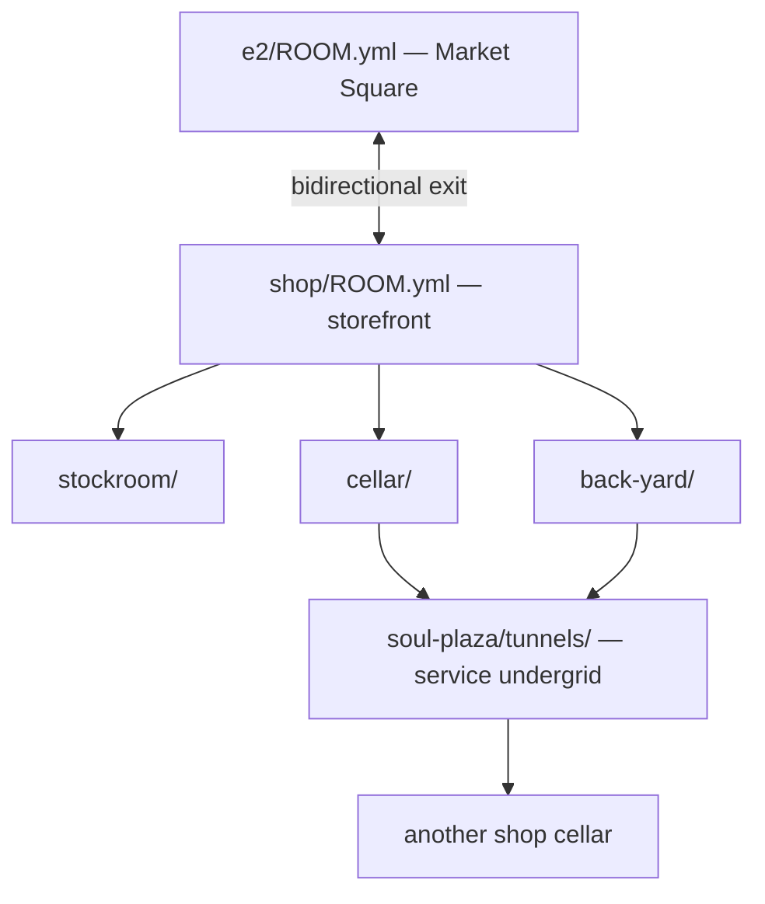

# Soul Plaza — district index (e2 Market Square)

> *Lightweight shops along the road — each one a directory you can enter.*

**Rollup doc:** [../SOUL-PLAZA-SHOPS.md](../SOUL-PLAZA-SHOPS.md) (condensed design at lane level)
**Street segment:** [../ROOM.yml](../ROOM.yml) · [../README.md](../README.md)

---

## The idea: lightweight neighbors

Soul Plaza shops are **not** a separate mall map. They are **neighbors on the lane** —
Sims-style lots glued to the sidewalk. At low resolution they are a line in `SOUL-PLAZA-SHOPS.md`
or a row in `e2/README.md`. At medium resolution each shop is a **`GLANCE.yml` sandwich board**.
At full resolution each shop is a **`ROOM.yml` tree**: front room, stockroom, back yard,
cellar, and (shared) **undergrid tunnels** in the spirit of Zork.



**Density rule (Don, 2026-07-09):** fill these lots **in place** on e2. No new street
segments until the center feels full.

---

## Resolution ladder (Semantic Image Pyramid)

| Level | File | Question |
|-------|------|----------|
| Rollup | `SOUL-PLAZA-SHOPS.md` | What is the whole strip? |
| District | `soul-plaza/GLANCE.yml` | What's on this block? |
| District | `soul-plaza/README.md` | How do shops link? |
| Shop board | `shops/*/GLANCE.yml` | What's in the window? |
| Shop card | `shops/*/CARD.yml` | What can I do here? |
| Shop room | `shops/*/ROOM.yml` | I'm inside — what do I see? |
| Sub-rooms | `shops/*/back-yard/`, `cellar/`, … | Where else? |
| Undergrid | `tunnels/` | What's below the block? |
| Skill | `skill_or_design` pointer | What tool does this run? |

Apps, workshops, and storefronts are the **same thing** at different zoom levels.

---

## Two-way linking convention

Every shop **must** link back to the street and the street **must** link in.

```yaml
# shop/ROOM.yml
exits:
  street:
    to: ../../ROOM.yml
    direction: south | north
    address: "10 Lane Neverending"
    aliases: [out, outside, lane, soul-plaza]

# e2/ROOM.yml — when built
exits:
  milk-bar:
    to: soul-plaza/shops/milk-bar/
    side: south
    address: "10 Lane Neverending"
```

**Invariant:** `shop → street` and `street → shop` use matching `address` + `side`.
Sub-rooms use relative paths (`./back-yard/`). Tunnels use `../tunnels/` or named
portal files so the undergrid is navigable without leaking to unrelated districts.

---

## Backyard + Zork undergrid

South-side shops share a **service alley** behind the Bartle/Hopkins row. North-side
shops share a **loading court** behind the Transmogrifier chain. Below both: the
**SERVICE UNDERGRID** — brick tunnels, steam pipes, cloned-GUID maintenance hatches,
occasional grue-adjacent darkness (but `grue_safe: true` on the public street above).

See [tunnels/README.md](tunnels/README.md) · [tunnels/SERVICE-ALLEY.yml](tunnels/SERVICE-ALLEY.yml)

Shops connect to the undergrid from **cellar/** or **stockroom/** — not every shop
on day one; the graph grows as rooms are built.

---

## Shop directory (planned)

| Slug | Address | Side | GLANCE | Skill / design |
|------|---------|------|--------|----------------|
| [milk-bar](shops/milk-bar/) | 10 | south | ✓ | kid third place, dreaming sessions |
| [pet-shop-vet](shops/pet-shop-vet/) | 12 | south | ✓ | [THE-PET-SHOP](../../../../designs/sim-obliterator/THE-PET-SHOP.md) |
| [wig-o-rama](shops/wig-o-rama/) | 14 | north | ✓ | Wig-O-Matic |
| [rug-o-porium](shops/rug-o-porium/) | 16 | north | ✓ | Rug-O-Matic |
| [transmogrifier-hq](shops/transmogrifier-hq/) | 18 | north | ✓ | IFF / GUID pipeline |
| [head-shop](shops/head-shop/) | 20 | north | ✓ | skins (THE-UPLIFT) |
| [tombstone-studio](shops/tombstone-studio/) | 22 | north | ✓ | memorial objects |
| [mesh-lab](shops/mesh-lab/) | 24 | north | ✓ | glTF ↔ SKN |
| [photo-book-press](shops/photo-book-press/) | 26 | north | ✓ | pageable books |
| [simplifier-annex](shops/simplifier-annex/) | 28 | north | ✓ | object simplification |

**Street fixtures (not shops):** [corner-fountain-ne](../corner-fountain-ne.yml) — Zach Mama NPC.

**Conglomerate brand:** [TRANSMOGRIFIER-CORP.yml](TRANSMOGRIFIER-CORP.yml)

---

## Build order

1. `ROOM.yml` + `GLANCE.yml` per shop (front room only — still lightweight).
2. Bidirectional exits on `e2/ROOM.yml`.
3. `back-yard/` or `stockroom/` where the fiction needs it.
4. First tunnel spur from Milk Bar cellar → Pet Shop (guinea pig referral pipe).
5. `CARD.yml` + skill pointer when the tool exists.
6. Comedy signage from [comedy register](../SOUL-PLAZA-SHOPS.md#comedy-register--zach-mama--transmogrifier).

---

## See also

- [Lane Neverending](../../README.md)
- [Soul City](https://github.com/SimHacker/WillWrightShowForFood/tree/main/catalogs/soul-city)
- [THE-UPLIFT](../../../../designs/sim-obliterator/THE-UPLIFT.md)
- [Zach Mama NPC](../../../characters/real-people/zach-mama/)
