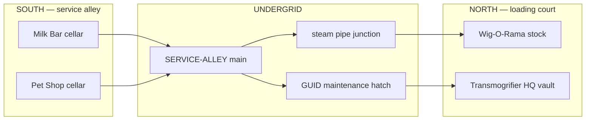

# Soul Plaza — service undergrid (Zork spirit)

> *Below the Market Square: brick, steam, maintenance hatches, and shortcuts between shops.*

The **SERVICE UNDERGRID** is not a second street. It is the **connective tissue** behind
and beneath the lightweight storefronts — the place delivery carts, cloned inventory,
and night staff actually move. Public face on the lane; plumbing down here.

Inspired by Zork's maze logic, Habitat's neighbor graph, and ACME's painted tunnels
([w1 ACME](../../../w1/) — but these tunnels **work** for shop staff and curious explorers).

---

## Topology

**South side:** `SERVICE-ALLEY` runs behind Bartle (13) and Hopkins (15). Shop back yards
open onto it. Cellar stairs drop from Milk Bar and Pet Shop.

**North side:** `LOADING-COURT` behind the Transmogrifier chain. Rug-O-Matic freight doors,
Wig-O-Matic restock bays, HQ vault elevator.

**Connection:** `STEAM-JUNCTION` links south undergrid to north loading court (one grue-safe
lamp, one questionable puddle). Not every shop connected on day one — graph grows with build-out.

---

## Room files (planned)

| Path | Role |
|------|------|
| [SERVICE-ALLEY.yml](SERVICE-ALLEY.yml) | Main east-west tunnel under e2 |
| `STEAM-JUNCTION.yml` | North–south connector |
| `LOADING-COURT.yml` | North-side surface behind shops |
| `GUID-HATCH.yml` | Transmogrifier maintenance — clone egress |
| `MILK-PIPE.yml` | Referral pipe to Pet Shop (marshmallow logistics) |

---

## Conventions

- `grue_safe: false` in deep undergrid; `true` in lit service alleys.
- Tunnels use **named portals** (`to: ../shops/milk-bar/cellar/`) not magic jumps.
- Discoverability: some entrances `hidden: true` until back yard explored.
- Comedy signage from Transmogrifier corp bleeds down here ([TRANSMOGRIFIER-CORP.yml](../TRANSMOGRIFIER-CORP.yml)).

---

## Exits

- **Up** → [e2 Market Square](../ROOM.yml)
- **Milk Bar cellar** → [shops/milk-bar/cellar/](../shops/milk-bar/) *(planned)*
- **Pet Shop cellar** → [shops/pet-shop-vet/cellar/](../shops/pet-shop-vet/) *(planned)*
