# E3: Far East (The Loop Point)

> *"The end is just another beginning."*

**E3** is the easternmost segment of Lane Neverending — which means it connects directly to the westernmost segment. Walk east from here and you'll find yourself in W3. The loop completes.

---

## The Street

```mermaid
flowchart LR
    E2["← e2"] --> E3["E3<br/>You Are Here"]
    E3 --> |"THE LOOP!"| W3["w3 →<br/>(west side!)"]
    
    style E3 fill:#9b59b6,color:#fff
```

---

## The Loop

There's no visible portal. No doorway. The street just... continues. East becomes west. West becomes east. Neverending.

---

## Landmarks

This segment is quieter than the center. A few discoveries await:

| Feature | Description |
|---------|-------------|
| The Last Lamp (East) | The easternmost lamp before the loop |
| A quiet bench | Good for contemplation |
| The continuation | Where east meets west |

---

## Street Furniture

| Fixture | Location | Notes |
|---------|----------|-------|
| 🏮 Lamp Post | North side | The easternmost lamp |
| 🪑 Bench | South side | Peaceful spot |

---

## Philosophy of the Loop

Why does Lane Neverending loop?

---

## Connections

| Direction | Destination | Notes |
|-----------|-------------|-------|
| ⬅️ West | [e2](../e2/) | ACME Surplus |
| ➡️ East | [w3](../w3/) | **THE LOOP** — arrives at far west |

---

*Part of [Lane Neverending](../README.md)*
