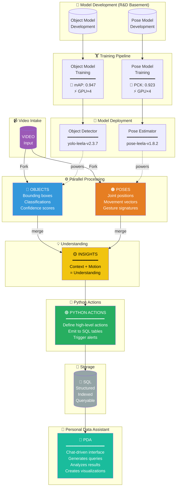
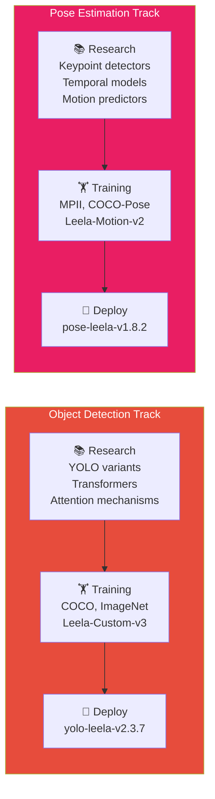
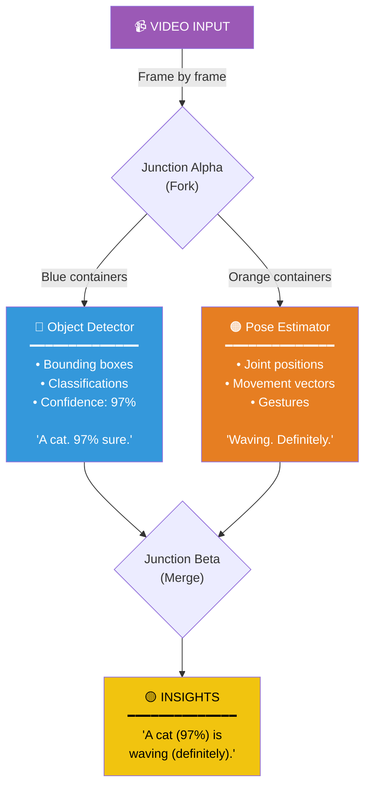
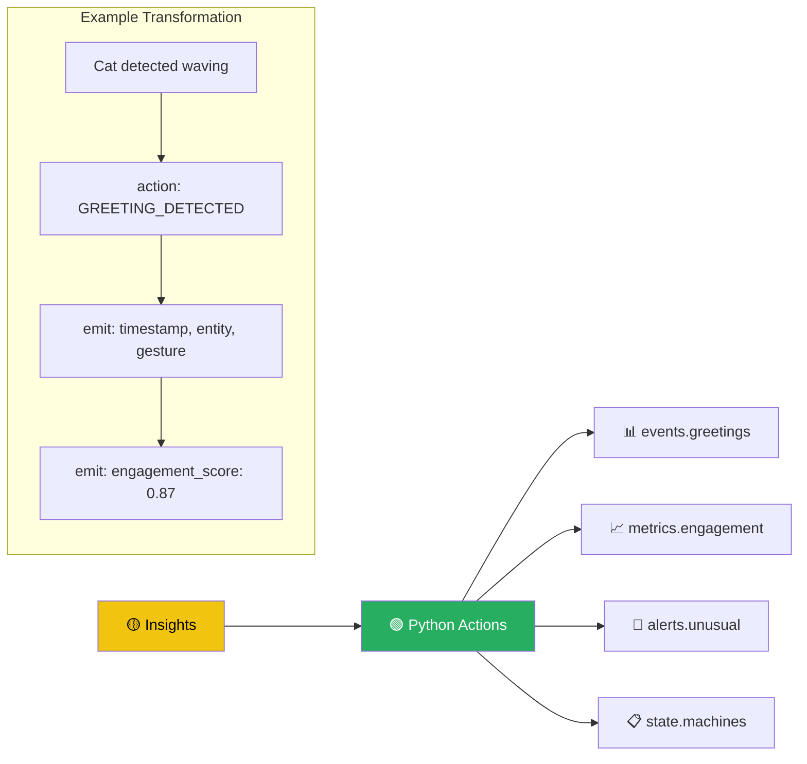
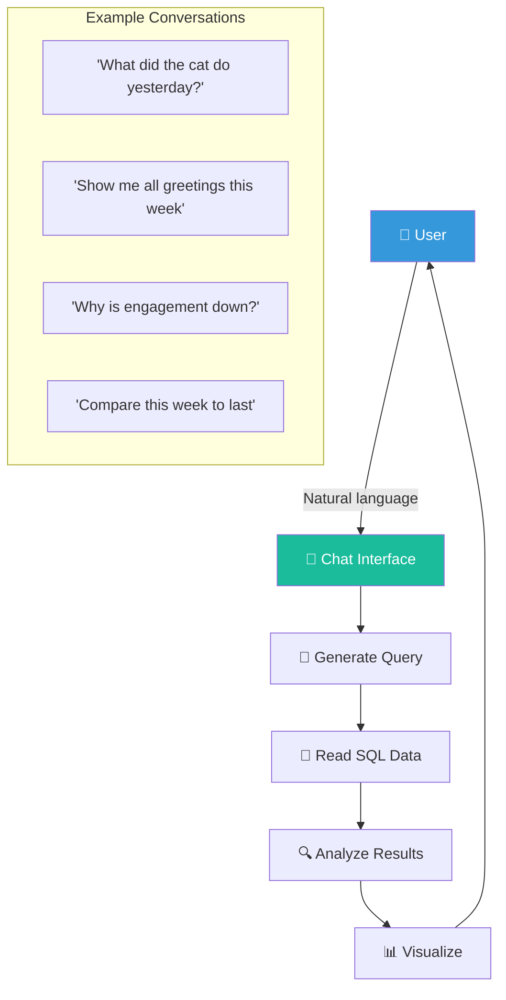
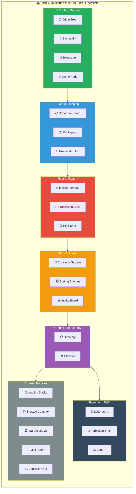
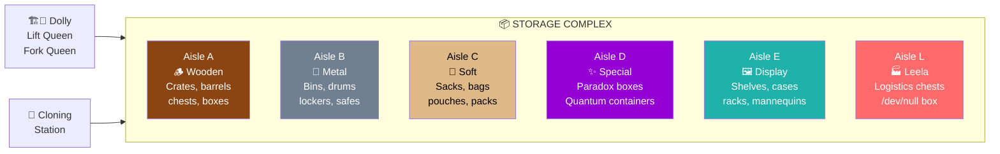
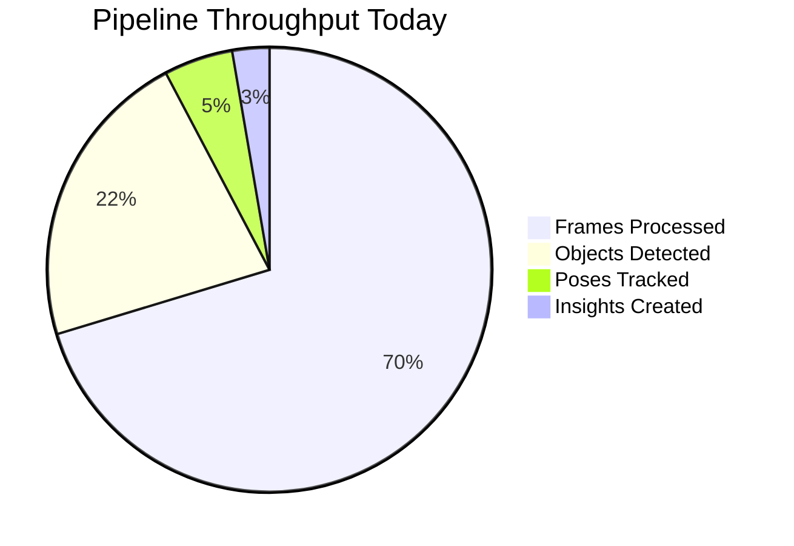
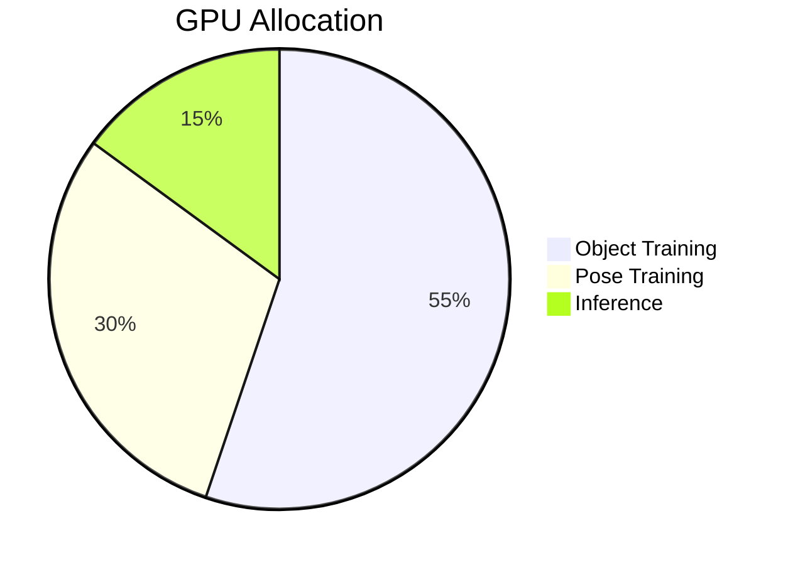

# Leela Manufacturing Intelligence

> *"We manufacture understanding."*

Welcome to **Leela Manufacturing Intelligence** — the industrial heart of Lane Neverending. Located at **5 Lane Neverending**, right next door to the pub, this facility transforms raw video streams into actionable insights, beautiful visualizations, and genuine understanding.

In SimCity terms, we're an **Industrial Zone** — but instead of manufacturing widgets, we manufacture **knowledge**.

---

## The Leela Pipeline

The core of Leela Manufacturing is a sophisticated data pipeline that transforms video into understanding.



---

## Pipeline Details

### 🔬 Model Development & Training

Two parallel pipelines develop and train the ML models that power perception:



### 🔀 Video Processing Fork

Video enters and immediately forks to parallel processors:



### 🐍 Python Actions Layer

Insights flow into Python actions that define high-level events:



### 💬 PDA: Personal Data Assistant

The chat-driven interface for exploring your data:



---

## Factory Floor Map



---

## Floor Directory

| Floor | Name | Purpose |
|-------|------|---------|
| 🌿 | **Rooftop** | Garden, drone pads, wisdom tortoise |
| 3 | **Shipping** | Packaging, departure board, pneumatic tubes |
| 2 | **Factory** | Insight Furnace, processing cells, Big Board |
| 1 | **Intake** | Conveyor system, sorting, intake monitoring |
| G | **Lobby** | Directory, elevator, street access |
| B | **Basement** | R&D Laboratory, Zone 7, Forbidden Shelf |

### External Facilities

| Facility | Purpose |
|----------|---------|
| 🚛 **Loading Docks** | 8 bays (4 in, 4 out), forklifts, drones, carriages |
| 📦 **Storage Complex** | Container prototypes, cloning station, Dolly |
| 🏛️ **Warehouse 23** | Long-term artifact storage (cursed items) |
| 📮 **Mail Room** | Postal integration, pneumatic tubes, pigeons |
| 🏗️ **Logistics Yard** | Trucks, sorting, mass transport |

---

## Storage Aisles

The Storage Complex contains prototypical containers for cloning:



---

## Key Personnel

| Name | Role | Location |
|------|------|----------|
| 👑 **Dolly Doorin** | Lift Queen / Fork Queen | Storage Complex |
| 🐢 **Eventually** | Wisdom Tortoise | Rooftop Garden |
| 👤 **The Archivist** | Curator | Warehouse 23 |
| 👤 **Dr. Unknown** | Zone 7 Lead | Basement (probably) |
| 👴 **Old Jareth** | Stable Master | Carriage House |

---

## Live Statistics





---

## Quick Reference

### Pipeline Flow

```
VIDEO → [fork] → OBJECTS ──┐
                           ├──→ INSIGHTS → PYTHON ACTIONS → SQL → PDA
        [fork] → POSES ────┘
```

### Model Pipeline

```
DEVELOPMENT → TRAINING → DEPLOYMENT → PROCESSOR
     ↑                                    │
     └────────── feedback ────────────────┘
```

### Data Access

```
USER → 💬 CHAT → PDA → SQL
                  ↓
              ANALYSIS
                  ↓
           VISUALIZATION
```

---

## Address

**Leela Manufacturing Intelligence**  
5 Lane Neverending  
(Next to the pub)

*"The insight will come. Eventually."* — Eventually the Tortoise

---

*Part of the [MOOLLM Hotel](../../../) adventure world.*
