# Basement: R&D Laboratory

> *"What if we tried...?"*

The **R&D Laboratory** occupies the entire basement. The lighting is intentionally dim — some experiments prefer it that way. Occasional flashes illuminate bubbling beakers, sparking equipment, and researchers in goggles hunched over incomprehensible apparatus.

This is where Leela's future is invented.

---

## Laboratory Zones

| Zone | Name | Safety Level | Access |
|------|------|--------------|--------|
| 1 | Controlled Experiments | ✅ Safe | Open |
| 2 | Uncontrolled Experiments | 🥽 Goggles Required | Open |
| 3 | Theoretical Work | ✅ Safe | Open |
| 4 | Applied Madness | ⚠️ Waiver Required | Restricted |
| 5 | The Archive | ✅ Safe | Open |
| 6 | Cold Storage | ❄️ Temperature Controlled | Restricted |
| 7 | [SEALED] | ⛔ DO NOT ENTER | **SEALED** |

---

## Current Research Projects

### Wisdom Synthesis
- **Status:** Ongoing (30+ years)
- **Progress:** "We've made better questions"
- **Lead:** Dr. Patient
- **Notes:** This project will complete when it's ready. Wisdom cannot be rushed.

### Insight Recycling
- **Status:** Promising
- **Progress:** Used insights can be 87% recovered
- **Lead:** Dr. Sustainable
- **Notes:** Environmental and economical. Failed insights → compost bins → rooftop garden → new ideas.

### Paradox Processing
- **Status:** ⚠️ EXTREME CAUTION
- **Progress:** "We understand the problem. The problem understands us back."
- **Lead:** Dr. Unknown (identity classified)
- **Location:** Zone 7 (sealed)

---

## The Researchers

| Role | Count | Notes |
|------|-------|-------|
| Mad Scientists | 3 | Varying degrees of madness |
| Reasonable Scientists | 5 | Keeping things grounded |
| Dr. Why Not | 1 | The Unreasonable Scientist |
| Graduate Students | ∞ | Infinite, replaceable |
| Eventually (Turtle) | 1 | Wisdom consultant (Zone 5) |

---

## Equipment

### Bubbling Things
- Beaker Array Alpha — 47 beakers, all bubbling differently
- The Cauldron — not magical, just very large
- Fermentation Tanks — "Brewing" insights (takes 6 months)
- Something in a jar that bubbles when you look at it

### Sparking Things
- Tesla Coil (decorative? functional? unclear)
- "The Synapse Simulator" — arcs between electrodes
- A Jacob's Ladder that spells words nobody can read
- Van de Graaff generator (for making hair stand up during eureka moments)

### Things That Hum Ominously
- **The Black Box** — nobody knows what it does, but it's DOING something
- Quantum Processor QX-7 — computing answers to unasked questions
- "The Resonator" — hums at exactly the frequency of existential dread
- A server rack that's been running since 1987 *(nobody will turn it off)*

### Things That Are Perfectly Silent
*(This category is most concerning)*
- The Null Chamber — absorbs all sound. Also, apparently, some light.
- Specimen Container #0 — contains something. Says nothing.
- A whiteboard that used to have equations that "solved themselves"

---

## The Forbidden Shelf

```mermaid
flowchart TB
    Shelf["🚫 THE FORBIDDEN SHELF<br/>━━━━━━━━━━━━━━━━━━<br/>Experiments TOO SUCCESSFUL"]
    
    Shelf --> E7["Experiment 7<br/>'Perfect Answer'<br/>Answers questions<br/>you shouldn't ask"]
    Shelf --> E12["Experiment 12<br/>'Infinite Insight'<br/>Understanding includes<br/>things better left unknown"]
    Shelf --> E23["Experiment 23<br/>'Completed Problem'<br/>Solved itself.<br/>Keeps solving OTHER problems."]
    Shelf --> E31["Experiment 31<br/>'Wisdom Crystals'<br/>100% pure wisdom.<br/>Made everyone quit<br/>and become monks."]
    Shelf --> E44["Experiment 44<br/>[REDACTED]"]

    style Shelf fill:#e74c3c,color:#fff
```

> *"IN CASE OF EMERGENCY, DO NOT OPEN. ESPECIALLY THEN."*

---

## Zone 7

**Current Status:**
- Door: SEALED
- Warning lights: ROTATING
- Personnel inside: UNKNOWN (count keeps changing)
- Last entry: CLASSIFIED
- Next scheduled inspection: INDEFINITELY POSTPONED

---

## Camera: BASE1

**BASE1** (Deep Eye) watches the laboratory from a reinforced corner mount.

| Detection | Last Hour |
|-----------|-----------|
| Objects detected | 89 |
| Poses estimated | 47 |
| "RESEARCHER_THINKING" events | 12 |
| "EQUIPMENT_ACTIVATED" events | 3 |
| "FORBIDDEN_SHELF_APPROACHED" alarms | 1 |
| Zone 7 entries | 0 *(door remained sealed)* |

**⚠️ PARTIAL REDACTION:** Some portions of BASE1's feed are automatically redacted before entering the pipeline. What happens in Zone 7's visible arc is... not processed.

---

## Connections

| Direction | Destination | Notes |
|-----------|-------------|-------|
| ⬆️ Up | [Lobby](../lobby/) | Elevator (clearance may be required) |
| 🏛️ Heavy Door | [Warehouse 23](../warehouse-23/) | Long-term artifact storage |
| ⚠️ Sealed | Zone 7 | **DO NOT ENTER** |

---

## Objects in This Room

- 🚫 [Forbidden Shelf](forbidden-shelf.yml) — Experiments too successful
- 🔬 [Experimental Equipment](experimental-equipment.yml) — Bubbling, sparking, humming, silent
- ⚠️ [Zone 7 Door](zone-7-door.yml) — Paradox containment
- 📹 [Camera BASE1](camera-base1.yml) — The Deep Eye

---

## Safety Warnings

1. Do not feed the hypotheses
2. Protective eyewear required beyond Zone 1
3. If you hear your name from Zone 7, **ignore it**
4. Coffee in designated areas only (reactions possible)
5. If the equations on the chalkboard start moving, look away

---

*Part of [Leela Manufacturing Intelligence](../README.md) • 5 Lane Neverending*
