# Floor 1: Intake Department

> *"Where video becomes understanding."*

The **Intake Department** is the heart of Leela Manufacturing's visual intelligence pipeline. This is where raw video streams enter the building and begin their transformation into actionable insights.

---

## The Leela Pipeline

Leela AI is a **Visual Intelligence Platform** — we transform video into understanding. Floor 1 houses the core intake and processing infrastructure that makes this possible.

```mermaid
flowchart TB
    subgraph Cameras["📹 Leela's Seven Eyes"]
        LOG1["LOG1<br/>Loading Docks"]
        FAC1["FAC1<br/>Factory"]
        INT1["INT1<br/>Intake"]
        SHP1["SHP1<br/>Shipping"]
        LOB1["LOB1<br/>Lobby"]
        ROOF1["ROOF1<br/>Rooftop"]
        BASE1["BASE1<br/>Basement"]
    end
    
    Cameras --> V["📹 VIDEO INTAKE<br/>Line V (Purple)"]
    
    V --> Fork{"Junction Alpha<br/>(Fork)"}
    
    Fork --> O["🔵 OBJECT DETECTION<br/>Line O (Blue)"]
    Fork --> P["🟠 POSE ESTIMATION<br/>Line P (Orange)"]
    
    O --> Merge{"Junction Beta<br/>(Merge)"}
    P --> Merge
    
    Merge --> I["🟡 INSIGHTS<br/>Line I (Gold)"]
    
    I --> A["🟢 PYTHON ACTIONS<br/>Line A (Green)"]
    
    A --> SQL["💾 SQL STORAGE<br/>Line S (Silver)"]
    
    SQL --> PDA["💬 PDA<br/>Personal Data Assistant"]

    style V fill:#9b59b6,color:#fff
    style O fill:#3498db,color:#fff
    style P fill:#e67e22,color:#fff
    style I fill:#f1c40f,color:#000
    style A fill:#27ae60,color:#fff
    style SQL fill:#95a5a6,color:#fff
    style PDA fill:#1abc9c,color:#fff
```

---

## Pipeline Components

### Model Development & Training

Two parallel ML pipelines feed our processors:

| Track | Architectures | Selection Criteria |
|-------|--------------|-------------------|
| Object Detection | YOLO, Detectron2, DETR, ViT | Best accuracy for each customer's specific objects and environment |
| Pose Estimation | HRNet, ViTPose, OpenPose | Best joint tracking for each customer's workers and tasks |

Models are selected and trained per customer deployment. No single model fits all factories.

### Conveyor Lines

| Line | Color | Contents | Destination |
|------|-------|----------|-------------|
| V | Purple | Raw video frames | Junction Alpha |
| O | Blue | Detected objects (bboxes, classes) | Junction Beta |
| P | Orange | Skeletal poses (joints, gestures) | Junction Beta |
| I | Gold | Unified insights | Python Actions |
| A | Green | Action events | SQL Storage |
| S | Silver | Structured data | PDA queries |

---

## Sorting Stations

Workers in blue jumpsuits sort incoming containers:

### The Confused Welcome Desk

For items that don't fit any category. A patient worker sits here with a large cup of coffee and an expression of infinite tolerance.

> *"IF YOU DON'T KNOW WHAT THIS IS, NEITHER DO WE. YET."*

---

## Live Statistics

| Metric | Today | This Week |
|--------|-------|-----------|
| Frames Processed | 1,247,000 | 8,729,000 |
| Objects Detected | 3,891,247 | 27,238,729 |
| Poses Tracked | 891,247 | 6,238,729 |
| Insights Created | 47,891 | 335,237 |
| Actions Triggered | 8,472 | 59,304 |

---

## Camera: INT1

**INT1** (Intake Eye) watches this floor — and feeds back into the very pipeline it observes.

```mermaid
flowchart LR
    INT1["📹 INT1"] --> Pipeline["Pipeline"]
    Pipeline --> Insight["Insight about INT1"]
    Insight --> Pipeline
    
    style INT1 fill:#9b59b6,color:#fff
```

> *"The containers carrying insights about containers become containers carrying insights about insights about containers."*

This is normal. (Probably.)

---

## Connections

| Direction | Destination | Notes |
|-----------|-------------|-------|
| ⬇️ Down | [Lobby](../lobby/) | Main entrance |
| ⬆️ Up | [Floor 2 — Factory](../floor-2/) | The Insight Furnace |
| 🚛 East | [Loading Docks](../loading-docks/) | Incoming shipments |

---

## Objects on This Floor

- 🔄 [Conveyor System](conveyor-system.yml) — The full pipeline
- 📬 [Sorting Stations](sorting-stations.yml) — Classification and routing
- 📊 [Intake Board](intake-board.yml) — Live statistics display
- 📹 [Camera INT1](camera-int1.yml) — The Intake Eye

---

## The Quarantine Zone

A glassed-off area for dangerous items:

| Item | Status | Notes |
|------|--------|-------|
| 1 Paradox | Pacing | Back and forth, back and forth |
| 2 Recursive Questions | Asking each other | Infinite loop detected |
| 1 Unknown | Labeled "DO NOT THINK ABOUT" | We're trying not to |

---

*Part of [Leela Manufacturing Intelligence](../README.md) • 5 Lane Neverending*
