# Floor 2: Factory Floor

> *"Where problems become insights."*

The **Factory Floor** is where the magic happens — or rather, where the careful, methodical transformation of problems into insights occurs. Magic is unreliable. Process is eternal.

At the center of this floor stands **The Insight Furnace**, a towering structure that has been running continuously for over 40 years.

---

## The Insight Furnace

```mermaid
flowchart TB
    subgraph Inputs["⬇️ INPUTS"]
        Q["Questions"]
        P["Problems"]
        D["Raw Data"]
        O["Objects"]
        Poses["Poses"]
    end
    
    Inputs --> Furnace
    
    subgraph Furnace["🔥 THE INSIGHT FURNACE"]
        direction TB
        Chamber["Combustion Chamber<br/>2000°K cognitive heat"]
        Filter["Wisdom Filter<br/>Removes assumptions"]
        Crystal["Crystallization<br/>Insight formation"]
        Chamber --> Filter --> Crystal
    end
    
    Furnace --> Outputs
    
    subgraph Outputs["⬆️ OUTPUTS"]
        Insights["✨ Refined Insights"]
        BQ["Better Questions<br/>(recycled to Intake)"]
        Wisdom["Pure Wisdom<br/>(rare, handle carefully)"]
    end

    style Furnace fill:#e74c3c,color:#fff
    style Insights fill:#f1c40f,color:#000
```

### Furnace Specifications

| Specification | Value |
|---------------|-------|
| Operating Temperature | 2000°K (cognitive heat) |
| Uptime | 40+ years continuous |
| Input Capacity | 10,000 problems/day |
| Output Yield | ~60% insights, ~35% better questions, ~5% pure wisdom |
| Byproducts | Occasionally, enlightenment |

> ⚠️ **CAUTION: CONTENTS MAY BE PROFOUND**

---

## Processing Cells

Eight glass-walled workspaces surround the Furnace, each tackling different problem domains:

```mermaid
flowchart TB
    subgraph Cells["PROCESSING CELLS"]
        A["Cell A<br/>🏭 Manufacturing<br/>Optimization"]
        B["Cell B<br/>🚛 Logistics<br/>Puzzles"]
        C["Cell C<br/>⚙️ Process<br/>Improvement"]
        D["Cell D<br/>📊 Data<br/>Analysis"]
        E["Cell E<br/>🤔 Meta-Problems<br/>(problems about problems)"]
        F["Cell F<br/>⚡ Edge Cases"]
        G["Cell G<br/>👁️ 'The Weird Ones'<br/>[CLASSIFIED]"]
        H["Cell H<br/>🧹 Currently Empty<br/>(being decontaminated)"]
    end

    style G fill:#9b59b6,color:#fff
    style H fill:#7f8c8d,color:#fff
```

| Cell | Domain | Team Size | Whiteboard Coverage | Status |
|------|--------|-----------|---------------------|--------|
| A | Manufacturing Optimization | 4 | 85% | Active |
| B | Logistics Puzzles | 3 | 70% | Active |
| C | Process Improvement | 5 | 90% | Active |
| D | Data Analysis | 6 | 60% | Active |
| E | Meta-Problems | 2 | 100% | *Recursing* |
| F | Edge Cases | 3 | 45% | Active |
| G | "The Weird Ones" | ? | REDACTED | [CLASSIFIED] |
| H | — | 0 | — | Decontamination |

### Cell G

We don't talk about Cell G. The team size is uncertain. The problems they work on are... difficult to describe. Sometimes the whiteboard writes back.

---

## The Big Board

A massive display showing every problem currently in process:

```mermaid
pie title Problem Status Distribution
    "🟢 On Track" : 847
    "🟡 Needs Attention" : 23
    "🔴 Stuck" : 3
    "🟣 Unknown State" : 7
```

| Dot Color | Meaning | Current Count |
|-----------|---------|---------------|
| 🟢 Green | On track | 847 |
| 🟡 Yellow | Needs attention | 23 |
| 🔴 Red | Stuck (send help) | 3 |
| 🟣 Purple | "We're not sure what's happening" | 7 |

---

## Object & Pose Integration

This is where the Object Detection and Pose Estimation pipelines converge:

```mermaid
flowchart LR
    subgraph From_Floor1["From Floor 1"]
        Objects["🔵 Objects<br/>'A cat. 97% sure.'"]
        Poses["🟠 Poses<br/>'Waving. Definitely.'"]
    end
    
    Objects --> Merge{"Junction Beta"}
    Poses --> Merge
    
    Merge --> Insight["🟡 Insight<br/>'A cat (97%) is<br/>waving (definitely).'"]
    
    Insight --> Furnace["🔥 Insight Furnace"]
    
    Furnace --> Understanding["✨ Understanding<br/>'The cat is greeting<br/>someone it recognizes.'"]

    style Objects fill:#3498db,color:#fff
    style Poses fill:#e67e22,color:#fff
    style Insight fill:#f1c40f,color:#000
```

---

## Camera: FAC1

**FAC1** (Second Eye) watches this floor from above the Furnace.

```mermaid
flowchart TB
    FAC1["📹 FAC1"] --> |"watches"| Floor["Factory Floor"]
    Floor --> |"processes"| FAC1Feed["FAC1's feed"]
    FAC1Feed --> |"becomes"| Insight["Insight about<br/>FAC1 watching"]
    Insight --> |"processed by"| Floor

    style FAC1 fill:#9b59b6,color:#fff
```

> *"The snake eating its tail is also watching the tail."* — Cell G

**Meta-Observation Statistics:**
- Times FAC1 detected a worker: 847,291
- Times that worker was working on FAC1's feed: 12,847
- Recursive depth reached: 7 (recommended max: 5)
- Status: "It's fine."

---

## The First Recursive Moment

When FAC1's feed was first processed by this floor, something happened:

1. The Insight Furnace flared unexpectedly
2. The Big Board flickered
3. A single gold container emerged, labeled simply: **"?"**

That container is now in [Warehouse 23](../warehouse-23/). Nobody has opened it.

---

## Connections

| Direction | Destination | Notes |
|-----------|-------------|-------|
| ⬇️ Down | [Floor 1 — Intake](../floor-1/) | Conveyor system |
| ⬆️ Up | [Floor 3 — Shipping](../floor-3/) | Packaged insights |
| 🛗 Elevator | [Lobby](../lobby/) | Main entrance |

---

## Objects on This Floor

- 🔥 [Insight Furnace](insight-furnace.yml) — The heart of Leela
- 🧪 [Processing Cells](processing-cells.yml) — 8 workspaces
- 📺 [Big Board](big-board.yml) — Status visualization
- 📹 [Camera FAC1](camera-fac1.yml) — The Second Eye

---

## Safety Notices

- Protective eyewear required near Furnace
- Do not stare directly at the Furnace during peak insight generation
- Cell G visitors must sign waiver (available at reception)
- If the Big Board shows all purple dots, evacuate calmly

---

*Part of [Leela Manufacturing Intelligence](../README.md) • 5 Lane Neverending*
