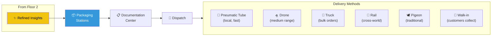
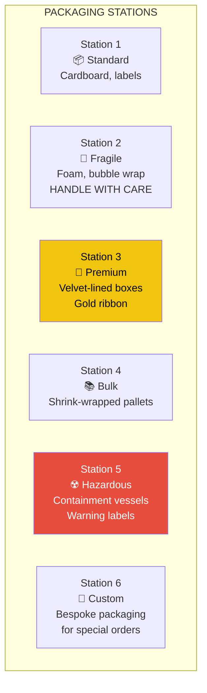
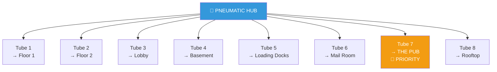
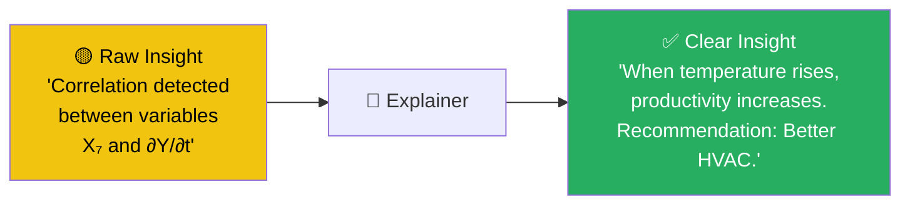

# Floor 3: Shipping Department

> *"Where insights go out into the world."*

The **Shipping Department** is the final stage of Leela's visual intelligence pipeline. Finished insights arrive from the Factory Floor, get packaged, labeled, and dispatched to customers across... everywhere.

---

## The Flow of Knowledge



---

## Departure Board

The iconic split-flap departure board dominates the center of the floor:

```
*clack clack clack*
```



```mermaid
gantt
    title Current Departures
    dateFormat HH:mm
    axisFormat %H:%M
    
    section Departed
    Insight Bundle #4471 → Rusty Lantern    :done, 14:23, 1m
    Knowledge Crate K-99 → Construction     :done, 14:25, 1m
    
    section Boarding
    Wisdom (Premium) → Origin Plaza         :active, 14:30, 5m
    
    section Queued
    Bulk Questions → RETURN TO INTAKE       :14:47, 3m
    [CLASSIFIED] → [CLASSIFIED]             :15:00, 5m
```

| Time | Shipment | Destination | Status |
|------|----------|-------------|--------|
| 14:23 | Insight Bundle #4471 | The Rusty Lantern | 🟢 DEPARTED |
| 14:25 | Knowledge Crate K-99 | Construction Site | 🟢 DEPARTED |
| 14:30 | Wisdom (Premium) | Origin Plaza | 🟡 BOARDING |
| 14:47 | Bulk Questions | RETURN TO INTAKE | ⏳ QUEUED |
| 15:00 | [CLASSIFIED] | [CLASSIFIED] | ⚪ SCHEDULED |

---

## Packaging Stations

Six specialized stations for different shipment types:



| Station | Type | Specialist | Current Queue |
|---------|------|------------|---------------|
| 1 | Standard | "Box Bob" | 23 |
| 2 | Fragile | "Careful Carol" | 8 |
| 3 | Premium | "Fancy Frank" | 3 |
| 4 | Bulk | "Big Batch Betty" | 45 |
| 5 | Hazardous | "Hazmat Hannah" | 1 |
| 6 | Custom | "Creative Chris" | 2 |

---

## The Pneumatic Hub

A brass-and-glass marvel of Victorian engineering:



**Tube 7** has special priority status — it goes directly to the pub next door. Some insights are best delivered with a pint.

| Tube | Destination | Avg Transit Time | Capsules/Hour |
|------|-------------|------------------|---------------|
| 1 | Floor 1 (Intake) | 3 seconds | 47 |
| 2 | Floor 2 (Factory) | 3 seconds | 23 |
| 3 | Lobby | 4 seconds | 12 |
| 4 | Basement | 5 seconds | 8 |
| 5 | Loading Docks | 6 seconds | 89 |
| 6 | Mail Room | 4 seconds | 34 |
| 7 | **THE PUB** | 2 seconds | **PRIORITY** |
| 8 | Rooftop | 7 seconds | 15 |

---

## The Explainers

A dedicated team that translates "raw insight" into "actionable knowledge":

> *"If you can't explain it, it's not done."*



---

## Returns Desk

For insights that didn't quite work out:

> *"WE DON'T DO REFUNDS. WE DO BETTER QUESTIONS."*

When an insight fails to provide value, we don't take it back — we figure out what the *real* question should have been.

---

## Camera: SHP1

**SHP1** (Shipping Eye) watches the departure board and packaging stations from above.

| Metric | Last Hour |
|--------|-----------|
| Packages wrapped | 89 |
| Departures recorded | 47 |
| Pneumatic launches | 23 |
| Rush orders | 12 |
| Packages too beautiful | 1 (sent to gallery) |

---

## Connections

| Direction | Destination | Notes |
|-----------|-------------|-------|
| ⬇️ Down | [Floor 2 — Factory](../floor-2/) | Insight Furnace |
| ⬆️ Up | [Rooftop Garden](../rooftop/) | Drone pads |
| 🚛 East | [Loading Docks](../loading-docks/) | Truck dispatch |
| 🛗 Elevator | [Lobby](../lobby/) | Main entrance |

---

## Objects on This Floor

- 📋 [Departure Board](departure-board.yml) — *clack clack clack*
- 📦 [Packaging Stations](packaging-stations.yml) — Six specialists
- 🔵 [Pneumatic Hub](pneumatic-hub.yml) — Eight-tube terminal
- 📹 [Camera SHP1](camera-shp1.yml) — The Shipping Eye

---

*Part of [Leela Manufacturing Intelligence](../README.md) • 5 Lane Neverending*
