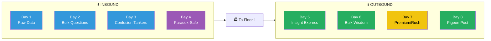
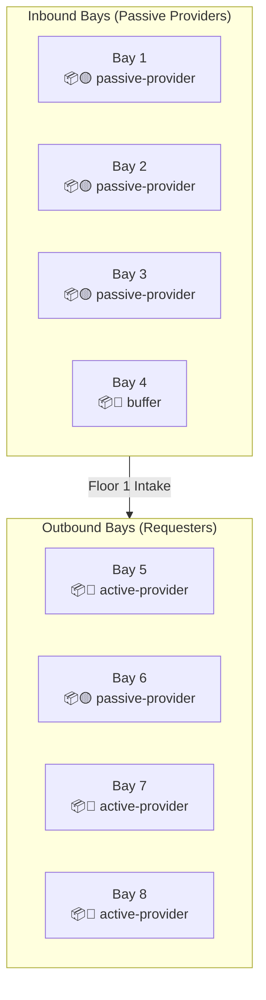
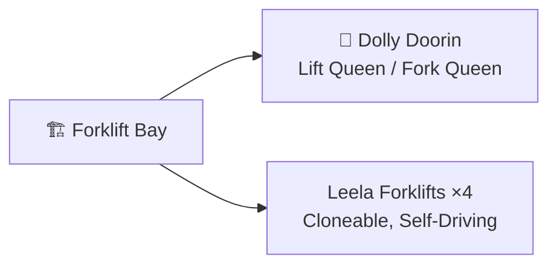
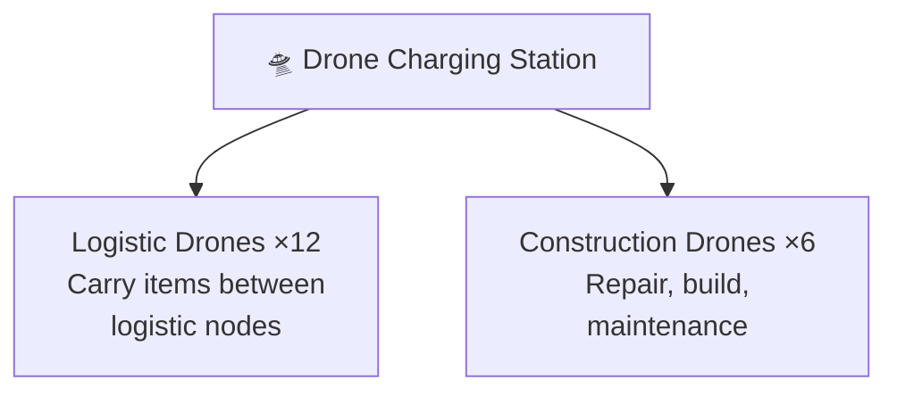
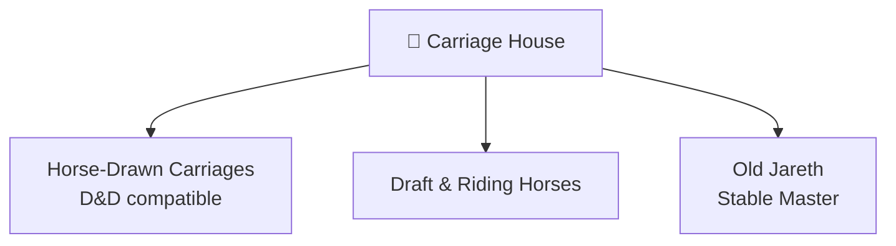
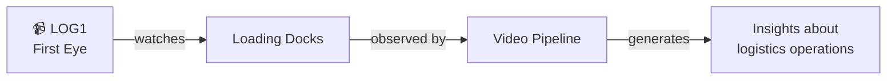

# Loading Docks

> *"Where the physical world meets the knowledge factory."*

The **Loading Docks** wrap around the back of Leela Manufacturing. Eight bays — four inbound, four outbound — handle the constant flow of knowledge in and out of the building. Forklifts beep. Pallets stack. Workers in safety vests coordinate the dance.

This facility is fully integrated with the [Factorio Logistics Protocol](../../../../skills/logistic-container/).

---

## Bay Layout

| Bay | Direction | Specialization | Current Status |
|-----|-----------|----------------|----------------|
| 1 | ⬇️ Inbound | Raw Data | Unloading |
| 2 | ⬇️ Inbound | Bulk Questions | Truck backing in |
| 3 | ⬇️ Inbound | Confusion Tankers | Empty, awaiting |
| 4 | ⬇️ Inbound | Paradox-Safe Deliveries | Reserved |
| 5 | ⬆️ Outbound | Insight Express #1 | Loading |
| 6 | ⬆️ Outbound | Bulk Wisdom | Staging |
| 7 | ⬆️ Outbound | Premium/Rush Orders | Reserved |
| 8 | ⬆️ Outbound | Pigeon Post & Small Parcels | Active |

---

## Factorio Logistics Integration

Each bay operates as a **logistic node** with chest modes:

| Bay | Chest Mode | Behavior |
|-----|------------|----------|
| 1-3 | `passive-provider` | Wait for bots to collect |
| 4 | `buffer` | Hold until safe to process |
| 5, 7, 8 | `active-provider` | Push out immediately |
| 6 | `passive-provider` | Staging for bulk pickup |

---

## Transport Fleet

### Forklift Bay

**Dolly Doorin** (Lift Queen) resides here when not in [Storage](../storage/). She knows where everything is. The files obey her.

| Vehicle | Status | Driver |
|---------|--------|--------|
| Dolly | Available | Self (autonomous) |
| Forklift #2 | In use | Worker |
| Forklift #3 | Charging | — |
| Forklift #4 | Available | Self-driving |

### Drone Station

Factorio-style logistic and construction drones:

| Type | Count | Status | Recyclable |
|------|-------|--------|------------|
| Logistic Drone | 12 | 8 active, 4 charging | ✅ Yes |
| Construction Drone | 6 | 2 active, 4 standby | ✅ Yes |

### Carriage House

For historical/fantasy integration:

*"For when the destination is more important than the speed."* — Old Jareth

---

## Camera: LOG1

**LOG1** (First Eye) was the first camera installed at Leela Manufacturing. It has watched every delivery, every shipment, every forklift dance.

| Detection | Last Hour |
|-----------|-----------|
| Objects detected | 847 |
| Poses estimated | 423 |
| "FORKLIFT_MOVING" events | 12 |
| "DRONE_LANDING" events | 47 |
| "DOLLY_DANCING" events | 1 *(under review)* |

---

## Dock Office

A small windowed office overlooking the bays:

- Dispatch coordinator with clipboard, headset, coffee
- Schedules on the wall
- Radio chatter constant
- Weather updates (affects drone operations)

---

## Connections

| Direction | Destination | Notes |
|-----------|-------------|-------|
| 🏭 Inside | [Floor 1 — Intake](../floor-1/) | Direct access |
| 🏭 Inside | [Floor 3 — Shipping](../floor-3/) | Direct access |
| 📦 Adjacent | [Storage Complex](../storage/) | Short walk |
| 🏗️ Adjacent | [Logistics Yard](../logistics/) | Truck parking |
| 🛗 Inside | [Lobby](../lobby/) | Through building |

---

## Objects in This Room

- 📋 dock-office.yml — Dispatch coordination
- 🏗️ [Forklift Bay](forklift-bay.yml) — Fleet management
- 🛸 [Drone Station](drone-station.yml) — Logistic & construction drones
- 🐴 [Carriage House](carriage-house.yml) — Historical transport
- 📹 [Camera LOG1](camera-log1.yml) — The First Eye

---

## Safety

- Hard hats required in bay areas
- Forklifts have right of way
- Drones maintain 3m altitude minimum
- Paradox-safe containers: Bay 4 ONLY
- In case of spilled confusion: evacuate and call Dr. Mop

---

*Part of [Leela Manufacturing Intelligence](../README.md) • 5 Lane Neverending*
