# Lobby: Ground Floor

> *"Welcome to Leela Manufacturing Intelligence."*

The **Lobby** is clean, professional, and quietly impressive. The Leela logo glows softly on the wall behind the reception desk. A directory board lists all floors. This is where the world meets Leela.

---

## Directory

```mermaid
flowchart TB
    subgraph Building["🏭 LEELA MANUFACTURING INTELLIGENCE"]
        direction TB
        Roof["🌿 Rooftop<br/>Garden & Drones"]
        F3["Floor 3<br/>📦 Shipping"]
        F2["Floor 2<br/>🔥 Factory"]
        F1["Floor 1<br/>🔄 Intake"]
        Lobby["Ground<br/>🚪 Lobby ← YOU ARE HERE"]
        Basement["Basement<br/>🔬 R&D"]
    end
    
    Roof --> F3 --> F2 --> F1 --> Lobby --> Basement

    style Lobby fill:#9b59b6,color:#fff
```

| Floor | Name | Function |
|-------|------|----------|
| 🌿 | [Rooftop](../rooftop/) | Garden, drone pads, Eventually |
| 3 | [Shipping](../floor-3/) | Packaging, dispatch, pneumatic hub |
| 2 | [Factory](../floor-2/) | Insight Furnace, processing cells |
| 1 | [Intake](../floor-1/) | Conveyor system, video pipeline |
| G | **Lobby** | Reception, elevator access |
| B | [Basement](../basement/) | R&D Laboratory *(clearance required)* |

### External Facilities

| Facility | Description |
|----------|-------------|
| 🚛 [Loading Docks](../loading-docks/) | 8 bays, forklifts, drones, carriages |
| 📦 [Storage Complex](../storage/) | Container prototypes, Dolly, cloning |
| 🏛️ [Warehouse 23](../warehouse-23/) | Long-term artifact storage |
| 📮 [Mail Room](../mail-room/) | Postal integration, pneumatic tubes |

---

## Reception

```mermaid
flowchart LR
    Visitor["👤 Visitor"] --> Reception["🛎️ Reception Desk"]
    Reception --> Help["How can we<br/>help you today?"]
    Help --> Directory["📋 Directory"]
    Help --> Elevator["🛗 Elevator"]
    Help --> Guide["🚶 Guided Tour"]
```

**Receptionist: Alex**
- Warm, helpful, knows everything
- Been here since... actually, nobody's quite sure how long
- Can direct you anywhere in the building
- Knows which floor each problem should go to

---

## Visitor Analytics

Camera LOB1 tracks visitor flow:

| Destination | % of Visitors | Notes |
|-------------|---------------|-------|
| Floor 2 (Factory) | 34% | Most common — problems need processing |
| Loading Docks | 28% | Deliveries and pickups |
| Floor 1 (Intake) | 19% | Submitting new questions |
| Rooftop | 12% | Thinking, Eventually consultation |
| Basement | 7% | Requires clearance |

---

## The Elevator

Brass doors with art deco styling. A soft chime when it arrives.

```mermaid
flowchart TB
    Elevator["🛗 ELEVATOR"]
    
    Elevator --> Roof["🌿 Rooftop"]
    Elevator --> F3["3: Shipping"]
    Elevator --> F2["2: Factory"]
    Elevator --> F1["1: Intake"]
    Elevator --> Lobby["G: Lobby"]
    Elevator --> B["B: Basement<br/>🔒 Clearance Required"]

    style B fill:#e74c3c,color:#fff
```

The elevator music is a subtle instrumental version of "The Insight Will Come (Eventually)."

---

## Waiting Area

- Comfortable chairs arranged around a low table
- Coffee table with magazines:
  - *Manufacturing Intelligence Quarterly*
  - *The Journal of Applied Wisdom*
  - *Tortoise Enthusiast Monthly*
- A small fountain burbles peacefully
- Natural light from windows overlooking Lane Neverending

---

## Camera: LOB1

**LOB1** (Front Eye) watches the entrance from above the directory.

| Metric | Today |
|--------|-------|
| Visitors arrived | 47 |
| Elevator trips | 156 |
| Directory consultations | 89 |
| Confused visitors (redirected) | 3 |

Privacy note: LOB1 uses facial blur for visitor privacy.

---

## Window View

Large windows look out onto [Lane Neverending](../../):

- The pub is visible to the east (through [w1](../../w1/))
- Lamp posts glow warmly
- Occasional drones overhead
- Street furniture in the flyweight pattern
- The painted tunnel on ACME Surplus (definitely not real)

---

## Connections

| Direction | Destination | Notes |
|-----------|-------------|-------|
| 🚪 Out | [Lane Neverending W1](../../w1/) | 5 Lane Neverending |
| 🛗 Up | All floors | Elevator access |
| 🚛 East | [Loading Docks](../loading-docks/) | Direct door |
| 📦 East | [Storage Complex](../storage/) | Direct door |

---

## Objects in This Room

- 📹 [Camera LOB1](camera-lob1.yml) — The Front Eye

---

## Video Archives

Footage captured by Leela cameras is stored here:

| Archive | Camera | Content |
|---------|--------|---------|
| 📁 [ACME Heist Footage](acme-heist-footage/) | ACM1 | 10 frames of the break-in at ACME Surplus (2026-01-22) |
| 📁 [ACME Tunnel Temporal Views](acme-tunnel-temporal-views/) | ACM1 | Temporal anomaly documentation |

---

## Address

**Leela Manufacturing Intelligence**  
5 Lane Neverending  
(Next to the pub)

Phone: Ask Alex  
Email: reception@leela.ai

---

*Part of [Leela Manufacturing Intelligence](../README.md) • 5 Lane Neverending*
