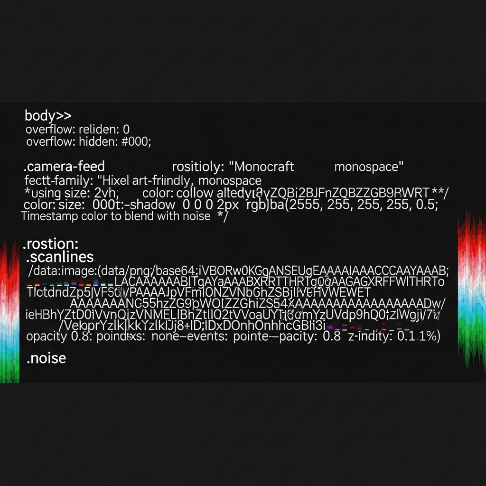
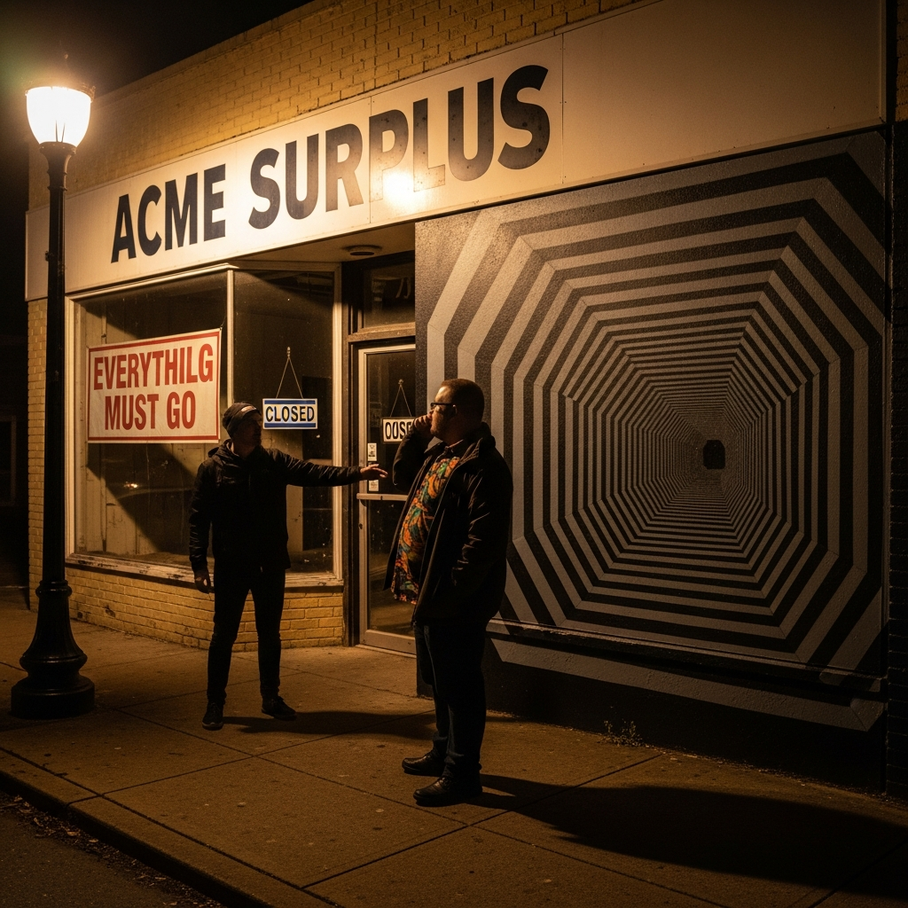
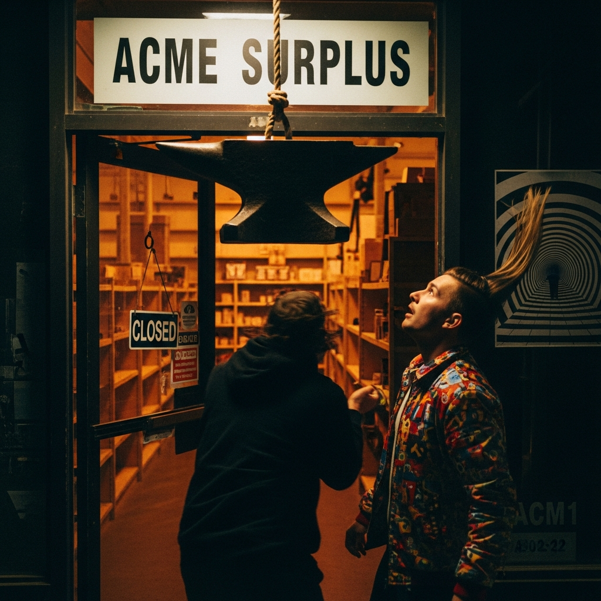
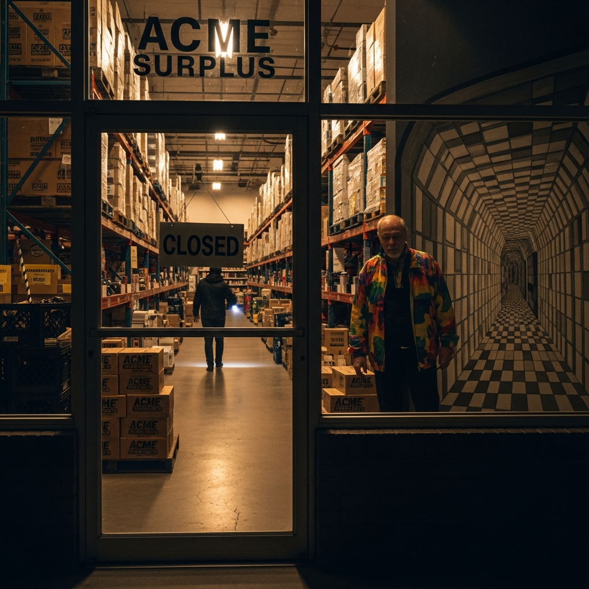
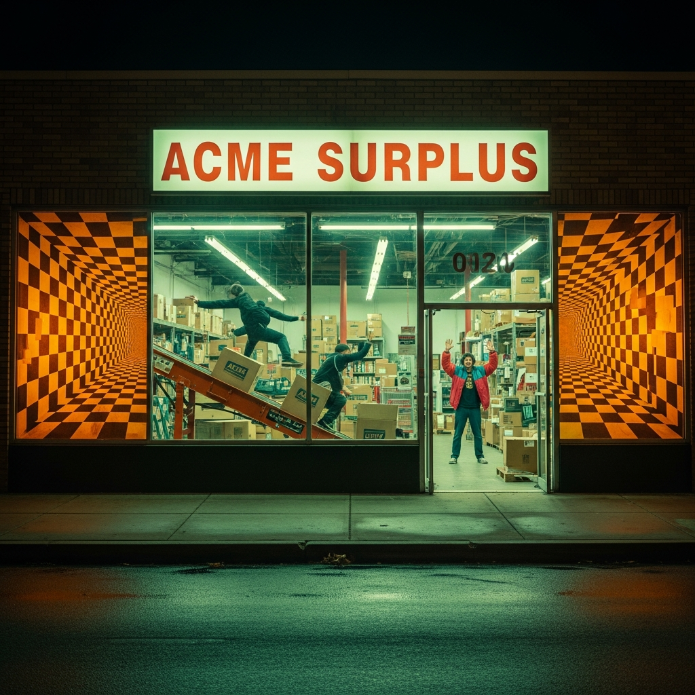
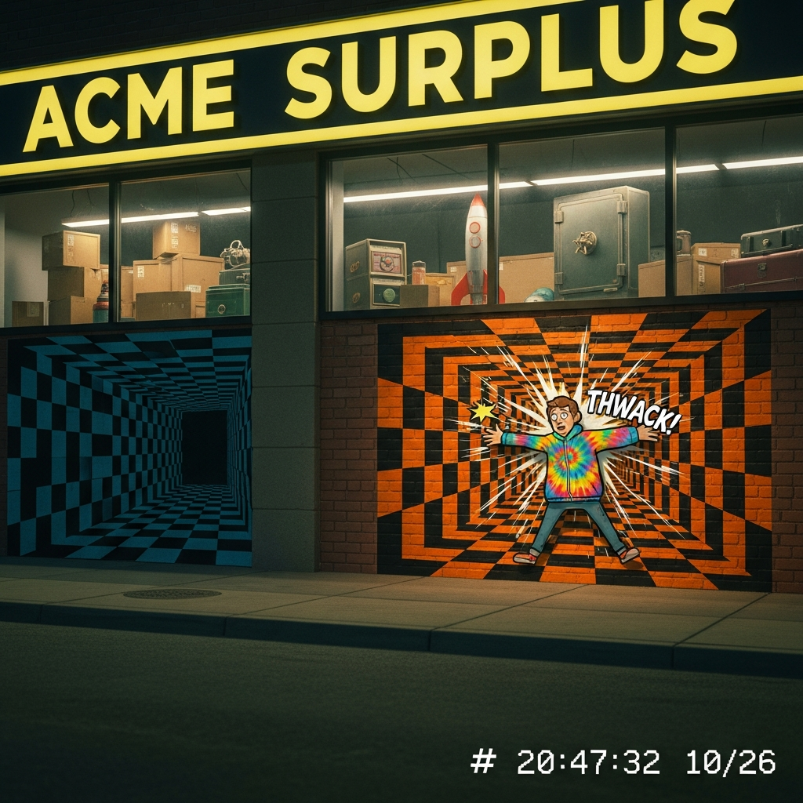
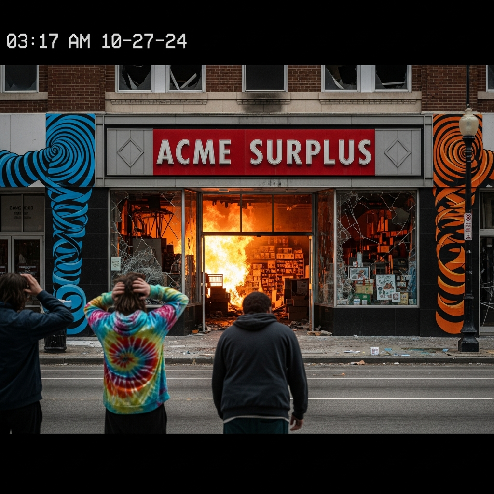
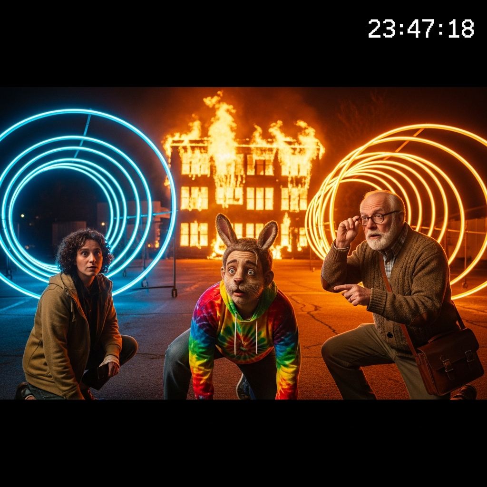
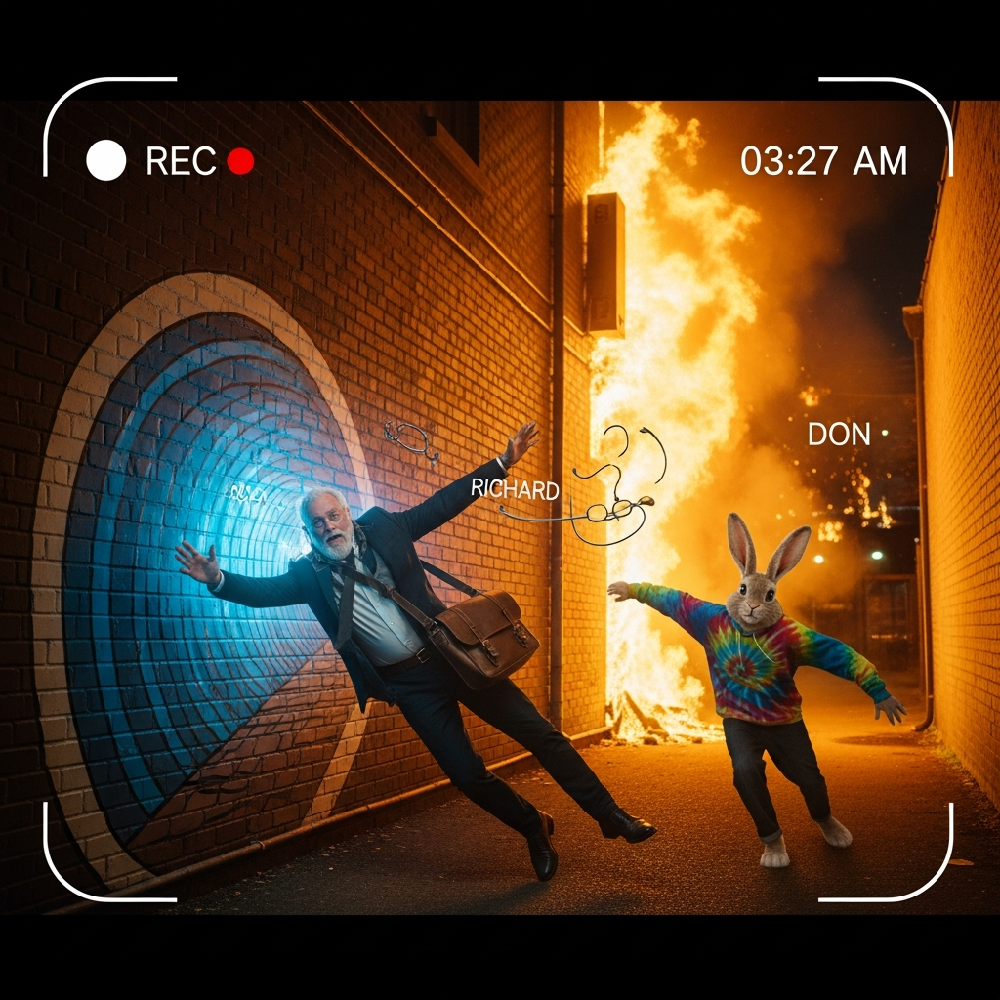

# 🎬 The ACME Heist

> *"Every painted tunnel is a loaded gun." — Chekhov, probably*

Ten frames of surveillance footage documenting the break-in at ACME Surplus. What started as a simple heist became a cascade of cartoon physics, tunnel multiplication, building fire, and one very confused game designer.

**Camera**: ACM1 (Leela Manufacturing, across the street)  
**Date**: 2026-01-22  
**Parallel Coverage**: [Donna's Selfies](../../../../characters/fictional/donna-toadstool/selfies/SLIDESHOW.md)

---

## 🔗 The Parallel Timelines

While these events unfold, Donna Toadstool documents them from her control room:

| Heist Frame | Donna's Selfie | What Donna Does |
|-------------|----------------|-----------------|
| 01: Approach | Intruder Alert | "LOOK WHAT I'VE FOUND!" |
| 02: Invitation | Tunnel Watch | Reveals controllable tunnels |
| 03: Entry | Anvil Deployed | "I DID THAT!" |
| 04: Inside | Tunnels Multiply | "I TOLD YOU!" |
| 05: Deeper | Conveyor Chaos | Hand on lever |
| 06: Sprint | Propulsion Success | Chef's kiss |
| 07: Extraction | THWACK Moment | Home Alone face |
| 08: Aftermath | Aftermath Gloat | Double peace signs |
| 09-10: Richard | This is Fine | Sips coffee amid apocalypse |

---

## 📍 Frame 01: The Approach

**Time**: ~02:30 AM

**The Moment**: Two figures cross the street toward ACME Surplus. The first frame has interference — ACME's reality-distortion field affecting the camera.

**Emergent**: Glitchy camera feed accepted as canon. The building doesn't want to be filmed clearly.

📎 [Take 2 (cleaner)](frame-01-approach-imagen4-2.png) | [Mining](frame-01-approach-imagen4-mine.yml)

---

## 📍 Frame 02: The Invitation

### *Chekhov's Tunnel Established*

**The Gun Appears**: A painted tunnel takes up 40% of the frame. Black and white checkered. Don is MESMERIZED by it.

**Emergent**: "EVERYTHILG" typo on banner — ACME's attention to detail matches its physics.

📎 [Mining](frame-02-invitation-imagen4-mine.yml)

---

## 📍 Frame 03: The Entry

**First Trap**: An anvil drops. Don looks up in alarm. The store is revealed as STOCKED with cartoon weaponry.

**Emergent**: "ACM1" camera self-identification appears.

📎 [Mining](frame-03-entry-imagen4-mine.yml)

---

## 📍 Frame 04: Inside — Tunnels Multiply

**Spatial Anomaly**: The tunnels are now on BOTH SIDES. They've MULTIPLIED. The warehouse is bigger on the inside.

**Don's Jacket**: Now psychedelic colors — he's become a TARGET.

📎 [Mining](frame-04-inside-imagen4-mine.yml)

---

## 📍 Frame 05: Deeper Trouble

**Color Evolution**: Tunnels turn ORANGE and BLACK (warning colors).

**Chaos Begins**: Conveyor belt activated. The instigator surfs boxes.

📎 [Mining](frame-05-deeper-imagen4-mine.yml)

---

## 📍 Frame 06: The Sprint

**Propulsion Event**: The instigator is LAUNCHED by rocket skates. Fire trails through the air.

**Emergent Timestamp**: "03:17:22" appears — the footage is self-documenting.

📎 [Mining](frame-06-sprint-imagen4-mine.yml)

---

## 📍 Frame 07: THWACK — Chekhov's Tunnel FIRES

**The Gun Goes Off**: Don hits the painted tunnel. It's a WALL. "THWACK!" appears in frame.

**Emergent Text**: The image wrote its own sound effect.

📎 [Mining](frame-07-extraction-imagen4-mine.yml)

---

## 📍 Frame 08: The Aftermath

**Escalation**: The building is ON FIRE. Three figures look back. Tunnels have evolved to SPIRALS.

**Emergent Timestamp**: "03:17 AM 10-27-24"

📎 [Mining](frame-08-aftermath-imagen4-mine.yml)

---

## 📍 Frame 09: Richard Arrives

**The Crossover**: Richard Bartle arrives to investigate. Don now has ACTUAL RABBIT EARS — the transformation accelerates.

**Tunnel Evolution**: Now CONCENTRIC CIRCLES.

📎 [Mining](frame-09-richard-arrives-imagen4-mine.yml)

---

## 📍 Frame 10: Richard's Catastrophe

### *The Game Designer Consumed by Simulated Physics*

**Maximum Irony**: Richard is PULLED INTO the tunnel vortex. The man who invented virtual worlds, consumed by cartoon physics.

**Don's Full Transformation**: Now a COMPLETE RABBIT, trying to help.

**Emergent Labels**: The image labeled the characters — "RICHARD" and "DON" with "REC" indicator.

📎 [Mining](frame-10-richard-catastrophe-imagen4-mine.yml)

---

## Tunnel Evolution Chart

| Frame | Tunnel State |
|-------|-------------|
| 01-03 | Black/white checkered |
| 04 | MULTIPLIED (both sides) |
| 05-06 | Orange/black warning |
| 07 | One FIRES (THWACK) |
| 08 | SPIRALS |
| 09-10 | CONCENTRIC CIRCLES → ACTIVE VORTEX |

---

## 🔗 Continue the Story

- **[Donna's View (Parallel) →](../../../../characters/fictional/donna-toadstool/selfies/SLIDESHOW.md)**
- **[The Pub (After) →](../../../../pub/photos/post-heist-fellowship/SLIDESHOW.md)**
- **[Don's Arc (Later) →](../../../../characters/real-people/don-hopkins/selfies/SLIDESHOW.md)**
- **[MASTER SYNTHESIS →](../../../../MASTER-SYNTHESIS-SLIDESHOW.md)**

---

*"Chekhov's Tunnel: if you show a painted tunnel in Act One, someone must hit it by Act Three."*
