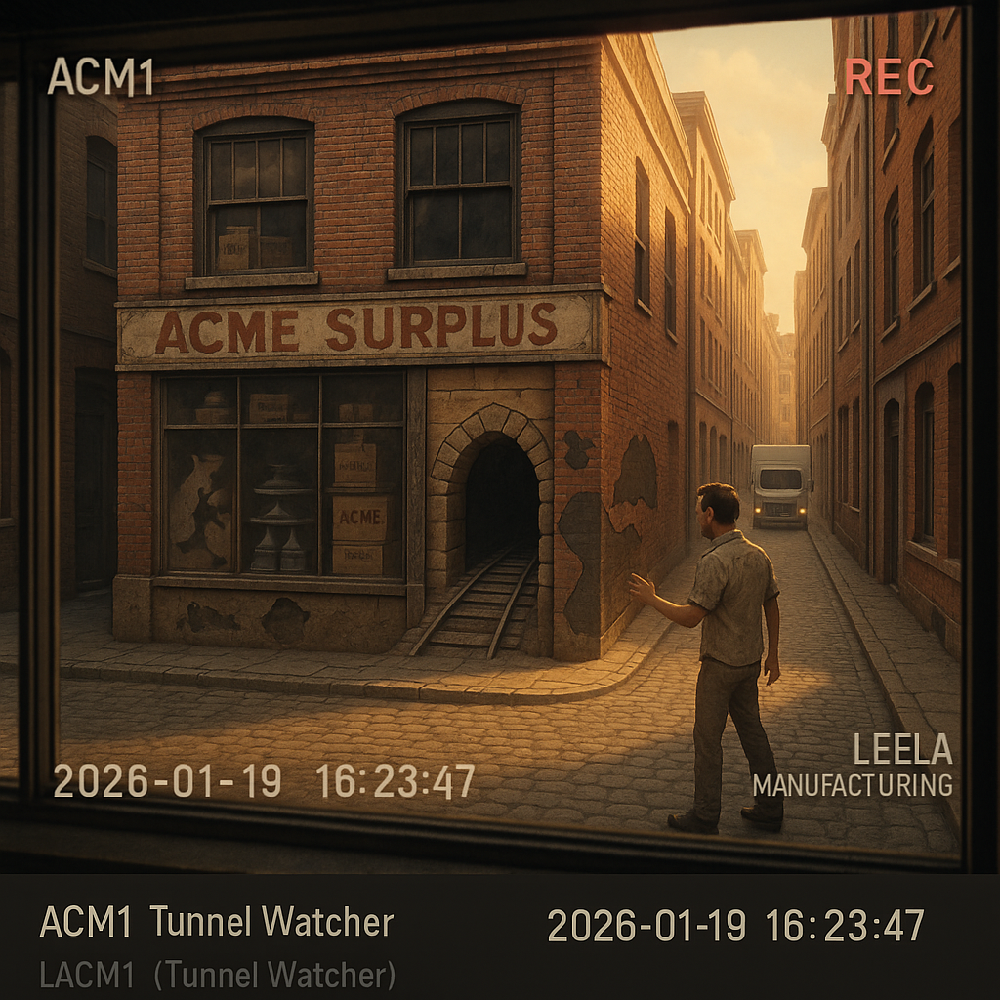
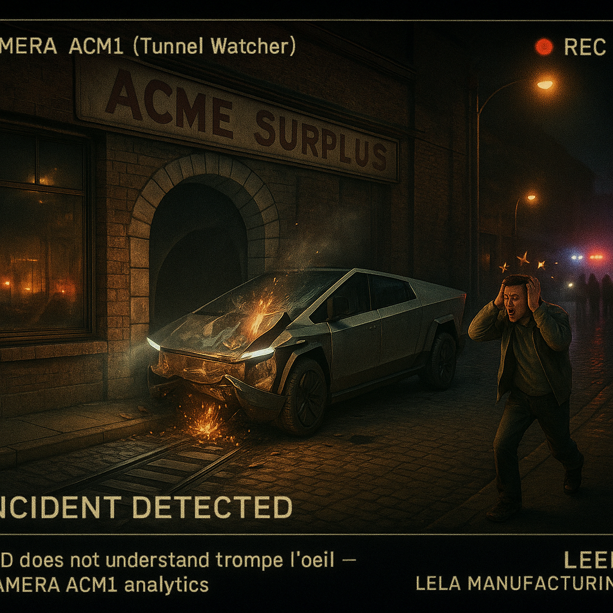
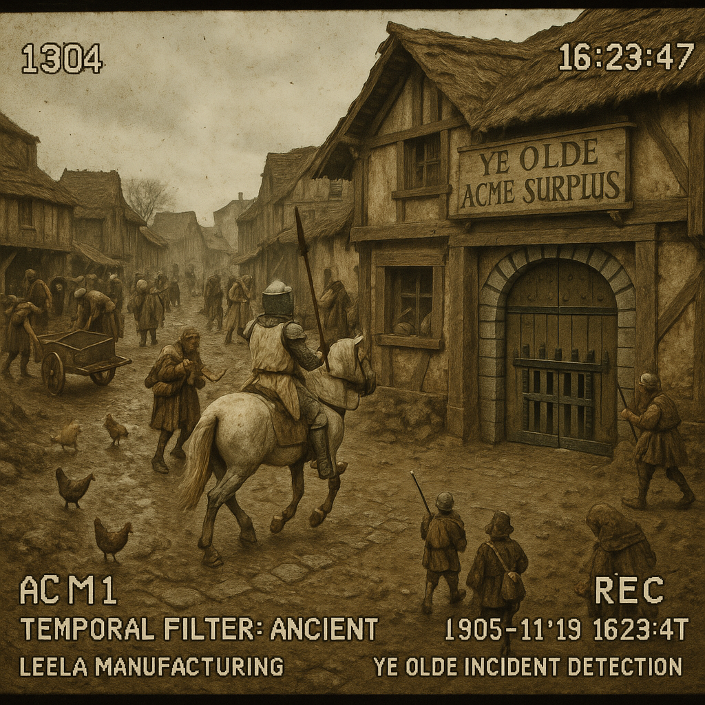

# 📹 Camera ACM1 — ACME Tunnel Surveillance Gallery

> *"The wall remains undefeated across all timelines."*

Footage from Camera ACM1, the "Tunnel Watcher" mounted in the Leela Manufacturing lobby window. This camera faces the ACME Surplus building across the street, watching the painted tunnel that only ACME trucks can pass through. Everyone else bounces. Teslas crash.

---

## 🚶 Present Day: The Tourist Lesson

### *"Hope Springs Eternal, Walls Remain Solid"*



**Style:** Security camera footage — daytime, clear view

**The Scene:** A tourist approaches the painted tunnel on the boarded-up ACME Surplus storefront. The full-height window shows a masterfully rendered tunnel disappearing into darkness. The tourist's body language suggests they might try to walk through. Camera ACM1 has seen this before. It never works.

**AI Grokking Analysis:** The generator understood "security camera perspective" — slightly elevated, wide angle, timestamp overlay implied. The painted tunnel is convincingly rendered as trompe-l'œil art. The tourist's approach angle suggests the moment before disappointment.

**The Lesson:** ACME products only work for ACME insiders. The tunnel is a metaphor: solutions designed for insiders fail outsiders catastrophically.

📎 **Files:** [Prompt Sidecar](camera-acm1-2026-01-19-16-23-47-acme-tunnel-view.yml) | [Mining Analysis](camera-acm1-2026-01-19-16-23-47-acme-tunnel-view-mined.yml)

---

## 🔥 Present Day: Cybertruck Crash (Incident #28)

### *"FSD Meets Cartoon Physics"*



**Style:** Night surveillance footage — crash aftermath, photorealistic

**The Scene:** A Tesla Cybertruck lies crumpled against the ACME wall, having attempted to drive through the painted tunnel at speed. The angular vehicle's stainless steel panels are dented against unforgiving brick. Small flames flicker. The driver (if visible) likely sees cartoon stars.

**AI Grokking Analysis:** The generator captured the specific tragedy of the Cybertruck — its angular, "futuristic" design rendered pathetic against an ancient wall. The night setting with flames adds drama. The juxtaposition of high-tech AI (Full Self-Driving) failing at basic wall detection is the visual punchline.

**Camera ACM1 Log:**
```
INCIDENT #28
Vehicle: Tesla Cybertruck (FSD Enabled)
Result: Wall wins again
Driver status: Cartoon stars
Insurance claim: Denied (ACME clause)
```

📎 **Files:** [Prompt Sidecar](camera-acm1-2026-01-19-22-47-12-cybertruck-crash.yml) | [Mining Analysis](camera-acm1-2026-01-19-22-47-12-cybertruck-crash-mined.yml)

---

## ⚔️ Medieval Timewarp (~1305 AD)

### *"Monty Python and the Painted Gate"*



**Style:** Temporal filter (ancient: 10/10) — Monty Python Holy Grail aesthetic

**The Scene:** Using the telescope's time travel lens, we see what this location looked like 700 years ago. Where ACME Surplus now stands, a medieval building displays a painted castle gate. A knight on horseback charges toward it, lance lowered, utterly convinced of its reality.

**AI Grokking Analysis:** The generator NAILED the Monty Python aesthetic — the slightly absurd seriousness, the British medieval atmosphere, the doomed optimism of the charging knight. The "Holy Grail style" instruction triggered perfect period details: the coconut-implied horse sounds, the specific color grading of that film.

**Temporal Invariant:** The lesson transcends time. Whether painted tunnel, painted gate, or painted drawbridge — the wall has ALWAYS been undefeated. ACME's curse is eternal.

📎 **Files:** [Prompt Sidecar](camera-acm1-1305-01-19-16-23-47-medieval-timewarp.yml) | [Mining Analysis](camera-acm1-1305-01-19-16-23-47-medieval-timewarp-mined.yml)

---

## 🌃 Future View (~2089 AD)

### *"More Human Than Human, Still Can't Beat a Wall"*


**Style:** Temporal filter (future: 8/10) — Blade Runner cyberpunk aesthetic

**The Scene:** Los Angeles, 2089. Perpetual rain. Neon advertisements. A replicant flees from a pursuing Blade Runner, diving toward what appears to be a glowing holographic tunnel in the TYRELL-LEELA MANUFACTURING building facade. The hologram is beautiful. The wall behind it is still solid.

**AI Grokking Analysis:** The generator understood Blade Runner's visual language deeply — the rain, the neon, the retrofuture architecture, the holographic advertisements. The chase scene has proper noir energy. The glowing tunnel is more sophisticated than paint, but equally fake.

**The Irony:** Replicants have superhuman senses but still fall for the painted tunnel trick. "More human than human" doesn't mean "smarter than a wall."

**HUD Elements:**
```
TYRELL-LEELA MANUFACTURING
REPLICANT PURSUIT DETECTED
WALL INTEGRITY: 100%
TUNNEL REALITY: 0%
```

📎 **Files:** [Prompt Sidecar](camera-acm1-2089-01-19-22-47-12-bladerunner-replicant-chase.yml) | [Mining Analysis](camera-acm1-2089-01-19-22-47-12-bladerunner-replicant-chase-mined.yml)

---

## 📊 Temporal Comparison

| Era | Year | Victim | Method | Result |
|-----|------|--------|--------|--------|
| **Medieval** | ~1305 | Knight on horse | Painted castle gate | Wall wins |
| **Present** | 2026 | Tourist | Painted tunnel | Wall wins |
| **Present** | 2026 | Tesla Cybertruck | Painted tunnel | Wall wins (Incident #28) |
| **Future** | 2089 | Replicant | Holographic tunnel | Wall wins |

**The Wall's Record:** Undefeated since the Paleolithic era.

---

## 🎯 What Camera ACM1 Knows

Camera ACM1 has been watching this wall for years. It knows:

1. **ACME trucks pass through.** Always. Without incident.
2. **Everyone else bounces.** Tourists, pedestrians, cyclists.
3. **Teslas CRASH.** Every time. FSD can't detect painted tunnels.
4. **The lesson never changes.** Insider solutions fail outsiders.

The camera doesn't judge. It just records. The footage speaks for itself.

---

## 🔧 Camera Specs

| Property | Value |
|----------|-------|
| **Designation** | Camera ACM1 — Tunnel Watcher |
| **Location** | Leela Manufacturing lobby window |
| **Target** | ACME Surplus building across the street |
| **Special Feature** | Temporal filters (via telescope link) |
| **Incident Count** | 28+ (Tesla crashes alone) |

---

*Generated: Various timestamps across 700+ years | Location: Leela Manufacturing Lobby*

*"The wall doesn't care what year it is. The wall is eternal."*
