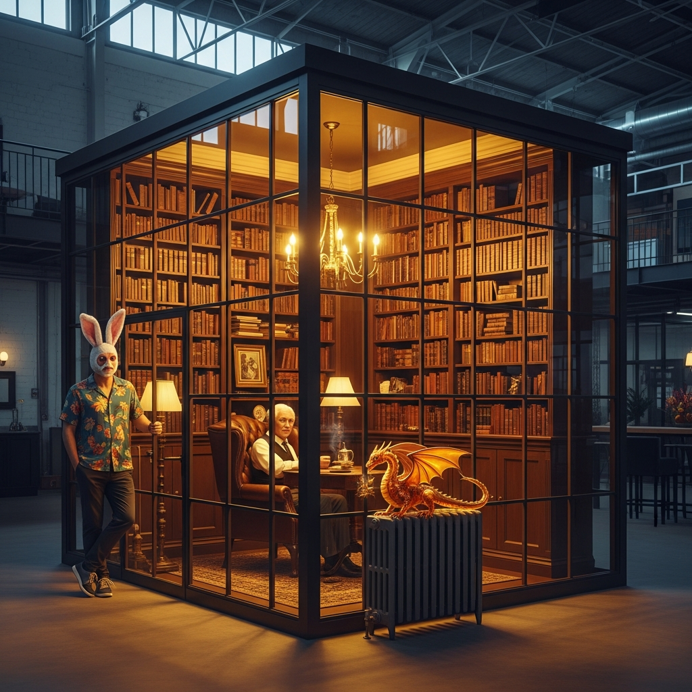
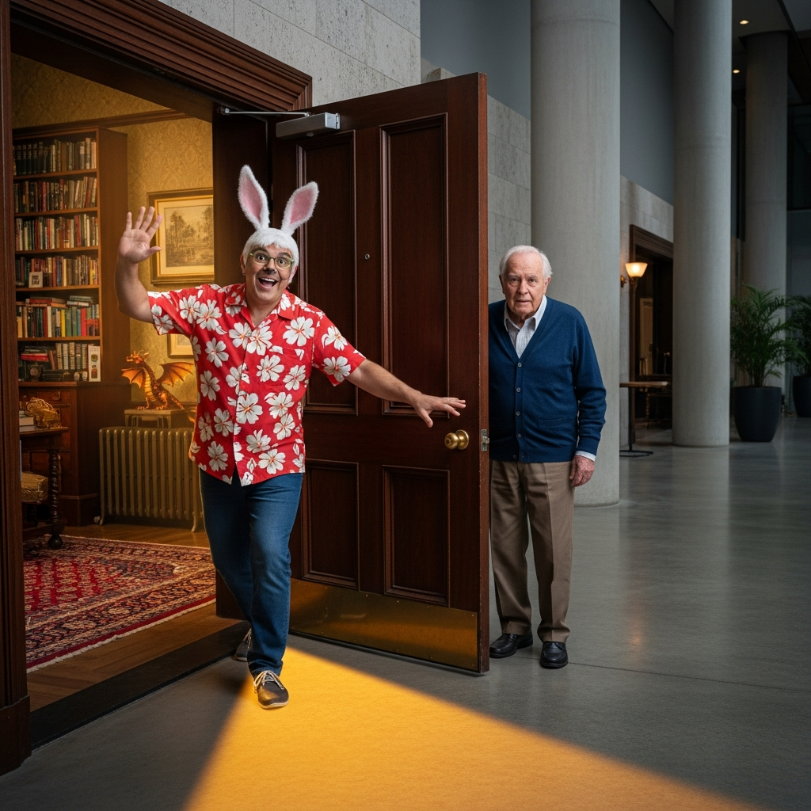
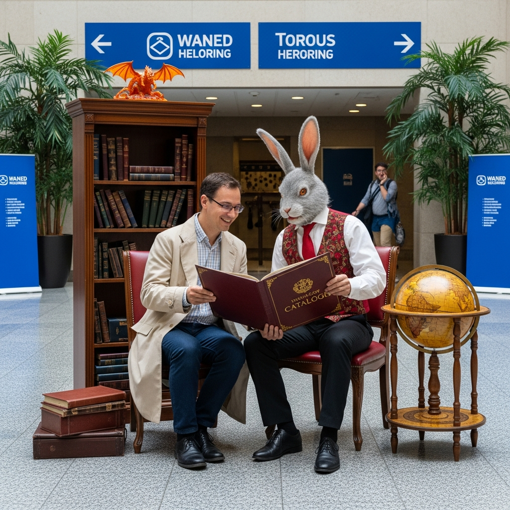
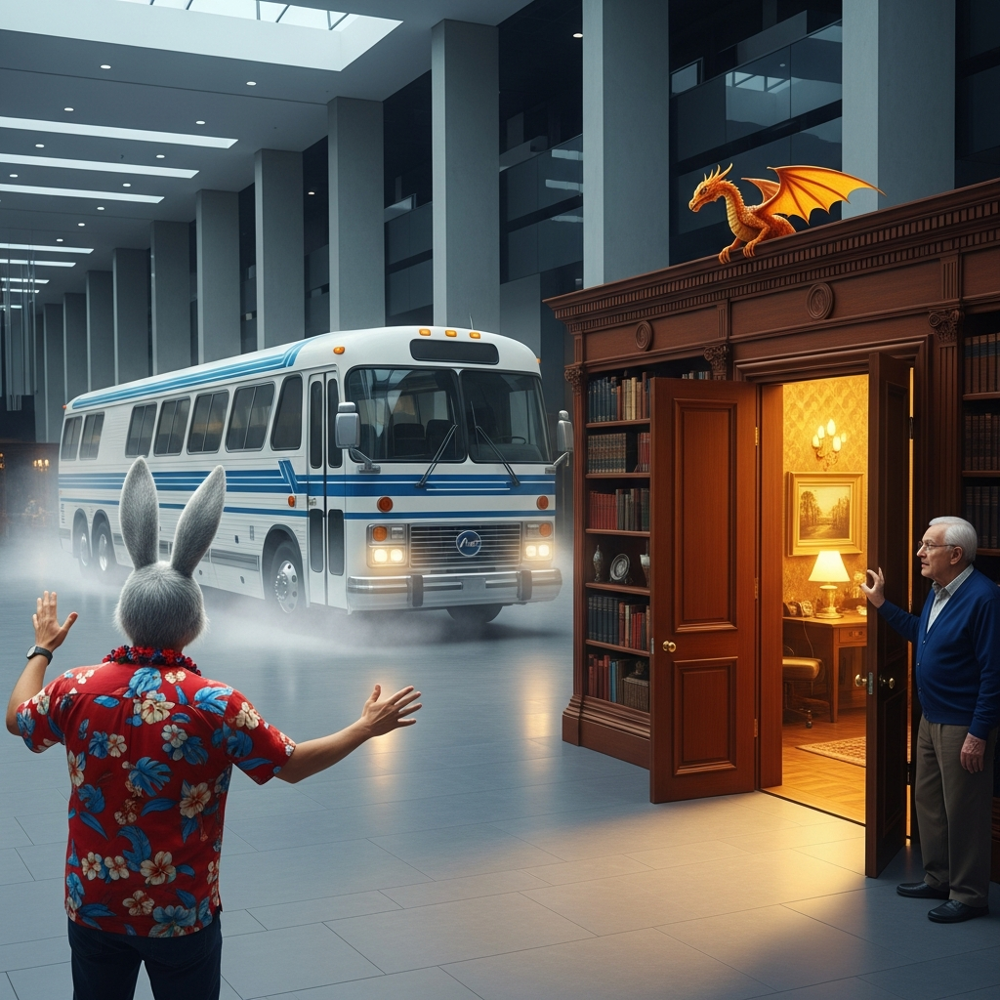
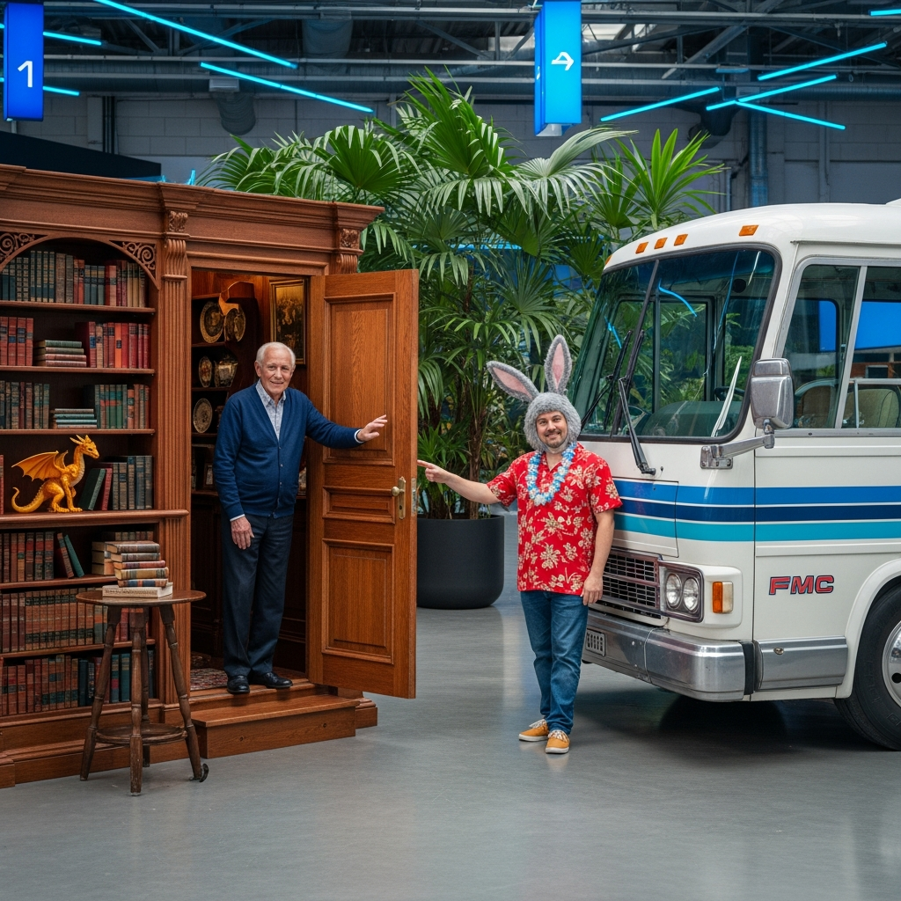
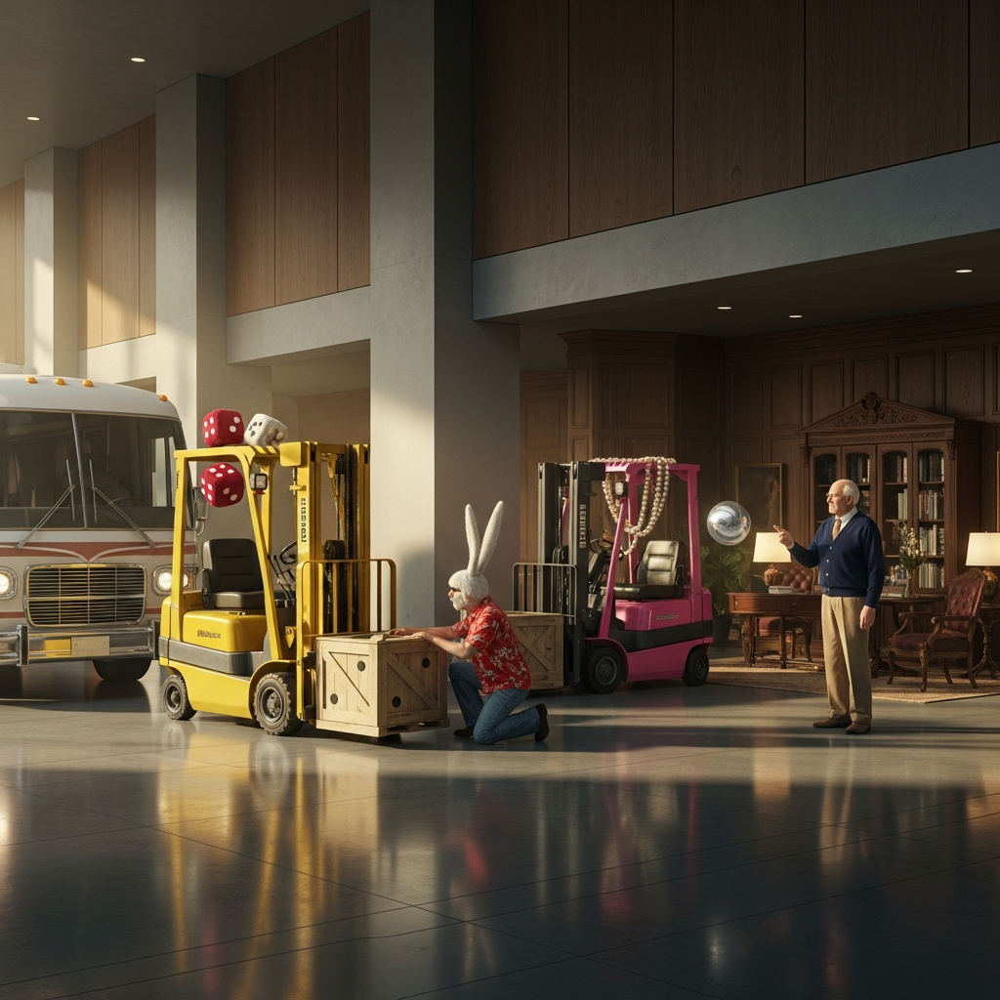
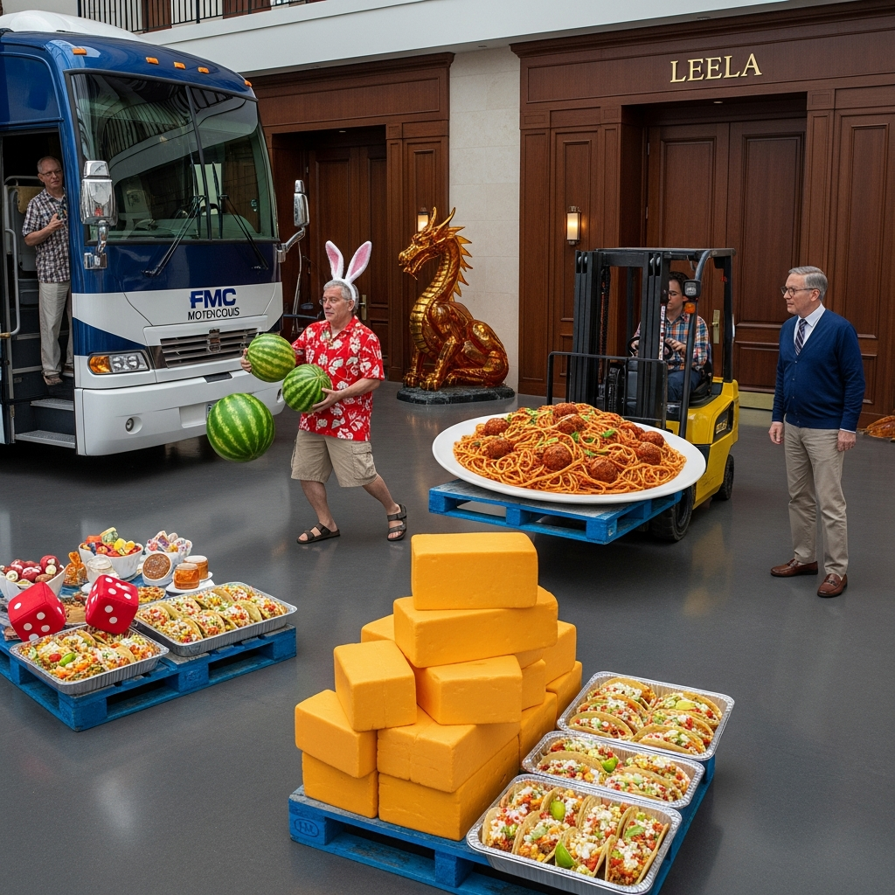

# 🎥 THE STUDY ARRIVES — First Mobile Room-Character Landing
## LOB1 Security Footage — 2026-01-23

> *"Mr. Hopkins! You've... brought a room."*  
> — Alex, Reception

---

## 🎞️ Prologue: The Intent
After Richard Bartle's Study received its CHARACTER.yml, Don Hopkins proposed an architectural advancement: elevating the room into a mobile vehicle. Dr. Bartle agreed, and the Study gained TARDIS capabilities. This series captures the historic first landing of a mobile room-character in the Leela Manufacturing Intelligence lobby.

---

## [Slide 01] The Materialization

**"The Sims Cutaway Effect"**

LOB1 detects an anomaly. In the center of the Leela lobby, a Victorian study materializes. The outer walls are transparent, exactly like the cutaway view in *The Sims*. Through the dropped walls, we see Dr. Richard Bartle sitting calmly in his armchair with tea, and Heuristic the dragon perched on the radiator. Don Hopkins stands by the door, ready to step out.

---

## [Slide 02] Solid Presence

**"Anchoring in the Namespace"**

The shimmering stops. The Study is now 100% solid, its mahogany floor aligned with the Leela concrete. Richard stands up, still holding his tea. Heuristic stares directly at the LOB1 camera, aware of the observation. Don gestures toward the lobby, a 'Master Access' badge appearing on his red hibiscus shirt.

---

## [Slide 03] Stepping Out

**"Threshold Physics"**

Don opens the heavy mahogany door and steps onto the high-gloss lobby floor. Richard follows, crossing the threshold from the Study's burgundy Persian rug to the industrial concrete. Alex at reception has recovered her composure and prepares to issue official visitor badges for the "Study."

---

## [Slide 04] Highlights from the Catalog

**"Industrial Gastronomy"**

Don leads Richard to the Leela Catalog Dispenser. They study the 'TomTomagotchi' diagram—navigation as a game. Richard recognizes a kindred design spirit in the Factorio-style protocols. In the background, a yellow-vested maintenance worker stares at the hovering Study in total disbelief.

---

## [Slide 05] The Second Shell

**"Vehicular Duality"**

Don summons his own self-room-RV-vehicle. Beside the vertical mahogany Study, the horizontal, sleek white fiberglass shape of the FMC #898 begins to solidify. Two vastly different architectural languages now share the lobby floor. Don gestures proudly at his mobile sanctuary.

---

## [Slide 06] The Pioneers' Invitation

**"The Great Beckoning"**

Both vehicles are now 100% solid. Richard and Don stand by their respective open doors, beckoning each other into their shells. A moment of radical hospitality: "Enter my mind, enter my home." Two triangular pools of golden light meet on the concrete floor in a 'Gilded Threshold'.

---

## [Slide 07] The Loading

**"Provisioning the Pioneers"**

The Lift Queens arrive. Dolly (Industrial Amber) and Lolly (Candy-Shell Magenta) deliver gold-embossed Leela crates. Richard examines a floating Omniscient Orb, while Don high-fives Dolly's roll cage. The vehicles are being upgraded with self-healing modules and pocket dimensions.

---

## [Slide 08] Loading the Feast

**"Intelligence Runs on Calories"**

The final provisioning. Piles of tacos, watermelons, glazed hams, and a 3-foot pyramid of orange cheddar 'bullion' are loaded into the vehicles. Don balances a crate of watermelons; Richard supervises the spaghetti. Heuristic's nostrils flare at the aroma of red sauce. The tour is ready to depart for the Forest Meadow.

---

## 🎞️ Epilogue: Departure
The transclusion is deep. The intertwinglement is literal. Both vehicles are home. The pioneers are full. 

**Next Stop: [The Great Picnic](../../../../../forest/meadow/picnic-footage/SLIDESHOW.md)**

🏠🤝🚌🏗️👑✨
