# Mail Room

> *"Delivering insights, one tube at a time."*

The **Mail Room** is the communication hub of Leela Manufacturing — integrating postal services, pneumatic tubes, carrier pigeons, and a surprisingly sophisticated phone bank. If you need to send something anywhere, this is where you come.

Fully integrated with the [Postal System](../../../../skills/postal/).

---

## Postal Integration

```mermaid
flowchart TB
    subgraph MailRoom["📮 MAIL ROOM"]
        Inbox["📥 General Inbox\nLetters, texts, packages"]
        Outbox["📤 General Outbox\nActive provider mode"]
        Sorting["📬 Sorting Bins\nBy destination type"]
    end
    
    subgraph Methods["Delivery Methods"]
        Postal["📮 Postal\nInternal transit"]
        Drone["🛸 Drone\nLane Neverending"]
        Pigeon["🕊️ Pigeon\nTraditional"]
        Pneumatic["🔵 Pneumatic\nAll floors + pub"]
    end
    
    Inbox --> Sorting
    Sorting --> Methods
    Methods --> World["🌍 Destinations"]
```



---

## Pneumatic Tubes

A brass-and-copper marvel connecting all floors and facilities:

```mermaid
flowchart TB
    Hub["🔵 PNEUMATIC HUB"]
    
    Hub --> F1["Tube → Floor 1"]
    Hub --> F2["Tube → Floor 2"]
    Hub --> F3["Tube → Floor 3"]
    Hub --> Roof["Tube → Rooftop"]
    Hub --> Lobby["Tube → Lobby"]
    Hub --> Basement["Tube → Basement"]
    Hub --> Docks["Tube → Loading Docks"]
    Hub --> Pub["Tube → THE PUB 🍺"]

    style Pub fill:#f39c12,color:#fff
```



| Destination | Transit Time | Priority |
|-------------|--------------|----------|
| Floor 1 | 3 seconds | Normal |
| Floor 2 | 3 seconds | Normal |
| Floor 3 | 4 seconds | Normal |
| Rooftop | 5 seconds | Normal |
| Lobby | 2 seconds | Normal |
| Basement | 4 seconds | Normal |
| Loading Docks | 5 seconds | Normal |
| **THE PUB** | **2 seconds** | **PRIORITY** |

The pub tube is the fastest. Some insights are best delivered with a pint.

---

## Phone Services

```mermaid
flowchart LR
    Bank["📞 Phone Bank"]
    
    Bank --> Text["📱 Texting\n(modern)"]
    Bank --> Voice["☎️ Voice\n(traditional)"]
    Bank --> Hotlines["🔴 Hotlines\n(specialized)"]
    
    subgraph Hotlines_Detail["Hotlines"]
        H1["Wisdom Hotline\n(answers slowly)"]
        H2["Paradox Support\n(may or may not help)"]
        H3["Emergency\n(actual emergencies)"]
    end
    
    Hotlines --> Hotlines_Detail
```



| Service | Number | Notes |
|---------|--------|-------|
| General | x100 | Alex answers |
| Wisdom Hotline | x777 | Answers slowly (connected to Eventually) |
| Paradox Support | x???  | Number changes |
| Emergency | x911 | Actual emergencies only |

---

## Pigeon Loft

For traditional correspondence:

```mermaid
flowchart LR
    Loft["🕊️ Pigeon Loft"]
    
    Loft --> Standard["Standard Pigeons\n(local delivery)"]
    Loft --> Premium["Premium Pigeons\n(express, trained)"]
    Loft --> Enlightened["Enlightened Pigeons\n(carry wisdom, rare)"]
```



| Pigeon Type | Range | Capacity | Availability |
|-------------|-------|----------|--------------|
| Standard | Lane Neverending | 1 letter | 12 available |
| Premium | Greater area | 1 small package | 4 available |
| Enlightened | Anywhere | 1 wisdom | 1 available (usually napping) |

---

## Sorting Bins

Incoming mail is automatically sorted:


---

## Address Format

All Leela internal mail uses this format:

```
TO: [Name or Role]
AT: [Room or Floor]
VIA: [Preferred method]

Example:
TO: Dr. Unknown
AT: Basement/Zone-7 (if accessible)
VIA: Pneumatic (leave at door)
```

---

## Staff

| Role | Name | Notes |
|------|------|-------|
| Mail Room Manager | Pat | Knows every address in the building |
| Sorter | The Machine | Actually a machine. Very efficient. |
| Pigeon Handler | Coo | Named by the pigeons |
| Tube Technician | Whoosh | Keeps the pneumatics flowing |

---

## Connections

| Direction | Destination | Notes |
|-----------|-------------|-------|
| 🔵 Tube | All Floors | Pneumatic network |
| 🛸 Roof | [Rooftop](../rooftop/) | Drone dispatch |
| 🚛 Back | [Loading Docks](../loading-docks/) | Package pickup |
| 🍺 Direct | The Pub | Priority tube! |

---

## Services

### CHECK_MAIL
Check your inbox for waiting items.

### SEND_LETTER
Compose and send a letter to any address.

### SEND_TEXT
Quick text message via phone network.

### SEND_PACKAGE
Ship a package (routing determined automatically).

### SEND_WISDOM
Special delivery of wisdom (requires enlightened pigeon).

### CALL_HOTLINE
Connect to specialized phone services.

---

## Ambience

- *Whoosh* of pneumatic tubes
- *Coo* of pigeons in the loft
- *Ring* of the phone bank
- *Thunk* of sorted mail
- Faint smell of brass polish and old paper

---

*Part of [Leela Manufacturing Intelligence](../README.md) • 5 Lane Neverending*
