# Rooftop: Garden & Observation

> *"Where ideas grow wild."*

The **Rooftop Garden** is an oasis above the industrial floors below. The moment you step out of the elevator, the factory hum fades and is replaced by birdsong, rustling leaves, and the distant drone of departing delivery drones.

This is where workers come to think. Where Eventually the Tortoise holds court. Where the Origin Tree grows despite all architectural reason.

---

## The Garden

---

## The Origin Tree

An oak that shouldn't exist on a rooftop. Its trunk is thick, its branches spread wide, and its roots... go somewhere.

```mermaid
flowchart TB
    Origin["🌳 The Origin Tree<br/>(somewhere ancient)"]
    
    Origin --> |"cutting taken"| Rooftop["🌱 Rooftop Tree<br/>(Leela Manufacturing)"]
    Origin --> |"cutting taken"| Garden["🌱 Back Garden Tree<br/>(The Pub)"]
    Origin --> |"cutting taken"| Other["🌱 Other locations<br/>(unknown)"]

    style Origin fill:#228B22,color:#fff
```

**The Plaque:**
> *"Grown from a cutting of the Origin Tree.*
> *This branch remembers where it came from."*

Good thinking happens in its shade. Sit here when stuck on a problem.

---

## Eventually the Tortoise

An ancient wisdom tortoise who has been here longer than anyone remembers.

```mermaid
flowchart LR
    Question["❓ Your Question"] --> Wait["⏳ Wait...<br/>(hours, sometimes)"]
    Wait --> Answer["💡 Wisdom<br/>(always worth it)"]

    style Wait fill:#DEB887,color:#000
```

**Known Sayings:**
- *"The insight will come. Eventually."*
- *"Patience is not waiting. Patience is knowing."*
- *"I've seen problems older than you. They all got solved."*

| Attribute | Value |
|-----------|-------|
| Name | Eventually |
| Age | Unknown. Possibly always. |
| Species | Wisdom Tortoise |
| Last moved | 3 hours ago |
| Wisdom queue | 7 questions pending |

---

## Drone Pads

Six hexagonal landing zones near the edge of the roof:

```mermaid
flowchart TB
    subgraph Pads["🛸 DRONE PADS"]
        P1["Pad 1<br/>🟢 Clear"]
        P2["Pad 2<br/>🟡 Landing"]
        P3["Pad 3<br/>🔴 Occupied"]
        P4["Pad 4<br/>🟢 Clear"]
        P5["Pad 5<br/>🟢 Clear"]
        P6["Pad 6<br/>🟡 Launching"]
    end
    
    Pads --> Routes
    
    subgraph Routes["Delivery Routes"]
        Local["🏘️ Lane Neverending"]
        Regional["🌆 Greater Area"]
        Express["⚡ Express Routes"]
    end

    style Pads fill:#3498db,color:#fff
```

| Pad | Status | Last Activity |
|-----|--------|---------------|
| 1 | 🟢 Clear | Launched 5 min ago |
| 2 | 🟡 Landing | Drone incoming |
| 3 | 🔴 Occupied | Charging |
| 4 | 🟢 Clear | Ready |
| 5 | 🟢 Clear | Ready |
| 6 | 🟡 Launching | Takeoff sequence |

---

## The Observation Deck

A raised platform with the best view of Lane Neverending.

```mermaid
flowchart LR
    Telescope["🔭 Telescope"]
    
    Telescope --> Pub["🍺 The Pub<br/>(waves back!)"]
    Telescope --> Street["🛣️ Lane Neverending<br/>(east to west)"]
    Telescope --> Sky["🌟 Night Sky<br/>(LLOOOOMM Constellation)"]
    Telescope --> Other["🏢 Other Buildings<br/>(the neighborhood)"]
```

The pub's rooftop also has a telescope. The two occasionally wave at each other.

---

## Camera: ROOF1

**ROOF1** (Sky Eye) watches the garden, drones, and Eventually from a tall post near the tree.

| Detection | Last Hour |
|-----------|-----------|
| Objects detected | 127 (mostly leaves, clouds, drones) |
| Poses estimated | 23 (garden visitors) |
| Drone landings | 8 |
| Tortoise movements | 1 *(celebrated)* |
| Bird flybys | 47 |
| Telescope waves | 1 (someone waved at the pub) |

---

## What Grows Here

| Section | Contents | Status |
|---------|----------|--------|
| Herb Spiral | Rosemary, lavender, thyme, ideas | Thriving |
| Vegetable Beds | Tomatoes, peppers, insights | Seasonal |
| Flower Patches | Various (attracts pollinators) | Blooming |
| Mushroom Corner | Mysterious varieties | **DO NOT EAT** |
| Compost Bins | Failed insights → future potential | Processing |

The herb spiral supplies the pub next door with fresh ingredients. The arrangement is mutually beneficial.

---

## Connections

| Direction | Destination | Notes |
|-----------|-------------|-------|
| ⬇️ Down | [Floor 3 — Shipping](../floor-3/) | Elevator |
| 🛗 Elevator | [All Floors](../lobby/) | Full access |
| 🍺 Visual | [The Pub](../../w1/) | Wave through telescope! |

---

## Objects on This Floor

- 🌳 [Origin Cutting](origin-cutting.yml) — The Rooftop Tree
- 🛸 [Drone Pads](drone-pads.yml) — Six landing zones
- 🐢 [Eventually](turtle-eventually.yml) — Wisdom Tortoise
- 🔭 [Telescope](telescope.yml) — Observation scope
- 📹 [Camera ROOF1](camera-roof1.yml) — The Sky Eye

---

## Hours

The garden is open 24/7, but Eventually keeps their own schedule.

Best times to find Eventually awake:
- Sunny afternoons (high confidence)
- After rainfall (moderate confidence)
- During philosophical crises (they somehow know)

---

*Part of [Leela Manufacturing Intelligence](../README.md) • 5 Lane Neverending*
