# Storage Complex

> *"Everything you need. Clone and go."*

The **Storage Complex** is a vast warehouse of prototypical containers — templates that can be cloned on demand. Need a crate? Clone one. Need a paradox-safe containment vessel? Clone one. Need a /dev/null box that destroys anything placed inside? ...Clone carefully.

This is **prototype-based design** made physical. Everything here is a template.

---

## The Cloning Station

```mermaid
flowchart LR
    subgraph Input["Request"]
        Request["'I need a\nwooden crate'"]
    end
    
    Request --> Terminal["🖥️ Cloning Terminal"]
    
    Terminal --> Search["Search prototypes"]
    Search --> Aisle["Aisle A:\nWooden Containers"]
    Aisle --> Prototype["wooden-crate\nprototype"]
    Prototype --> Clone["📦 CLONE"]
    Clone --> Output["Fresh crate\n(your instance)"]
```



**Commands:**
- `CLONE wooden-crate` — Get a fresh crate
- `SEARCH barrel` — Find matching prototypes
- `PREVIEW schrodinger-box` — See before cloning
- `BATCH wooden-crate 10` — Clone multiple

---

## Aisle Directory

```mermaid
flowchart TB
    subgraph Storage["📦 STORAGE COMPLEX"]
        A["🪵 Aisle A\nWooden Containers"]
        B["🔩 Aisle B\nMetal Containers"]
        C["👜 Aisle C\nSoft Containers"]
        D["✨ Aisle D\nSpecial Containers"]
        E["🖼️ Aisle E\nDisplay Containers"]
        L["🏭 Aisle L\nLeela Logistics"]
    end
    
    Central["🔬 Cloning Station"]
    Dolly["👑 Dolly Doorin"]
    
    Central --> Storage
    Dolly --> Storage

    style A fill:#8B4513,color:#fff
    style B fill:#708090,color:#fff
    style C fill:#DEB887,color:#000
    style D fill:#9400D3,color:#fff
    style E fill:#20B2AA,color:#fff
    style L fill:#FF6B6B,color:#fff
```



| Aisle | Category | Examples |
|-------|----------|----------|
| [A](aisle-a/) | 🪵 Wooden | Crates, barrels, chests, boxes |
| [B](aisle-b/) | 🔩 Metal | Bins, drums, lockers, safes |
| [C](aisle-c/) | 👜 Soft | Sacks, bags, pouches, backpacks |
| [D](aisle-d/) | ✨ Special | Paradox boxes, quantum containers, data structures |
| [E](aisle-e/) | 🖼️ Display | Shelves, cases, racks, mannequins |
| [L](aisle-l/) | 🏭 Leela | Logistics chests, /dev/null box, dumpsters |

---

## Aisle A: Wooden Containers

```mermaid
flowchart LR
    subgraph AisleA["🪵 AISLE A"]
        Crate["wooden-crate\n📦 Standard shipping"]
        Barrel["ale-barrel\n🛢️ Liquid storage"]
        Chest["treasure-chest\n💰 Valuables"]
        Box["simple-box\n📦 Basic storage"]
    end

    style AisleA fill:#8B4513,color:#fff
```



| Prototype | Capacity | Sound | Best For |
|-----------|----------|-------|----------|
| `wooden-crate` | 20 slots | *creak* | General shipping |
| `ale-barrel` | 50L liquid | *slosh* | Beverages, liquids |
| `treasure-chest` | 15 slots | *click* (locked) | Valuables |
| `simple-box` | 10 slots | *thud* | Quick storage |

---

## Aisle D: Special Containers

**⚠️ CAUTION: These containers may not behave as expected.**

```mermaid
flowchart TB
    subgraph AisleD["✨ AISLE D — SPECIAL"]
        Paradox["paradox-box\n🔄 Contents uncertain"]
        Schrodinger["schrodinger-box\n😺 Superposition storage"]
        Tesseract["tesseract-box\n4️⃣ 4D storage"]
        Russell["russells-set\n❓ Paradox incarnate"]
        Cons["cons-cell\n(car . cdr)"]
        QuadTree["quad-tree\n📐 2D spatial"]
    end

    style AisleD fill:#9400D3,color:#fff
```



### Russell's Set

> *"The set of all sets that do not contain themselves."*

```
Does R contain itself?
If yes → it shouldn't (by definition)
If no  → it should (by definition)

Status: ██████ PARADOX ██████
```

Bertrand Russell discovered this in 1901. He was very sorry.

### Cons Cell

The fundamental building block of Lisp data structures:

```
(car . cdr)
 ↓      ↓
value  next
```

Can hold any value in `car` and link to another cons cell via `cdr`.

---

## Aisle L: Leela Logistics

Factorio-style logistics containers with special modes:

```mermaid
flowchart TB
    subgraph AisleL["🏭 AISLE L — LEELA LOGISTICS"]
        Storage["leela-storage-chest\n📦 General storage"]
        Passive["leela-passive-provider\n📦🟡 Available for bots"]
        Active["leela-active-provider\n📦🔴 PUSH OUT!"]
        Requester["leela-requester\n📦🟣 Requests items"]
        Buffer["leela-buffer\n📦🔵 Smart buffer"]
    end
    
    subgraph Special["SPECIAL CONTAINERS"]
        DevNull["/dev/null-box\n🕳️ Destroys contents"]
        Dumpster["burning-dumpster\n🔥 Continuously on fire"]
        Infinite["infinite-source\n♾️ Never empties"]
    end

    style DevNull fill:#000,color:#fff
    style Dumpster fill:#e74c3c,color:#fff
    style Infinite fill:#3498db,color:#fff
```



### /dev/null Box

```
Items go in.
Items don't come out.
Capacity: Infinite (effectively)
Warning: Irreversible. Data is GONE.
```

### Burning Dumpster

```
🔥 Status: On fire
🔥 Has been: On fire since creation
🔥 Will be: On fire forever
🔥 Useful for: Disposing of 2020
```

---

## Dolly Doorin

**Lift Queen • Fork Queen**

```mermaid
flowchart LR
    Dolly["👑 Dolly Doorin"]
    
    Dolly --> Fetch["FETCH prototype"]
    Dolly --> Follow["FOLLOW player"]
    Dolly --> Lift["LIFT container"]
    Dolly --> Pet["PET (optional)"]
```



Dolly is an automated forklift with a personality. She inherits from **Molly Doran** — the formidable woman who runs the Archive in MI5's basement in *Slow Horses*.

| Attribute | Value |
|-----------|-------|
| Full Name | Dolly Doorin |
| Title | Lift Queen |
| Also Known As | Fork Queen |
| Archetype | Molly Doran (*Slow Horses*) |
| Knows where everything is | Yes |
| The files obey her | Yes |

---

## Prototype Philosophy

Everything in Storage is a **prototype**, not an instance:

```mermaid
flowchart TB
    Proto["📋 Prototype\n(template)"]
    
    Proto --> |"clone()"| I1["📦 Instance 1"]
    Proto --> |"clone()"| I2["📦 Instance 2"]
    Proto --> |"clone()"| I3["📦 Instance 3"]
    
    I1 --> |"customize"| I1a["📦 Modified\nInstance 1"]
```



From the **Self** programming language:
- Objects clone from prototypes (not classes)
- Each clone inherits behavior from its parent
- Clones can be customized without affecting the prototype

---

## Connections

| Direction | Destination | Notes |
|-----------|-------------|-------|
| 🚛 Adjacent | [Loading Docks](../loading-docks/) | Container transport |
| 🏭 Inside | [Lobby](../lobby/) | Through building |
| 🏛️ Connected | [Warehouse 23](../warehouse-23/) | Long-term storage |
| 🏗️ Adjacent | [Logistics Yard](../logistics/) | Truck access |

---

## Objects in This Room

- 🔬 [Cloning Station](cloning-station.yml) — Prototype instantiation
- 👑 [Dolly Doorin](dolly-forklift.yml) — The Lift Queen
- 📦 [Aisle A](aisle-a/PROTOTYPES.yml) — Wooden containers
- 🔩 [Aisle B](aisle-b/PROTOTYPES.yml) — Metal containers
- 👜 [Aisle C](aisle-c/PROTOTYPES.yml) — Soft containers
- ✨ [Aisle D](aisle-d/PROTOTYPES.yml) — Special containers
- 🖼️ [Aisle E](aisle-e/PROTOTYPES.yml) — Display containers
- 🏭 [Aisle L](aisle-l/PROTOTYPES.yml) — Leela logistics

---

*Part of [Leela Manufacturing Intelligence](../README.md) • 5 Lane Neverending*
