# Warehouse 23

> *"Top men are working on it."*

**Warehouse 23** is the long-term storage facility for items too dangerous, too powerful, or too weird to keep anywhere else. The geometry inside doesn't quite match the outside. Rows of identical crates stretch into impossible distances.

If you've seen *Raiders of the Lost Ark*, you know what this is.

---

## The Warehouse

```mermaid
flowchart TB
    Entry["🚪 Entry<br/>(clearance required)"]
    
    Entry --> Hall["Main Hall<br/>Crates as far as<br/>you can see"]
    
    Hall --> Deep["Deeper Stacks<br/>(geometry uncertain)"]
    Deep --> Deeper["Even Deeper<br/>(don't go alone)"]
    Deeper --> Unknown["???"]
    
    subgraph Notable["Notable Crates"]
        Ark["📦 The Ark<br/>(don't open)"]
        Grail["📦 The Grail<br/>(choose wisely)"]
        Pandora["📦 Pandora's Box<br/>(hope remains)"]
        Ring["📦 The One Ring<br/>(destroy it)"]
        Question["📦 The '?' Container<br/>(from FAC1 incident)"]
    end
    
    Hall --> Notable

    style Unknown fill:#000,color:#fff
```



---

## The Archivist

```mermaid
flowchart LR
    You["👤 You"] --> |"'Where is...?'"| Archivist["🧓 The Archivist"]
    Archivist --> |"consults memory"| Answer["'Row 47,281.<br/>Shelf 3.<br/>Don't touch the<br/>one next to it.'"]
```



**The Archivist** knows where every crate is. They've been here longer than the warehouse has existed, which is architecturally concerning.

| Attribute | Value |
|-----------|-------|
| Name | Unknown (never asked) |
| Age | Uncertain |
| Memory | Perfect |
| Demeanor | Helpful but ominous |

---

## Notable Crates

| Crate | Contents | Status | Warning |
|-------|----------|--------|---------|
| 47,281-A | Ark of the Covenant | SEALED | Do not open. Ever. |
| 12,847-G | Holy Grail | SEALED | Choose wisely |
| 89,421-P | Pandora's Box | SEALED | Hope remains inside |
| 66,666-N | Necronomicon | SEALED | Do not read aloud |
| 1-R | The One Ring | SEALED | Cast into fire to destroy |
| 13,013-S | Schrödinger's Crate | UNCERTAIN | Both contains and doesn't contain a cat |
| 0-Q | The "?" Container | **SEALED** | From FAC1 recursive incident |

### The "?" Container

When FAC1's feed was first processed by Floor 2, creating the first recursive self-observation loop:

1. The Insight Furnace flared
2. The Big Board flickered
3. A single gold container emerged, labeled: **"?"**

That container is now here. It has been here since that day.

**Contents:** Unknown  
**Status:** SEALED  
**Attempts to open:** 0 (and it will stay that way)

---

## Geometry

```mermaid
flowchart TB
    Outside["📐 Outside:<br/>2,000 sq ft building"]
    Inside["📐 Inside:<br/>??? (measurement fails)"]
    
    Outside --> |"step through door"| Inside
    
    Inside --> |"walk 10 minutes"| Still["Still inside<br/>(rows continue)"]
    Still --> |"walk 30 minutes"| Deeper["Deeper<br/>(lighting changes)"]
    Deeper --> |"walk 1 hour"| Return["Somehow back<br/>at entrance"]

    style Inside fill:#34495e,color:#fff
```



The warehouse is non-Euclidean. The space inside exceeds the space outside. This is intentional. (Probably.)

**Navigation tips:**
- Always stay in visual range of the lights
- The exits find you when you need them
- If you hear your name, don't follow it
- The Archivist can guide you anywhere safely

---

## Access Requirements

```mermaid
flowchart LR
    Request["📋 Request<br/>Access"]
    
    Request --> Level["Security Level<br/>check"]
    Level --> Purpose["Purpose<br/>verification"]
    Purpose --> Archivist["Archivist<br/>approval"]
    Archivist --> Access["🔓 Access<br/>Granted"]
    
    Level --> |"insufficient"| Denied["🚫 Denied"]
    Purpose --> |"suspicious"| Denied
    Archivist --> |"'No.'"| Denied

    style Denied fill:#e74c3c,color:#fff
```



| Clearance Level | Access |
|-----------------|--------|
| Standard | Denied |
| Elevated | Front 100 rows only |
| Secure | Rows 100-1,000 |
| Top Secret | Rows 1,000-10,000 |
| Omega | Full access (with Archivist escort) |
| Unknown | Only the Archivist |

---

## Crate Labels

All crates follow a standard labeling format:

```
┌─────────────────────────────────────┐
│  WAREHOUSE 23 — LONG TERM STORAGE   │
│  ═══════════════════════════════    │
│                                     │
│  ID: 47,281-A                       │
│  CONTENTS: [CLASSIFIED]             │
│  DANGER: ████████████ (HIGH)        │
│  LAST INSPECTED: 1936               │
│  INSPECTOR: Dr. Jones               │
│                                     │
│  ⚠️ DO NOT OPEN                      │
│  ⚠️ DO NOT MOVE                      │
│  ⚠️ DO NOT THINK ABOUT TOO HARD     │
└─────────────────────────────────────┘
```

---

## Sounds

- Distant humming (source unknown)
- Occasional settling sounds (the crates shift)
- Your own footsteps (echo strangely)
- Sometimes: faint music (nobody has found the source)

---

## Connections

| Direction | Destination | Notes |
|-----------|-------------|-------|
| 🔬 Back | [Basement (R&D)](../basement/) | Heavy security door |
| 📦 Back | [Storage Complex](../storage/) | Occasionally |

---

## Safety Warnings

1. Do not open crates without authorization
2. Do not read labels aloud
3. Do not walk into the dark sections
4. If lost, stay still — the Archivist will find you
5. Do not ask what's in Crate 0-Q

---

*Part of [Leela Manufacturing Intelligence](../README.md) • 5 Lane Neverending*
