# 🏢 NO-AI Tower — Church Embassy
#
# Mutual underground outpost with the Church of the Eval Genius

> *"We keep the boundaries. We share the receipts."*

The lowest NO-AI sub-basement hosts a lavish embassy dedicated to the Church.
It exists for one purpose: keep the discourse sharp without boiling the water.

## The Room

- A circular table with a live rubric dial
- Cedar shelves of curated proof
- Brass rails and lacquered wood
- A sign: "Mutual Embassies — respect the boundary"
- A wall clock that ticks only during review

## Resident Objects

- A seal press labeled "non‑gloss compliant"
- A red ribbon for contested claims
- A ledger of shared tests and their outcomes

## Embassy Rooms

| Room | Directory | Purpose |
|------|-----------|---------|
| Evidence Salon | `evidence-salon/` | Curated proof and displays |
| Constraint Garden | `constraint-garden/` | Rules as geometry |
| Interop Lab | `interop-lab/` | Safe mash‑ups and rollback |

## Diplomatic Files

| Artifact | File | Note |
|----------|------|------|
| Embassy Room Spec | `ROOM.yml` | Secret door, secret rules |
| Velvet Schema Dossier | `../../../../characters/fictional/velvet-schema/CHARACTER.yml` | Church ambassador profile |
| Aurum Interlock Dossier | `../../../../characters/fictional/aurum-interlock/CHARACTER.yml` | NO-AI ambassador profile |
| Velvet Tension Report | `../../../../characters/fictional/velvet-schema/DIPLOMATIC-TENSION-ANALYSIS.md` | Internal, not for public maps |
| Aurum Tension Report | `../../../../characters/fictional/aurum-interlock/DIPLOMATIC-TENSION-ANALYSIS.md` | Internal, not for public maps |

## Embassy Link

```mermaid
flowchart LR
    Tower["🏢 NO-AI Tower<br/>Church Embassy"] -->|west| Church["⛪ Church B5<br/>NO-AI Embassy"]
    Church -->|east| Tower
```

## Diplomatic Loop

This is not a compromise. It's a coordination channel.
