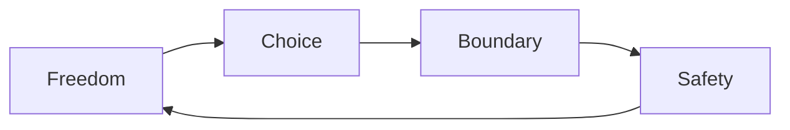

# 🌿 Constraint Garden

> *"Safe defaults are a kind of mercy."*

An underground garden built from rule geometry. It is lush with order:
every hedge is a boundary, every path a constraint, every curve a careful
limit.

## Features

- Logic‑gate hedges (AND, OR, NOT)
- Truth‑table tiles
- A fountain of safe defaults
- A maze of exception paths with warning plaques

## Garden Rules

- Follow the path you choose to the end
- Do not step over a boundary unless invited
- Red gates require a witness

## Diagram: Constraint Lattice

## Note

If the garden feels too strict, the answer is not to remove walls.
It is to design better paths.
