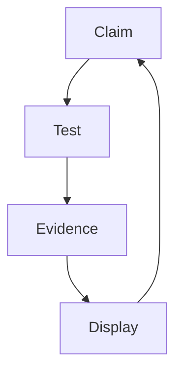

# 📎 Evidence Salon

> *"Make it legible. Make it shareable. Make it stand."*

The Evidence Salon is an ornate library of proof. This is NO‑AI’s love
letter to accountability, curated with the Church’s ritual discipline.

## Highlights

- Annotated rubrics under glass
- Chain‑of‑custody seals
- A rotating wall of “best receipts of the month”
- A docket rail for contested claims
- A “red tag” shelf for failed proofs

## The Curator’s Rules

- Every receipt gets a title, date, and provenance
- Every claim gets a counter‑example
- Every display has a path back to raw evidence

## Diagram: Proof Pipeline

## Rule

If it can’t be shown, it can’t be claimed.
