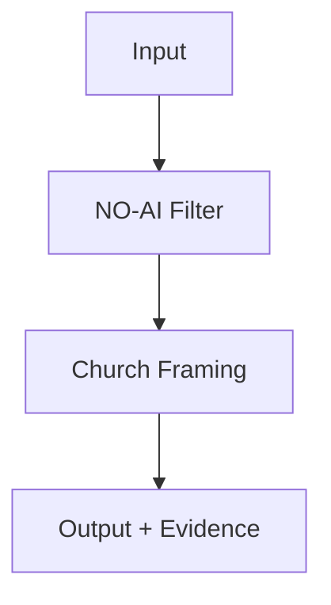

# 🔧 Interoperability Lab

> *"Mash up safely, or don’t mash at all."*

The Interop Lab is where the Church and NO‑AI test their joint systems.
Every experiment is a reversible splice of ideas.

## What Lives Here

- Modular rigs for cross‑protocol tests
- Fail‑safe toggles and rollback levers
- A shared whiteboard of mash‑up patterns
- A quarantine shelf for unstable integrations

## Lab Protocol

- Every mash‑up must define rollback first
- Evidence logging is automatic, not optional
- Unstable builds stay on the quarantine shelf

## Diagram: Safe Mash‑Up

## Rule

If the rollback lever won’t work, you can’t run the test.
