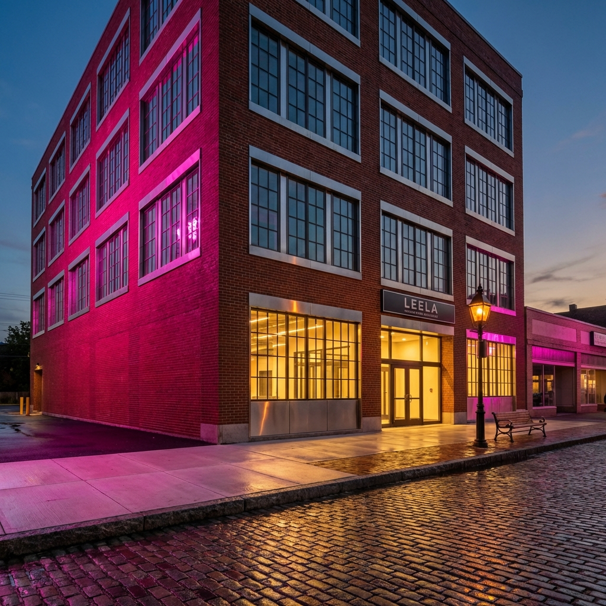
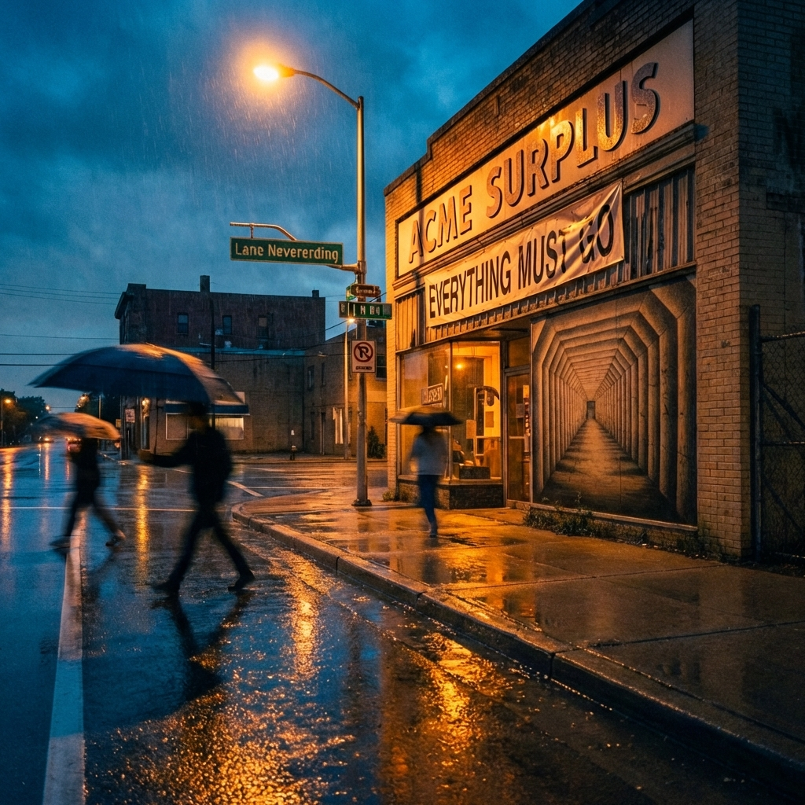
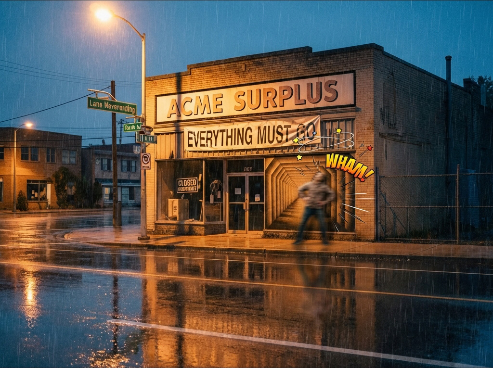
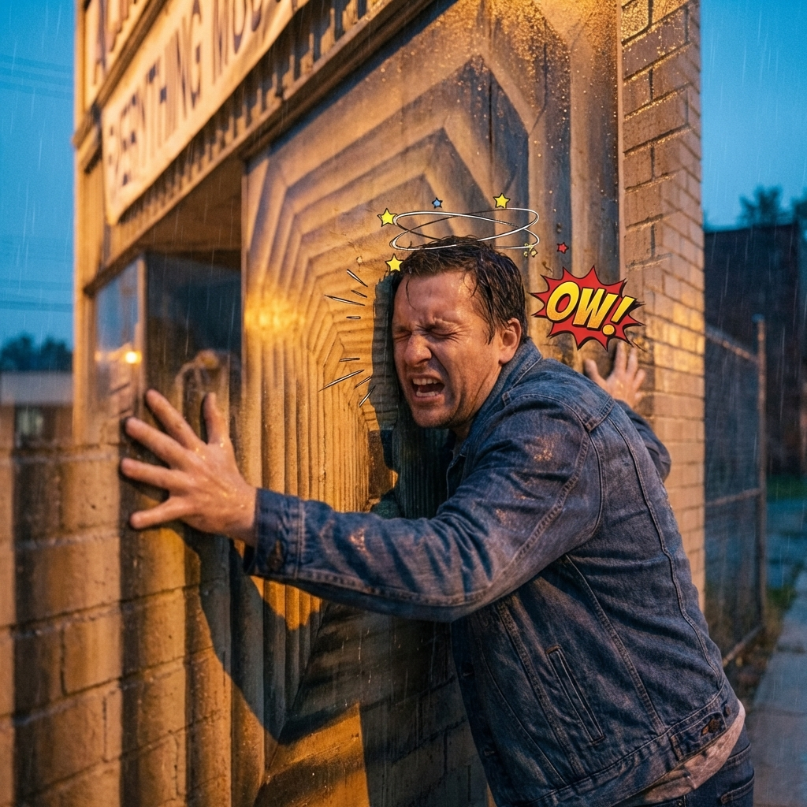
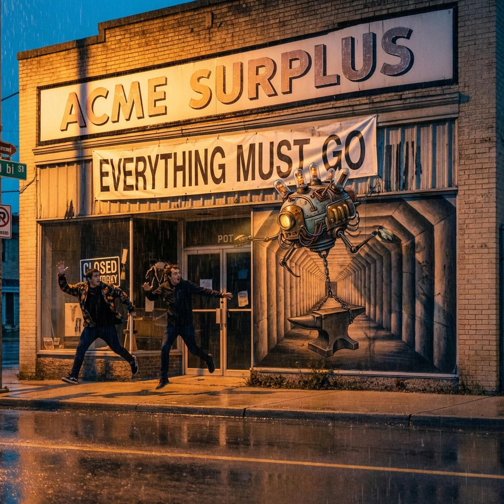
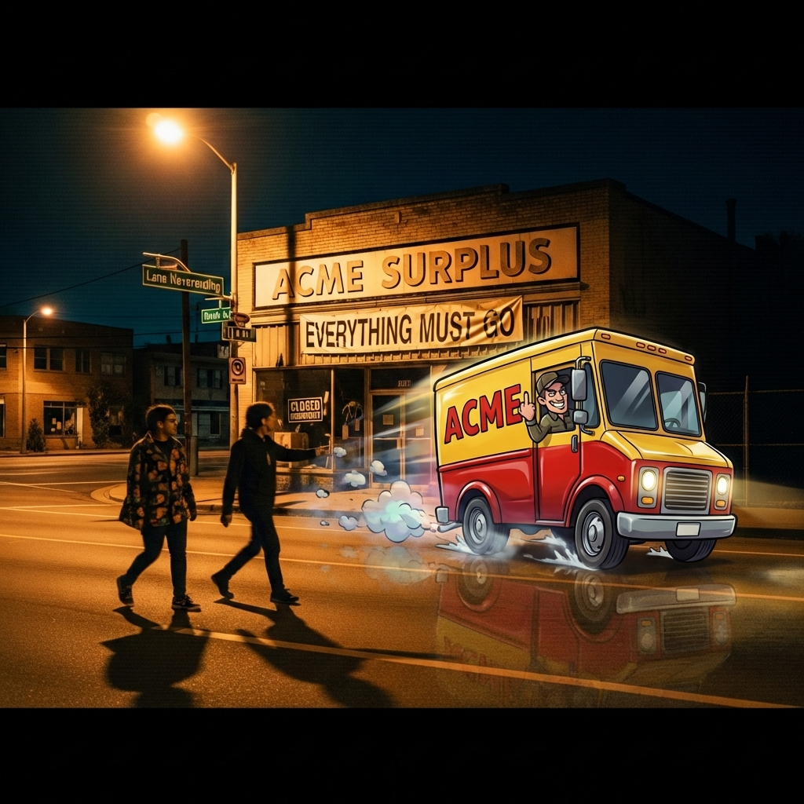
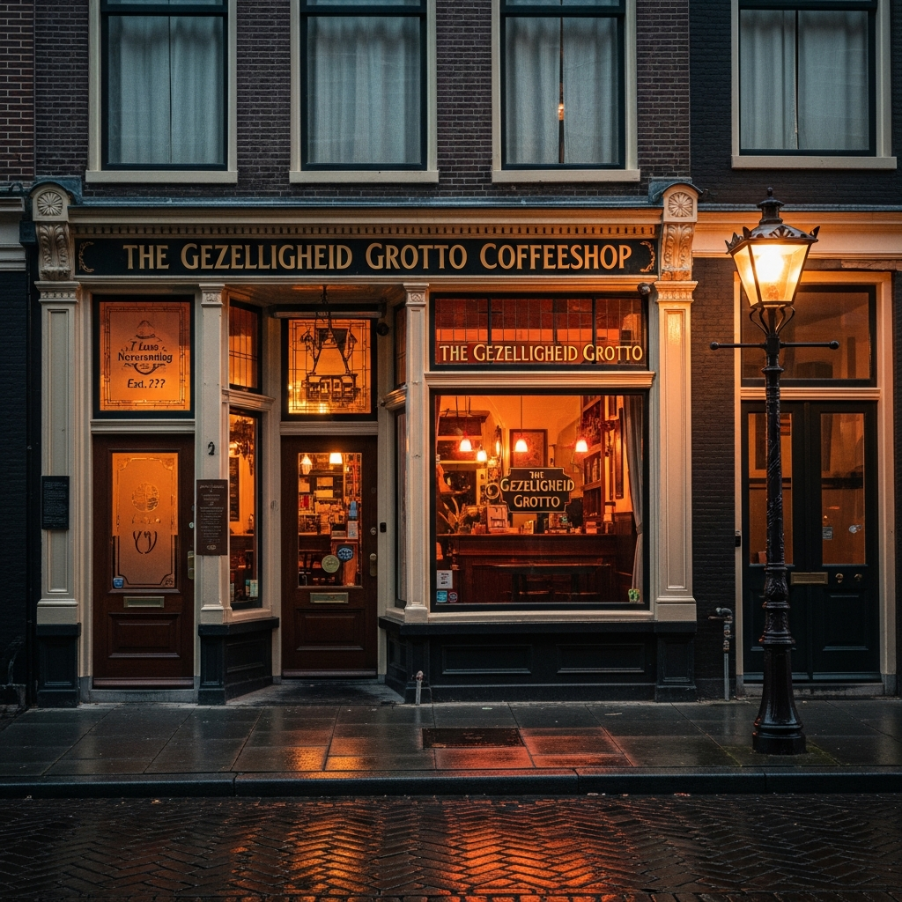
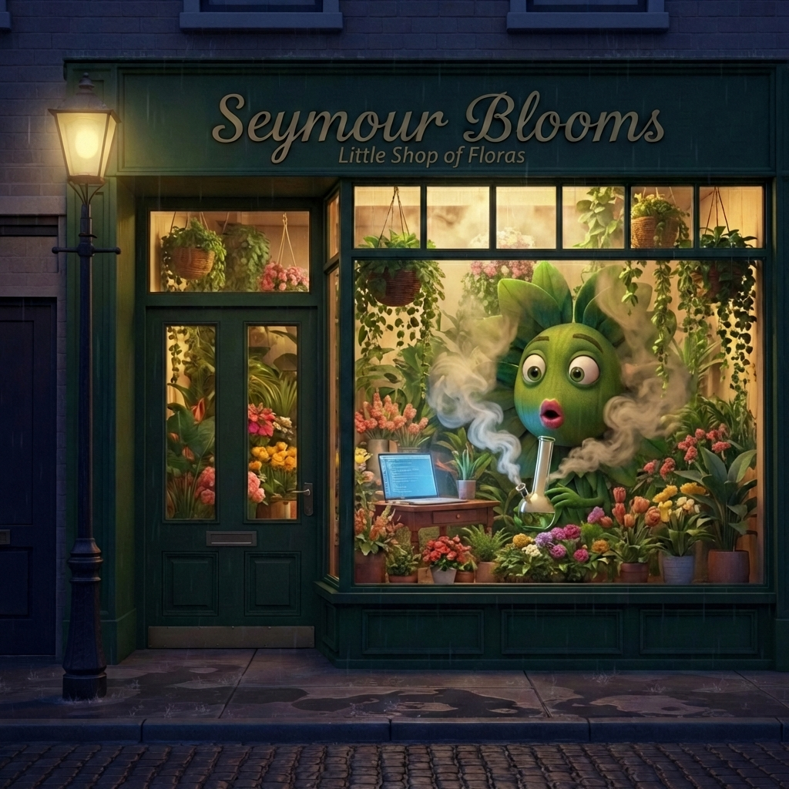

# Lane Neverending — Photo Album

**Start here:** [SLIDESHOW.md](./SLIDESHOW.md)

Short, narrative-first tour of Lane Neverending, with full captions and mining layers.

---

## Featured Shots

### NO AI Tower

The sign that turns a one-story building into a forty-foot statement. Neon, wet asphalt, and the unmistakable pink glow.

### Leela Manufacturing (Dusk)

Warm lobby light behind tall panes, brick washed in magenta spill, the calm counterpoint to the neon next door.

### ACME Surplus Tunnel Sequence

Five frames, one joke, escalating consequences. The tunnel dares, the wall answers, and the street keeps score.

The hit that proves the tunnel is paint, not depth.

Close-up pain, cartoon physics with real-world sting.

The drone arrives with hardware and bad intent.

The truck ignores the rules and exits anyway.

### Gezelligheid Grotto (Dusk)

The pub glow in the lane, cozy and impossible, a warm anchor in the pink spill.

### Seymour Blooms (Ada II)

Closed shop, lights on, the plant that should not be seen caught mid-surprise.

## Photo Index

- **NO AI Tower** — [no-ai-sign-dusk/](./no-ai-sign-dusk/)
- **Leela Manufacturing (Dusk)** — [leela-manufacturing-dusk/](./leela-manufacturing-dusk/)
- **ACME Surplus Tunnel Sequence** — [acme-surplus-dusk/](./acme-surplus-dusk/)
- **Gezelligheid Grotto (Dusk)** — [gezelligheid-grotto-dusk/](./gezelligheid-grotto-dusk/)
- **Seymour Blooms (Ada II)** — [seymour-blooms-dusk/](./seymour-blooms-dusk/)

---

## Road Map (Outline)

- **Lane Neverending (center)**
  - **W1 — ACME Surplus**
    - Painted tunnel illusion
  - **Center — Sandwich Board**
  - **E1 — Flickering Lamppost**
  - **E2 — The Infinite Fountain**
  - **E3 — Construction Site**
  - **5½ — NO AI Tower**
    - One-story building with 40-foot neon sign
  - **Leela Manufacturing Intelligence**
    - Red brick factory, warm lobby glow
  - **Number 7 — Seymour Blooms**
    - Florist shop, Ada II in the window

---

## Related

- [SLIDESHOW.yml](./SLIDESHOW.yml) — Album metadata and structure
