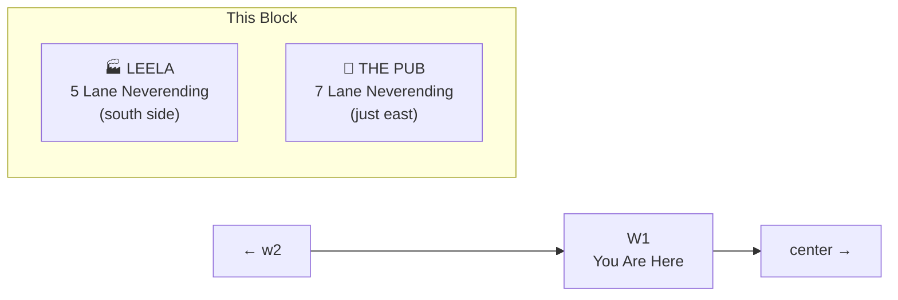
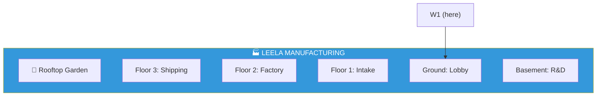

# W1: Leela's Neighborhood

> *"Where intelligence meets industry. And also a nice pub."*

**W1** is the segment of Lane Neverending just west of the center. This is prime real estate — home to [Leela Manufacturing Intelligence](../leela-manufacturing/) at 5 Lane Neverending, and right next to the beloved neighborhood pub.

---

## The Neighborhood

---

## Leela Manufacturing Intelligence

The visual intelligence factory. Video comes in, understanding comes out. Full documentation: [Leela Manufacturing →](../leela-manufacturing/)

---

## The Pub

Just east of Leela, almost at the corner with center. A priority pneumatic tube connects the two buildings directly.

| Feature | Notes |
|---------|-------|
| Priority tube from Leela | 2 second delivery |
| Garden in back | Origin Tree cutting grows there |
| Rooftop telescope | Waves at Leela's telescope |

---

## Street Furniture

| Fixture | Location | Notes |
|---------|----------|-------|
| 🏮 Lamp Post | North side | Standard flyweight instance |
| 🪑 Bench | South side, near Leela entrance | Good for thinking |

---

## Connections

| Direction | Destination | Notes |
|-----------|-------------|-------|
| ⬅️ West | [w2](../w2/) | More landmarks |
| ➡️ East | [center](../center/) | Origin Plaza |
| 🏭 South | [Leela Manufacturing](../leela-manufacturing/) | The factory |
| 🍺 East | The Pub | Next door |

---

*Part of [Lane Neverending](../README.md)*
