# W1: The Contrast Block

> *"Knowledge thrives. Gimmicks fade."*

**W1** is the segment of Lane Neverending just west of center. This block tells the story of two economies facing each other across the cobblestones.

**Both buildings are now explorable:**
- **[Leela Manufacturing](../leela-manufacturing/)** — Open, thriving, welcoming
- **[ACME Surplus](../acme-surplus/)** — Closed, locked, trapped (break in at your own risk)

---

## The Layout

```mermaid
flowchart TB
    subgraph North["⬆️ NORTH SIDE"]
        ACME["🏚️ ACME SURPLUS<br/>4 Lane Neverending<br/>(closed, painted tunnel)"]
    end
    
    North --> Street
    
    subgraph Street["LANE NEVERENDING"]
        direction LR
        W2["← w2"] --- W1["W1<br/>You Are Here"] --- Center["center →"]
    end
    
    Street --> South
    
    subgraph South["⬇️ SOUTH SIDE"]
        Leela["🏭 LEELA MANUFACTURING<br/>5 Lane Neverending<br/>(thriving)"]
    end

    style ACME fill:#7f8c8d,color:#fff
    style Leela fill:#3498db,color:#fff
    style W1 fill:#f1c40f,color:#000
```

---

## The Contrast

| | NORTH | SOUTH |
|---|-------|-------|
| **Building** | ACME Surplus | Leela Manufacturing |
| **Address** | 4 Lane Neverending | 5 Lane Neverending |
| **Status** | Closed, abandoned | Thriving, busy |
| **Business** | Mail-order killed retail | Knowledge never dies |
| **Notable** | The painted tunnel | The Insight Furnace |

---

## ACME Surplus (North Side)

```mermaid
flowchart LR
    subgraph ACME["🏚️ ACME SURPLUS"]
        Window["Dusty windows"]
        Anvil["Display anvil<br/>(not for sale)"]
        Tunnel["🎨 PAINTED TUNNEL<br/>(DO NOT RUN)"]
    end
    
    You["🏃 You"] --> |"sprint at tunnel"| THWACK["💥 THWACK<br/>(solid plywood)"]
    Delivery["🚚 ACME Delivery"] --> |"drives through"| Tunnel
    Tesla["🔷 Tesla Cybertruck"] --> |"autopilot engaged"| FIRE["🔥 DUMPSTER FIRE<br/>(recall pending)"]

    style Tunnel fill:#9b59b6,color:#fff
    style THWACK fill:#e74c3c,color:#fff
    style FIRE fill:#e67e22,color:#fff
```

**The Painted Tunnel:**
- Looks 100% real
- You CANNOT run through it
- ACME delivery trucks CAN (drive right through)
- Roadrunners CAN (meep meep)
- Tesla Cybertrucks CANNOT (autopilot doesn't recognize painted tunnels)
- It's not fair. But ACME products never were.

**The Catalog Dispenser:**
On the sidewalk in front of ACME, a battered metal dispenser offers FREE catalogs:

| Action | What Happens |
|--------|--------------|
| 📖 READ | Browse catalogs without taking one |
| 📦 TAKE | Get your own ACME Mail-Order Catalog |
| 🛒 ORDER | Speak into the "Talk to Order" button |

The catalogs connect to the [ACME catalog prototype](./acme-catalog.yml) — now co-located here. Full ordering system, all products, all malfunctions.

**Instance/Prototype Pattern:**
- The prototype (`acme-catalog.yml`) lives here, next to the dispenser
- Characters TEAR OFF lightweight instances (references) to carry
- Instances are weightless pointers — the real content stays at the prototype
- When dropped in a room, creates a tiny pointer file with room-specific annotations
- The kitchen has an [instance](../../../kitchen/acme-catalog.yml) already

**Delivery Options:**
- 📍 **FREE PICKUP** — Wait at the dispenser (variable timing)
- 🚚 **ROOM DELIVERY** — 5-10 gold, anywhere (2-4 turns)

CAM-ACME-01 watches this dispenser from across the street. Every interaction is logged.

---

## Leela Manufacturing (South Side)

```mermaid
flowchart TB
    Street["W1 (here)"] --> Lobby
    
    subgraph Leela["🏭 LEELA MANUFACTURING"]
        direction TB
        Roof["🌿 Rooftop"]
        Roof --- F3["Floor 3"]
        F3 --- F2["Floor 2"]
        F2 --- F1["Floor 1"]
        F1 --- Lobby["Lobby"]
        Lobby --- Basement["Basement"]
    end

    style Leela fill:#3498db,color:#fff
```

Three stories of visual intelligence manufacturing. Video goes in, understanding comes out.

Full documentation: [Leela Manufacturing →](../leela-manufacturing/)

---

## The Pub

The Rusty Lantern is just one block east, at center, on the south side. 
Leela and the pub are neighbors — knowledge and ale, side by side. 
There are persistent rumors of secret doors and pneumatic tubes connecting them.
As there should be.

---

## Street Furniture

| Fixture | Location | Notes |
|---------|----------|-------|
| 🏮 Lamp Post | North side, near ACME | Ornate, older design |
| 🏮 Lamp Post | South side, near Leela | Ornate, older design |
| 🪑 Bench | Between buildings | Carved: "knowledge vs gimmicks" |

---

## Connections

| Direction | Destination | Notes |
|-----------|-------------|-------|
| ⬅️ West | [w2](../w2/) | Older district |
| ➡️ East | [center](../center/) | The pub! |
| ⬆️ North | [ACME Surplus](../acme-surplus/) | 4 Lane Neverending (LOCKED + TRAPPED) |
| ⬇️ South | [Leela Manufacturing](../leela-manufacturing/) | 5 Lane Neverending |

---

*Part of [Lane Neverending](../README.md)*
