# W1: The Contrast Block

> *"Knowledge thrives. Gimmicks fade."*

**W1** is the segment of Lane Neverending just west of center. This block tells the story of two economies facing each other across the cobblestones.

---

## The Layout

```mermaid
flowchart TB
    subgraph North["NORTH SIDE"]
        ACME["🏚️ ACME SURPLUS\n4 Lane Neverending\n(closed, painted tunnel)"]
    end
    
    subgraph Street["═══ LANE NEVERENDING ═══"]
        W2["← w2"] --> W1["W1\nYou Are Here"] --> Center["center →"]
    end
    
    subgraph South["SOUTH SIDE"]
        Leela["🏭 LEELA MANUFACTURING\n5 Lane Neverending\n(thriving)"]
    end

    style ACME fill:#7f8c8d,color:#fff
    style Leela fill:#3498db,color:#fff
```

---

## The Contrast

| | NORTH | SOUTH |
|---|-------|-------|
| **Building** | ACME Surplus | Leela Manufacturing |
| **Address** | 4 Lane Neverending | 5 Lane Neverending |
| **Status** | Closed, abandoned | Thriving, busy |
| **Business** | Mail-order killed retail | Knowledge never dies |
| **Notable** | The painted tunnel | The Insight Furnace |

---

## ACME Surplus (North Side)

**The Painted Tunnel:**
- Looks 100% real
- You CANNOT run through it
- ACME employees CAN
- Delivery drones CAN
- It's not fair. But ACME products never were.

---

## Leela Manufacturing (South Side)

```mermaid
flowchart TB
    subgraph Leela["🏭 LEELA MANUFACTURING"]
        direction TB
        Roof["🌿 Rooftop"]
        F3["Floor 3"]
        F2["Floor 2"]
        F1["Floor 1"]
        Lobby["Lobby"]
        Basement["Basement"]
    end
    
    Street["W1 (here)"] --> Lobby

    style Leela fill:#3498db,color:#fff
```

Three stories of visual intelligence manufacturing. Video goes in, understanding comes out.

Full documentation: [Leela Manufacturing →](../leela-manufacturing/)

---

## The Pub

The Rusty Lantern is just one block east, at center. Leela and the pub are neighbors — knowledge and ale, side by side. As it should be.

---

## Street Furniture

| Fixture | Location | Notes |
|---------|----------|-------|
| 🏮 Lamp Post | North side, near ACME | Ornate, older design |
| 🏮 Lamp Post | South side, near Leela | Ornate, older design |
| 🪑 Bench | Between buildings | Carved: "knowledge vs gimmicks" |

---

## Connections

| Direction | Destination | Notes |
|-----------|-------------|-------|
| ⬅️ West | [w2](../w2/) | Older district |
| ➡️ East | [center](../center/) | The pub! |
| ⬇️ South | [Leela Manufacturing](../leela-manufacturing/) | 5 Lane Neverending |

---

*Part of [Lane Neverending](../README.md)*
