# W2: The Landmark Quarter

> *"History lives on every corner."*

**W2** is the segment of Lane Neverending between W1 (Leela's neighborhood) and W3 (the loop point). This stretch is known for its historical landmarks and architectural character.

---

## The Street

```mermaid
flowchart LR
    W3["← w3"] --> W2["W2\nYou Are Here"]
    W2 --> W1["w1 →"]
    
    subgraph Landmarks["This Block"]
        History["🏛️ Historical markers"]
        Architecture["🏠 Old buildings"]
    end
```

---

## Notable Features

| Feature | Description |
|---------|-------------|
| Historic facade | One of the original buildings from early Lane Neverending |
| Memorial bench | Dedicated to early residents |
| Gas lamp (original) | One of the first, still works |

---

## Street Furniture

| Fixture | Location | Notes |
|---------|----------|-------|
| 🏮 Original Gas Lamp | North side | Historic, carefully preserved |
| 🏮 Modern Lamp | South side | Standard flyweight |
| 🪑 Memorial Bench | North side | Names of early residents carved |

---

## Connections

| Direction | Destination | Notes |
|-----------|-------------|-------|
| ⬅️ West | [w3](../w3/) | Far west (loop point) |
| ➡️ East | [w1](../w1/) | Leela Manufacturing |

---

*Part of [Lane Neverending](../README.md)*
