# W3: Far West (The Loop Point)

> *"The end is just another beginning."*

**W3** is the westernmost segment of Lane Neverending — which means it connects directly to the easternmost segment. Walk west from here and you'll find yourself in E3. The loop completes.

---

## The Street

```mermaid
flowchart LR
    E3["← e3<br/>(east side!)"] --> |"THE LOOP!"| W3["W3<br/>You Are Here"]
    W3 --> W2["w2 →"]
    
    style W3 fill:#9b59b6,color:#fff
```

---

## The Loop

---

## Notable Features

| Feature | Description |
|---------|-------------|
| The First Lamp (West) | The westernmost lamp before the loop |
| Curiosity shops | Small storefronts with unusual wares |
| The continuation | Where west meets east |

---

## Shops

A few small storefronts line this segment:

| Shop | Specialty |
|------|-----------|
| Odd & Ends | Miscellaneous curiosities |
| The Map Shop | Maps of places that may not exist |
| Yesterday's Tomorrow | Vintage future tech |

---

## Street Furniture

| Fixture | Location | Notes |
|---------|----------|-------|
| 🏮 Lamp Post | North side | The westernmost lamp |
| 🪑 Bench | South side | Watch the shops |

---

## Connections

| Direction | Destination | Notes |
|-----------|-------------|-------|
| ⬅️ West | [e3](../e3/) | **THE LOOP** — arrives at far east |
| ➡️ East | [w2](../w2/) | Landmark quarter |

---

*Part of [Lane Neverending](../README.md)*
