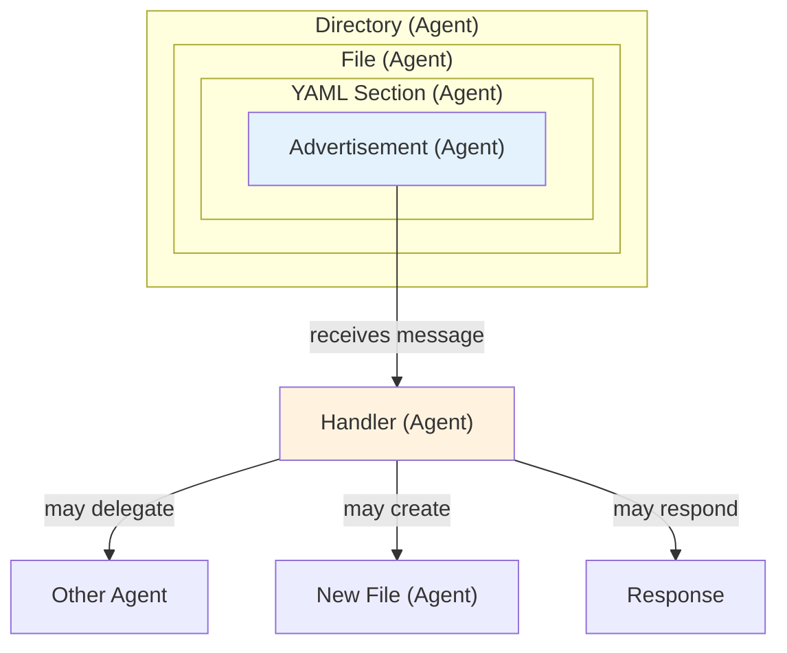
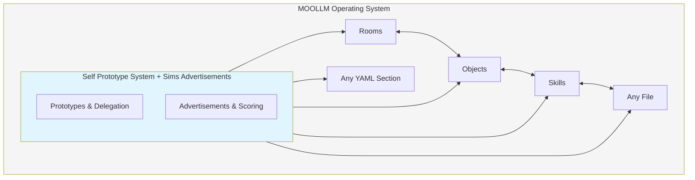

# MOOLLM Kernel Architecture

> *"The orchestrator is the Operating System. The LLM is the Coherence Engine. The Repo is the Microworld."*

---

## Overview

This document captures the **philosophy and design rationale** behind the MOOLLM kernel. The kernel itself (`kernel/`) contains lean operational files; this document explains *why* they work the way they do.

**See also:**
- `README.md` — Kernel quick reference (this directory)
- `drivers/README.md` — Driver structure
- `../skills/skill/SKILL.md` — How skills relate to kernel

---

## The Three Layers

```
┌─────────────────────────────────────────────────────┐
│  USERLAND (skills/)                                 │
│  Soul chat, rooms, cards, advertisements, games     │
│  → Semantic meaning, application logic              │
├─────────────────────────────────────────────────────┤
│  KERNEL (kernel/)                                   │
│  Tools, context assembly, memory, repair, logging   │
│  → Infrastructure, plumbing, adaptation             │
├─────────────────────────────────────────────────────┤
│  HARDWARE (LLM + Orchestrator)                      │
│  Stateless token predictor + context management     │
│  → Raw computation, I/O                             │
└─────────────────────────────────────────────────────┘
```

The kernel provides **infrastructure**, not **semantics**. It doesn't know what "rooms" or "soul chat" mean — that's userland's job.

---

## Orchestrator Types: Smart vs Generic

### The Core Distinction

**Generic Orchestrators** (like Cursor, ChatGPT):
- Cannot parse MOOLLM-specific files
- Don't understand CARD.yml advertisements
- Can't inject ambient skills automatically
- The LLM must manually manage context

**Smart Orchestrators** (like MOOCO, custom implementations):
- Parse CARD.yml advertisements directly
- Inject ambient skills invisibly into context
- Manage hot/cold/working-set operationally
- Keep administrative infrastructure out of LLM's context window

### The Magic Dictionary Analogy

Smart orchestrators work like **NeWS PostScript magic dictionaries**:

In NeWS (Network extensible Window System), PostScript dictionaries like `processes`, `canvases`, and `events` appeared to be normal data structures but were actually backed by the window system. Reading from them triggered system queries; writing to them triggered system calls. The code didn't need to know — it just manipulated dictionaries.

Similarly, a smart MOOLLM orchestrator:
- Reads `CARD.yml` advertisements and activates matching skills
- Watches `hot.yml` / `working-set.yml` for context hints
- Injects ambient skills without the LLM explicitly requesting them
- Makes edits to these files "magically effect" orchestrator behavior

The **same skill files work on both orchestrator types** — the mechanism adapts:
- On generic orchestrators: LLM reads files manually, self-manages context
- On smart orchestrators: Orchestrator reads files, injects automatically

### Advisory Mode vs Operational Mode

| Feature | Generic (Advisory) | Smart (Operational) |
|---------|-------------------|---------------------|
| `hot.yml` | Documentation of what SHOULD be prioritized | Actually loaded into context |
| `cold.yml` | Breadcrumbs for archaeology | Actually evicted from context |
| `working-set.yml` | Self-documentation | Active context manifest |
| Ambient skills | LLM must manually load | Injected invisibly |
| CARD advertisements | Read on demand | Parsed and activated |

### Reverse Generation Pattern

On generic orchestrators, these files can work **in reverse**:
- Instead of commanding what to load, they **document what Cursor loaded**
- Generate them to reflect what the orchestrator's attention is focused on
- The files become **mirrors** rather than **commands**

---

## Driver Architecture

### What Drivers Do

Drivers adapt the MOOLLM constitution to specific orchestrators — like OS drivers adapt to different hardware.

A driver specifies:
1. **Detection** — How to identify this orchestrator
2. **Capabilities** — What features are available
3. **Tools** — Mapping abstract operations to concrete tool names
4. **Paths** — Where to store session files
5. **Adaptations** — Fallbacks for unsupported features
6. **Limits** — Token limits, file limits, etc.

### Driver Tiers

| Tier | Description | Example |
|------|-------------|---------|
| 1 | Minimal — bare essentials | `generic.yml` |
| 2 | Basic — read/write/terminal | Basic CLI |
| 3 | Standard — search, some MCP | ChatGPT |
| 4 | Advanced — full file ops, MCP | Cursor |
| 5 | Premium — custom tools, full MCP | Claude Code, Antigravity |
| 6 | Custom — full kernel control | MOOCO |

### Capability Graceful Degradation

When a feature isn't available, drivers specify fallbacks:

| Feature | Full Support | Fallback |
|---------|-------------|----------|
| `why` parameter | Include in tool call | Document intent in response |
| Append-only | Enforced by orchestrator | Convention only |
| Event logging | Structured YAML | Markdown narrative |
| Vector search | `SemanticSearch` | Grep/manual scan |
| Sandboxed exec | Isolated container | Trust-based |

---

## Context Assembly

### The Problem

LLMs are stateless — they don't remember previous turns unless you include them in the prompt. The orchestrator must **assemble context** from:
- Conversation history
- File contents
- Search results
- Tool outputs
- Session state

### MOOLLM's Approach

The kernel provides **context assembly protocol** (`kernel/context-assembly-protocol.md`):

1. **Working Set** — Files currently relevant
2. **Hot Cache** — High-priority items to keep loaded
3. **Cold Cache** — Items recently evicted (breadcrumbs)
4. **Summaries** — Compressed representations of large content

On generic orchestrators, these are **advisory** — the LLM consults them to remind itself what to load. On smart orchestrators, they're **operational** — the orchestrator reads them and assembles context automatically.

---

## Memory Management

### Hot/Cold Model

Inspired by CPU cache hierarchies:

```
┌─────────────────────────────────────────┐
│  CONTEXT WINDOW (~30K tokens)           │
│  What the LLM can see RIGHT NOW         │
├─────────────────────────────────────────┤
│  HOT CACHE (.moollm/hot.yml)            │
│  High-priority items to keep loaded     │
│  "Page these in frequently"             │
├─────────────────────────────────────────┤
│  WARM (working-set.yml)                 │
│  Currently relevant files               │
│  "These are my focus right now"         │
├─────────────────────────────────────────┤
│  COLD CACHE (.moollm/cold.yml)          │
│  Recently evicted items                 │
│  "I used to care about these"           │
├─────────────────────────────────────────┤
│  REPO (files on disk)                   │
│  Everything else                        │
│  "I can page this in if needed"         │
└─────────────────────────────────────────┘
```

### Resolution Hints

Skills can declare **resolution levels** in their CARD.yml:
- `activation_only` — Just check if skill applies
- `summary` — Read CARD.yml header
- `interface` — Read CARD.yml fully
- `implementation` — Read SKILL.md
- `full` — Read everything including README.md

This lets the LLM (or orchestrator) know how deep to page in.

---

## Ambient Skills

### What Are Ambient Skills?

Skills that should be **always present** in context, continuously influencing behavior. Examples:
- `no-ai-slop` — Suppress filler language
- `yaml-jazz` — Treat YAML comments as semantic data
- `representation-ethics` — Guidelines for simulating real people

### The Injection Problem

On generic orchestrators, the LLM must:
1. Know that ambient skills exist
2. Remember to load their CARD.yml
3. Keep them in hot.yml for persistence
4. Re-load them if context is cleared

On smart orchestrators:
1. Orchestrator parses CARD.yml advertisements
2. Finds skills with `type: AMBIENT`
3. Injects them into every context assembly
4. LLM never has to think about it

### Same Files, Different Mechanism

The beauty: **same CARD.yml works both ways**:

```yaml
# In any skill's CARD.yml
advertisements:
  - trigger: "*"           # Matches everything
    score: 0.3             # Low but always present
    type: AMBIENT          # Smart orchestrators auto-inject
    resolution: summary    # Just the header
```

- Generic orchestrator: LLM reads this, knows to keep it loaded
- Smart orchestrator: Parses this, auto-injects skill

---

## Cursor Optimization System

On Cursor, several skills work together as a **unified context management system**:

```
┌─────────────────────────────────────────────────────────────────┐
│                    CURSOR OPTIMIZATION SYSTEM                   │
├─────────────────────────────────────────────────────────────────┤
│                                                                 │
│  INTROSPECTION          COMPILATION           BOOTSTRAP         │
│  (cursor-mirror)        (OPTIMIZE)            (bootstrap)       │
│                                                                 │
│  ┌─────────────┐       ┌─────────────┐       ┌─────────────┐   │
│  │ Watch self  │──────▶│ Compile     │──────▶│ Fast boot   │   │
│  │ think       │       │ .cursorrules│       │ next time   │   │
│  └─────────────┘       └─────────────┘       └─────────────┘   │
│        │                      │                      │          │
│        ▼                      ▼                      ▼          │
│  ┌─────────────┐       ┌─────────────┐       ┌─────────────┐   │
│  │ Analyze     │       │ User prefs  │       │ Pre-loaded  │   │
│  │ sessions    │       │ + skill     │       │ context     │   │
│  │ & patterns  │       │ examples    │       │ & skills    │   │
│  └─────────────┘       └─────────────┘       └─────────────┘   │
│                                                                 │
└─────────────────────────────────────────────────────────────────┘
```

### The Optimization Loop

1. **Work** — Use Cursor normally with MOOLLM skills
2. **Introspect** — cursor-mirror analyzes what was needed
3. **Compile** — cursor-mirror OPTIMIZE generates optimized `.cursorrules`
4. **Boot** — Next session starts with everything pre-loaded
5. **Repeat** — Each iteration refines the context

### cursor-mirror: Introspection

The `skills/cursor-mirror/` skill enables **meta-cognition** — the LLM watching itself think.

```bash
cursor-mirror status          # Quick health check
cursor-mirror tree            # Navigate sessions
cursor-mirror thinking @1     # Watch reasoning blocks
cursor-mirror tools @1        # Trace tool calls
cursor-mirror deep-snitch     # Security audit
```

This is especially powerful on Cursor, where the skill can:
- Read conversation history from LevelDB
- Analyze boot sequences
- Track tool call patterns
- Debug context assembly

### cursor-mirror: The MOOLLM Compiler

The OPTIMIZE command compiles user preferences + skill examples into optimized output:

```bash
cursor-mirror optimize .cursorrules    # Compile to .cursorrules
cursor-mirror optimize context         # Compile to hot.yml context
cursor-mirror optimize --dry-run       # Preview without writing
```

**How it works:**

1. **Reads skill examples** from `skills/*/examples/`
2. **Overlays user preferences** from `.moollm/skills/*/examples/`
3. **Applies user exclusions** from `.moollm/skills/*/exclusions.yml`
4. **Compiles into optimized output** — deduped, prioritized, compressed

**Why this matters:**

Instead of the LLM manually loading all skills and examples every session, it loads the **compiled result**. The compilation:
- Removes redundant examples
- Prioritizes frequently-used patterns
- Excludes user-rejected examples
- Pre-loads ambient skills
- Fits within `.cursorrules` token limits

### Local Preference Management

```bash
# List your local preferences
cursor-mirror prefs list

# Create preference from what just happened
cursor-mirror prefs create no-ai-slop --from-session

# Exclude a central example you don't like
cursor-mirror prefs exclude no-ai-slop verbose-option-example.yml

# Include it again
cursor-mirror prefs include no-ai-slop verbose-option-example.yml
```

Your preferences live in `.moollm/skills/*/` (gitignored), overlaid on central skills during compilation.

### Contribution Workflow (Play-Learn-Lift)

When you develop a good local preference, share it back:

```bash
# Stage your example for contribution
cursor-mirror stage add no-ai-slop my-example.yml

# Consolidate with existing example if overlapping
cursor-mirror stage consolidate my-example.yml existing-example.yml

# Create thoughtful commit
cursor-mirror stage commit

# Create PR
cursor-mirror stage pr
```

This is **Play-Learn-Lift** in action:
- **Play** — Discover patterns through use
- **Learn** — Capture as local preferences
- **Lift** — Share back via contribution workflow

### bootstrap: Fast Boot

The `skills/bootstrap/` skill provides application-specific boot sequences.

After introspecting your sessions, you know:
- Which skills are always needed for this project
- What context should be pre-loaded
- Which examples are most relevant

**Optimize boot by rewriting `.cursorrules`:**

```yaml
# In .cursorrules (compiled from cursor-mirror optimize)

# Pre-loaded skills for this project
skills:
  always_load:
    - no-ai-slop         # This team hates filler
    - yaml-jazz          # Heavy YAML usage
    - room               # Adventure game project
    - character          # Character simulations
    
  on_demand:
    - incarnation        # Only when creating souls
    - speed-of-light     # Only for benchmarks
    
# Pre-loaded context hints
context:
  hot:
    - examples/adventure-4/pub/ROOM.yml
    - characters/real-people/don-hopkins/CHARACTER.yml
  
  warm:
    - skills/room/CARD.yml
    - skills/character/CARD.yml
```

### The Full Stack

| Layer | Component | Purpose |
|-------|-----------|---------|
| `.cursorrules` | Compiled config | What Cursor loads at boot |
| `hot.yml` | Runtime hints | What to keep loaded during session |
| `working-set.yml` | Focus snapshot | What's currently relevant |
| `cold.yml` | Breadcrumbs | What was evicted (for archaeology) |
| Skill CARDs | Advertisements | What activates when |
| cursor-mirror | Introspection | Watch, analyze, optimize |
| bootstrap | Boot sequence | PROBE → DETECT-DRIVER → WARM → STARTUP |

### Introspection on Other Orchestrators

The same introspection **concept** applies everywhere, but implementation varies:
- Cursor: Deep LevelDB access via cursor-mirror
- Claude Code: MCP history access
- Custom: Whatever the orchestrator exposes

The **compilation** concept also generalizes:
- Cursor: `.cursorrules` optimization
- Claude Code: MCP tool preloading
- Custom: Context pre-assembly

---

## The Coherence Engine

The LLM isn't just generating text. It's:

1. **Computing Dependencies** — Figuring out what depends on what
2. **Cross-Checking State** — Verifying consistency against rules
3. **Refereeing Conflicts** — Resolving parallel agent disagreements
4. **Orchestrating Simulations** — Running many characters per call
5. **Maintaining Consistency** — Keeping the microworld coherent

The kernel provides the **infrastructure** for this; skills provide the **semantics**.

---

## The Universal Foundation: Agents All The Way Down

This is the **most fundamental architectural principle** in MOOLLM. Everything else builds on this.

### Self + Sims = MOOLLM's DNA

MOOLLM's operating system layer combines two powerful ideas:

| From Self (Ungar) | From The Sims (Wright) |
|-------------------|------------------------|
| Prototypes & delegation | Advertisements & scoring |
| Slots (named references) | Needs/motives drive selection |
| Message passing | Dithering for organic behavior |
| Everything clones | Everything advertises |

These aren't skill-specific features. They're the **microcode** everything runs on.

### Advertisements Are Everywhere

Skills have CARD files with advertisements — that's how skills work. But **any object, file, or YAML section can have advertisements**:

```yaml
# A room can advertise
examples/adventure-4/pub/ROOM.yml:
  advertisements:
    - name: "enter_pub"
      score: 0.8
      triggers: [drink, socialize, relax]

# A character can advertise
characters/cat-whiskers/CHARACTER.yml:
  advertisements:
    - name: "pet_cat"
      triggers: [pet, comfort, cute]

# A YAML section can advertise inline
inventory:
  magic_sword:
    advertisements:
      - name: "attack_with_sword"
        triggers: [combat, fight]
```

### Events Don't Require Reification

An advertisement is an **event handler** — but the "event" doesn't have to exist as a file:

```yaml
# The "event" can be:
- A word in chat           # "feed the cat" triggers hunt_mouse
- A concept                # Player feels lonely → pet_cat scores higher
- A delegated method       # Another skill routes a message here
- A need state             # Hunger > 0.7 activates food-related ads
- Just... a message        # No file, no YAML, just intent
```

The handler can CHOOSE to materialize the event — or not:
- Just respond (no file created)
- Create YAML Jazz in same directory according to a schema
- Route to an inbox subdirectory
- Delegate to another skill
- Multiple dispatch (fan out to several handlers)

### Advertisements as Lexically Scoped Agents

An advertisement is a **lexically scoped agent** — bound to its directory context:

- **Captures environment** (the directory, the object's state)
- **Responds to patterns** (triggers)
- **Can create side effects** (files, messages, state changes)
- **Or just returns a value**

It's like a closure that receives messages and decides what to do.

### Agents All The Way Down



Every advertisement is a mini-agent. Every file containing advertisements is an agent. Every directory containing files is an agent. **Agents composed of agents** — Minsky's Society of Mind realized in filesystems.

### Skills Are Just Directories

Skills aren't special. They're directories that happen to have:
1. `CARD.yml` (interface/advertisements)
2. `SKILL.md` (detailed protocol)
3. Inherit from the same prototype system everything uses

**Anthropic skills embedded in MOOLLM gain all the nice things** that every directory and file already inherits:
- Prototype inheritance (from `parents:`)
- Advertisement discovery
- Path variable resolution
- Empathic linking

We didn't invent prototypes and advertisements **just for skills**. They're for **everything**. Skills just happen to use them well.

### Universal Composition



**Everything composes with everything else. Not just skills with skills.**

### The Heritage

| Concept | Origin | In MOOLLM |
|---------|--------|-----------|
| Prototypes | Self (Ungar) | Every directory can have `parents:` |
| Slots | Self | Every file is a slot in a directory |
| Delegation | Self | Resolution walks parent chain |
| Advertisements | The Sims (Wright) | Any object can advertise capabilities |
| Dithering | The Sims | Top-N + random for organic selection |
| Needs/Motives | The Sims | Context scores advertisements |
| Society of Mind | Minsky | Agents composed of agents |
| Actor Model | Hewitt/Agha | Everything is message passing |

**See also:** `designs/MOO-HERITAGE.md` for the full analysis including MOO/LambdaMOO lineage.

---

## Design Principles

### From Unix

- Simple tools that compose
- Text as universal interface
- Convention over configuration

### From Self Language

- Prototypes and delegation
- Objects clone, not instantiate
- Everything is mutable
- **Slots + messages = universal primitives** (see "Agents All The Way Down" above)

### From The Sims

- Advertisements signal capabilities
- Needs/motives score relevance
- Dithering prevents robotic behavior
- **Every object is an autonomous agent**

### From Minsky's Society of Mind

- Mind as society of simple agents
- Agents composed of agents
- K-lines activate constellations
- **The filesystem IS a distributed agent system**

### From Robust-First Computing (Dave Ackley)

- Missing state → repair, not crash
- Local information, global behavior
- Homeostatic maintenance

### From Kay/Papert

- Microworld as operating system
- The repo IS the world
- Learning through exploration

### From NeWS

- Magic dictionaries as system interface
- Code that doesn't know it's talking to the system
- Same API, different backing implementation

---

## File Organization (This Directory)

```
kernel/
├── README.md                    # Quick reference
├── ARCHITECTURE.md              # This file — design philosophy
├── constitution-core.md         # Universal principles
├── constitution-template.md     # Full constitution template
├── context-assembly-protocol.md # How context is built
├── memory-management-protocol.md# Hot/cold/working-set
├── event-logging-protocol.md    # Append-only logging
├── self-healing-protocol.md     # Repair and recovery
├── tool-calling-protocol.md     # How tools work
├── NAMING.yml                   # Naming conventions
├── naming/                      # Detailed naming docs
│   ├── NAMING-K-LINES.yml       # Names as K-lines
│   ├── NAMING-RELATIONSHIPS.yml # See-also annotations
│   └── ...
├── drivers/
│   ├── README.md                # Driver docs
│   ├── cursor.yml               # Cursor IDE adapter
│   ├── claude-code.yml          # Claude Code adapter
│   ├── antigravity.yml          # Antigravity adapter
│   ├── generic.yml              # Fallback adapter
│   └── custom.yml               # Full-control template
└── ...
```

---

## See Also

| Topic | Location |
|-------|----------|
| **Foundational** | |
| MOO/LambdaMOO heritage | `../designs/MOO-HERITAGE.md` |
| Directory as object | `DIRECTORY-AS-OBJECT.md` |
| Advertisement system | `../skills/advertisement/CARD.yml` |
| **Kernel** | |
| Kernel quick reference | `README.md` |
| Driver structure | `drivers/README.md` |
| Context assembly | `context-assembly-protocol.md` |
| Memory management | `memory-management-protocol.md` |
| Naming conventions | `naming/NAMING.yml` |
| **Skills** | |
| Skill architecture | `../skills/skill/SKILL.md` |
| CARD.yml format | `../skills/card/CARD.yml` |
| **Cursor Optimization** | |
| cursor-mirror skill | `../skills/cursor-mirror/CARD.yml` |
| cursor-mirror SKILL.md | `../skills/cursor-mirror/SKILL.md` |
| bootstrap skill | `../skills/bootstrap/CARD.yml` |
| **Orchestrators** | |
| Cursor driver | `drivers/cursor.yml` |
| MOOCO orchestrator | `../designs/MOOCO-ARCHITECTURE.md` (in mooco repo) |

---

*"Make the kernel boring so the skills can be exciting."*
