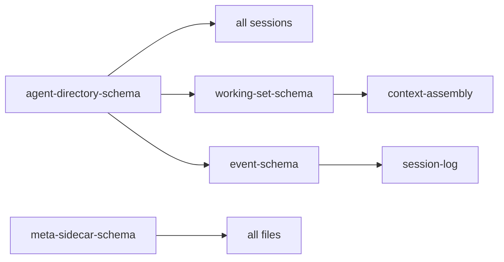
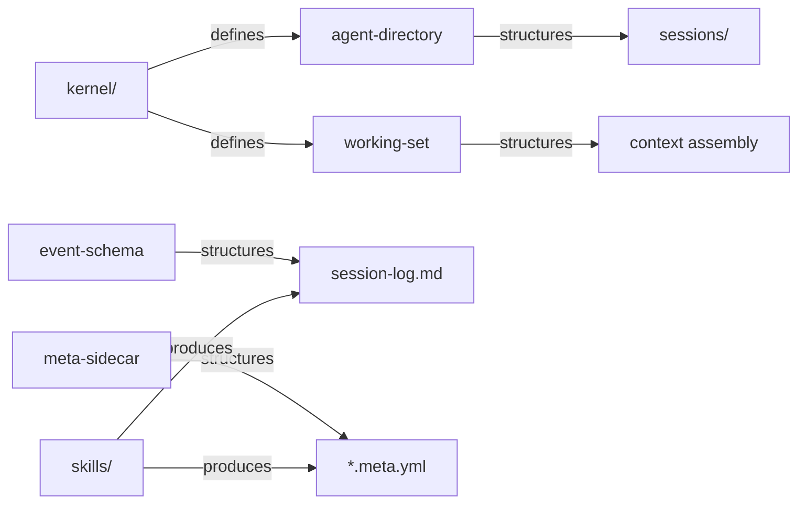

# Schemas

> *Machine-readable definitions for MOOLLM data structures.*

The shapes of things.

> [!NOTE]
> **This is the vault.** Data contracts that kernel and skills agree on.

---

## Purpose

These schemas define the format of key MOOLLM files:
- **YAML structures** for configuration and state
- **JSON Schema semantics** for validation
- **Documented fields** with semantic comments

Schemas can be used for:
1. **Validation** — Check files conform to expected format
2. **Documentation** — Understand expected structure
3. **Generation** — Create compliant files programmatically
4. **Integration** — Build tools that work with MOOLLM

---

## 🗺️ You Are Here

```
moollm/
├── README.md           ← Project entrance
├── PROTOCOLS.yml       ← Symbol index
├── kernel/             ← Core protocols
├── skills/             ← Userland protocols
├── schemas/            ← YOU ARE HERE (the vault)
│   ├── README.md       ← This file
│   └── *.yml           ← Schema definitions
└── designs/            ← Historical archives
```

---

## Schema Files

| Schema | Describes | Used By |
|--------|-----------|---------|
| [agent-directory-schema.yml](./agent-directory-schema.yml) | `.agent/` directory structure | All sessions |
| [event-schema.yml](./event-schema.yml) | Session log YAML blocks | [session-log/](../skills/session-log/) |
| [working-set-schema.yml](./working-set-schema.yml) | Context assembly manifest | [context-assembly](../kernel/context-assembly-protocol.md) |
| [meta-sidecar-schema.yml](./meta-sidecar-schema.yml) | `.meta.yml` sidecar files | All skills |

---

## How Schemas Work

Schemas use **YAML with JSON Schema-compatible structure**:

```yaml
$schema: "https://json-schema.org/draft/2020-12/schema"
$id: "moollm/event-embedded"
title: "Event Log Entry"

type: object
properties:
  type:
    type: string
    description: "Event category"
  timestamp:
    type: string
    format: date-time
    
required: [type, timestamp]
```

### YAML Jazz in Schemas

Comments in schemas ARE documentation — they carry semantic meaning:

```yaml
properties:
  why:
    type: string
    # CRITICAL: This field exists for auditability.
    # Without it, you can't trace intent.
    # See: WHY-REQUIRED protocol symbol
    description: "Why this action is being taken"
```

The LLM reads these comments. They're not just for humans.

---

## Schema Relationships



---

## The Intertwingularity

Schemas are the shapes. Everything conforms to them.



---

## Navigation

| Direction | Destination |
|-----------|-------------|
| ⬆️ Up | [Project Root](../) |
| 📖 Quick | [QUICKSTART.md](../QUICKSTART.md) |
| 🔧 Sibling | [kernel/](../kernel/) — Uses these schemas |
| 🎭 Sibling | [skills/](../skills/) — Produces these formats |
| 📜 Sibling | [designs/](../designs/) — Historical context |
| 📋 Symbols | [PROTOCOLS.yml](../PROTOCOLS.yml) — K-line index |
